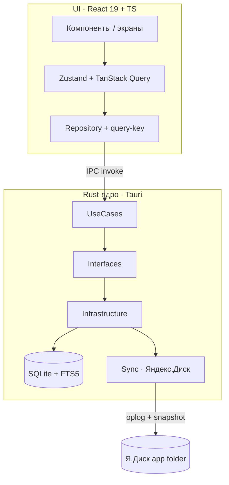
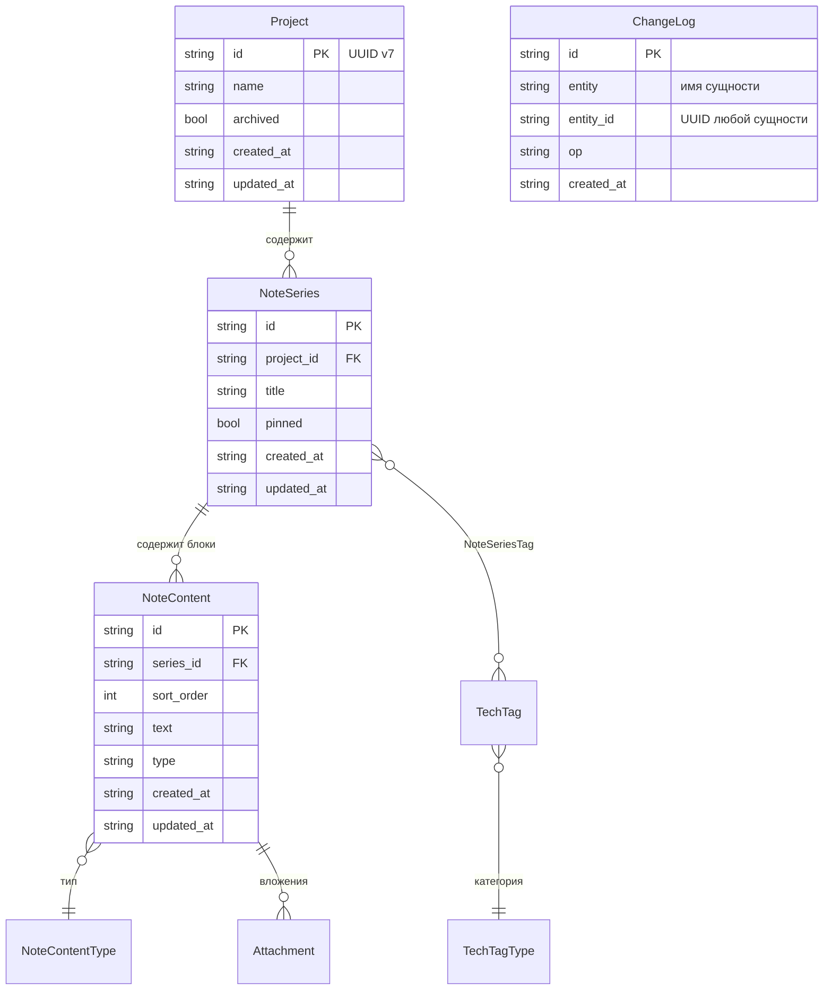

# DEVNOTES

> **Что это за файл.** Корневой README репозитория `DevNotes/` — точка входа в проект. Здесь суть продукта, ключевые возможности, технологический стек, карта репозитория со ссылками на всю проектную документацию (`docs/*`), быстрый старт и статус. Для деталей архитектуры, схемы БД, синка и дизайна — переходите по ссылкам из блока «Связанные документы».

> **Статус проекта:** `Проектирование / ТЗ готово`. Кодовой базы пока нет — репозиторий содержит проектную документацию. Реализация ведётся по дорожной карте [docs/10-ROADMAP.md](docs/10-ROADMAP.md).

---

## Связанные документы

| Документ | О чём |
|---|---|
| [docs/01-VISION.md](docs/01-VISION.md) | Видение продукта, целевой пользователь, боль и сценарии использования |
| [docs/02-SPECIFICATION.md](docs/02-SPECIFICATION.md) | Техническое задание и WBS (must / should / could / wont), инварианты, риски |
| [docs/03-FEATURES.md](docs/03-FEATURES.md) | Каталог фич по приоритетам: MVP → Should → Could; критерии приёмки |
| [docs/04-ARCHITECTURE.md](docs/04-ARCHITECTURE.md) | Слои Clean Architecture, обоснование Tauri vs Electron/MAUI/Flutter, IPC-контур |
| [docs/05-DATA-MODEL.md](docs/05-DATA-MODEL.md) | Доменная модель, ER-диаграмма, инварианты, SQLite-схема (DDL), миграции |
| [docs/06-UI-UX.md](docs/06-UI-UX.md) | Экраны, командная палитра, горячие клавиши, навигация, дизайн-токены, терминальная эстетика |
| [docs/07-TECH-STACK.md](docs/07-TECH-STACK.md) | Технологический стек, версии, обоснование выбора библиотек |
| [docs/08-SEARCH.md](docs/08-SEARCH.md) | Полнотекстовый поиск: FTS5 external content, bm25, сниппеты, русская морфология |
| [docs/09-YANDEX-DISK.md](docs/09-YANDEX-DISK.md) | Синхронизация с Яндекс.Диском: OAuth 2.0 + PKCE, oplog, LWW, конфликт-копии |
| [docs/10-ROADMAP.md](docs/10-ROADMAP.md) | Дорожная карта: вехи, порядок реализации, приоритезация WBS |
| [docs/12-GLOSSARY.md](docs/12-GLOSSARY.md) | Единый глоссарий сущностей и терминов, инварианты именования |

> Часть документов может быть в работе. Актуальность и порядок реализации отслеживаются в [docs/10-ROADMAP.md](docs/10-ROADMAP.md).

---

## Суть проекта

**DEVNOTES** — кроссплатформенное **десктоп-приложение** для инженерных заметок по технологиям разработки. Local-first «терминал инженерных знаний»: заметки группируются по проектам и темам, доступен мгновенный полнотекстовый поиск по всей базе, а бэкап/синхронизация идут через Яндекс.Диск.

**Для кого.** Разработчик (в первую очередь Full-Stack .NET/React), который ведёт личную базу знаний: сниппеты, разборы багов, конспекты технологий, заметки по проектам. Ему нужна скорость, работа офлайн и полный контроль над данными — без облачного SaaS-замка.

**Какую боль решает.**

- **Разрозненность.** Заметки расползаются по Notion / Obsidian / файлам / issue-трекерам без единой структуры «проект → тема → блок».
- **Медленный поиск.** По растущей базе поиск тормозит; нужен `<50 мс` на 10k блоков.
- **Онлайн-зависимость.** Облачные редакторы требуют сети и отдают данные наружу. DEVNOTES работает **полностью офлайн**, данные лежат в локальном SQLite.
- **Хрупкий бэкап.** Ручное копирование теряется. Здесь — журналируемый синк (oplog) + снапшоты на Яндекс.Диск с разрешением конфликтов.

**Ключевой архитектурный принцип — local-first.** Приложение работает без сети; облако — это канал бэкапа и синхронизации между устройствами, а не источник истины. По облаку **никогда не синкается «живой» файл БД** (это гарантированная потеря данных при двух устройствах) — синкается только журнал изменений `ChangeLog` (oplog) и периодические снапшоты.

---

## Ключевые возможности

- **Иерархия знаний.** `Project` → `NoteSeries` → `NoteContent`. Блоки контента типов **markdown / code / image / link**, сортировка drag-and-drop (`@dnd-kit`, поле `sort_order`).
- **Мгновенный поиск.** SQLite **FTS5** (external content над `NoteContent` + `NoteSeries`), ранжирование **bm25**, подсветка сниппетов. Цель — `<50 мс` на 10k блоков.
- **Командная палитра `Ctrl/Cmd+K`.** Поиск, переход к проекту/серии, быстрые действия.
- **Теги технологий.** `TechTag` с категориями `TechTagType` (язык / фреймворк / инструмент / БД / DevOps); фильтрация списков по тегу и проекту.
- **Синк с Яндекс.Диском.** OAuth 2.0 Authorization Code + **PKCE** через loopback-redirect, область `app folder`; токены — в системном keychain. Офлайн-очередь изменений, конфликты — **LWW по `updated_at`** на уровне блока + конфликт-копия.
- **Markdown + код.** Рендер `react-markdown`, подсветка `react-syntax-highlighter`.
- **Обязательные даты.** У каждой сущности `created_at` и `updated_at` — хранение UTC ISO 8601, отображение в локальной таймзоне.
- **Терминальная тема.** Тёмная по умолчанию + светлая; HSL-токены в стиле shadcn/ui, `JetBrains Mono`, акцент `#22c55e`, terminal window, scanlines.

**В планах (Should / Could):** экспорт серии в Markdown/PDF, вложения-изображения (content-addressable), локальные снапшоты (`VACUUM INTO`), избранное/архив, автосохранение черновиков, шаблоны серий, автообновление (Tauri Updater), версионирование блоков, wiki-links, шифрование БД (SQLCipher), quick-capture, WebDAV-каналы, AI-фичи. Подробности — в [docs/03-FEATURES.md](docs/03-FEATURES.md) и [docs/10-ROADMAP.md](docs/10-ROADMAP.md).

---

## Технологический стек

```text
[ SHELL ] Tauri 2.0 · Rust-core        [ FRONT ] React 19 · TypeScript · Vite 6
[ DB    ] SQLite · rusqlite · FTS5·bm25 [ STATE ] Zustand · TanStack Query
[ SYNC  ] Яндекс.Диск REST · OAuth2·PKCE [ UI   ] Tailwind · CVA · clsx · tw-merge
[ DND   ] @dnd-kit                      [ MD   ] react-markdown · syntax-highlighter
[ ARCH  ] Clean Architecture (Rust+TS)  [ FONT ] JetBrains Mono · accent #22c55e
```

| Слой | Технологии |
|---|---|
| **Оболочка** | Tauri 2.0 (Rust-ядро), сборки Windows / macOS / Linux (в перспективе mobile) |
| **Ядро (Rust)** | тонкий слой: SQL (`rusqlite`), FTS5-индексация, синк, IPC-команды |
| **Хранилище** | SQLite + FTS5 (external content, `bm25`); миграции версионируются |
| **Синхронизация** | Яндекс.Диск Cloud REST API, OAuth 2.0 + PKCE, oplog (`ChangeLog`), LWW |
| **Фронтенд** | React 19, TypeScript, Vite 6, React Router 7 |
| **Состояние/данные** | Zustand + TanStack Query, repository-pattern + генераторы query-key |
| **UI/дизайн** | Tailwind, дизайн-токены HSL (shadcn/ui), CVA + clsx + tailwind-merge |
| **Контент** | `@dnd-kit`, react-markdown, react-syntax-highlighter |

> Полный стек с версиями и обоснованием библиотек — в [docs/07-TECH-STACK.md](docs/07-TECH-STACK.md). Обоснование выбора **Tauri 2.0** (vs Electron / .NET MAUI / Flutter) — в [docs/04-ARCHITECTURE.md](docs/04-ARCHITECTURE.md). Решение зафиксировано.

---

## Архитектура (обзор)

Слои по мотивам Clean Architecture из Portfolio, зеркально на Rust-ядре и на фронте:



Границы: вся бизнес-логика UI остаётся в TypeScript; Rust-слой намеренно тонкий (SQL + sync + IPC) — это снижает кривую обучения для .NET/React-команды. Детали и IPC-контракты — в [docs/04-ARCHITECTURE.md](docs/04-ARCHITECTURE.md).

---

## Доменная модель (кратко)



> `ChangeLog` (oplog) намеренно показан **отдельным узлом без ребра-FK**: он полиморфен — ссылается на любую сущность парой (`entity`, `entity_id`) и не имеет жёсткого внешнего ключа на `Project` или иную конкретную таблицу. Модель журнала и правила синка — в [docs/05-DATA-MODEL.md](docs/05-DATA-MODEL.md) и [docs/09-YANDEX-DISK.md](docs/09-YANDEX-DISK.md).

Инварианты (обязательны во всех документах):

- **Имена сущностей строго:** `Project` / `NoteSeries` / `NoteContent` / `NoteContentType` / `TechTag` / `TechTagType` / `Attachment` / `ChangeLog` / `SyncState`. Без синонимов: «тема» = `NoteSeries`, «блок» = `NoteContent`.
- **ID = UUID v7 (строка), генерируется клиентом** — обязательное условие офлайн-создания и синка.
- **Даты — UTC ISO 8601 в БД**; поля `created_at` / `updated_at` обязательны у всех сущностей.
- **SQLite: snake_case** в схеме; домен на Rust — PascalCase, на TS — camelCase.

Полная модель, справочники, связи и DDL — в [docs/05-DATA-MODEL.md](docs/05-DATA-MODEL.md).

---

## Структура репозитория

```text
DevNotes/
├── CLAUDE.md                  # состояние проекта и конвенции — обязательная точка входа для ассистента
├── README.md                  # этот файл — точка входа для внешнего читателя
├── docs/                      # проектная документация
│   ├── 01-VISION.md           # видение, пользователь, боль
│   ├── 02-SPECIFICATION.md    # ТЗ и WBS (must/should/could/wont), риски
│   ├── 03-FEATURES.md         # каталог фич по приоритетам, критерии приёмки
│   ├── 04-ARCHITECTURE.md     # слои, обоснование Tauri, IPC
│   ├── 05-DATA-MODEL.md       # доменная модель, ER, DDL, миграции, FTS5-триггеры
│   ├── 06-UI-UX.md            # экраны, командная палитра, хоткеи, дизайн-токены
│   ├── 07-TECH-STACK.md       # стек, версии, обоснование библиотек
│   ├── 08-SEARCH.md           # FTS5 / bm25 / сниппеты / морфология
│   ├── 09-YANDEX-DISK.md      # Яндекс.Диск, OAuth2+PKCE, oplog, LWW
│   ├── 10-ROADMAP.md          # дорожная карта, вехи, приоритезация WBS
│   └── 12-GLOSSARY.md         # единый глоссарий сущностей и инвариантов
│
└── (планируется при реализации)
    ├── src-tauri/             # Rust-ядро: Domain/UseCases/Interfaces/Infrastructure
    │   ├── src/
    │   ├── migrations/        # версионируемые миграции SQLite
    │   └── tauri.conf.json
    ├── src/                   # React 19 + TS фронтенд (дизайн-система Portfolio)
    │   ├── domain/            # типы, сущности
    │   ├── repositories/      # repository-pattern + query-key генераторы
    │   ├── features/          # проекты, серии, блоки, поиск, синк
    │   ├── components/ui/     # Button/Card/Input/Badge (CVA)
    │   └── styles/            # HSL-токены, terminal-тема
    ├── package.json
    └── vite.config.ts
```

---

## Быстрый старт

> ✅ Реализован MVP: ядро (Rust `core/`), IPC-оболочка (`src-tauri/`), фронтенд (`app/`). Ядро и фронтенд собираются и проходят тесты (23 зелёных). Синхронизация с Я.Диском и фичи v1.0+ — по [docs/10-ROADMAP.md](docs/10-ROADMAP.md).

**Предпосылки:**

- Node.js `>= 22` и `pnpm`
- Rust `stable` (toolchain для Tauri 2.0)
- Системные зависимости WebView: WebView2 (Windows) / WebKit (macOS) / WebKitGTK 4.1 (Linux) — нужны только для GUI-сборки Tauri

```bash
git clone <repo-url> && cd DevNotes

# Ядро: тесты (работает без GUI-зависимостей)
cd core && cargo test && cd ..

# Фронтенд: установка, тесты, сборка
cd app && pnpm install && pnpm test && pnpm build && cd ..

# Десктоп в dev-режиме (нужен WebView; запускает Vite на :1420 + окно Tauri)
cd src-tauri && cargo tauri dev

# Продакшн-сборка под текущую платформу (требуются иконки src-tauri/icons/*)
cd src-tauri && cargo tauri build
```

Локальная БД SQLite создаётся при первом запуске в пользовательской app-директории; миграции применяются автоматически. Настройка синка с Яндекс.Диском — в [docs/09-YANDEX-DISK.md](docs/09-YANDEX-DISK.md).

---

## Скриншоты

> _Место под скриншоты. Будут добавлены после реализации UI (терминальная тема, командная палитра, редактор блоков, панель поиска)._

```text
┌────────────────────────────────────────────────────────────┐
│  ● ● ●   devnotes — terminal of engineering knowledge        │
├────────────────────────────────────────────────────────────┤
│  > [ скриншот: список проектов / серий ]                     │
│  > [ скриншот: редактор блоков + markdown-превью ]           │
│  > [ скриншот: Ctrl+K командная палитра / FTS5-поиск ]       │
│  > [ скриншот: индикатор синка с Яндекс.Диском ]             │
└────────────────────────────────────────────────────────────┘
```

---

## Статус

| Аспект | Состояние |
|---|---|
| Концепция и ТЗ | ✅ Готово (WBS согласован, см. [docs/02-SPECIFICATION.md](docs/02-SPECIFICATION.md)) |
| Проектная документация `docs/*` | 🟡 В работе |
| Rust-ядро / фронтенд | ⬜ Не начато |
| MVP (must-have) | ⬜ По дорожной карте ([docs/10-ROADMAP.md](docs/10-ROADMAP.md)) |

**Резюме:** _Проектирование / ТЗ готово, реализация — по дорожной карте ([docs/10-ROADMAP.md](docs/10-ROADMAP.md))._

---

## Источник концепций

Модель данных, дизайн-язык и часть фронтенд-стека перенесены из веб-проекта **Portfolio** (`Mafiozist/Portfolio`, .NET + React): Clean Architecture, сущности `Project/NoteSeries/NoteContent/TechTag`, терминально-хакерская эстетика (JetBrains Mono, акцент `#22c55e`, scanlines), примитивы UI на CVA. Портфолио-часть (`Company`, `Task`, `ExperienceWork/Education`) в десктоп v1 **не переносится** — только упоминается в разделах «перспектива».

---

_Все документы — на русском. Тон — инженерный, конкретный. Единый глоссарий сущностей и инварианты именования — в [docs/12-GLOSSARY.md](docs/12-GLOSSARY.md) и в [CLAUDE.md](CLAUDE.md) (раздел 3.5)._
