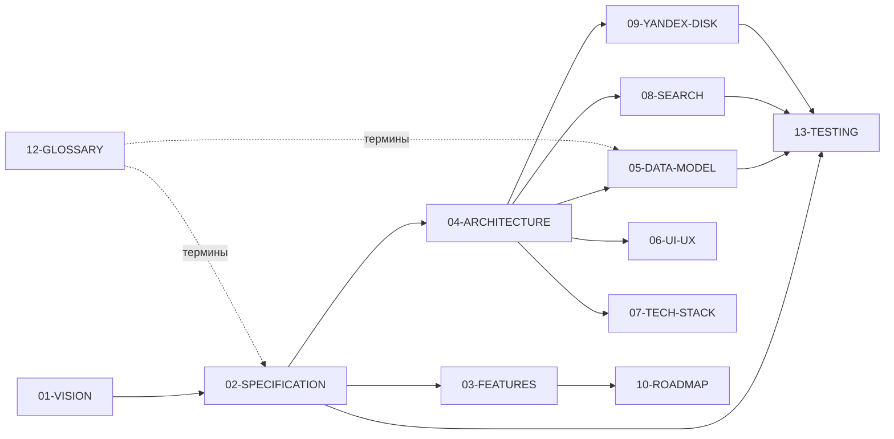

# 00 — Оглавление документации DEVNOTES

> **Что это за файл.** Единая точка входа во всю документацию проекта **DEVNOTES** (кроссплатформенное local-first десктоп-приложение для инженерных заметок по технологиям). Здесь — карта всех документов, рекомендованные маршруты чтения и связи между разделами. Начинайте отсюда.

> **Девиз проекта:** DEVNOTES — local-first терминал инженерных знаний: заметки по технологиям, мгновенный FTS5-поиск, синхронизация с Яндекс.Диском.
>
> **Стадия:** проектирование. Актуальный статус и решения — в [`../CLAUDE.md`](../CLAUDE.md).

---

## Карта документации

| Документ | Путь | О чём | Когда читать |
| --- | --- | --- | --- |
| Состояние и конвенции | [`../CLAUDE.md`](../CLAUDE.md) | Текущий статус, зафиксированные решения, конвенции, роли, DoD, журнал | Первым, до любых изменений |
| README | [`../README.md`](../README.md) | Суть проекта для внешнего читателя, стек, структура | Для быстрого знакомства |
| Видение | [`01-VISION.md`](01-VISION.md) | Зачем продукт, персоны, сценарии, scope | Чтобы понять «почему» |
| **Большое ТЗ** | [`02-SPECIFICATION.md`](02-SPECIFICATION.md) | Функц./нефункц. требования, user stories, критерии приёмки | Перед реализацией любой фичи |
| Каталог фич | [`03-FEATURES.md`](03-FEATURES.md) | Все возможности с приоритетами MoSCoW | Для планирования объёма |
| Архитектура | [`04-ARCHITECTURE.md`](04-ARCHITECTURE.md) | Tauri 2 + React, слои, IPC, sync-движок, диаграммы | Перед проектированием кода |
| Модель данных | [`05-DATA-MODEL.md`](05-DATA-MODEL.md) | Сущности, ER, SQLite DDL, FTS5, миграции, инварианты | При работе с БД/доменом |
| Дизайн-система и UI/UX | [`06-UI-UX.md`](06-UI-UX.md) | Токены, терминал-эстетика, экраны, тренды, доступность | При работе над UI |
| Технологический стек | [`07-TECH-STACK.md`](07-TECH-STACK.md) | Обоснование выбора, версии, дистрибуция, CI | При настройке проекта |
| Быстрый поиск | [`08-SEARCH.md`](08-SEARCH.md) | FTS5 external content, bm25, синтаксис, перф | При работе над поиском |
| Яндекс.Диск | [`09-YANDEX-DISK.md`](09-YANDEX-DISK.md) | OAuth 2.0 + PKCE, oplog, конфликты, офлайн-очередь | При работе над синхронизацией |
| Дорожная карта | [`10-ROADMAP.md`](10-ROADMAP.md) | Релизы MVP→v2, вехи, риски | Для планирования |
| Реестр файлов | [`11-FILE-INDEX.md`](11-FILE-INDEX.md) | Однострочное описание каждого файла репозитория | Чтобы найти «где что лежит» |
| Глоссарий | [`12-GLOSSARY.md`](12-GLOSSARY.md) | Канонические определения терминов | При любых сомнениях в терминах |
| Тестирование | [`13-TESTING.md`](13-TESTING.md) | Стратегия unit + интеграционных тестов, CI | При написании кода и тестов |
| Журнал прогонов | [`WORKLOG.md`](WORKLOG.md) | История мульти-агентных прогонов (восстановление контекста) | После конца сессии / для аудита |

> Нумерация соответствует именам файлов и идёт не подряд: `11` — реестр файлов, `12` — глоссарий, `13` — тесты.

---

## Рекомендованные маршруты чтения

### Новый разработчик (онбординг)
1. [`../CLAUDE.md`](../CLAUDE.md) — статус, решения, конвенции, глоссарий-сводка.
2. [`01-VISION.md`](01-VISION.md) — зачем и для кого.
3. [`04-ARCHITECTURE.md`](04-ARCHITECTURE.md) — как устроено.
4. [`05-DATA-MODEL.md`](05-DATA-MODEL.md) — данные.
5. [`12-GLOSSARY.md`](12-GLOSSARY.md) — язык проекта.

### Реализация фичи
1. [`02-SPECIFICATION.md`](02-SPECIFICATION.md) — требования и критерии приёмки фичи.
2. [`03-FEATURES.md`](03-FEATURES.md) — приоритет и границы.
3. Профильный документ: [`08-SEARCH.md`](08-SEARCH.md) / [`09-YANDEX-DISK.md`](09-YANDEX-DISK.md) / [`06-UI-UX.md`](06-UI-UX.md).
4. [`13-TESTING.md`](13-TESTING.md) — какие тесты обязательны.
5. Обновить [`11-FILE-INDEX.md`](11-FILE-INDEX.md) и журнал в [`../CLAUDE.md`](../CLAUDE.md).

### Ревью (роль fable)
1. Definition of Done — [`../CLAUDE.md`](../CLAUDE.md) §6.
2. Соответствие [`02-SPECIFICATION.md`](02-SPECIFICATION.md) и глоссарию [`12-GLOSSARY.md`](12-GLOSSARY.md).
3. Наличие тестов по [`13-TESTING.md`](13-TESTING.md), актуальность кросс-документации.

### Планирование
1. [`10-ROADMAP.md`](10-ROADMAP.md) → 2. [`03-FEATURES.md`](03-FEATURES.md) → 3. риски и стек в [`07-TECH-STACK.md`](07-TECH-STACK.md).

---

## Связи документов

