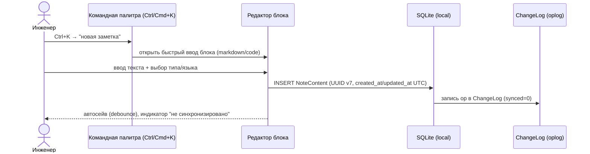
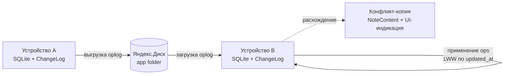

# DEVNOTES — Видение продукта

> **Что это за файл.** Верхнеуровневый документ видения: зачем существует DEVNOTES, для кого, какие проблемы решает и какими метриками мы измеряем успех. Это «нулевая точка» проектной документации — все технические решения (архитектура, схема БД, поиск, синк) обязаны трассироваться сюда. Документ не содержит кода реализации; он фиксирует **проблему, персон, сценарии, цели/не-цели, метрики и УТП**. Технические детали раскрываются в соседних документах.

**Статус:** черновик v1 · **Дата:** 2026-07-17 · **Автор:** Full-Stack .NET/React-разработчик · **Аудитория:** сам автор + будущие контрибьюторы.

---

## Связанные документы

| Документ | Назначение |
|---|---|
| [`01-VISION.md`](./01-VISION.md) | **(этот файл)** Видение, персоны, сценарии, метрики |
| [`02-ARCHITECTURE.md`](./02-ARCHITECTURE.md) | Слои Clean Architecture, выбор Tauri vs Electron/MAUI/Flutter, IPC-контур |
| [`03-DATA-MODEL.md`](./03-DATA-MODEL.md) | Доменные сущности, SQLite-схема (snake_case), миграции, UUID v7 |
| [`04-SEARCH-FTS5.md`](./04-SEARCH-FTS5.md) | FTS5 external content, bm25, триггеры, trigram-fallback, SLA <50 мс |
| [`05-SYNC-YANDEX-DISK.md`](./05-SYNC-YANDEX-DISK.md) | OAuth 2.0 + PKCE, oplog (ChangeLog), LWW + конфликт-копии, app folder |
| [`06-DESIGN-SYSTEM.md`](./06-DESIGN-SYSTEM.md) | HSL-токены shadcn/ui, терминальная эстетика, CVA-примитивы |
| [`07-ROADMAP.md`](./07-ROADMAP.md) | WBS (must/should/could/wont), фазы, релизы |

> Ссылки на 02–07 — плановые: файлы создаются по мере проработки. Имена сущностей и терминов во всех документах **строго едины** (см. блок «Глоссарий»).

---

## 1. Проблема и мотивация

Инженер-разработчик за неделю прогоняет через голову десятки мелких, но дорого добытых знаний: как починить сборку EF Core, какой флаг у `docker buildx`, почему падал `dnd-kit` под React 19, готовый сниппет middleware. Эти знания **теряются** между тремя каналами:

- **Мессенджеры «избранное»** — свалка без структуры и без поиска по смыслу.
- **Облачные заметочники (Notion/Obsidian-синк/Google Keep)** — либо требуют онлайн, либо тормозят, либо не дают инженерного контроля над данными, либо плохо ищут по русским техническим текстам с кодом.
- **Локальные `.md` в папках** — быстрый ввод, но нет мгновенного поиска по всей базе, нет тегов, нет синка между рабочей и домашней машиной.

### Боли, которые мы адресуем

| Боль | Проявление | Наш ответ |
|---|---|---|
| Знание не находится за секунды | Поиск по 5000+ заметок «тормозит» или ищет только точную строку | FTS5 + bm25, цель **<50 мс на 10k блоков**, подсветка сниппетов |
| Работа зависит от сети | В самолёте/метро/при падении сервиса заметки недоступны | **Local-first**: всё в локальном SQLite, синк — опциональный слой поверх |
| Данные заперты в чужом облаке | Нет экспорта, нет доступа к файлу БД, вендор-лок | Открытый SQLite-файл на диске, экспорт в Markdown/PDF, синк в **свой** Яндекс.Диск |
| Плохой ввод кода | Нет подсветки, нет типизированных блоков | Типизированные блоки `markdown/code/image/link`, syntax-highlight |
| Разрозненность | Заметки не сгруппированы по проекту/технологии | Иерархия **Project → NoteSeries → NoteContent** + теги **TechTag** |

### Почему сейчас

Существует готовый веб-проект **Portfolio (Mafiozist)** на .NET + React с уже спроектированной моделью данных (Project / NoteSeries / NoteContent / TechTag) и дизайн-системой (терминальная эстетика, HSL-токены). DEVNOTES **переиспользует модель и UI-язык**, но перерождает их в десктопное local-first приложение на **Tauri 2.0**. Это снижает стоимость входа: фронтенд и домен уже наполовину существуют.

---

## 2. Целевые персоны

Продукт делается прежде всего «для себя» (dogfooding), но проектируется под две явные персоны.

### Персона A — Инженер-разработчик, изучающий технологии («Practitioner»)

```
Имя-архетип : Артём, 27, Full-Stack .NET/React
Контекст    : 2-3 рабочих проекта + пет-проекты, учит Rust/Tauri
Устройства  : рабочий ноут (Windows), домашний (Linux), иногда macOS
Сеть        : дома/офис онлайн, в дороге офлайн
```

| Аспект | Детали |
|---|---|
| **Цели** | Не терять решения проблем; накапливать личную базу сниппетов; быстро находить «как я это делал в прошлый раз» |
| **Боли** | Медленный поиск, привязка к сети, ручной перенос между машинами |
| **Поведение** | Пишет короткими блоками между задачами; ценит горячие клавиши и командную палитру; читает markdown с кодом |
| **Критерий успеха** | «Ввёл заметку за 5 секунд, нашёл нужную за 1 секунду, работает без интернета» |

### Персона B — Тимлид-наставник («Mentor»)

```
Имя-архетип : Дина, 34, техлид команды из 5 человек
Контекст    : ведёт онбординг, копит разборы багов и конспекты технологий
Устройства  : рабочий ноут + личный
```

| Аспект | Детали |
|---|---|
| **Цели** | Систематизировать знания команды в структурированные серии; готовить материалы для наставничества; экспортировать разборы |
| **Боли** | Знания разрознены; трудно собрать «серию по теме»; нет аккуратного экспорта |
| **Поведение** | Ведёт длинные серии заметок по проекту; использует шаблоны («разбор бага», «конспект технологии»); экспортирует в PDF/Markdown |
| **Критерий успеха** | «Собрал серию из блоков, отсортировал drag-and-drop, выгрузил в PDF для команды» |

> **Явно вне персон v1:** несколько пользователей одной базы, шаринг в реальном времени, роли/права. Это в `wont` (см. Roadmap).

---

## 3. Пользовательские сценарии

Ключевые user journeys. Каждый сценарий трассируется в конкретные пункты WBS.

### Сценарий S1 — Быстрый захват заметки (Practitioner)

**Триггер:** во время задачи всплыло знание, надо зафиксировать за секунды.



- Работает **офлайн полностью**; синк произойдёт позже автоматически.
- ID генерируется клиентом (UUID v7) — обязательное условие офлайн-создания.

### Сценарий S2 — Поиск решения по тегу и тексту (Practitioner)

**Триггер:** «где-то я уже чинил похожую ошибку EF Core».

1. `Ctrl/Cmd+K` → вводит `ef core migration`.
2. FTS5 отдаёт ранжированные (bm25) результаты со **сниппетами и подсветкой** за <50 мс.
3. Фильтрует по тегу `#EFCore` (TechTagType = framework) и типу блока `code`.
4. Переходит к блоку внутри нужной NoteSeries.

```
┌─ SEARCH ────────────────────────────────────────┐
│ > ef core migration                    [ 12 hits]│
├──────────────────────────────────────────────────┤
│ ● [code]  "…add-migration InitialCreate…"  #EFCore│
│           Project: Backend · Series: Миграции    │
│ ● [md]    "…dotnet ef database update падал…"     │
│ ● [md]    "…__EFMigrationsHistory таблица…"       │
└──────────────────────────────────────────────────┘
```

### Сценарий S3 — Ведение серии по проекту (Mentor)

**Триггер:** сбор структурированного «разбора» или конспекта.

1. Создаёт `Project` (или выбирает существующий).
2. Внутри — `NoteSeries` («Разбор бага: дедлок в пуле соединений»), привязывает теги.
3. Добавляет упорядоченные `NoteContent`-блоки (markdown-описание, code-репро, image-скрин, link-на-issue).
4. Пересобирает порядок **drag-and-drop** (`@dnd-kit`, поле `sort_order`).
5. Закрепляет серию (`pinned`), позже экспортирует в Markdown/PDF.

### Сценарий S4 — Синхронизация между машинами (обе персоны)

**Триггер:** ввёл дома → хочет видеть на работе.



- Синкается **только oplog + snapshot'ы**, **никогда «живой» файл БД** (иначе гарантированная потеря данных при двух устройствах).
- Конфликты: **LWW на уровне NoteContent** + **создание конфликт-копии** (пользователь не теряет версию молча).
- Нет сети → офлайн-очередь копится и выгружается при появлении сети.

### Трассировка сценариев → WBS

| Сценарий | Опирается на пункты WBS |
|---|---|
| S1 Быстрый захват | Local-first SQLite; CRUD иерархии; командная палитра; created_at/updated_at; автосейв debounce |
| S2 Поиск | FTS5 + bm25 + сниппеты; фильтр по тегу/типу/дате; командная палитра |
| S3 Серия | CRUD Project→Series→Content; drag-and-drop sort_order; теги; markdown/highlight; экспорт MD/PDF; pinned |
| S4 Синк | OAuth 2.0 + PKCE; oplog (ChangeLog); LWW + конфликт-копия; app folder; snapshot |

---

## 4. Цели и не-цели

### 4.1 Цели (v1)

1. **Local-first по умолчанию.** Приложение полностью функционально офлайн; облако — опция, не зависимость.
2. **Мгновенный поиск.** FTS5 + bm25, SLA поиска **<50 мс на 10k блоков**, подсветка сниппетов.
3. **Структура знаний.** Иерархия Project → NoteSeries → NoteContent + теги TechTag/TechTagType.
4. **Кроссплатформенность desktop.** Подписанные сборки Windows / macOS / Linux на едином коде (Tauri 2.0).
5. **Безопасный синк своим облаком.** Яндекс.Диск через oplog (никогда — целый файл БД), понятное разрешение конфликтов.
6. **Инженерный UX.** Командная палитра, горячие клавиши, drag-and-drop, терминальная эстетика, тёмная тема по умолчанию.
7. **Переиспользование Portfolio.** Модель данных и дизайн-система наследуются, снижая стоимость разработки.

### 4.2 Не-цели (v1) — явно НЕ делаем

| Не-цель | Причина |
|---|---|
| Портфолио-часть (Company, Task, ExperienceWork/Education) | Вне продуктовой ценности заметочника; `Project` живёт без `CompanyId` |
| Мультипользовательность, шаринг, realtime-коллаборация | Продукт персональный; резко усложняет синк и модель прав |
| Собственный сервер/бэкенд | Синк только клиент ↔ Яндекс.Диск; нет инфраструктуры для поддержки |
| Web- и mobile-версия в MVP | Фокус на desktop; mobile — «перспектива» на Tauri 2 |
| Electron / .NET MAUI / Flutter как оболочка | Решение зафиксировано — **Tauri 2.0** (см. `02-ARCHITECTURE.md`) |
| Система плагинов/расширений | Преждевременная абстракция для v1 |
| E2E-шифрование облачных данных | В v1 только транспортный TLS; SQLCipher — `could` |
| WYSIWYG-редактор | Только markdown-редактор с превью |
| Синк «живого» файла SQLite по облаку | Гарантированная потеря данных при двух устройствах — синкаем только oplog + snapshot |

---

## 5. Метрики успеха

Метрики разделены на **продуктовые** (ценность для пользователя) и **технические SLA** (обязательства реализации). Для персонального dogfood-продукта главный источник — телеметрия локальная/самонаблюдение, без внешней аналитики.

### 5.1 Технические SLA (проверяемые в CI/бенчах)

| Метрика | Цель | Как измеряем |
|---|---|---|
| Латентность поиска | **p95 < 50 мс** на 10k блоков | Бенч FTS5 на синтетической БД в CI |
| Время холодного старта | < 1.5 с до готовности UI | Замер от процесса до `ready` |
| Задержка захвата заметки | < 300 мс от `Ctrl+K` до готового поля ввода | Ручной/автотест командной палитры |
| Автосейв блока | debounce ≤ 800 мс, без потери ввода | Тест редактора |
| Размер релиз-бандла | десктоп < ~15 МБ (преимущество Tauri) | CI-артефакты |
| Сборки | зелёные на Windows/macOS/**Ubuntu** | Matrix CI (Linux-WebView обязателен) |
| Целостность синка | 0 «молчаливых» потерь: каждый конфликт → конфликт-копия | Интеграционный тест сценария двух устройств |

### 5.2 Продуктовые метрики

| Метрика | Цель (ориентир) | Смысл |
|---|---|---|
| Time-to-capture | медиана < 5 с | Захват должен быть быстрее, чем «лень записать» |
| Time-to-find | медиана < 3 с (ввод→открытие блока) | Поиск быстрее памяти |
| Доля офлайн-сессий без сбоев | 100% | Local-first обязателен |
| Успешность синка между 2 машинами | ≥ 99% операций применяются без ручного вмешательства | Доверие к синку |
| Retention (личный) | ежедневное использование ≥ 4 из 5 рабочих дней | Продукт «прижился» |
| Накопление базы | рост числа NoteContent неделя к неделе | База растёт → ценность растёт |

### 5.3 Anti-метрики (сигналы провала)

- Пользователь ушёл писать в мессенджер «потому что там быстрее» → провал time-to-capture.
- Поиск «не нашёл, хотя точно есть» → провал релевантности (см. русский стемминг, trigram-fallback).
- «Потерял заметку после синка» → критический провал доверия (недопустимо).

---

## 6. Уникальное ценностное предложение (УТП)

> **DEVNOTES — local-first терминал инженерных знаний: заметки по технологиям, мгновенный FTS5-поиск, синк с Яндекс.Диском.**

Ценность возникает на **пересечении** четырёх свойств, которых нет вместе ни у одного конкурента:

```
        ┌─────────────────────────────────────────────┐
        │                  DEVNOTES                     │
        │                                               │
        │   LOCAL-FIRST ────────────── ЯНДЕКС.ДИСК      │
        │   (офлайн, свой SQLite)      (свой синк,       │
        │        │                      без вендор-лока) │
        │        │                         │            │
        │   БЫСТРЫЙ ПОИСК ──────── ТЕРМИНАЛЬНЫЙ UX       │
        │   (FTS5+bm25, <50мс)     (JetBrains Mono,      │
        │                           #22c55e, scanlines)  │
        └─────────────────────────────────────────────┘
```

### Позиционирование против альтернатив

| Свойство | Notion | Obsidian | Google Keep | «.md в папке» | **DEVNOTES** |
|---|:--:|:--:|:--:|:--:|:--:|
| Работает офлайн полностью | ~ | + | − | + | **+** |
| Мгновенный полнотекстовый поиск по всей базе | ~ | ~ | ~ | − | **+ (FTS5/bm25)** |
| Данные в открытом локальном формате | − | + | − | + | **+ (SQLite)** |
| Синк в *свой* Яндекс.Диск | − | ~ | − | ~ | **+** |
| Инженерная модель Project→Series→Block + теги технологий | ~ | ~ | − | − | **+** |
| Типизированные блоки + подсветка кода | + | + | − | ~ | **+** |
| Терминально-хакерская эстетика | − | ~ | − | − | **+** |
| Лёгкий бандл (Tauri) | − | ~ | − | + | **+ (<15 МБ)** |

Легенда: `+` есть · `~` частично/через плагины/платно · `−` нет.

### Формула ценности

- **Скорость важнее возможностей.** Захват < 5 с и поиск < 3 с бьют богатую функциональность, до которой «лень доходить».
- **Владение данными.** Файл SQLite — твой; синк — в твой Яндекс.Диск; экспорт в Markdown/PDF в любой момент.
- **Инженер для инженеров.** Модель, тон и эстетика говорят на языке разработчика, а не «универсального заметочника».

---

## 7. Глоссарий (единые термины для всех документов)

Эти имена используются **строго и без синонимов** во всей документации и коде.

| Термин | Что это | Синонимы, которые НЕ используем |
|---|---|---|
| **Project** | Проект-группа заметок | «проект» ок как перевод, но сущность = Project |
| **NoteSeries** | Серия/тема заметок внутри проекта | ~~тема~~, ~~топик~~ |
| **NoteContent** | Блок контента серии (единица) | ~~блок~~ как сущность → всегда NoteContent |
| **NoteContentType** | Тип блока: `markdown \| code \| image \| link` | — |
| **TechTag / TechTagType** | Тег технологии и его категория (`language \| framework \| tool \| database \| devops \| other`) | — |
| **NoteSeriesTag** | Связка many-to-many серия ↔ тег | — |
| **Attachment** | Вложение блока (файл, sha256, sync_status) | — |
| **ChangeLog (oplog)** | Журнал изменений для синка | ~~журнал~~, ~~лог~~ вне контекста |
| **SyncState / AppSetting** | Состояние синка / настройки (key-value) | — |
| **notes_fts** | Виртуальная таблица FTS5 (не доменная сущность) | — |

**Инварианты, обязательные во всех документах:**

1. **ID = UUID v7 (строка), генерируется клиентом** — условие офлайн-создания и синка.
2. **Даты — UTC ISO 8601 в БД**, поля `created_at`/`updated_at` обязательны у всех сущностей; отображение — в локальной таймзоне.
3. **SQLite: snake_case** в схеме; домен на Rust — PascalCase, на TS — camelCase.
4. **Оболочка зафиксирована:** Tauri 2.0 (Rust) + React 19 + TypeScript + Vite + Tailwind; состояние — Zustand + TanStack Query; repository-pattern с генераторами query-key.
5. **Поиск — только FTS5** (external content table + bm25), индекс обновляется триггерами; SLA <50 мс на 10k блоков.
6. **Синк — только через oplog (ChangeLog)** в app folder Яндекс.Диска (REST API, OAuth 2.0 + PKCE); конфликты LWW по `updated_at` на уровне NoteContent + конфликт-копия; **файл БД по облаку не синкается**.
7. **Слои:** Domain / UseCases / Interfaces / Infrastructure(DB, Sync) / UI.
8. **MVP не включает** Company/Task/Experience, сервер, коллаборацию, mobile — только в разделах «перспектива».

---

## 8. Перспектива (за пределами v1)

Не входит в MVP, но модель данных и синк проектируются так, чтобы не закрывать эти двери:

- **Mobile на Tauri 2** (iOS/Android) поверх той же схемы синка.
- **Версионирование блоков** (история/diff/откат), **wiki-links** `[[...]]` и граф связей.
- **Шифрование локальной БД** (SQLCipher) по мастер-паролю.
- **WebDAV-абстракция** для альтернативных облаков (Nextcloud) — запасной канал к Яндекс.Диску.
- **AI-фичи:** автотегирование, суммаризация серии, семантический поиск.
- **Статистика:** heatmap активности, распределение по технологиям.

Детали и приоритеты — в [`07-ROADMAP.md`](./07-ROADMAP.md).
