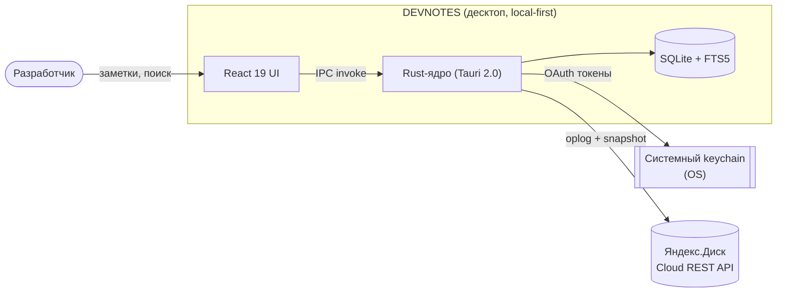
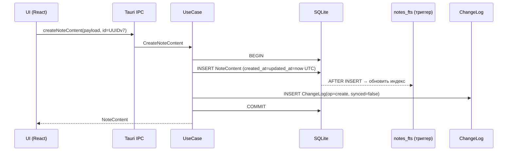
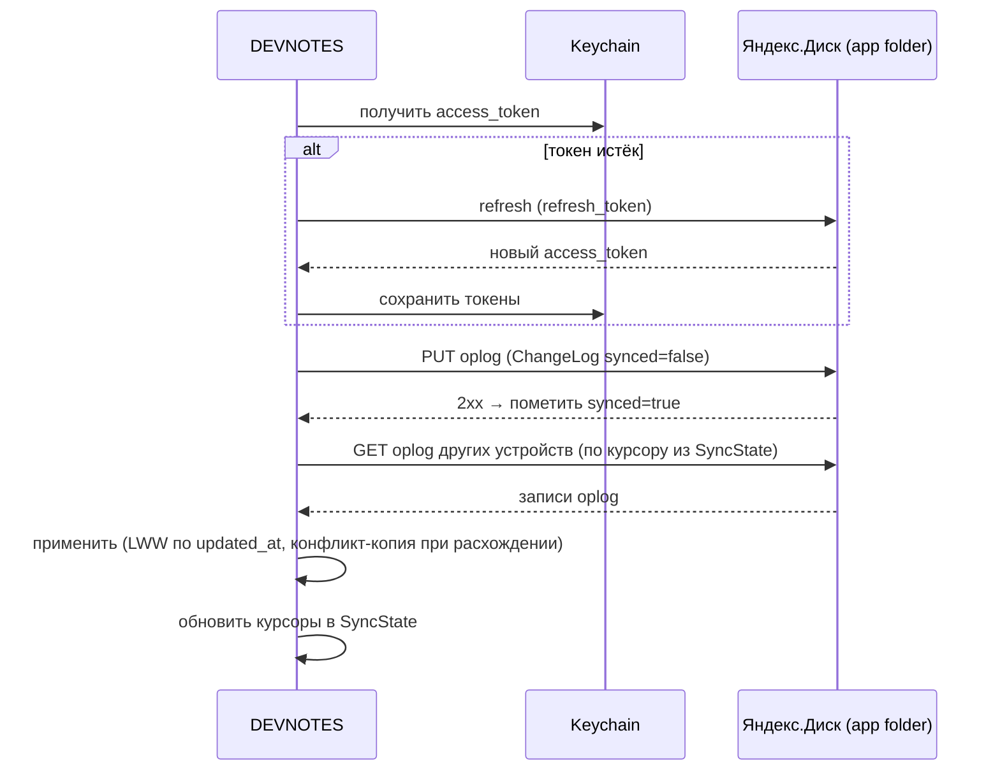
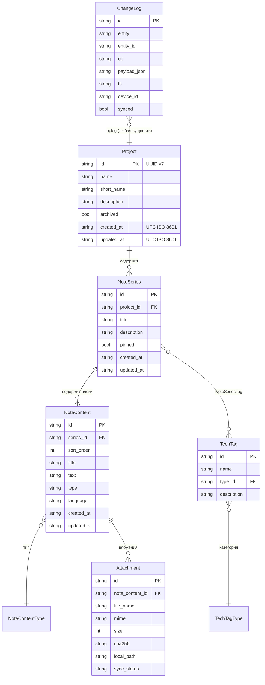

# 02 — БОЛЬШОЕ ТЗ (технико-функциональное задание)

> **Что это за файл.** Главный и самый объёмный документ проекта **DEVNOTES** — полное технико-функциональное задание. Определяет назначение и границы системы, функциональные требования по всем модулям (Проекты, Серии заметок, Блоки контента, Теги технологий, Поиск, Синхронизация с Яндекс.Диском, Экспорт/Импорт, Настройки, Командная палитра), детальные пользовательские истории с критериями приёмки в Gherkin-стиле (Дано/Когда/Тогда), нефункциональные требования (производительность, кроссплатформенность, офлайн, безопасность, доступность, локализация), ограничения, допущения, требования к данным и интеграционные требования к API Яндекс.Диска. Документ — источник истины для реализации и приёмки. Все термины и инварианты строго соответствуют глоссарию проекта.

> **Статус:** проектирование. **Дата:** 2026-07-17. **Язык:** русский, тон инженерный. **Область:** десктоп v1 (Windows / macOS / Linux).

---

## Связанные документы

Пути указаны относительно `DevNotes/`. Канон именования и оглавление — в `docs/00-INDEX.md`.

| Документ | Назначение | Роль для этого ТЗ |
| --- | --- | --- |
| [`CLAUDE.md`](../CLAUDE.md) | Состояние проекта, конвенции, глоссарий, DoD | Источник конвенций и инвариантов |
| [`docs/00-INDEX.md`](00-INDEX.md) | Оглавление документации | Точка входа |
| [`docs/01-VISION.md`](01-VISION.md) | Видение, цели, целевой пользователь, scope | Обоснование «зачем» |
| [`docs/02-ARCHITECTURE.md`](02-ARCHITECTURE.md) | Целевая архитектура Tauri 2.0 + React 19, слои, IPC | Реализация требований этого ТЗ |
| [`docs/03-DATA-MODEL.md`](03-DATA-MODEL.md) | Доменная модель, SQLite DDL, инварианты сущностей | Требования к данным (раздел 11) |
| [`docs/04-SEARCH-FTS5.md`](04-SEARCH-FTS5.md) | FTS5 external content, bm25, триггеры, токенизация | Модуль «Поиск» (раздел 5.5) |
| [`docs/05-SYNC-YANDEX.md`](05-SYNC-YANDEX.md) | Синхронизация: OAuth 2.0 + PKCE, oplog, конфликты | Модуль «Синхронизация» (5.6), интеграция (12) |
| [`docs/06-DESIGN-SYSTEM.md`](06-DESIGN-SYSTEM.md) | Дизайн-токены HSL, терминальная эстетика, компоненты | НФТ доступности/UI (раздел 8) |
| [`docs/07-ADR/`](07-ADR/) | Architecture Decision Records | Обоснование зафиксированных решений |
| [`docs/08-ROADMAP.md`](08-ROADMAP.md) | Дорожная карта, вехи, приоритезация | Порядок реализации требований |
| [`docs/09-RISKS.md`](09-RISKS.md) | Реестр рисков и митигации | Ограничения и допущения (раздел 10) |
| [`docs/10-CONVENTIONS.md`](10-CONVENTIONS.md) | Конвенции кода/именования/git | Требования к именованию |

> Глоссарий сущностей — раздел 3.5 `CLAUDE.md` и раздел 2 ниже. При расхождении формулировок канон — `CLAUDE.md` и `consistencyNotes` из WBS.

---

## 1. Назначение и границы системы

### 1.1. Назначение

**DEVNOTES** — кроссплатформенное десктоп-приложение (local-first) для ведения инженерных заметок по технологиям разработки. Система обеспечивает:

- структурированное хранение знаний в иерархии `Project → NoteSeries → NoteContent`;
- обязательную фиксацию даты и времени создания и изменения каждой записи;
- мгновенный полнотекстовый поиск по всей базе;
- резервное копирование и синхронизацию между устройствами одного пользователя через Яндекс.Диск;
- работу полностью офлайн — сеть требуется только для синка/бэкапа.

### 1.2. Границы системы (что входит в v1)

| В границах v1 (MVP + Should) | Вне границ v1 (Won't / перспектива) |
| --- | --- |
| CRUD иерархии `Project → NoteSeries → NoteContent` | Портфолио-часть Portfolio: `Company`, `Task`, `ExperienceWork/Education` |
| Блоки типов `markdown` / `code` / `image` / `link`, drag-and-drop сортировка | Мультипользовательность, шаринг, realtime-коллаборация |
| Обязательные `created_at` / `updated_at` (UTC ISO 8601) | Собственный сервер / бэкенд (синк только клиент ↔ Я.Диск) |
| FTS5-поиск + bm25, командная палитра `Ctrl/Cmd+K` | Web- и mobile-версии |
| Теги `TechTag` / `TechTagType`, фильтрация | Electron / .NET MAUI / Flutter как оболочка (зафиксирован Tauri 2.0) |
| Синк с Яндекс.Диском (OAuth 2.0 + PKCE, oplog, LWW) | Система плагинов/расширений |
| Экспорт Markdown/PDF, вложения, снапшоты, шаблоны (Should) | E2E-шифрование облака в v1 (только транспортный TLS) |
| Тёмная/светлая тема, терминально-хакерская эстетика | WYSIWYG-редактор (только markdown с превью) |

> Полный список Won't и «перспективы» — раздел `wont` WBS и [`docs/01-VISION.md`](01-VISION.md).

### 1.3. Пользователи и роли (продукта)

Система однопользовательская на устройство. «Роль» одна — **владелец базы знаний** (разработчик). Мультиаккаунтность и разделение прав не предусмотрены. Один пользователь может использовать несколько устройств, синхронизируемых через один аккаунт Яндекс.Диска.

### 1.4. Контекст системы (C4-уровень 1)



Границы доверия: локальная БД и keychain — на устройстве пользователя; единственный внешний сервис — Яндекс.Диск (только по явному согласию пользователя при подключении).

---

## 2. Глоссарий (ссылка)

Полный глоссарий сущностей и запрещённых синонимов — раздел **3.5 `CLAUDE.md`** и `consistencyNotes` WBS. Ключевые термины (канон, без синонимов):

| Термин | Значение |
| --- | --- |
| `Project` | Проект-группа заметок |
| `NoteSeries` | Серия/тема заметок внутри проекта (не «тема», не «заметка») |
| `NoteContent` | Блок контента серии — единица контента (не «блок» без уточнения, не «параграф») |
| `NoteContentType` | Тип блока: `markdown` \| `code` \| `image` \| `link` |
| `TechTag` / `TechTagType` | Тег технологии / его категория (`language` \| `framework` \| `tool` \| `database` \| `devops` \| `other`) |
| `NoteSeriesTag` | Связка many-to-many `NoteSeries` ↔ `TechTag` |
| `Attachment` | Вложение блока (content-addressable по sha256) |
| `ChangeLog` (oplog) | Журнал изменений для синка |
| `SyncState` | Состояние синхронизации (ревизии, курсоры, `device_id`) |
| `AppSetting` | Настройка приложения (key/value) |
| `notes_fts` | Виртуальная таблица FTS5 (не доменная сущность) |

Инварианты (обязательны, повторены из `CLAUDE.md` для самодостаточности этого ТЗ):

- **ID = UUID v7 (строка), генерируется клиентом** — условие офлайн-создания и синка.
- **Даты — UTC ISO 8601 в БД**; `created_at` / `updated_at` обязательны у всех доменных сущностей; UI отображает в локальной таймзоне.
- **SQLite: snake_case**; домен Rust — PascalCase; домен TS — PascalCase-типы / camelCase-поля.
- **Файл БД по облаку не синкается** — только oplog + снапшоты.

---

## 3. Обзор модулей и трассируемость к WBS

| # | Модуль | Раздел | Приоритет | Источник (WBS) |
| --- | --- | --- | --- | --- |
| M1 | Проекты (`Project`) | 5.1 | MUST | must[2] |
| M2 | Серии заметок (`NoteSeries`) | 5.2 | MUST | must[2] |
| M3 | Блоки контента (`NoteContent` + типы) | 5.3 | MUST | must[2], must[8] |
| M4 | Теги технологий (`TechTag`/`TechTagType`) | 5.4 | MUST | must[6] |
| M5 | Поиск (FTS5) | 5.5 | MUST | must[4] |
| M6 | Синхронизация (Яндекс.Диск) | 5.6 | MUST | must[7], must[8] |
| M7 | Экспорт / Импорт | 5.7 | SHOULD | should[0], should[9] |
| M8 | Настройки (`AppSetting`) | 5.8 | MUST/SHOULD | must[9], should[* ] |
| M9 | Командная палитра `Ctrl/Cmd+K` | 5.9 | MUST | must[5] |
| M10 | Вложения (`Attachment`) | 5.3.5 | SHOULD | should[1] |
| M11 | Бэкапы/снапшоты | 5.7.3 | SHOULD | should[2] |

Каждое требование ниже имеет идентификатор вида `FR-Mx-NN` (functional requirement) или `NFR-XX-NN` (non-functional). Идентификаторы стабильны и служат для трассировки к тестам приёмки.

---

## 4. Общие функциональные принципы (сквозные требования)

| ID | Требование |
| --- | --- |
| `FR-GEN-01` | Все доменные сущности создаются с `id` = UUID v7, сгенерированным на клиенте (TS/Rust), **до** обращения к БД. Сервер не участвует. |
| `FR-GEN-02` | При создании сущности `created_at` = `updated_at` = текущее UTC-время (ISO 8601, точность до миллисекунд). При любом изменении полей сущности `updated_at` обновляется. |
| `FR-GEN-03` | Любая операция создания/изменения/удаления доменной сущности порождает запись в `ChangeLog` (op ∈ `create`/`update`/`delete`) в той же локальной транзакции. |
| `FR-GEN-04` | Все списки (проекты, серии, блоки, теги) поддерживают пустое состояние (empty state) с подсказкой к первому действию. |
| `FR-GEN-05` | Удаление — «мягкое» там, где указан `archived`/`pinned`; жёсткое удаление сущности каскадно удаляет её потомков и порождает `delete`-записи в `ChangeLog` для каждого затронутого узла. |
| `FR-GEN-06` | Все временные метки в UI отображаются в локальной таймзоне ОС с относительным форматом («2 часа назад») и абсолютным по наведению (ISO/локаль). |
| `FR-GEN-07` | Все деструктивные действия (жёсткое удаление, восстановление из снапшота) требуют явного подтверждения в модальном окне. |
| `FR-GEN-08` | Приложение работает без сети во всех модулях, кроме M6 (синк) и OAuth-подключения; отсутствие сети не блокирует ни один пользовательский сценарий CRUD/поиска. |

---

## 5. Функциональные требования по модулям

### 5.1. Модуль M1 — Проекты (`Project`)

**Назначение.** Верхний уровень иерархии; группирует серии заметок. Поля: `id`, `name`, `short_name?`, `description?`, `archived`, `created_at`, `updated_at`. `CompanyId` в v1 отсутствует (портфолио-часть не переносится).

| ID | Требование |
| --- | --- |
| `FR-M1-01` | Создать `Project`: обязательное `name` (1–200 симв.), опциональные `short_name` (≤ 32), `description` (≤ 4000). |
| `FR-M1-02` | Редактировать поля `name`, `short_name`, `description`. |
| `FR-M1-03` | Архивировать/разархивировать `Project` (`archived = true/false`) без удаления данных; архивные скрыты из основного списка, доступны через фильтр «Архив». |
| `FR-M1-04` | Жёстко удалить `Project` с подтверждением: каскадно удаляются его `NoteSeries` и их `NoteContent`, `NoteSeriesTag`, `Attachment`; для каждого — `delete` в `ChangeLog`. |
| `FR-M1-05` | Список проектов: сортировка по `updated_at` (по умолчанию), `name`, `created_at`; показывает счётчик серий и дату последнего изменения. |
| `FR-M1-06` | Фильтр списка проектов по статусу (`active`/`archived`) и по тегу (через входящие серии). |
| `FR-M1-07` | Серия может существовать без проекта (`project_id` = NULL) — «без проекта»; такие серии доступны в отдельной виртуальной группе. |

### 5.2. Модуль M2 — Серии заметок (`NoteSeries`)

**Назначение.** Тема/серия заметок внутри проекта; контейнер упорядоченных блоков и точка привязки тегов. Поля: `id`, `project_id?`, `title`, `description?`, `pinned`, `created_at`, `updated_at`.

| ID | Требование |
| --- | --- |
| `FR-M2-01` | Создать `NoteSeries`: обязательное `title` (1–300), опциональное `description` (≤ 8000), опциональная привязка к `Project`. |
| `FR-M2-02` | Редактировать `title`, `description`, сменить `project_id` (перенос между проектами). |
| `FR-M2-03` | Закрепить/открепить серию (`pinned`); закреплённые показываются вверху списка отдельной группой. |
| `FR-M2-04` | Привязать/отвязать `TechTag` (many-to-many через `NoteSeriesTag`); при вводе — автодополнение существующих тегов. |
| `FR-M2-05` | Жёстко удалить серию с подтверждением: каскад по `NoteContent`, `NoteSeriesTag`, `Attachment` + `delete` в `ChangeLog`. |
| `FR-M2-06` | Список серий проекта: группы «Закреплённые» / «Остальные»; сортировка по `updated_at`/`title`/`created_at`; счётчик блоков. |
| `FR-M2-07` | Дублировать серию (копия со всеми блоками и тегами, новые `id`, новые `created_at`/`updated_at`, суффикс « (копия)» в `title`). |
| `FR-M2-08` | Индикатор несинхронизированных изменений на карточке серии (если есть непереданные записи `ChangeLog`, связанные с серией или её блоками). |

### 5.3. Модуль M3 — Блоки контента (`NoteContent`) и типы

**Назначение.** Единица контента внутри серии, упорядоченная `sort_order`. Поля: `id`, `series_id`, `sort_order`, `title?`, `text`, `type`, `language?`, `created_at`, `updated_at`.

#### 5.3.1. Типы блоков (`NoteContentType`)

| Тип | Хранение | Рендер |
| --- | --- | --- |
| `markdown` | Markdown-текст в `text` | `react-markdown` (GFM) |
| `code` | Исходный код в `text`, язык в `language` | `react-syntax-highlighter`, подсветка по `language` |
| `image` | Ссылка/идентификатор `Attachment` в `text`, метаданные — в `Attachment` | Превью изображения из локального `local_path` |
| `link` | URL + подпись в `text` (или структурировано) | Карточка-ссылка с фавиконкой/заголовком |

#### 5.3.2. CRUD и сортировка

| ID | Требование |
| --- | --- |
| `FR-M3-01` | Добавить блок заданного типа в конец серии (`sort_order` = max+1) или в произвольную позицию. |
| `FR-M3-02` | Редактировать `title?`, `text`, для `code` — `language`; смена `type` допускается только между совместимыми (`markdown`↔`link`); `image` не конвертируется. |
| `FR-M3-03` | Drag-and-drop сортировка блоков (`@dnd-kit`); при перестановке пересчитывается `sort_order`; изменение фиксируется в `ChangeLog` для затронутых блоков. |
| `FR-M3-04` | Удалить блок с подтверждением; каскад по `Attachment` блока + `delete` в `ChangeLog`. |
| `FR-M3-05` | Автосохранение черновика блока с debounce (по умолчанию 600 мс после последнего ввода); индикатор состояния «сохраняется…/сохранено». |
| `FR-M3-06` | Виртуализация списка блоков (react-window/virtual) при > 50 блоков — для соблюдения НФТ производительности IPC (см. риск IPC-сериализации). |
| `FR-M3-07` | Для `markdown`-блока — переключатель «редактирование / превью / сплит»; для `code` — выбор языка из списка поддерживаемых `react-syntax-highlighter`. |

#### 5.3.3. `sort_order` — правило

`sort_order` — целое; уникально в пределах `series_id`. При вставке между блоками допускается пересчёт диапазона (реиндексация) либо дробная стратегия — конкретная реализация фиксируется в [`docs/03-DATA-MODEL.md`](03-DATA-MODEL.md). Для приёмки существенно: порядок стабилен, drag-and-drop даёт детерминированный результат, конфликт порядка при синке разрешается по `updated_at` блока.

#### 5.3.4. Шаблоны блоков и серий (Should)

| ID | Требование |
| --- | --- |
| `FR-M3-08` | Создать серию из шаблона: «разбор бага», «сниппет», «конспект технологии» — предзаполненный набор блоков с заголовками. |
| `FR-M3-09` | Вставить блок из шаблона в существующую серию. |

#### 5.3.5. Вложения (`Attachment`, Should) — M10

| ID | Требование |
| --- | --- |
| `FR-M10-01` | Прикрепить изображение к блоку `image`: файл сохраняется рядом с БД в content-addressable хранилище (имя = `sha256`), запись `Attachment` (`file_name`, `mime`, `size`, `sha256`, `local_path`, `sync_status`). |
| `FR-M10-02` | Дедупликация: одинаковый контент (совпадение `sha256`) хранится один раз. |
| `FR-M10-03` | Вложения синкаются на Яндекс.Диск отдельным каналом; `sync_status` ∈ `pending`/`synced`/`error`. |
| `FR-M10-04` | Удаление блока/серии помечает связанные `Attachment` к удалению; сборка мусора удаляет файлы, на которые не осталось ссылок. |

### 5.4. Модуль M4 — Теги технологий (`TechTag` / `TechTagType`)

**Назначение.** Классификация серий по технологиям. `TechTag(id, name, type_id, description?)`; `TechTagType`: `language` \| `framework` \| `tool` \| `database` \| `devops` \| `other`.

| ID | Требование |
| --- | --- |
| `FR-M4-01` | Создать `TechTag` с обязательными `name` (уникально, 1–64) и `type_id`; опциональное `description`. |
| `FR-M4-02` | Редактировать/удалить тег; при удалении — снятие связей `NoteSeriesTag` + `delete` в `ChangeLog`. |
| `FR-M4-03` | Привязать тег к серии (5.2 FR-M2-04); один тег — на многих сериях, одна серия — с многими тегами. |
| `FR-M4-04` | Фильтровать списки серий/проектов по одному или нескольким тегам (логика И/ИЛИ — переключаемая); фильтр комбинируется с фильтром по проекту. |
| `FR-M4-05` | Отображать теги цветовыми бейджами по категории `TechTagType` (палитра из дизайн-системы, см. [`docs/06-DESIGN-SYSTEM.md`](06-DESIGN-SYSTEM.md)). |
| `FR-M4-06` | Автодополнение тега при вводе; предложение создать новый тег, если совпадений нет. |

### 5.5. Модуль M5 — Поиск (FTS5)

**Назначение.** Мгновенный полнотекстовый поиск по всей базе. Реализация — SQLite FTS5 external content table над `NoteContent.title`/`NoteContent.text` + `NoteSeries.title`, ранжирование bm25, обновление индекса триггерами. Детали — [`docs/04-SEARCH-FTS5.md`](04-SEARCH-FTS5.md).

| ID | Требование |
| --- | --- |
| `FR-M5-01` | Поиск по всей БД по подстроке/словам; результаты — блоки и серии с подсветкой сниппетов (`snippet()`), ранжирование по релевантности (bm25). |
| `FR-M5-02` | Поиск инкрементальный (as-you-type) с debounce (≈ 120 мс); отмена устаревших запросов. |
| `FR-M5-03` | Фильтры поиска (Should, `should[8]`): по `Project`, по `TechTag`, по типу блока (`NoteContentType`), по диапазону дат (`created_at`/`updated_at`). |
| `FR-M5-04` | Русская морфология: базовый токенизатор `unicode61` ищет по точным словоформам; для морфологического запаса заложен trigram-токенизатор как fallback (компромисс «размер индекса vs морфология» описан в [`docs/04-SEARCH-FTS5.md`](04-SEARCH-FTS5.md)). |
| `FR-M5-05` | Переход из результата к блоку/серии с прокруткой и подсветкой найденного. |
| `FR-M5-06` | Индекс поддерживается в актуальном состоянии триггерами `AFTER INSERT/UPDATE/DELETE` на `NoteContent` и `NoteSeries` — рассинхронизации индекса с данными не допускается. |
| `FR-M5-07` | Поиск доступен как отдельная панель и через командную палитру (5.9). |

**Целевой SLA поиска** — см. `NFR-PERF-01` (раздел 8).

### 5.6. Модуль M6 — Синхронизация с Яндекс.Диском

**Назначение.** Бэкап и синхронизация между устройствами одного пользователя. Канал — Яндекс.Диск Cloud REST API, область `app folder`. Модель — синк **oplog (`ChangeLog`) + снапшоты**, «живой» файл БД по облаку не передаётся. Детали и последовательности — [`docs/05-SYNC-YANDEX.md`](05-SYNC-YANDEX.md).

#### 5.6.1. Подключение аккаунта (OAuth)

| ID | Требование |
| --- | --- |
| `FR-M6-01` | Подключение Яндекс.Диска: OAuth 2.0 Authorization Code + **PKCE** через loopback-redirect (`http://127.0.0.1:<port>/callback`); область — доступ к app folder. |
| `FR-M6-02` | `access_token` и `refresh_token` хранятся **только** в системном keychain (Windows Credential Manager / macOS Keychain / Secret Service на Linux); в БД и файлах токенов нет. |
| `FR-M6-03` | Автоматическое обновление `access_token` по `refresh_token`; при отзыве доступа — понятная ошибка и предложение переподключить. |
| `FR-M6-04` | Отключение аккаунта: удаление токенов из keychain, остановка синка; локальные данные не затрагиваются. |

#### 5.6.2. Обмен изменениями

| ID | Требование |
| --- | --- |
| `FR-M6-05` | Каждое локальное изменение фиксируется в `ChangeLog` (`op`, `entity`, `entity_id`, `payload_json`, `ts`, `device_id`, `synced=false`). |
| `FR-M6-06` | При наличии сети очередь `ChangeLog` (`synced=false`) выгружается в app folder Я.Диска; успешно переданные помечаются `synced=true`. |
| `FR-M6-07` | Приём: скачиваются oplog-записи других устройств, применяются к локальной БД; курсоры/ревизии хранятся в `SyncState`. |
| `FR-M6-08` | Разрешение конфликтов — **LWW по `updated_at` на уровне `NoteContent`**: при расхождении версий одного блока побеждает более поздний `updated_at`. |
| `FR-M6-09` | При обнаружении конфликта проигравшая версия **не теряется молча**: создаётся конфликт-копия блока (пометка в `title`/метаданных) и UI-индикация; пользователь разрешает вручную. |
| `FR-M6-10` | Идемпотентность применения oplog: повторное применение одной записи не даёт дубликатов (дедуп по `ChangeLog.id`). |
| `FR-M6-11` | Индикатор состояния синка: «синхронизировано / есть изменения / синхронизация… / ошибка / офлайн»; счётчик непереданных записей. |
| `FR-M6-12` | Ручной запуск синка и настройка автосинка (интервал/по событию); учёт лимитов API Я.Диска (throttling, backoff при 429). |
| `FR-M6-13` | Запасной канал при недоступности сервиса: ручной экспорт/импорт oplog и снапшота (см. риск доступности Я.Диска вне РФ, `docs/09-RISKS.md`). |

#### 5.6.3. Снапшоты (Should) — M11

| ID | Требование |
| --- | --- |
| `FR-M11-01` | Периодический снапшот БД через `VACUUM INTO` (локально); ротация по количеству/возрасту. |
| `FR-M11-02` | Восстановление из локального снапшота и из снапшота на Я.Диске с подтверждением (деструктивно для текущей БД). |
| `FR-M11-03` | Снапшот выгружается на Я.Диск как отдельный файл (не «живой» файл БД во время работы). |

### 5.7. Модуль M7 — Экспорт / Импорт

| ID | Требование |
| --- | --- |
| `FR-M7-01` | Экспорт серии в **Markdown**: блоки в порядке `sort_order`, `code` в fenced-блоках с языком, `image` как ссылки на вложения, метаданные (даты, теги) в front-matter. |
| `FR-M7-02` | Экспорт серии в **PDF**. Основной путь — `html2pdf.js` в WebView; при проблемах в Linux-WebView (WebKitGTK) — резервный рендер на Rust-стороне (printpdf/headless), см. риск в `docs/09-RISKS.md`. |
| `FR-M7-03` | Импорт-мигратор из существующего Portfolio API (одноразовый): переносит `Project` / `NoteSeries` / `NoteContent` / `TechTag`; портфолио-часть (`Company`/`Task`/`Experience`) не импортируется; `project.company_id` игнорируется. |
| `FR-M7-04` | При импорте генерируются новые UUID v7 либо сохраняется маппинг исходных id → новые; даты источника переносятся в `created_at`/`updated_at` (UTC ISO 8601). |
| `FR-M7-05` | Экспорт всей базы для бэкапа (снапшот + вложения) как единый архив (перекликается с M11). |

### 5.8. Модуль M8 — Настройки (`AppSetting`)

| ID | Требование |
| --- | --- |
| `FR-M8-01` | Тема оформления: `dark` (по умолчанию) / `light` / `system`. |
| `FR-M8-02` | Язык интерфейса: `ru` (по умолчанию) / `en` (см. `NFR-LOC-01`). |
| `FR-M8-03` | Параметры синка: вкл/выкл автосинк, интервал, статус аккаунта Я.Диска. |
| `FR-M8-04` | Параметры поиска: токенизатор (unicode61/trigram), поведение подсветки. |
| `FR-M8-05` | Параметры бэкапа: периодичность снапшотов, число хранимых копий. |
| `FR-M8-06` | Горячие клавиши: просмотр и (при возможности) переназначение основных действий (`should[5]`). |
| `FR-M8-07` | Автообновление приложения через Tauri Updater (подписанные релизы, `should[7]`): проверка обновлений, канал, статус. |
| `FR-M8-08` | Все настройки хранятся в `AppSetting` (key/value); часть — устройство-локальные (не синкаются), часть может синкаться (решается в `docs/05-SYNC-YANDEX.md`). |

### 5.9. Модуль M9 — Командная палитра (`Ctrl/Cmd+K`)

| ID | Требование |
| --- | --- |
| `FR-M9-01` | Открытие по `Ctrl+K` (Win/Linux) / `Cmd+K` (macOS) из любого экрана. |
| `FR-M9-02` | Единое поле: полнотекстовый поиск (M5), переход к `Project`/`NoteSeries`, быстрые действия (создать проект/серию/блок, переключить тему, открыть настройки, запустить синк). |
| `FR-M9-03` | Клавиатурная навигация (стрелки/Enter/Esc); без обязательной мыши (см. `NFR-A11Y`). |
| `FR-M9-04` | Ранжирование результатов: команды и недавние объекты выше при пустом/коротком запросе; релевантность bm25 для текстовых совпадений. |
| `FR-M9-05` | Глобальные горячие клавиши приложения (`should[5]`): новая заметка, новый блок, поиск, переключение темы — работают и вне палитры. |

---

## 6. Детальные пользовательские истории с критериями приёмки (Gherkin)

Формат: **Дано / Когда / Тогда**. Каждая история трассируется к FR. Критерии — основа приёмочных тестов.

### US-01 — Создание проекта (FR-M1-01, FR-GEN-01/02/03)

```gherkin
Функция: Создание проекта
  Как владелец базы знаний
  Я хочу создать проект
  Чтобы группировать в нём серии заметок

  Сценарий: Успешное создание проекта офлайн
    Дано приложение запущено и сеть отсутствует
    И открыт список проектов
    Когда я создаю проект с именем "DEVNOTES core"
    Тогда проект появляется в списке немедленно
    И у проекта есть id формата UUID v7, сгенерированный на клиенте
    И created_at равен updated_at и записан в UTC ISO 8601
    И в ChangeLog добавлена запись op=create, entity=Project, synced=false

  Сценарий: Валидация пустого имени
    Дано открыта форма создания проекта
    Когда я оставляю имя пустым и подтверждаю
    Тогда создание отклоняется с сообщением о пустом имени
    И запись в ChangeLog не создаётся
```

### US-02 — Создание серии внутри проекта (FR-M2-01)

```gherkin
Функция: Создание серии заметок
  Сценарий: Создание серии в проекте
    Дано открыт проект "DEVNOTES core"
    Когда я создаю NoteSeries с заголовком "Настройка FTS5"
    Тогда серия появляется в списке серий проекта
    И project_id серии равен id открытого проекта
    И created_at и updated_at заполнены (UTC ISO 8601)
    И в ChangeLog добавлена запись op=create, entity=NoteSeries

  Сценарий: Серия без проекта
    Дано открыта группа "Без проекта"
    Когда я создаю серию "Разное" без выбора проекта
    Тогда серия создаётся с project_id = NULL
    И отображается в виртуальной группе "Без проекта"
```

### US-03 — Добавление и сортировка блоков (FR-M3-01/03, FR-GEN-02)

```gherkin
Функция: Блоки контента серии
  Сценарий: Добавление code-блока
    Дано открыта серия "Настройка FTS5"
    Когда я добавляю блок типа code с language="sql" и текстом DDL FTS5
    Тогда блок появляется в конце серии с sort_order = max+1
    И код отображается с подсветкой синтаксиса SQL
    И у блока заполнены created_at и updated_at

  Сценарий: Перестановка блоков drag-and-drop
    Дано в серии три блока в порядке [A, B, C]
    Когда я перетаскиваю блок C между A и B
    Тогда новый порядок [A, C, B] сохраняется
    И sort_order пересчитан для затронутых блоков
    И для изменённых блоков обновлён updated_at
    И в ChangeLog зафиксированы op=update для затронутых блоков

  Сценарий: Автосохранение черновика
    Дано я редактирую markdown-блок
    Когда я перестаю печатать
    Тогда через ~600 мс черновик автосохраняется
    И индикатор меняется с "сохраняется…" на "сохранено"
    И updated_at блока обновлён
```

### US-04 — Обязательность даты и времени (FR-GEN-02, требования к данным)

```gherkin
Функция: Дата и время у каждой записи
  Сценарий: Отображение в локальной таймзоне
    Дано системная таймзона устройства = Europe/Moscow (UTC+3)
    И блок создан в 2026-07-17T09:00:00.000Z (UTC)
    Когда я открываю серию с этим блоком
    Тогда рядом с блоком отображается локальное время 12:00 (17 июля 2026)
    И при наведении показывается абсолютная метка в ISO 8601

  Сценарий: Обновление updated_at при правке
    Дано блок с created_at = updated_at
    Когда я изменяю его текст и сохраняю
    Тогда updated_at становится больше created_at
    И created_at не меняется
```

### US-05 — Мгновенный поиск (FR-M5-01/02/05, NFR-PERF-01)

```gherkin
Функция: Полнотекстовый поиск по всей базе
  Сценарий: Поиск as-you-type с подсветкой
    Дано в базе 10 000 блоков
    Когда я ввожу в поиск "bm25 ранжирование"
    Тогда результаты появляются за время в рамках SLA (см. NFR-PERF)
    И в сниппетах найденные слова подсвечены
    И результаты отсортированы по релевантности bm25

  Сценарий: Переход к результату
    Дано показан список результатов поиска
    Когда я выбираю результат — блок в серии "Настройка FTS5"
    Тогда открывается эта серия
    И происходит прокрутка к блоку с подсветкой совпадения

  Сценарий: Фильтр по проекту и тегу
    Дано открыт поиск с фильтрами
    Когда я задаю запрос "миграция" и фильтр Project="DEVNOTES core", TechTag="sqlite"
    Тогда в выдаче только блоки серий указанного проекта с указанным тегом
```

### US-06 — Командная палитра (FR-M9-01/02/03)

```gherkin
Функция: Командная палитра Ctrl/Cmd+K
  Сценарий: Быстрый переход к серии клавиатурой
    Дано открыт любой экран приложения
    Когда я нажимаю Ctrl+K
    И ввожу "FTS5"
    И стрелками выбираю серию "Настройка FTS5" и нажимаю Enter
    Тогда открывается эта серия
    И весь путь пройден без использования мыши

  Сценарий: Быстрое действие
    Дано открыта командная палитра
    Когда я выбираю действие "Создать серию"
    Тогда открывается форма создания NoteSeries
```

### US-07 — Подключение Яндекс.Диска (FR-M6-01/02)

```gherkin
Функция: Подключение аккаунта Яндекс.Диск
  Сценарий: OAuth с PKCE через loopback
    Дано синк не настроен и есть сеть
    Когда я запускаю "Подключить Яндекс.Диск"
    Тогда открывается браузер на странице согласия Яндекс с code_challenge (PKCE)
    И после согласия редирект идёт на http://127.0.0.1:<port>/callback с кодом
    И приложение обменивает код на токены
    И access_token и refresh_token сохраняются в системный keychain
    И ни один токен не записан в БД или файлы приложения

  Сценарий: Обновление истёкшего токена
    Дано access_token истёк, refresh_token валиден
    Когда выполняется операция синка
    Тогда access_token автоматически обновляется по refresh_token
    И операция синка продолжается без участия пользователя
```

### US-08 — Синхронизация и разрешение конфликтов (FR-M6-05..09)

```gherkin
Функция: Синхронизация через oplog и конфликт-копии
  Сценарий: Офлайн-очередь выгружается при появлении сети
    Дано сеть отсутствует
    И я создал 5 блоков (5 записей ChangeLog, synced=false)
    Когда сеть появляется и запускается синк
    Тогда 5 записей ChangeLog выгружаются в app folder Яндекс.Диска
    И они помечаются synced=true
    И индикатор синка показывает "синхронизировано"

  Сценарий: Конфликт LWW с конфликт-копией
    Дано один блок отредактирован на устройстве A (updated_at=T2)
    И тот же блок отредактирован на устройстве B (updated_at=T1, T1 < T2)
    Когда устройство B применяет oplog устройства A
    Тогда в блоке остаётся версия с updated_at=T2 (побеждает поздняя)
    И версия устройства B сохраняется как конфликт-копия
    И в UI показан индикатор конфликта для ручного разрешения
    И ни одна версия не потеряна молча

  Сценарий: Файл БД не синкается
    Дано настроен синк
    Когда выполняется любой цикл синхронизации
    Тогда по облаку передаются только записи ChangeLog и снапшоты
    И "живой" файл SQLite целиком по облаку не передаётся
```

### US-09 — Экспорт серии (FR-M7-01/02)

```gherkin
Функция: Экспорт серии
  Сценарий: Экспорт в Markdown
    Дано открыта серия с блоками markdown, code(language=sql), image, link
    Когда я выбираю "Экспорт → Markdown"
    Тогда формируется .md с блоками в порядке sort_order
    И code-блок обёрнут в fenced-блок с языком sql
    И метаданные (даты, теги) вынесены во front-matter

  Сценарий: Экспорт в PDF
    Дано открыта серия
    Когда я выбираю "Экспорт → PDF"
    Тогда формируется PDF с корректным рендером markdown и подсветкой кода
    И на Linux/WebKitGTK при сбое html2pdf используется резервный рендер
```

### US-10 — Теги и фильтрация (FR-M4-03/04)

```gherkin
Функция: Теги технологий
  Сценарий: Привязка тега и фильтрация
    Дано есть серии и тег TechTag "rust" (TechTagType=language)
    Когда я привязываю тег "rust" к серии "Тонкий Rust-слой"
    И включаю в списке фильтр по тегу "rust"
    Тогда в списке остаются только серии с тегом "rust"
    И бейдж тега окрашен по категории language

  Сценарий: Создание тега на лету
    Дано в поле тега введено "sqlx", совпадений нет
    Когда я выбираю "Создать тег sqlx"
    Тогда создаётся TechTag с name="sqlx" и выбранной категорией
    И он сразу привязывается к серии
```

### US-11 — Архив и закрепление (FR-M1-03, FR-M2-03)

```gherkin
Функция: Архивирование и закрепление
  Сценарий: Архивирование проекта
    Дано проект "Старый эксперимент"
    Когда я архивирую его
    Тогда он скрывается из основного списка
    И доступен через фильтр "Архив"
    И его данные не удалены

  Сценарий: Закрепление серии
    Дано список серий проекта
    Когда я закрепляю серию "Шпаргалка по FTS5"
    Тогда она отображается в группе "Закреплённые" вверху списка
```

### US-12 — Восстановление из снапшота (FR-M11-02)

```gherkin
Функция: Бэкап и восстановление
  Сценарий: Восстановление из снапшота с подтверждением
    Дано есть локальный снапшот БД от вчерашней даты
    Когда я выбираю "Восстановить из снапшота" и подтверждаю
    Тогда текущая БД заменяется данными снапшота
    И приложение перезагружает состояние
    И действие требовало явного подтверждения (деструктивно)
```

---

## 7. Диаграммы ключевых потоков

### 7.1. Поток «создание блока → индекс → oplog»



### 7.2. Поток синхронизации (упрощённо)



---

## 8. Нефункциональные требования (НФТ)

### 8.1. Производительность (`NFR-PERF`)

| ID | Требование | Метрика приёмки |
| --- | --- | --- |
| `NFR-PERF-01` | Полнотекстовый поиск быстрый на большой базе | Запрос-выборка FTS5 (SQL-время) `< 50 мс` на 10k блоков (SLA из WBS/`CLAUDE.md`); **сквозной** отклик поиска (ввод → отрисовка) `< 100 мс` на 50k заметок при прогретом индексе |
| `NFR-PERF-02` | Быстрый холодный старт приложения | Запуск до интерактивности `< 2 с` на среднем железе |
| `NFR-PERF-03` | Плавный рендер больших серий | Список блоков виртуализирован; отсутствие подвисаний UI при 500+ блоках (пагинация IPC, см. риск сериализации) |
| `NFR-PERF-04` | Автосохранение не блокирует ввод | Debounce; сохранение асинхронно, без фризов набора текста |
| `NFR-PERF-05` | Синк не блокирует работу | Синк — в фоне; UI остаётся отзывчивым, операции CRUD доступны во время синка |

> Расхождение SLA: `CLAUDE.md`/WBS фиксируют `<50 мс на 10k блоков` (время выборки FTS5); данное ТЗ дополнительно вводит сквозную цель `<100 мс на 50k заметок`. Обе цели обязательны; при конфликте измерений SLA FTS5 из WBS имеет приоритет как контрактный.

### 8.2. Кроссплатформенность (`NFR-XP`)

| ID | Требование |
| --- | --- |
| `NFR-XP-01` | Сборки для Windows, macOS, Linux (Tauri 2.0). Mobile — вне v1 (перспектива). |
| `NFR-XP-02` | Обязательное тестирование на Ubuntu (WebKitGTK) в CI: рендер markdown/подсветки и перфоманс (риск отставания Linux-WebView, `docs/09-RISKS.md`). |
| `NFR-XP-03` | Единый UX и дизайн-система на всех ОС; учёт платформенных различий горячих клавиш (`Ctrl` vs `Cmd`). |
| `NFR-XP-04` | Пути к БД/вложениям — по стандартным app-директориям каждой ОС. |

### 8.3. Офлайн и надёжность (`NFR-OFF`)

| ID | Требование |
| --- | --- |
| `NFR-OFF-01` | Полная работа офлайн: все модули, кроме синка/OAuth, функционируют без сети (`FR-GEN-08`). |
| `NFR-OFF-02` | Локальная БД — единственный источник истины; целостность через транзакции. |
| `NFR-OFF-03` | Никакой потери данных при синке двух устройств: файл БД по облаку не синкается; конфликт → конфликт-копия. |
| `NFR-OFF-04` | Версионируемые миграции схемы; безопасное применение при обновлении версии приложения; откат/резерв перед миграцией. |

### 8.4. Безопасность (`NFR-SEC`)

| ID | Требование |
| --- | --- |
| `NFR-SEC-01` | OAuth-токены Я.Диска — только в системном keychain; не в БД, файлах, логах. |
| `NFR-SEC-02` | OAuth — Authorization Code + **PKCE**; без client_secret на клиенте; loopback-redirect на `127.0.0.1`. |
| `NFR-SEC-03` | Транспорт до Я.Диска — TLS. E2E-шифрование облачных данных в v1 не реализуется (Won't); заявлено честно. |
| `NFR-SEC-04` | Опциональное шифрование локальной БД (SQLCipher, `could`) — перспектива; в v1 не обязательно. |
| `NFR-SEC-05` | Никаких хардкод-секретов в репозитории; конфигурация — через env/локальные настройки. |
| `NFR-SEC-06` | Минимум прав Tauri (allowlist/permissions): только необходимые команды и доступ к ФС/сети. |

### 8.5. Доступность — WCAG 2.2 (`NFR-A11Y`)

| ID | Требование |
| --- | --- |
| `NFR-A11Y-01` | Полная клавиатурная доступность: все основные сценарии (навигация, CRUD, поиск, палитра) выполнимы без мыши. |
| `NFR-A11Y-02` | Контраст текста и интерактивных элементов удовлетворяет WCAG 2.2 AA в обеих темах (проверка токенов дизайн-системы, `docs/06-DESIGN-SYSTEM.md`). Неоново-зелёный акцент `#22c55e` применяется с учётом контраста. |
| `NFR-A11Y-03` | Видимый фокус на всех интерактивных элементах (в т.ч. соответствие WCAG 2.2 «Focus Appearance»). |
| `NFR-A11Y-04` | Семантическая разметка/ARIA для скринридеров; корректные роли для списков, диалогов, командной палитры. |
| `NFR-A11Y-05` | Не полагаться только на цвет: статусы синка/типы тегов дублируются иконкой/текстом. |
| `NFR-A11Y-06` | Уважать `prefers-reduced-motion`: scanlines/анимации отключаемы. |
| `NFR-A11Y-07` | Целевые размеры кликабельных элементов согласно WCAG 2.2 «Target Size (Minimum)». |

### 8.6. Локализация (`NFR-LOC`)

| ID | Требование |
| --- | --- |
| `NFR-LOC-01` | Интерфейс на русском (по умолчанию) и английском; переключение в настройках без перезапуска. |
| `NFR-LOC-02` | Все строки UI — через словари i18n; отсутствие хардкод-строк в компонентах. |
| `NFR-LOC-03` | Форматы дат/чисел — по локали пользователя; хранение дат — всегда UTC ISO 8601. |
| `NFR-LOC-04` | Поиск корректно работает с кириллицей и латиницей (см. токенизацию, `FR-M5-04`). |

### 8.7. Размер бандла и ресурсы (`NFR-SIZE`)

| ID | Требование |
| --- | --- |
| `NFR-SIZE-01` | Компактный дистрибутив за счёт Tauri (системный WebView, без встроенного Chromium): целевой размер инсталлятора — единицы–десятки МБ (ориентир: значительно меньше Electron-аналога). |
| `NFR-SIZE-02` | Умеренное потребление RAM в покое; отсутствие утечек при длительной работе. |
| `NFR-SIZE-03` | Frontend-бандл оптимизирован (code-splitting, tree-shaking Vite); тяжёлые зависимости (syntax-highlighter) — по требованию/лениво. |

### 8.8. Обновляемость и сопровождение (`NFR-MAINT`)

| ID | Требование |
| --- | --- |
| `NFR-MAINT-01` | Автообновление через Tauri Updater с подписанными релизами (`should[7]`). |
| `NFR-MAINT-02` | Тонкий Rust-слой (SQL + sync + IPC); бизнес-логика UI — в TypeScript (снижение кривой обучения для .NET/React-команды). |
| `NFR-MAINT-03` | Слои Clean Architecture соблюдаются в Rust-ядре и на фронте (repository-pattern, генераторы query-key). |
| `NFR-MAINT-04` | Логи диагностики без секретов; уровень настраивается. |

---

## 9. Требования к оболочке и стеку (зафиксировано)

| Аспект | Решение | Основание |
| --- | --- | --- |
| Оболочка | Tauri 2.0 (Rust-ядро) + React 19 + TS + Vite + Tailwind | WBS, ADR в `docs/07-ADR/` |
| Хранилище | SQLite (rusqlite), версионируемые миграции | WBS |
| Поиск | FTS5 external content + bm25, обновление триггерами | WBS, `docs/04-SEARCH-FTS5.md` |
| Синк | Яндекс.Диск REST, OAuth 2.0 + PKCE, oplog + снапшоты | WBS, `docs/05-SYNC-YANDEX.md` |
| Состояние фронта | Zustand + TanStack Query, repository-pattern + query-key | WBS |
| DnD | `@dnd-kit` (сортировка блоков) | WBS |
| Markdown/код | react-markdown + react-syntax-highlighter | WBS |
| Дизайн | HSL-токены shadcn/ui, тёмная по умолчанию, JetBrains Mono, акцент `#22c55e`, CVA + clsx + tailwind-merge | WBS, `docs/06-DESIGN-SYSTEM.md` |

Отклонения от зафиксированных решений оформляются только как ADR (`docs/07-ADR/`).

---

## 10. Ограничения и допущения

### 10.1. Ограничения (constraints)

| ID | Ограничение |
| --- | --- |
| `CON-01` | Оболочка — только Tauri 2.0; Electron/.NET MAUI/Flutter исключены (зафиксировано). |
| `CON-02` | Синк — только Яндекс.Диск (REST, app folder); собственного сервера нет. |
| `CON-03` | «Живой» файл SQLite по облаку не синкается никогда — только oplog + снапшоты. |
| `CON-04` | FTS5 `unicode61` не даёт русского стемминга — только точные словоформы; trigram-токенизатор как fallback (компромисс индекс/морфология). |
| `CON-05` | Linux-WebView (WebKitGTK) отстаёт от Chromium — обязательна проверка рендера/перфоманса на Ubuntu в CI. |
| `CON-06` | IPC Tauri на больших сериях — узкое место сериализации JSON; обязательны пагинация и виртуализация с самого начала. |
| `CON-07` | Часть библиотек Portfolio (react-modal-sheet, html2pdf.js) может вести себя иначе в WebView; PDF-экспорт может потребовать Rust-стороны. |
| `CON-08` | v1 не включает Company/Task/Experience, сервер, коллаборацию, mobile, web (только «перспектива»). |
| `CON-09` | Доступ к Яндекс.Диску может быть ограничен вне РФ у части пользователей — обязателен запасной канал (ручной экспорт/импорт/WebDAV в перспективе). |
| `CON-10` | E2E-шифрование облака в v1 не реализуется — только транспортный TLS. |

### 10.2. Допущения (assumptions)

| ID | Допущение |
| --- | --- |
| `ASM-01` | У пользователя есть аккаунт Яндекс (для синка) — но приложение полноценно работает и без него (офлайн). |
| `ASM-02` | Одна база знаний используется одним человеком с нескольких устройств (не команда). |
| `ASM-03` | Устройство имеет системный keychain/Secret Service для хранения токенов. |
| `ASM-04` | Часы устройств достаточно синхронизированы для LWW по `updated_at` (риск рассинхронизации часов учитывается при разрешении конфликтов). |
| `ASM-05` | Объём базы — до десятков тысяч блоков (ориентир НФТ 10k–50k); экстремальные объёмы вне целевого профиля v1. |
| `ASM-06` | UUID v7 обеспечивает практическую уникальность id, генерируемых офлайн на разных устройствах. |

---

## 11. Требования к данным

Полная модель, DDL и инварианты — [`docs/03-DATA-MODEL.md`](03-DATA-MODEL.md). Здесь — требования уровня ТЗ.

### 11.1. Обязательные атрибуты каждой записи

| ID | Требование |
| --- | --- |
| `DR-01` | Каждая доменная сущность имеет `id` = UUID v7 (строка), сгенерированный на клиенте. |
| `DR-02` | Каждая доменная сущность имеет `created_at` и `updated_at` — **обязательно**, в UTC ISO 8601 (точность до мс). |
| `DR-03` | `created_at` неизменяем после создания; `updated_at` обновляется при любом изменении полей сущности. |
| `DR-04` | Хранение — всегда UTC; отображение — в локальной таймзоне пользователя (`FR-GEN-06`). |
| `DR-05` | Схема SQLite — `snake_case`; домен Rust — PascalCase; домен TS — PascalCase-типы/camelCase-поля. |

### 11.2. Сущности и ключевые поля (сводка)

| Сущность | Ключевые поля (сверх `id/created_at/updated_at`) |
| --- | --- |
| `Project` | `name`, `short_name?`, `description?`, `archived` |
| `NoteSeries` | `project_id?`, `title`, `description?`, `pinned` |
| `NoteContent` | `series_id`, `sort_order`, `title?`, `text`, `type`, `language?` |
| `NoteContentType` | справочник: `markdown` \| `code` \| `image` \| `link` |
| `TechTag` | `name`, `type_id`, `description?` |
| `TechTagType` | `language` \| `framework` \| `tool` \| `database` \| `devops` \| `other` |
| `NoteSeriesTag` | `series_id`, `tag_id` (many-to-many) |
| `Attachment` | `note_content_id`, `file_name`, `mime`, `size`, `sha256`, `local_path`, `sync_status` |
| `ChangeLog` | `entity`, `entity_id`, `op`, `payload_json`, `ts`, `device_id`, `synced` |
| `SyncState` | `key`, `value` (ревизии Я.Диска, курсоры, `device_id`) |
| `AppSetting` | `key`, `value` |
| `notes_fts` | виртуальная FTS5 (external content над `NoteContent.title/text` + `NoteSeries.title`) — не доменная сущность |

### 11.3. ER-диаграмма (обзор)



### 11.4. Целостность и правила

| ID | Требование |
| --- | --- |
| `DR-06` | Внешние ключи включены; каскадное удаление потомков (`Project → NoteSeries → NoteContent → Attachment`). |
| `DR-07` | `sort_order` уникален в пределах `series_id`; порядок детерминирован. |
| `DR-08` | `NoteContent.type` ∈ справочник `NoteContentType`; `language` осмыслен только для `code`. |
| `DR-09` | `TechTag.name` уникален; `type_id` ∈ `TechTagType`. |
| `DR-10` | Каждая мутация доменной сущности сопровождается записью `ChangeLog` в той же транзакции (`FR-GEN-03`). |
| `DR-11` | FTS-индекс синхронизирован с `NoteContent`/`NoteSeries` триггерами — рассинхрон недопустим. |
| `DR-12` | `Attachment` — content-addressable (`sha256`); дедупликация по контенту. |

---

## 12. Интеграционные требования — Яндекс.Диск API

Детальные последовательности, обработка ошибок и структура app folder — [`docs/05-SYNC-YANDEX.md`](05-SYNC-YANDEX.md). Здесь — требования уровня ТЗ.

### 12.1. Аутентификация

| ID | Требование |
| --- | --- |
| `INT-YD-01` | OAuth 2.0 Authorization Code Grant + **PKCE** (`code_challenge`/`code_verifier`, метод S256). |
| `INT-YD-02` | Redirect — loopback `http://127.0.0.1:<port>/callback`; локальный временный HTTP-listener на время авторизации. |
| `INT-YD-03` | Запрашиваемая область — доступ к app folder приложения (не весь диск). |
| `INT-YD-04` | Обмен кода на `access_token` + `refresh_token`; хранение — keychain (`NFR-SEC-01`). |
| `INT-YD-05` | Обновление `access_token` по `refresh_token` при истечении; обработка отзыва доступа. |

### 12.2. Работа с файлами (Cloud REST API)

| ID | Требование |
| --- | --- |
| `INT-YD-06` | Все данные синка располагаются в app folder; структура: каталог oplog (записи `ChangeLog` по устройствам), каталог снапшотов, каталог вложений. |
| `INT-YD-07` | Загрузка/скачивание файлов — через выдаваемые API upload/download URL; корректная обработка редиректов и статусов. |
| `INT-YD-08` | Отслеживание ревизий/изменений через `SyncState` (курсоры); инкрементальный приём чужих oplog-записей. |
| `INT-YD-09` | Идемпотентность и дедупликация применяемых записей (`FR-M6-10`). |
| `INT-YD-10` | Учёт лимитов API (rate limit): троттлинг запросов, экспоненциальный backoff при `429`/временных ошибках. |
| `INT-YD-11` | Устойчивость к сетевым сбоям: незавершённая передача не портит локальное состояние; повтор — безопасен. |
| `INT-YD-12` | Синк вложений (`Attachment`) — отдельный канал с `sync_status`; крупные файлы — по возможности чанками/дозагрузкой. |

### 12.3. Запасной канал и деградация

| ID | Требование |
| --- | --- |
| `INT-YD-13` | При недоступности сервиса Я.Диска — ручной экспорт/импорт oplog и снапшота как запасной путь (`FR-M6-13`, риск доступности вне РФ). |
| `INT-YD-14` | Перспектива (Could): WebDAV-абстракция для альтернативных облаков (Nextcloud, Диск по WebDAV) — не в v1. |
| `INT-YD-15` | Все интеграционные ошибки отображаются пользователю понятно, с действием «повторить»/«переподключить»; секреты в сообщениях/логах не раскрываются. |

---

## 13. Критерии приёмки уровня системы (Definition of Done для ТЗ)

Система соответствует ТЗ, когда:

- [ ] Реализованы все `MUST`-модули (M1–M6, M8 базовый, M9) с прохождением историй US-01…US-08, US-10, US-11.
- [ ] Соблюдены инварианты данных: UUID v7, обязательные `created_at`/`updated_at` (UTC ISO 8601), snake_case-схема (`DR-01…DR-05`).
- [ ] Поиск удовлетворяет `NFR-PERF-01` (FTS5 `<50 мс` на 10k; сквозной `<100 мс` на 50k при прогретом индексе).
- [ ] Синк не теряет данные: файл БД по облаку не синкается; конфликты → конфликт-копия + UI-индикация (US-08).
- [ ] Токены — только в keychain (`NFR-SEC-01/02`); OAuth PKCE + loopback работает (US-07).
- [ ] Кроссплатформенные сборки Win/macOS/Linux; CI-проверка на Ubuntu/WebKitGTK (`NFR-XP-02`).
- [ ] Доступность WCAG 2.2 AA по ключевым сценариям; полная клавиатурная навигация (`NFR-A11Y`).
- [ ] Локализация RU/EN без хардкод-строк (`NFR-LOC`).
- [ ] Тёмная/светлая тема, терминальная эстетика, дизайн-токены — по [`docs/06-DESIGN-SYSTEM.md`](06-DESIGN-SYSTEM.md).
- [ ] Соблюдён глоссарий (раздел 2), слои Clean Architecture (`NFR-MAINT-03`), кросс-ссылки на `docs/*` актуальны.
- [ ] Ревью fable пройдено (см. `CLAUDE.md`, раздел 6).

---

_Документ — часть проектной документации DEVNOTES. Термины и инварианты — строго по глоссарию (`CLAUDE.md` 3.5, WBS `consistencyNotes`). Все ссылки на смежные документы — относительные, в каталоге `docs/`. Обновление ТЗ отражается в `docs/00-INDEX.md`, `docs/11-FILE-INDEX.md` и Журнале состояния `CLAUDE.md`._
