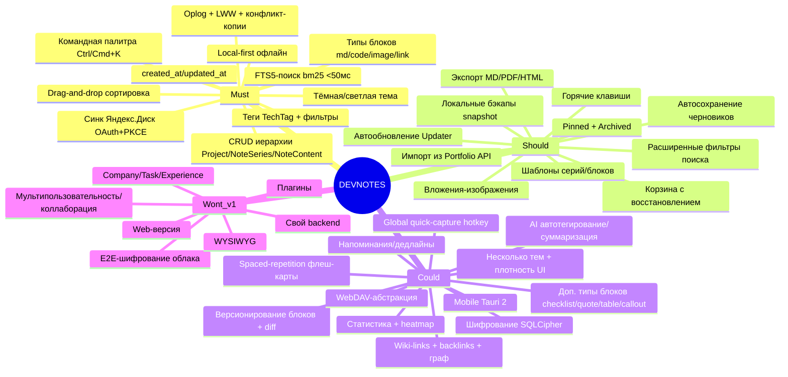

# DEVNOTES — Каталог фич (MoSCoW)

> **Что это за файл.** Полный каталог функциональности DEVNOTES с приоритизацией по методу **MoSCoW** (Must / Should / Could / Won't). Документ отвечает на вопрос «**что** приложение делает» (не «как» — это соседние технические документы). Каждая фича описана единообразно: краткое инженерное описание, ценность для пользователя, привязка к сущностям модели данных и, где нужно, компромиссы/риски. Файл — источник правды по объёму продукта; из него растут `08-ROADMAP.md` (в каком порядке делаем) и приёмочные критерии. Все термины — строго по глоссарию `CLAUDE.md` (§3.5): **Project → NoteSeries → NoteContent**, без синонимов.

**Статус:** черновик v1 · **Дата:** 2026-07-17 · **Автор:** Full-Stack .NET/React-разработчик · **Аудитория:** автор + контрибьюторы.

---

## Связанные документы

| Документ | Назначение |
|---|---|
| [`01-VISION.md`](./01-VISION.md) | Видение, персоны, сценарии, метрики — «зачем» |
| [`02-ARCHITECTURE.md`](./02-ARCHITECTURE.md) | Слои Clean Architecture, Tauri 2.0, IPC-контур |
| [`03-FEATURES.md`](./03-FEATURES.md) | **(этот файл)** Каталог фич с приоритизацией MoSCoW |
| [`03-DATA-MODEL.md`](./03-DATA-MODEL.md) | Доменные сущности, SQLite-схема (snake_case), UUID v7, миграции |
| [`04-SEARCH-FTS5.md`](./04-SEARCH-FTS5.md) | FTS5 external content, bm25, триггеры, trigram-fallback, SLA <50 мс |
| [`05-SYNC-YANDEX.md`](./05-SYNC-YANDEX.md) | OAuth 2.0 + PKCE, oplog (ChangeLog), LWW + конфликт-копии |
| [`06-DESIGN-SYSTEM.md`](./06-DESIGN-SYSTEM.md) | HSL-токены shadcn/ui, терминальная эстетика, CVA-примитивы |
| [`08-ROADMAP.md`](./08-ROADMAP.md) | WBS, фазы, релизы — «в каком порядке» |
| [`09-RISKS.md`](./09-RISKS.md) | Реестр рисков и меры митигации |

> Ссылки на ещё не созданные файлы — плановые (стадия проектирования). Факт наличия сверяется по `docs/11-FILE-INDEX.md`.

---

## 0. Как читать этот документ

**MoSCoW** — приоритизация по обязательности для ближайшего релиза:

| Приоритет | Значение | Правило |
|---|---|---|
| **Must** | Без этого продукт не имеет смысла (MVP) | Входит в v1.0. Провал любой Must = релиз не состоялся |
| **Should** | Важно, болезненно без этого, но релиз возможен | Целится в v1.0–v1.1; вырезается первым при нехватке времени |
| **Could** | Полезно, «приятно иметь» | v1.2+; берётся при наличии ресурса |
| **Won't** (this time) | Осознанно вне scope v1 | Фиксируется, чтобы не расползался объём |

**Легенда статусов сложности** (грубая оценка трудозатрат ядра+UI): `◔` малая · `◑` средняя · `●` крупная · `◕` крупная с риском.

**Обозначения зависимостей** ссылаются на сущности из `03-DATA-MODEL.md`.

---

## 1. Сводная карта приоритетов



Итоговая таблица (детали — в разделах ниже):

| # | Фича | Приоритет | Сложность | Ключевые сущности |
|---|---|---|---|---|
| M1 | CRUD иерархии Project → NoteSeries → NoteContent | Must | ● | Project, NoteSeries, NoteContent |
| M2 | Типы блоков markdown / code / image / link | Must | ◑ | NoteContent, NoteContentType |
| M3 | Drag-and-drop сортировка блоков | Must | ◑ | NoteContent.sort_order |
| M4 | Markdown-редактор с live-preview и подсветкой кода | Must | ● | NoteContent |
| M5 | Мгновенный FTS5-поиск (bm25, сниппеты) | Must | ◕ | notes_fts |
| M6 | Командная палитра Ctrl/Cmd+K | Must | ◑ | — |
| M7 | Теги TechTag/TechTagType + фильтрация | Must | ◑ | TechTag, TechTagType, NoteSeriesTag |
| M8 | Синхронизация с Яндекс.Диском (OAuth+PKCE) | Must | ◕ | SyncState |
| M9 | Офлайн-очередь (oplog) + LWW + конфликт-копии | Must | ◕ | ChangeLog |
| M10 | Local-first / полный офлайн | Must | ● | все |
| M11 | Тёмная/светлая тема, терминальная эстетика | Must | ◑ | AppSetting |
| M12 | Обязательные created_at / updated_at (UTC ISO 8601) | Must | ◔ | все |
| S1 | Экспорт серии в Markdown / PDF / HTML | Should | ◑ | NoteSeries, NoteContent |
| S2 | Вложения-изображения (content-addressable) | Should | ● | Attachment |
| S3 | Локальные бэкапы (VACUUM INTO snapshot) | Should | ◑ | — |
| S4 | Закрепление (pinned) + архив проектов (archived) | Should | ◔ | Project, NoteSeries |
| S5 | Корзина с восстановлением (soft-delete) | Should | ◑ | все доменные |
| S6 | Автосохранение черновиков (debounce) + индикатор синка | Should | ◑ | NoteContent, ChangeLog |
| S7 | Горячие клавиши (глобальная карта) | Should | ◔ | — |
| S8 | Шаблоны серий/блоков | Should | ◑ | NoteSeries, NoteContent |
| S9 | Автообновление (Tauri Updater, подписи) | Should | ◑ | — |
| S10 | Расширенные фильтры поиска (проект/тег/тип/даты) | Should | ◑ | notes_fts + JOIN |
| S11 | Импорт из Portfolio API (одноразовый мигратор) | Should | ◑ | все доменные |
| C1 | Версионирование блоков (история + diff + откат) | Could | ● | NoteContent (rev-таблица) |
| C2 | Wiki-links [[...]] + backlinks | Could | ◑ | NoteContent |
| C3 | Граф связей заметок | Could | ● | производное от C2 |
| C4 | Доп. типы блоков: checklist/quote/table/callout | Could | ◑ | NoteContentType |
| C5 | Шифрование чувствительных заметок (SQLCipher) | Could | ◕ | — |
| C6 | Глобальный quick-capture (system hotkey) | Could | ◑ | NoteContent |
| C7 | WebDAV-абстракция (Nextcloud и др.) | Could | ● | SyncState |
| C8 | Статистика + heatmap активности | Could | ◑ | производное от created_at |
| C9 | Напоминания / дедлайны | Could | ◑ | NoteSeries/NoteContent (+reminder) |
| C10 | Spaced-repetition / флеш-карты из заметок | Could | ● | производное от NoteContent |
| C11 | Несколько тем оформления + плотность UI | Could | ◔ | AppSetting |
| C12 | Mobile-версия (Tauri 2 iOS/Android) | Could | ◕ | — |
| C13 | AI: автотегирование, суммаризация, семантический поиск | Could | ◕ | — |
| W* | Company/Task/Experience, коллаборация, backend, web, плагины, E2E, WYSIWYG | Won't v1 | — | — |

---

## 2. MUST — ядро MVP

### M1. CRUD иерархии Project → NoteSeries → NoteContent `●`

**Описание.** Полный жизненный цикл трёхуровневой иерархии: создание/чтение/обновление/удаление **Project** (проект-группа), **NoteSeries** (серия/тема внутри проекта, `project_id?` — серия может быть «беспроектной») и **NoteContent** (блок контента внутри серии). Все ID — **UUID v7**, генерируются клиентом (условие офлайн-создания). Удаление серии каскадит блоки; удаление проекта — отвязывает/каскадит серии по правилу из `03-DATA-MODEL.md`.

```
Project (id, name, short_name?, description?, archived, created_at, updated_at)
  └─ NoteSeries (id, project_id?, title, description?, pinned, created_at, updated_at)
       └─ NoteContent (id, series_id, sort_order, title?, text, type, language?, created_at, updated_at)
```

**Ценность.** Базовая единица работы: инженер группирует знания по проекту и теме, а не сваливает в плоский список. Без иерархии продукта нет.

---

### M2. Типы блоков markdown / code / image / link `◑`

**Описание.** Каждый **NoteContent** имеет `type` из справочника **NoteContentType**: `markdown | code | image | link`. Поле `language?` хранит язык для блоков `code` (`csharp`, `rust`, `ts`, `bash`, …). Тип определяет редактор и рендер блока.

| Тип | Хранение (`text`) | Рендер |
|---|---|---|
| `markdown` | Markdown-исходник | `react-markdown` → HTML |
| `code` | Исходный код | `react-syntax-highlighter`, подсветка по `language` |
| `image` | Ссылка/`attachment_id` | `` из локального `Attachment` (см. S2) |
| `link` | URL + подпись | карточка ссылки |

**Ценность.** Типизированный ввод вместо «стены текста»: код подсвечивается, ссылки кликабельны, картинки встроены. Прямо адресует боль «плохой ввод кода» из `01-VISION.md`.

---

### M3. Drag-and-drop сортировка блоков `◑`

**Описание.** Порядок блоков внутри серии задаётся полем `sort_order` и меняется перетаскиванием (**@dnd-kit**). Сортировка — целочисленный `sort_order` с переиндексацией диапазона при вставке (или дробные индексы/`lexorank`-стратегия — решение в `03-DATA-MODEL.md`, чтобы не переписывать всю серию на каждый drop). Каждое перемещение фиксируется в **ChangeLog**.

**Ценность.** Заметка — это структура мысли; порядок несёт смысл (сначала проблема, потом решение, потом сниппет). Ручная сортировка обязательна для конспектов и разборов.

---

### M4. Markdown-редактор с live-preview и подсветкой кода `●`

**Описание.** Редактор блока `markdown`: моноширинный ввод (**JetBrains Mono**) с живым превью. Режимы: **split** (исходник ↔ превью), **preview**, **source**. Подсветка кода в fenced-блоках и в блоках `code`. Поддержка GFM (таблицы, чек-боксы, ~~strike~~), автоссылки, безопасный рендер (санитайз HTML). На больших сериях превью рендерится только для видимых блоков (виртуализация — см. риск IPC/перфоманса в `09-RISKS.md`).

> **Компромисс v1:** это **markdown-редактор с превью**, а не WYSIWYG (WYSIWYG — в `Won't`). Инженерная аудитория предпочитает контроль над разметкой.

**Ценность.** Быстрый, предсказуемый ввод технического текста с кодом и мгновенной обратной связью — центральный ежедневный сценарий.

---

### M5. Мгновенный полнотекстовый поиск (FTS5 + bm25) `◕`

**Описание.** Виртуальная таблица **notes_fts** (FTS5, **external content** над `NoteContent.title/text` + `NoteSeries.title`), индекс поддерживается **триггерами** insert/update/delete. Ранжирование **bm25**, подсветка совпадений через `snippet()`. Целевой SLA — **<50 мс на 10k блоков**. Русская морфология: `unicode61` ищет по точным словоформам → закладываем **trigram-токенизатор** как fallback (компромисс: размер индекса vs морфология — детально в `04-SEARCH-FTS5.md`).

**Ценность.** Главное УТП: «знание находится за секунды». Без мгновенного поиска база из тысяч заметок мертва.

---

### M6. Командная палитра Ctrl/Cmd+K `◑`

**Описание.** Модальная палитра: единая строка для поиска по всей БД, перехода к проекту/серии и запуска быстрых действий (новая серия, новый блок, переключение темы, экспорт, синк-сейчас). Fuzzy-подбор действий + результаты FTS5-поиска в одном списке. Полностью управляема с клавиатуры.

**Ценность.** Клавиатурный, «терминальный» UX: любое действие в один аккорд, без мыши. Соответствует эстетике и целевой персоне.

---

### M7. Теги технологий TechTag + фильтрация `◑`

**Описание.** **TechTag** (`id, name, type_id, description?`) с категорией **TechTagType**: `language | framework | tool | database | devops | other`. Привязка тегов к сериям — many-to-many через **NoteSeriesTag** (`series_id, tag_id`). Списки серий фильтруются по тегу(ам) и проекту; фильтр комбинируется с поиском (см. S10).

**Ценность.** Кросс-проектная навигация «покажи всё про Rust / EF Core / Docker» независимо от того, в каком проекте лежит заметка.

---

### M8. Синхронизация с Яндекс.Диском (OAuth 2.0 + PKCE) `◕`

**Описание.** Авторизация — **OAuth 2.0 Authorization Code + PKCE** через **loopback-redirect** (локальный http-сервер на `127.0.0.1:<port>`), scope — **app folder**. Токены хранятся в **системном keychain** (никогда в БД/файлах репозитория). Обмен с Диском — REST Cloud API (fallback-канал — WebDAV, см. C7 и риск недоступности сервиса в `09-RISKS.md`).

**Ценность.** Мультиустройство без своего сервера: рабочая и домашняя машины делят одну базу знаний через личный Яндекс.Диск.

---

### M9. Офлайн-очередь (oplog) + LWW + конфликт-копии `◕`

**Описание.** Каждое изменение доменных сущностей пишется в **ChangeLog** (oplog): `id, entity, entity_id, op, payload_json, ts, device_id, synced`. При появлении сети накопленные операции выгружаются в app folder Диска; входящие применяются. Разрешение конфликтов — **LWW по `updated_at` на уровне NoteContent**; при расхождении версий проигравшая **не теряется молча**, а сохраняется как **конфликт-копия** блока с UI-индикацией.

> **Инвариант (жёсткий, `09-RISKS.md`):** по облаку **никогда** не синкается «живой» файл SQLite целиком — только oplog + снапшоты. Иначе гарантированная потеря данных при двух устройствах.

**Ценность.** Надёжный синк, которому можно доверять: правки, сделанные офлайн на двух машинах, сходятся без тихой потери данных.

---

### M10. Local-first / полный офлайн `●`

**Описание.** Приложение полностью функционально **без сети**: чтение, запись, поиск, сортировка, экспорт работают на локальном **SQLite** (rusqlite). Сеть нужна только опциональному слою синка/бэкапа. Схема версионируется миграциями.

**Ценность.** Заметки доступны в самолёте, метро, при падении облака. Данные — на диске пользователя, в открытом формате, без вендор-лока.

---

### M11. Тёмная/светлая тема + терминальная эстетика `◑`

**Описание.** Тёмная тема **по умолчанию** + светлая. Дизайн-токены — **HSL CSS-переменные** в стиле shadcn/ui (`--background`, `--foreground`, `--primary`, `--card`, `--muted`, `--accent`, `--border`, `--ring`, `--radius`). Эстетика: **JetBrains Mono**, неоново-зелёный акцент **`#22c55e`**, «terminal window», scanlines, matrix-grid фон, neon-свечение. Компоненты — **CVA + clsx + tailwind-merge**; примитивы Button/Card/Input/TextArea/Badge как в Portfolio. Выбор темы — в **AppSetting**. Детали — `06-DESIGN-SYSTEM.md`.

**Ценность.** Узнаваемый инженерный характер продукта и комфорт для глаз при долгой работе с кодом.

---

### M12. Обязательные created_at / updated_at `◔`

**Описание.** У **каждой** доменной сущности — `created_at` и `updated_at`, хранение **UTC ISO 8601**, отображение в **локальной таймзоне** пользователя. `updated_at` — основа LWW-разрешения конфликтов (M9). Требование пользователя «каждая запись имеет дату и время» — реализуется здесь.

**Ценность.** Хронология знаний, сортировка «последнее изменённое», корректный синк. Фундамент, на который опираются M9, C1, C8.

---

## 3. SHOULD — важное, но не блокирует релиз

### S1. Экспорт серии в Markdown / PDF / HTML `◑`

**Описание.** Экспорт целой **NoteSeries** (или выбранных блоков) в три формата: **Markdown** (склейка блоков по `sort_order`), **HTML** (рендер темы), **PDF**. Для PDF — `html2pdf.js`; при проблемах в WebKitGTK (риск в `09-RISKS.md`) запасной путь — генерация на Rust-стороне (`printpdf`/headless).

**Ценность.** Знание выносится наружу: в PR-описание, вики команды, отчёт. Анти-вендор-лок.

---

### S2. Вложения-изображения (content-addressable) `●`

**Описание.** **Attachment** (`id, note_content_id, file_name, mime, size, sha256, local_path, sync_status`). Файлы хранятся рядом с БД, адресуются по **sha256** (дедупликация одинаковых картинок). Вставка через paste/drag. Синк вложений на Диск отдельным каналом с `sync_status`.

**Ценность.** Скриншоты ошибок, диаграммы, схемы прямо в заметке — обычный кейс разбора бага.

---

### S3. Локальные бэкапы (snapshot) `◑`

**Описание.** Периодический снапшот БД через **`VACUUM INTO`** (консистентная копия без остановки работы) с ротацией. Восстановление — из локального снапшота и из снапшота на Яндекс.Диске.

**Ценность.** Защита от повреждения БД и «ой, удалил проект». Дополняет корзину (S5) на уровне всей базы.

---

### S4. Закрепление (pinned) + архив проектов (archived) `◔`

**Описание.** Флаг `pinned` у **NoteSeries** — закреп в топе списка. Флаг `archived` у **Project** — убирает из основной навигации **без удаления** (архив доступен отдельным фильтром).

**Ценность.** Управление вниманием: активное — под рукой, завершённое — не мешает, но не потеряно.

---

### S5. Корзина с восстановлением (soft-delete) `◑`

**Описание.** Удаление доменных сущностей — «мягкое» (`deleted_at`/статус), объект уезжает в **корзину** и восстанавливается в исходное место. Жёсткое удаление — по TTL или вручную. Синхронно с oplog (удаление — такая же операция).

**Ценность.** Прощает ошибки; удаление перестаёт быть страшным. Критично для доверия к синку (удаление на одном устройстве не должно необратимо стирать данные на другом).

---

### S6. Автосохранение черновиков + индикатор синка `◑`

**Описание.** Ввод в блок сохраняется автоматически с **debounce** (напр. 400–800 мс) — без кнопки «Сохранить». Глобальный индикатор показывает число несинхронизированных операций (`ChangeLog.synced = 0`) и статус «всё выгружено / есть офлайн-изменения / идёт синк».

**Ценность.** Ничего не теряется при закрытии окна; пользователь всегда видит, синхронизирован ли он.

---

### S7. Горячие клавиши (глобальная карта) `◔`

**Описание.** Клавиатурные сокращения на частые действия и подсказка-шпаргалка (`?`).

| Действие | Клавиши (примерно) |
|---|---|
| Командная палитра / поиск | `Ctrl/Cmd+K` |
| Новая серия | `Ctrl/Cmd+N` |
| Новый блок | `Ctrl/Cmd+Enter` |
| Переключить тему | `Ctrl/Cmd+Shift+L` |
| Синк сейчас | `Ctrl/Cmd+S` (переопределён на синк, автосейв и так есть) |

**Ценность.** Скорость и «терминальность» — без отрыва рук от клавиатуры.

---

### S8. Шаблоны серий/блоков `◑`

**Описание.** Предзаготовки структуры: **«разбор бага»** (симптом → воспроизведение → причина → фикс → проверка), **«сниппет»** (описание + блок `code`), **«конспект технологии»** (обзор → ключевые команды → грабли → ссылки). Пользовательские шаблоны — тоже.

**Ценность.** Снижает трение старта записи и приучает к единой структуре знаний.

---

### S9. Автообновление (Tauri Updater) `◑`

**Описание.** Обновление приложения через **Tauri Updater** с проверкой **подписи** релизов. Каналы stable/beta; отложенная установка.

**Ценность.** Пользователь всегда на свежей версии без ручной переустановки; подпись защищает канал доставки.

---

### S10. Расширенные фильтры поиска `◑`

**Описание.** Поверх FTS5 (M5) — фасеты: по **проекту**, **тегу** (TechTag), **типу блока** (NoteContentType), **диапазону дат** (`created_at`/`updated_at`). Фильтры комбинируются с полнотекстовым запросом (FTS5 MATCH + JOIN/WHERE), состояние отражается в URL/стейте.

**Ценность.** «Найди код на Rust в проекте X за последний месяц» — точечная выборка вместо простыни результатов.

---

### S11. Импорт из Portfolio API (одноразовый мигратор) `◑`

**Описание.** Разовый импортёр тянет из существующего **Portfolio API** сущности `Project / NoteSeries / NoteContent / TechTag` и раскладывает в локальную схему (маппинг PascalCase↔snake_case, генерация UUID v7, простановка `created_at/updated_at`). Портфолио-часть (Company/Task/Experience) **не импортируется**.

**Ценность.** Мгновенное наполнение базы реальными данными — не начинать с нуля.

---

## 4. COULD — приятные расширения

### C1. Версионирование блоков (история + diff + откат) `●`

**Описание.** История ревизий **NoteContent**: снимок при значимом изменении, просмотр **diff** между версиями, **откат**. Хранение — отдельная rev-таблица (не раздувать основную строку).

**Ценность.** «Что я тут менял вчера» и восстановление удачной формулировки. Дополняет корзину на уровне содержимого блока.

---

### C2. Wiki-links [[...]] + backlinks `◑`

**Описание.** Синтаксис `[[Название серии]]` в markdown-блоках создаёт ссылку на другую **NoteSeries**/блок; на целевой странице собирается панель **backlinks** («сюда ссылаются»). Автодополнение имён при вводе `[[`.

**Ценность.** Знания перестают быть изолированными — образуется связная сеть, как в Obsidian/Zettelkasten.

---

### C3. Граф связей заметок `●`

**Описание.** Визуальный граф серий как узлов и wiki-links (C2) как рёбер; клик — переход. Фильтр по проекту/тегу.

**Ценность.** Обзор структуры базы знаний, обнаружение кластеров и «сирот».

> Зависит от C2 — без wiki-links графу нечего рисовать.

---

### C4. Дополнительные типы блоков `◑`

**Описание.** Расширение **NoteContentType** сверх md/code/image/link: **checklist** (чек-лист задач), **quote** (цитата), **table** (таблица), **callout** (выделенный блок note/warning/tip). Каждый — свой редактор и рендер.

| Тип | Назначение |
|---|---|
| `checklist` | Пункты с чекбоксами (шаги, todo внутри заметки) |
| `quote` | Цитата из дока/статьи с источником |
| `table` | Структурированные данные (флаги, бенчмарки) |
| `callout` | Акцент: ⚠️ грабли / 💡 совет / ℹ️ примечание |

**Ценность.** Богаче выражение мысли без ухода в WYSIWYG; чек-листы — мостик к напоминаниям (C9).

---

### C5. Шифрование чувствительных заметок (SQLCipher) `◕`

**Описание.** Шифрование локальной БД через **SQLCipher** по мастер-паролю (ключ — из пароля через KDF). Опционально — пометка отдельных серий как «чувствительных». В облако уходит только зашифрованный oplog/снапшот (в v1 облако — транспортный TLS, E2E — в `Won't`, см. риск-реестр).

**Ценность.** Токены, ключи, приватные заметки защищены на диске (потеря/кража ноутбука).

---

### C6. Глобальный quick-capture (system hotkey) `◑`

**Описание.** Системный глобальный хоткей открывает мини-окно быстрой заметки поверх любого приложения; текст падает в «Входящие» (inbox-серию) для последующей разборки.

**Ценность.** Мысль фиксируется за 2 секунды, не прерывая работу — ключ к тому, чтобы заметки вообще делались.

---

### C7. WebDAV-абстракция (альтернативные облака) `●`

**Описание.** Абстракция транспорта синка поверх **WebDAV** — Nextcloud, Яндекс.Диск по WebDAV и др. Запасной канал, если Cloud REST недоступен (см. риск в `09-RISKS.md`).

**Ценность.** Свобода выбора облака; устойчивость к недоступности одного провайдера.

---

### C8. Статистика + heatmap активности `◑`

**Описание.** Дашборд: **heatmap** активности по дням (в стиле GitHub-contributions), распределение заметок по технологиям (TechTag), топ-проекты. Всё считается из `created_at`/`updated_at` и связей — без отдельного трекинга.

**Ценность.** Обратная связь и мотивация («серия из 30 дней»), видно, какие технологии реально осваиваются.

---

### C9. Напоминания / дедлайны `◑`

**Описание.** Опциональные `reminder_at`/`due_at` у серии/блока или пункта чек-листа; локальные системные уведомления. Панель «на сегодня/просрочено».

**Ценность.** Заметка «вернуться к этому багу» или «доучить раздел» не теряется во времени.

---

### C10. Spaced-repetition / флеш-карты из заметок `●`

**Описание.** Из блоков генерируются **флеш-карты** (вопрос/ответ; можно из markdown-заголовка+тела или из выделения). Повторение по алгоритму интервального повторения (SM-2/FSRS-подобному): планировщик показывает карты «на сегодня», оценка ответа сдвигает интервал.

**Ценность.** Заметки превращаются в инструмент **заучивания технологий** — команды, API, паттерны переходят в долговременную память, а не просто хранятся.

---

### C11. Несколько тем + плотность интерфейса `◔`

**Описание.** Помимо dark/light — дополнительные темы (напр. «amber terminal», «solarized»), и переключатель **плотности** UI (comfortable / compact) для списков и блоков. Значения — в **AppSetting**.

**Ценность.** Персонализация под глаза и под размер экрана; на маленьком ноуте compact вмещает больше.

---

### C12. Mobile-версия (Tauri 2 iOS/Android) `◕`

**Описание.** Мобильная сборка на **Tauri 2** поверх той же схемы и того же синка через Яндекс.Диск. Read-heavy сценарий + quick-capture.

**Ценность.** Доступ к базе знаний и быстрый захват с телефона. Перспектива — в MVP не входит.

---

### C13. AI-фичи `◕`

**Описание.** Автотегирование (предложение TechTag по тексту), суммаризация серии, **семантический поиск** (эмбеддинги как дополнение к FTS5). Локальные/облачные модели — по выбору; работает как слой поверх данных, не ломая local-first.

**Ценность.** Меньше ручной рутины (теги/оглавления), поиск «по смыслу», а не только по словоформам.

---

## 5. WON'T (this time) — осознанно вне v1

Зафиксировано, чтобы объём не расползался. Упоминать только в разделах «перспектива».

| Что не делаем в v1 | Почему |
|---|---|
| **Портфолио-часть Portfolio**: Company, Task, ExperienceWork/ExperienceEducation | Не относится к заметкам; `Project` живёт без `CompanyId`. Только импорт Project/NoteSeries/NoteContent/TechTag |
| **Мультипользовательность, шаринг, realtime-коллаборация** | Продукт персональный; коллаборация кратно усложняет синк и модель |
| **Собственный сервер / backend** | Синк только клиент ↔ Яндекс.Диск; нет инфраструктуры для поддержки |
| **Web-версия и mobile в MVP** | Фокус на десктоп; mobile — перспектива (C12) |
| **Electron / .NET MAUI / Flutter как оболочка** | Решение зафиксировано: **Tauri 2.0** (ADR в `07-ADR/`) |
| **Система плагинов/расширений** | Преждевременно; раздувает поверхность безопасности и поддержки |
| **E2E-шифрование облачных данных** | В v1 — только транспортный TLS; локальный SQLCipher (C5) — отдельно |
| **WYSIWYG-редактор** | Только markdown-редактор с превью (M4) — сознательный выбор под инженерную аудиторию |

---

## 6. Матрица трассировки (фича → документ реализации)

| Фича | Основной документ реализации |
|---|---|
| M1, M2, M3, M12, S4, S5, C1, C4 | `03-DATA-MODEL.md` (схема, инварианты, миграции) |
| M4, M6, M11, C2, C3, C11 | `06-DESIGN-SYSTEM.md` + фронт-фичи (`src/features/*`) |
| M5, S10, C13 | `04-SEARCH-FTS5.md` |
| M8, M9, S2, S3, C5, C7 | `05-SYNC-YANDEX.md` |
| M10, S6, S9, C6, C12 | `02-ARCHITECTURE.md` (Tauri, IPC, local-first) |
| S1, S8, S11, C8, C9, C10 | UseCases-слой (Rust) + фронт-фичи |

> Приёмочные критерии каждой Must-фичи детализируются при её реализации; порядок и вехи — в `08-ROADMAP.md`. Риски по FTS5-морфологии, синку «живого» файла БД, OAuth Я.Диска, WebKitGTK, IPC-перфомансу и LWW — в `09-RISKS.md`.

---

_Документ поддерживается в актуальном состоянии. Изменение объёма продукта (добавление/перенос/удаление фич между приоритетами) отражается здесь и в `08-ROADMAP.md`, с записью в журнал `CLAUDE.md` (§7)._
