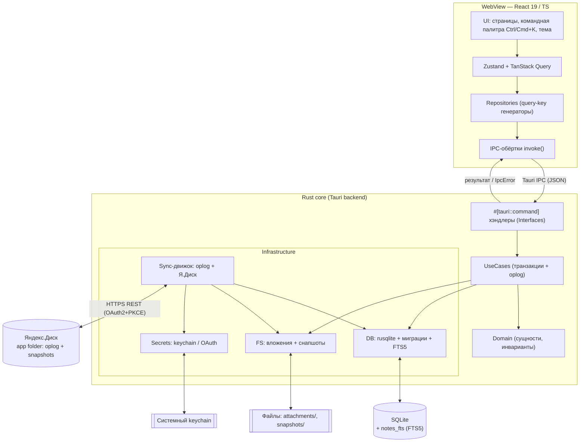
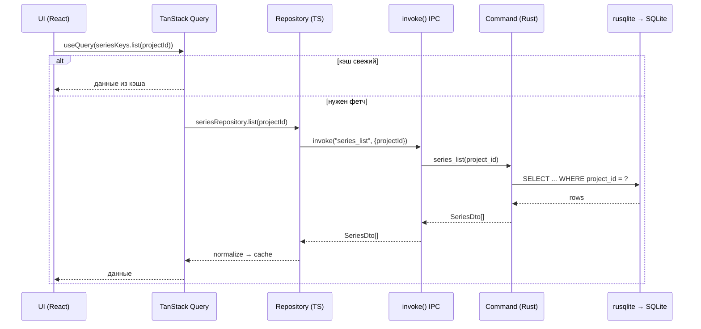
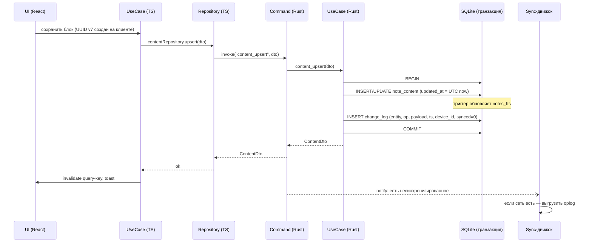

# 04 — Архитектура

> **Что это за файл.** Технический разбор архитектуры десктоп-приложения **DEVNOTES**: как устроена оболочка Tauri 2.0 (Rust-ядро) поверх React 19/TypeScript-фронтенда, как проведены слои по мотивам Clean Architecture из проекта Portfolio (Domain / UseCases / Interfaces / Infrastructure / UI), как ходят данные между WebView и Rust через Tauri IPC, как устроены слой доступа к данным (SQLite + миграции), sync-движок (oplog, конфликты) и контракты IPC-команд. Документ — источник истины по компонентным границам; конкретные схемы БД, API синка и UI-детали вынесены в соседние файлы.

## Связанные документы

| Файл | Тема |
|------|------|
| [`00-OVERVIEW.md`](./00-OVERVIEW.md) | Обзор продукта, требования, WBS |
| [`01-STACK.md`](./01-STACK.md) | Стек и обоснование выбора (Tauri vs Electron/MAUI/Flutter) |
| [`02-DATA-MODEL.md`](./02-DATA-MODEL.md) | Доменная модель, ER-диаграмма, DDL SQLite |
| [`03-MIGRATIONS.md`](./03-MIGRATIONS.md) | Версионирование схемы, порядок миграций |
| **`04-ARCHITECTURE.md`** | **Этот документ — архитектура слоёв, IPC, sync-движок** |
| [`05-SEARCH-FTS5.md`](./05-SEARCH-FTS5.md) | Полнотекстовый поиск: FTS5, bm25, токенизаторы |
| [`06-SYNC-YANDEX.md`](./06-SYNC-YANDEX.md) | Синхронизация с Яндекс.Диском, OAuth, конфликты |
| [`07-DESIGN-SYSTEM.md`](./07-DESIGN-SYSTEM.md) | Дизайн-токены, компоненты, терминальная эстетика |
| [`08-IPC-CONTRACTS.md`](./08-IPC-CONTRACTS.md) | Полный реестр IPC-команд и их сигнатур |

---

## 1. Обзор и ключевые принципы

DEVNOTES — **local-first** десктоп-приложение. Всё работает офлайн; сеть нужна только для синхронизации с Яндекс.Диском. Единственный источник истины на устройстве — локальная база **SQLite**. Облако хранит не «живой» файл БД, а журнал операций (oplog) и периодические снапшоты.

Приложение состоит из двух миров, соединённых через **Tauri IPC**:

- **WebView (фронтенд)** — React 19 + TypeScript + Vite + Tailwind. Здесь живут UI, состояние (Zustand + TanStack Query), repository-pattern с генераторами query-key, рендер markdown и подсветка кода. Вся **бизнес-логика представления** — тут.
- **Rust-ядро** — тонкий, но ответственный слой: доступ к SQLite, FTS5-поиск, миграции, sync-движок, работа с файловой системой (вложения, снапшоты), keychain и OAuth-loopback. Тут — **инварианты данных и I/O**.

### Разделение ответственности (сознательное «тонкое ядро»)

Команда — .NET/React, Rust второстепенен. Поэтому ядро держим **максимально тонким**: SQL, sync, IPC-команды, FS. Никакой доменной «умной» логики представления в Rust не выносим. Это осознанный компромисс из [WBS-рисков](./00-OVERVIEW.md): снижаем кривую обучения ценой того, что часть логики (валидация форм, сортировка UI, форматирование дат) дублируется описанием контракта, а не реализацией.

| Принцип | Как реализуется |
|---------|-----------------|
| **Local-first** | Все операции идут в локальный SQLite синхронно; UI никогда не ждёт сеть |
| **Offline-создание** | ID = **UUID v7 (строка)**, генерируется на клиенте (в TS) до записи — не нужен автоинкремент от БД |
| **Единый источник времени** | В БД — **UTC ISO 8601**; `created_at` / `updated_at` обязательны у всех сущностей; в UI показываем в локальной таймзоне |
| **Журналируемость** | Каждое доменное изменение пишет запись в `ChangeLog` (oplog) в той же транзакции |
| **Детерминированный поиск** | FTS5 external content над `NoteContent` + `NoteSeries`, индекс обновляется триггерами, ранжирование bm25 |
| **Безопасные конфликты** | LWW по `updated_at` на уровне `NoteContent` + **конфликт-копия** при расхождении (никогда молча не теряем версию) |

---

## 2. Слои (Clean Architecture по мотивам Portfolio)

Слои зеркалятся по обе стороны IPC: границы одинаковы, реализация разная. Направление зависимостей — **внутрь**: UI/Infrastructure зависят от Interfaces и Domain, но не наоборот.

```
┌──────────────────────────────────────────────────────────────┐
│                            UI                                  │
│   React-компоненты, страницы, командная палитра, тема          │
│   Zustand (эфемерное состояние) + TanStack Query (серверное)   │
└───────────────┬──────────────────────────────────────────────┘
                │ зависит от
┌───────────────▼──────────────────────────────────────────────┐
│                        UseCases (TS)                           │
│   Сценарии: createSeries, reorderBlocks, runSearch, syncNow    │
│   Оркестрация repository + инвалидация query-key                │
└───────────────┬──────────────────────────────────────────────┘
                │ зависит от
┌───────────────▼──────────────────────────────────────────────┐
│                       Interfaces (TS)                          │
│   Контракты репозиториев, DTO, тайп-гарды, invoke-обёртки IPC   │
│   (единственная точка, знающая имена Tauri-команд)              │
└───────────────┬──────────────────────────────────────────────┘
                │  Tauri IPC (JSON)  ── граница процессов ──
┌───────────────▼──────────────────────────────────────────────┐
│                    Interfaces (Rust)                           │
│   #[tauri::command] хэндлеры, десериализация DTO, валидация     │
└───────────────┬──────────────────────────────────────────────┘
                │ зависит от
┌───────────────▼──────────────────────────────────────────────┐
│                      UseCases (Rust)                           │
│   Транзакционные сценарии: apply_change, resolve_conflict,      │
│   run_fts_query, apply_migration                                │
└───────────────┬──────────────────────────────────────────────┘
                │ зависит от
┌───────────────▼──────────────────────────────────────────────┐
│                       Domain (Rust)                            │
│   Сущности, инварианты, типы op/entity, ошибки домена          │
└───────────────┬──────────────────────────────────────────────┘
                │ реализуется в
┌───────────────▼──────────────────────────────────────────────┐
│                  Infrastructure (Rust)                         │
│   DB (rusqlite + миграции + FTS5)                              │
│   Sync (oplog-выгрузка, Яндекс.Диск REST, OAuth, keychain)     │
│   FS (вложения content-addressable, снапшоты VACUUM INTO)      │
└──────────────────────────────────────────────────────────────┘
```

### Что где лежит

| Слой | Сторона | Ответственность | Ключевые модули |
|------|---------|-----------------|-----------------|
| **Domain** | Rust | Сущности `Project/NoteSeries/NoteContent/TechTag/...`, типы `Op`, `EntityKind`, доменные ошибки. Чистые типы, без I/O | `core/domain/` |
| **UseCases** | Rust | Транзакционные сценарии над репозиториями; здесь коммитятся oplog-записи | `core/usecases/` |
| **UseCases** | TS | Сценарии UI: оркестрация репозиториев, инвалидация кэша TanStack Query | `src/usecases/` |
| **Interfaces** | Rust | `#[tauri::command]`-хэндлеры, DTO (serde), маппинг доменных ошибок в IPC-ошибки | `core/ipc/` |
| **Interfaces** | TS | `invoke()`-обёртки, DTO-типы, генераторы query-key, тайп-гарды | `src/repositories/`, `src/ipc/` |
| **Infrastructure** | Rust | `Db` (rusqlite pool, миграции, триггеры FTS5), `Sync`, `Fs`, `Secrets` | `core/infra/` |
| **UI** | TS | Компоненты, страницы, командная палитра, дизайн-система | `src/ui/`, `src/components/` |

Repository-pattern на фронте повторяет Portfolio: каждый репозиторий (`projectRepository`, `seriesRepository`, `contentRepository`, `tagRepository`, `searchRepository`, `syncRepository`) экспортирует методы + генератор query-key. TanStack Query кэширует, Zustand держит эфемерное (открытая серия, drag-состояние, тема, статус синка).

---

## 3. Компонентная диаграмма



---

## 4. Поток данных: чтение и запись

### 4.1 Чтение (list/get)

Чтение всегда локальное и синхронное относительно сети. UI не отличает «есть сеть / нет сети».



Большие серии (сотни блоков) читаются **пагинированно** (`content_list(series_id, limit, offset)`), список блоков в UI **виртуализируется** — это митигация IPC-риска из WBS (сериализация JSON на больших сериях).

### 4.2 Запись (create/update/reorder/delete)

Запись атомарна: доменная мутация и запись в `ChangeLog` идут **в одной транзакции**. FTS-индекс обновляется триггерами внутри той же транзакции. После коммита — оптимистичная инвалидация query-key и «пинок» sync-движку.



**Автосохранение черновиков** (should-фича): в UI — debounce, каждый flush идёт через тот же `content_upsert`. Индикатор «несинхронизированных изменений» читает `COUNT(*) FROM change_log WHERE synced = 0`.

---

## 5. Слой доступа к данным (SQLite)

### 5.1 Подключение и режим

- Драйвер: **rusqlite** (bundled SQLite, чтобы не зависеть от системной версии и гарантировать наличие FTS5).
- Режим журнала: **WAL** — конкурентное чтение при одиночной записи, устойчивость.
- `PRAGMA foreign_keys = ON`, `PRAGMA busy_timeout = 5000`.
- Пул соединений: один writer (сериализованный) + несколько readers. Запись всегда через writer, чтобы транзакции oplog не пересекались.

```rust
// Инициализация (эскиз)
let conn = Connection::open(db_path)?;
conn.pragma_update(None, "journal_mode", "WAL")?;
conn.pragma_update(None, "foreign_keys", "ON")?;
conn.pragma_update(None, "busy_timeout", 5000)?;
run_migrations(&conn)?; // см. 03-MIGRATIONS.md
```

### 5.2 Миграции (версионируются)

Схема версионируется целочисленным `user_version`. Миграции — упорядоченный набор SQL-шагов; ядро на старте догоняет БД до целевой версии в транзакции. Down-миграций нет (только forward + снапшот перед апгрейдом).

```rust
fn run_migrations(conn: &Connection) -> Result<()> {
    let current: i64 = conn.pragma_query_value(None, "user_version", |r| r.get(0))?;
    for (target, sql) in MIGRATIONS.iter().enumerate().skip(current as usize) {
        conn.execute_batch("BEGIN")?;
        conn.execute_batch(sql)?;
        conn.pragma_update(None, "user_version", (target + 1) as i64)?;
        conn.execute_batch("COMMIT")?;
    }
    Ok(())
}
```

Перед каждым апгрейдом схемы делается снапшот `VACUUM INTO snapshots/pre-migrate-<version>.db` — это и точка отката, и защита. Полный DDL и порядок шагов — в [`02-DATA-MODEL.md`](./02-DATA-MODEL.md) и [`03-MIGRATIONS.md`](./03-MIGRATIONS.md).

### 5.3 FTS5 и триггеры

`notes_fts` — виртуальная таблица FTS5 **external content** над `note_content(title, text)` + `note_series(title)`. Индекс поддерживается **триггерами** `AFTER INSERT/UPDATE/DELETE`, ранжирование — bm25, подсветка — `snippet()`. Компромисс токенизатора (unicode61 vs trigram для русской морфологии) детально разобран в [`05-SEARCH-FTS5.md`](./05-SEARCH-FTS5.md). Целевой SLA — **<50 мс на 10k блоков**.

```sql
-- эскиз; полная версия — в 05-SEARCH-FTS5.md
CREATE VIRTUAL TABLE notes_fts USING fts5(
    title, text,
    content='note_content', content_rowid='rowid',
    tokenize='unicode61 remove_diacritics 2'
);
CREATE TRIGGER note_content_ai AFTER INSERT ON note_content BEGIN
    INSERT INTO notes_fts(rowid, title, text) VALUES (new.rowid, new.title, new.text);
END;
```

---

## 6. Sync-движок

Синхронизация — **только через oplog** (`ChangeLog`), выгружаемый в **app folder Яндекс.Диска**. Файл БД по облаку **никогда не синкается целиком** — это жёсткий инвариант из WBS-рисков (иначе гарантированная потеря данных на двух устройствах).

### 6.1 Модель

- Каждое изменение → строка в `change_log(id, entity, entity_id, op, payload_json, ts, device_id, synced)`.
- `device_id` уникален на устройство (в `SyncState`).
- Курсоры и ревизии Я.Диска — в `SyncState(key, value)`.
- Токены OAuth — в **системном keychain**, не в БД.

### 6.2 Конфликты — LWW + конфликт-копия

Разрешение — **Last-Write-Wins по `updated_at` на уровне `NoteContent`**. Но LWW молча теряет одну версию — недопустимо. Поэтому при расхождении проигравшая версия **не удаляется**, а материализуется как **конфликт-копия** (новый `NoteContent` с пометкой) + UI-индикация. Пользователь сам решает, что оставить.

### 6.3 Sequence синхронизации

```mermaid
sequenceDiagram
    participant APP as DEVNOTES (устройство A)
    participant YD as Яндекс.Диск (app folder)
    participant DB as Локальный SQLite

    Note over APP: триггер: появилась сеть / ручной "Синхронизировать" / таймер

    APP->>YD: GET манифест (ревизии, курсоры устройств)
    YD-->>APP: список oplog-сегментов + last revision

    rect rgb(30,40,30)
    Note over APP,YD: PULL — забрать чужие изменения
    APP->>YD: GET oplog-сегменты с курсора других device_id
    YD-->>APP: change-записи (JSON)
    APP->>DB: BEGIN
    loop по каждой записи
        APP->>DB: сравнить updated_at (LWW)
        alt входящая новее
            APP->>DB: применить (upsert)
        else локальная новее, но обе менялись
            APP->>DB: создать конфликт-копию + флаг
        else уже применена (по id записи)
            APP->>DB: пропустить (идемпотентность)
        end
    end
    APP->>DB: обновить курсоры в SyncState
    APP->>DB: COMMIT
    end

    rect rgb(30,30,40)
    Note over APP,YD: PUSH — выгрузить свои изменения
    APP->>DB: SELECT * FROM change_log WHERE synced = 0 ORDER BY ts
    APP->>YD: PUT новый oplog-сегмент (свой device_id)
    YD-->>APP: 201 Created + новая ревизия
    APP->>DB: UPDATE change_log SET synced = 1
    end

    opt периодический снапшот
        APP->>DB: VACUUM INTO snapshots/db-<ts>.db
        APP->>YD: PUT снапшот (компакция oplog)
    end
```



Идемпотентность обеспечивается тем, что каждая oplog-запись имеет свой UUID; повторное применение — no-op. Детали OAuth (Authorization Code + PKCE, loopback-redirect), лимиты API и WebDAV-fallback — в [`06-SYNC-YANDEX.md`](./06-SYNC-YANDEX.md).

---

## 7. IPC-контракты команд Tauri

IPC — **единственная** граница между мирами. Правила:

- Имена команд знает только слой Interfaces (TS `src/ipc/` ↔ Rust `core/ipc/`). UI и UseCases работают через репозитории.
- DTO — плоские, camelCase на TS ↔ маппинг в snake_case/PascalCase на Rust (serde `rename_all`).
- ID во всех DTO — строка (UUID v7). Даты — строки UTC ISO 8601.
- Все команды возвращают `Result<T, IpcError>`; ошибка сериализуется как `{ code, message, details? }`.

### 7.1 Реестр команд (сводка; полностью — [`08-IPC-CONTRACTS.md`](./08-IPC-CONTRACTS.md))

| Домен | Команда | Вход | Выход |
|-------|---------|------|-------|
| Project | `project_list` | `{ includeArchived }` | `ProjectDto[]` |
| Project | `project_upsert` | `ProjectDto` | `ProjectDto` |
| Project | `project_archive` | `{ id, archived }` | `void` |
| Series | `series_list` | `{ projectId?, tagIds?, pinnedFirst }` | `SeriesDto[]` |
| Series | `series_upsert` | `SeriesDto` | `SeriesDto` |
| Series | `series_set_pinned` | `{ id, pinned }` | `void` |
| Content | `content_list` | `{ seriesId, limit, offset }` | `ContentDto[]` |
| Content | `content_upsert` | `ContentDto` | `ContentDto` |
| Content | `content_reorder` | `{ seriesId, orderedIds }` | `void` |
| Content | `content_delete` | `{ id }` | `void` |
| Tag | `tag_list` | `{ typeId? }` | `TechTagDto[]` |
| Tag | `series_set_tags` | `{ seriesId, tagIds }` | `void` |
| Search | `search_query` | `{ q, filters?, limit }` | `SearchHitDto[]` |
| Attachment | `attachment_add` | `{ contentId, bytes, fileName, mime }` | `AttachmentDto` |
| Sync | `sync_status` | `{}` | `SyncStatusDto` |
| Sync | `sync_now` | `{}` | `SyncResultDto` |
| Sync | `sync_auth_start` | `{}` | `{ authUrl }` |
| Backup | `backup_snapshot` | `{}` | `{ path }` |
| Backup | `backup_restore` | `{ path }` | `void` |

### 7.2 Пример контракта

```typescript
// Interfaces (TS): src/ipc/content.ts
export interface ContentDto {
  id: string;               // UUID v7, создан клиентом
  seriesId: string;
  sortOrder: number;
  title: string | null;
  text: string;
  type: 'markdown' | 'code' | 'image' | 'link';
  language: string | null;  // для type === 'code'
  createdAt: string;        // UTC ISO 8601
  updatedAt: string;
}

export const contentUpsert = (dto: ContentDto) =>
  invoke<ContentDto>('content_upsert', { dto });
```

```rust
// Interfaces (Rust): core/ipc/content.rs
#[tauri::command]
pub async fn content_upsert(
    state: tauri::State<'_, AppState>,
    dto: ContentDto,
) -> Result<ContentDto, IpcError> {
    usecases::content::upsert(&state.db, dto)   // транзакция + oplog внутри
        .await
        .map_err(IpcError::from)
}
```

### 7.3 События (Rust → UI, push)

Помимо команд-запросов, ядро эмитит события через Tauri event-bus для фоновых процессов:

| Событие | Когда | Payload |
|---------|-------|---------|
| `sync://progress` | шаги pull/push | `{ phase, done, total }` |
| `sync://conflict` | создана конфликт-копия | `{ contentId, seriesId }` |
| `sync://done` | синк завершён | `SyncResultDto` |
| `db://migrated` | применена миграция | `{ fromVersion, toVersion }` |

UI подписывается через `listen()` и инвалидирует соответствующие query-key.

---

## 8. Модульность и границы

Жёсткие правила границ (проверяются на ревью и по возможности линтером):

1. **UI не вызывает `invoke` напрямую.** Только через репозитории. Единственный слой с именами команд — `src/ipc/` и `core/ipc/`.
2. **Domain (Rust) не знает про SQL и Tauri.** Чистые типы и инварианты. SQL — только в `core/infra/db`.
3. **oplog пишется только в UseCases (Rust)**, в той же транзакции, что и мутация. Ни один прямой SQL-путь не меняет данные мимо `ChangeLog`.
4. **Sync-движок не трогает файл БД других устройств** и не синкает «живой» файл — только oplog + снапшоты.
5. **Секреты не попадают в БД и в логи.** Токены — только keychain; при логировании DTO маскируются.
6. **Даты и ID — контрактные:** UTC ISO 8601 и UUID v7 (строка) на всех границах, без исключений.

Структура репозитория (эскиз):

```
DevNotes/
├─ src/                      # фронтенд (React/TS)
│  ├─ ui/                    # компоненты, страницы, командная палитра, тема
│  ├─ usecases/              # сценарии UI
│  ├─ repositories/          # repository-pattern + query-key генераторы
│  └─ ipc/                   # invoke-обёртки, DTO-типы (Interfaces)
├─ src-tauri/
│  └─ core/
│     ├─ domain/             # сущности, Op, EntityKind, ошибки
│     ├─ usecases/           # транзакционные сценарии + oplog
│     ├─ ipc/                # #[tauri::command] хэндлеры
│     └─ infra/
│        ├─ db/              # rusqlite, миграции, FTS5-триггеры
│        ├─ sync/            # oplog, Я.Диск REST, OAuth, конфликты
│        ├─ fs/              # вложения (content-addressable), снапшоты
│        └─ secrets/         # keychain
└─ docs/                     # эти документы
```

---

## 9. Обработка ошибок и логирование

### 9.1 Модель ошибок

Единый тип ошибки пересекает IPC. Доменные ошибки Rust маппятся в стабильные коды, UI решает по коду (а не по тексту).

```rust
#[derive(serde::Serialize)]
pub struct IpcError {
    pub code: ErrorCode,      // enum: NotFound, Conflict, Validation, Db, Sync, Auth, Io, Internal
    pub message: String,      // человекочитаемо, локализуемо в UI
    pub details: Option<serde_json::Value>,
}
```

| Код | Источник | Реакция UI |
|-----|----------|------------|
| `Validation` | UseCases (нарушен инвариант) | подсветить поле, toast |
| `NotFound` | DB | 404-состояние экрана |
| `Conflict` | Sync (конфликт-копия) | баннер + переход к разрешению |
| `Db` | rusqlite | toast «ошибка БД», предложить снапшот-восстановление |
| `Auth` | OAuth/keychain | переоткрыть авторизацию Я.Диска |
| `Io` | FS (вложения/снапшоты) | toast, retry |
| `Internal` | непойманное | toast + отправка в лог, «сообщите разработчику» |

Принцип: **ошибки записи никогда не оставляют БД в промежуточном состоянии** — транзакция откатывается целиком, oplog-запись при откате тоже не появляется.

### 9.2 Логирование

- Библиотека: `tracing` (Rust), уровни `error/warn/info/debug/trace`.
- Куда: ротируемый файл в app-data (`logs/devnotes.log`) + stderr в dev-сборке.
- **Что НЕ логируем:** токены, содержимое keychain, полный `text` блоков (только длина/hash при отладке). DTO с секретами маскируются перед выводом.
- Контекст: каждый лог IPC-команды несёт `command`, `device_id`, `duration_ms`, код результата — для диагностики перфоманса (в т.ч. IPC-узких мест на больших сериях).
- Фронтенд шлёт клиентские ошибки в тот же лог через команду `log_client_error` (единый журнал устройства).

### 9.3 Наблюдаемость sync

Sync-движок обязателен к трассировке: каждый цикл логирует `pulled`, `pushed`, `conflicts`, `revision`, `duration_ms`. Число несинхронизированных изменений (`change_log WHERE synced=0`) выводится в UI-индикатор и в лог — чтобы «тихие» проблемы синка были видимы.

---

## 10. Кроссплатформенные замечания

| Платформа | WebView | Риск и митигация |
|-----------|---------|------------------|
| Windows | WebView2 (Chromium) | базовая, наименее рискованная |
| macOS | WKWebView | keychain через Security.framework |
| Linux | WebKitGTK | **отстаёт от Chromium** — обязательное тестирование рендера markdown/подсветки и перфоманса на Ubuntu из CI (WBS-риск) |

Экспорт PDF: `html2pdf.js` в WebKitGTK может вести себя иначе — заложен запасной путь генерации PDF **на Rust-стороне** (printpdf/headless) как отдельная IPC-команда, если браузерный путь окажется нестабильным. Автообновление — через Tauri Updater (подписанные релизы).

---

*Документ поддерживается в актуальном состоянии вместе с изменениями IPC-контрактов и схемы БД. При расхождении с [`08-IPC-CONTRACTS.md`](./08-IPC-CONTRACTS.md) или [`02-DATA-MODEL.md`](./02-DATA-MODEL.md) — источником истины по деталям считаются они, по границам слоёв — этот файл.*
