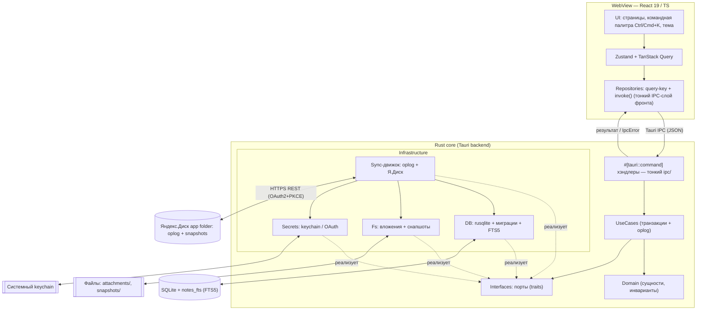

# 04 — Архитектура

> **Что это за файл.** Технический разбор архитектуры десктоп-приложения **DEVNOTES**: как устроена оболочка Tauri 2.0 (Rust-ядро) поверх React 19/TypeScript-фронтенда, как проведены слои по мотивам Clean Architecture из проекта Portfolio (Domain / UseCases / Interfaces / Infrastructure / UI) с тонким IPC-слоем поверх, как ходят данные между WebView и Rust через Tauri IPC, как устроены слой доступа к данным (SQLite + миграции), sync-движок (oplog, конфликты) и контракты IPC-команд. Документ — источник истины по компонентным границам и реестру IPC-команд; конкретные схемы БД, API синка и UI-детали вынесены в соседние файлы.

## Связанные документы

Пути указаны относительно `DevNotes/`. Канон именования, глоссарий и инварианты — [`CLAUDE.md`](../CLAUDE.md).

| Документ | Тема | Роль для этого файла |
|----------|------|----------------------|
| [`CLAUDE.md`](../CLAUDE.md) | Конвенции, глоссарий, инварианты, DoD | Именование сущностей, UUID v7, UTC ISO 8601, карта репозитория |
| [`01-VISION.md`](./01-VISION.md) | Видение, персоны, сценарии, WBS | «Зачем» существует архитектура; требования local-first и поиска |
| [`02-SPECIFICATION.md`](./02-SPECIFICATION.md) | Большое ТЗ (модули, НФТ, ограничения) | Функциональные требования к IPC-командам, НФТ, риск IPC-сериализации (`CON-06`) |
| [`03-FEATURES.md`](./03-FEATURES.md) | Каталог фич MoSCoW | Что именно реализуют слои и команды |
| **`04-ARCHITECTURE.md`** | **Этот документ — слои, IPC, sync-движок** | — |
| [`05-DATA-MODEL.md`](./05-DATA-MODEL.md) | Доменная модель, полный DDL SQLite, миграции (§8) | Схема БД, `ChangeLog`/`SyncState`, стратегия миграций |
| [`06-UI-UX.md`](./06-UI-UX.md) | Дизайн-система, экраны, командная палитра | Слой UI: токены, компоненты, эстетика |
| [`07-TECH-STACK.md`](./07-TECH-STACK.md) | Стек и обоснование (Tauri vs Electron/MAUI/Flutter) | Почему Tauri 2.0 + React 19 |
| [`08-SEARCH.md`](./08-SEARCH.md) | Полнотекстовый поиск: FTS5, bm25, токенизаторы, триггеры | Каноническая схема индексации, `notes_fts`, `fts_docmap` |
| [`09-YANDEX-DISK.md`](./09-YANDEX-DISK.md) | Синхронизация с Яндекс.Диском, OAuth, конфликты | Детали транспорта, OAuth PKCE, LWW + конфликт-копия |
| [`10-ROADMAP.md`](./10-ROADMAP.md) | Дорожная карта, вехи, приоритизация WBS | Порядок реализации слоёв |
| [`12-GLOSSARY.md`](./12-GLOSSARY.md) | Глоссарий терминов | Единые термины сущностей |

---

## 1. Обзор и ключевые принципы

DEVNOTES — **local-first** десктоп-приложение. Всё работает офлайн; сеть нужна только для синхронизации с Яндекс.Диском. Единственный источник истины на устройстве — локальная база **SQLite**. Облако хранит не «живой» файл БД, а журнал операций (oplog) и периодические снапшоты.

Приложение состоит из двух миров, соединённых через **Tauri IPC**:

- **WebView (фронтенд)** — React 19 + TypeScript + Vite + Tailwind. Здесь живут UI, состояние (Zustand + TanStack Query), repository-pattern с генераторами query-key, рендер markdown и подсветка кода. Вся **бизнес-логика представления** — тут.
- **Rust-ядро** — тонкий, но ответственный слой: доступ к SQLite, FTS5-поиск, миграции, sync-движок, работа с файловой системой (вложения, снапшоты), keychain и OAuth-loopback. Тут — **инварианты данных и I/O**.

### Разделение ответственности (сознательное «тонкое ядро»)

Команда — .NET/React, Rust второстепенен. Поэтому ядро держим **максимально тонким**: SQL, sync, IPC-команды, FS. Никакой доменной «умной» логики представления в Rust не выносим. Это осознанный компромисс (см. `02-SPECIFICATION.md`: НФТ `NFR-MAINT-02` «тонкий Rust-слой» и ограничение `CON-06` про IPC-сериализацию): снижаем кривую обучения ценой того, что часть логики (валидация форм, сортировка UI, форматирование дат) дублируется описанием контракта, а не реализацией.

| Принцип | Как реализуется |
|---------|-----------------|
| **Local-first** | Все операции идут в локальный SQLite синхронно; UI никогда не ждёт сеть |
| **Offline-создание** | ID = **UUID v7 (строка)**, генерируется **клиентом (в TS)** до записи — не нужен автоинкремент от БД. **Исключение:** конфликт-копии `NoteContent`, создаваемые Rust-ядром в pull-фазе синка (§6.3), — там UUID v7 генерирует **ядро** (единственный кейс серверной генерации ID) |
| **Единый источник времени** | В БД — **UTC ISO 8601**; `created_at` / `updated_at` обязательны у всех сущностей; в UI показываем в локальной таймзоне |
| **Журналируемость** | Каждое доменное изменение пишет запись в `ChangeLog` (oplog) в той же транзакции |
| **Детерминированный поиск** | FTS5-индекс `notes_fts` над «плоским» документом блока (денормализация `series_title`/`project_name`/`tags` триггерами), ранжирование bm25. Каноническая схема — `08-SEARCH.md` |
| **Безопасные конфликты** | LWW по `updated_at` на уровне `NoteContent` + **конфликт-копия при любом расхождении** (обе стороны менялись) — никогда молча не теряем версию |

---

## 2. Слои (Clean Architecture по мотивам Portfolio)

Слои совпадают по обе стороны IPC по границам, но различаются реализацией. Направление зависимостей — **внутрь, к Domain**: UI, IPC и Infrastructure зависят от абстракций (Interfaces = порты) и Domain, но не наоборот. **Infrastructure реализует порты Interfaces** (traits), а не Domain напрямую. **IPC — отдельный тонкий слой** на границе процессов (как зафиксировано в `CLAUDE.md` §4.2), а не «Interfaces».

```
┌──────────────────────────────────────────────────────────────┐
│                         UI (TS)                                │
│   React-компоненты, страницы, командная палитра, тема          │
│   Zustand (эфемерное) + TanStack Query (кэш серверного)        │
└───────────────┬──────────────────────────────────────────────┘
                │ зависит от
┌───────────────▼──────────────────────────────────────────────┐
│                       UseCases (TS)                            │
│   Сценарии UI (features/): createSeries, reorderBlocks,        │
│   runSearch, syncNow — оркестрация репозиториев + инвалидация  │
└───────────────┬──────────────────────────────────────────────┘
                │ зависит от
┌───────────────▼──────────────────────────────────────────────┐
│                   Repositories (TS)                            │
│   Контракты репозиториев, DTO, тайп-гарды, генераторы          │
│   query-key + invoke()-обёртки — единственная точка фронта,    │
│   знающая имена Tauri-команд (тонкий IPC-слой фронта)          │
└───────────────┬──────────────────────────────────────────────┘
                │  Tauri IPC (JSON)  ── граница процессов ──
┌───────────────▼──────────────────────────────────────────────┐
│                        IPC (Rust) — тонкий                     │
│   #[tauri::command] хэндлеры, (де)сериализация DTO (serde),     │
│   маппинг доменных ошибок → IpcError. Логики нет — делегирует.  │
└───────────────┬──────────────────────────────────────────────┘
                │ вызывает
┌───────────────▼──────────────────────────────────────────────┐
│                      UseCases (Rust)                           │
│   Транзакционные сценарии: apply_change, resolve_conflict,     │
│   run_fts_query, apply_migration — мутация + oplog в одной tx   │
└───────────────┬──────────────────────────────────────────────┘
                │ зависит от портов (и от Domain)
┌───────────────▼──────────────────────────────────────────────┐
│                Interfaces (Rust) — ПОРТЫ (traits)              │
│   ContentRepository, SeriesRepository, ProjectRepository,      │
│   CloudProvider, SecretStore, FileStore, Clock — абстракции    │
│   без I/O. UseCases зависят ТОЛЬКО от этих traits.             │
└───────────────▲──────────────────────────────────────────────┘
                │ реализует (impl trait)
┌───────────────┴──────────────────────────────────────────────┐
│                  Infrastructure (Rust)                         │
│   DB (rusqlite + миграции + FTS5-триггеры)                     │
│   Sync (oplog-выгрузка, Яндекс.Диск REST, OAuth)              │
│   Fs (вложения content-addressable, снапшоты VACUUM INTO)     │
│   Secrets (системный keychain)                                 │
└──────────────────────────────────────────────────────────────┘

  Domain (Rust): сущности, инварианты, типы Op/EntityKind, ошибки —
  базовый слой без I/O. От него зависят UseCases, Interfaces и
  Infrastructure; сам он не зависит ни от кого.
```

### Что где лежит

Пути модулей — по целевой карте репозитория из [`CLAUDE.md`](../CLAUDE.md) §2.

| Слой | Сторона | Ответственность | Ключевые модули |
|------|---------|-----------------|-----------------|
| **Domain** | Rust | Сущности `Project/NoteSeries/NoteContent/TechTag/...`, типы `Op`, `EntityKind`, доменные ошибки. Чистые типы, без I/O | `src-tauri/src/domain/` |
| **UseCases** | Rust | Транзакционные сценарии поверх портов; здесь коммитятся oplog-записи | `src-tauri/src/usecases/` |
| **UseCases** | TS | Сценарии UI: оркестрация репозиториев, инвалидация кэша TanStack Query | `src/src/features/` |
| **Interfaces (порты)** | Rust | `trait`-порты репозиториев/сервисов (`ContentRepository`, `CloudProvider`, `SecretStore`, `FileStore`, `Clock`), реализуемые Infrastructure | `src-tauri/src/interfaces/` |
| **IPC (тонкий)** | Rust | `#[tauri::command]`-хэндлеры, DTO (serde), маппинг доменных ошибок в `IpcError` | `src-tauri/src/ipc/` |
| **Repositories / IPC-обёртки** | TS | `invoke()`-обёртки, DTO-типы, генераторы query-key, тайп-гарды | `src/src/repositories/` |
| **Infrastructure** | Rust | `Db` (rusqlite pool, миграции, триггеры FTS5), `Sync`, `Fs`, `Secrets` — реализуют порты Interfaces | `src-tauri/src/infrastructure/` |
| **UI** | TS | Компоненты, страницы, командная палитра, дизайн-система | `src/src/app/`, `src/src/components/ui/` |

Repository-pattern на фронте повторяет Portfolio: каждый репозиторий (`projectRepository`, `seriesRepository`, `contentRepository`, `tagRepository`, `searchRepository`, `syncRepository`) экспортирует методы + генератор query-key и является **единственной точкой фронта, вызывающей `invoke()`**. TanStack Query кэширует, Zustand держит эфемерное (открытая серия, drag-состояние, тема, статус синка).

---

## 3. Компонентная диаграмма



---

## 4. Поток данных: чтение и запись

### 4.1 Чтение (list/get)

Чтение всегда локальное и синхронное относительно сети. UI не отличает «есть сеть / нет сети».


Большие серии (сотни блоков) читаются **пагинированно** (`content_list(series_id, limit, offset)`), список блоков в UI **виртуализируется** — это митигация риска IPC-сериализации JSON на больших сериях (ограничение `CON-06` в `02-SPECIFICATION.md`).

### 4.2 Запись (create/update/reorder/delete)

Запись атомарна: доменная мутация и запись в `ChangeLog` идут **в одной транзакции**. FTS-индекс обновляется триггерами внутри той же транзакции. После коммита — оптимистичная инвалидация query-key и «пинок» sync-движку.


**Автосохранение черновиков** (should-фича): в UI — debounce, каждый flush идёт через тот же `content_upsert`. Индикатор «несинхронизированных изменений» читает `COUNT(*) FROM change_log WHERE synced = 0`.

---

## 5. Слой доступа к данным (SQLite)

### 5.1 Подключение и режим

- Драйвер: **rusqlite** (bundled SQLite, чтобы не зависеть от системной версии и гарантировать наличие FTS5).
- Режим журнала: **WAL** — конкурентное чтение при одиночной записи, устойчивость.
- `PRAGMA foreign_keys = ON`, `PRAGMA busy_timeout = 5000`.
- Пул соединений: один writer (сериализованный) + несколько readers. Запись всегда через writer, чтобы транзакции oplog не пересекались.

```rust
// Инициализация (эскиз)
let conn = Connection::open(db_path)?;
conn.pragma_update(None, "journal_mode", "WAL")?;
conn.pragma_update(None, "foreign_keys", "ON")?;
conn.pragma_update(None, "busy_timeout", 5000)?;
run_migrations(&conn)?; // стратегия миграций — см. 05-DATA-MODEL.md §8
```

### 5.2 Миграции (версионируются)

Схема версионируется целочисленным `user_version`. Миграции — упорядоченный набор SQL-шагов; ядро на старте догоняет БД до целевой версии в транзакции. Down-миграций нет (только forward + снапшот перед апгрейдом).

```rust
fn run_migrations(conn: &Connection) -> Result<()> {
    let current: i64 = conn.pragma_query_value(None, "user_version", |r| r.get(0))?;
    for (target, sql) in MIGRATIONS.iter().enumerate().skip(current as usize) {
        conn.execute_batch("BEGIN")?;
        conn.execute_batch(sql)?;
        conn.pragma_update(None, "user_version", (target + 1) as i64)?;
        conn.execute_batch("COMMIT")?;
    }
    Ok(())
}
```

Перед каждым апгрейдом схемы делается снапшот `VACUUM INTO snapshots/pre-migrate-<version>.db` — это и точка отката, и защита. Полный DDL, порядок шагов и реестр миграций — в [`05-DATA-MODEL.md`](./05-DATA-MODEL.md) (§8 «Стратегия миграций»).

### 5.3 FTS5 и триггеры

Полнотекстовый индекс — единая FTS5-таблица `notes_fts`, поддерживаемая **триггерами** `AFTER INSERT/UPDATE/DELETE`; ранжирование — bm25, подсветка — `snippet()`. Целевой SLA — **<50 мс на 10k блоков**.

Важная тонкость механики (не «одна external-content-таблица над двумя таблицами»): классический external content FTS5 привязывается к **ровно одной** таблице по её целочисленному `rowid`, а поисковый документ DEVNOTES собирается из **нескольких** таблиц (`note_content.title/text` + `note_series.title` + `project.name` + агрегат тегов) и имеет `TEXT`-ключи (UUID v7). Поэтому:

- заводится маппинг-таблица `fts_docmap(rowid INTEGER ↔ content_id TEXT)` — стабильный целочисленный `rowid` для FTS при UUID-ключах домена;
- в строку блока в `notes_fts` **денормализуются** `series_title`, `project_name` и склейка `tags` — их проставляют триггеры при изменении соответствующих доноров (блока, серии, проекта, связок тегов);
- итог — «плоский» документ на блок, где заголовок серии ищется вместе с телом блока.

```sql
-- Иллюстративный эскиз; КАНОН схемы, весов, триггеров и токенизации — 08-SEARCH.md.
CREATE VIRTUAL TABLE notes_fts USING fts5(
    content_text, content_title, series_title, project_name, tags,
    content_id UNINDEXED, series_id UNINDEXED, content_type UNINDEXED,
    tokenize = 'unicode61 remove_diacritics 2',
    prefix   = '2 3 4'
);
```

Полная схема (`fts_docmap`, набор триггеров по всем донорам, веса bm25, компромисс токенизатора unicode61 vs trigram для русской морфологии, фолбэк `LIKE` и бенчмарки) — в [`08-SEARCH.md`](./08-SEARCH.md); «скелет» в контексте DDL — в [`05-DATA-MODEL.md`](./05-DATA-MODEL.md) §7.

---

## 6. Sync-движок

Синхронизация — **только через oplog** (`ChangeLog`), выгружаемый в **app folder Яндекс.Диска**. Файл БД по облаку **никогда не синкается целиком** — это жёсткий инвариант (иначе гарантированная потеря данных на двух устройствах).

### 6.1 Модель

- Каждое изменение → строка в `change_log(id, entity, entity_id, op, payload_json, ts, device_id, synced)`.
- `device_id` уникален на устройство (в `SyncState`).
- Курсоры и ревизии Я.Диска — в `SyncState(key, value)`.
- Токены OAuth — в **системном keychain**, не в БД.

### 6.2 Конфликты — LWW + конфликт-копия

Разрешение — **Last-Write-Wins по `updated_at` на уровне `NoteContent`**. Но LWW молча теряет одну версию — недопустимо. Поэтому правило симметрично: **при любом расхождении** (обе стороны меняли один и тот же `NoteContent` со времени общей базы) проигравшая по LWW версия **не удаляется**, а материализуется как **конфликт-копия** — новый `NoteContent` с пометкой + UI-индикация — **независимо от того, кто выиграл LWW** (входящая версия или локальная). Пользователь сам решает, что оставить.

- **UUID v7 конфликт-копии генерирует Rust-ядро** прямо в pull-фазе (это и есть оговорённое в §1 исключение из правила «ID создаёт клиент»): ядро не может делегировать генерацию в TS, потому что копия рождается внутри транзакции применения чужого oplog.
- Победитель по LWW становится каноном сущности; проигравший всегда сохраняется как копия — так выполняется инвариант WBS «конфликт-копия при расхождении» и принцип §1 «никогда молча не теряем версию».

### 6.3 Sequence синхронизации

```mermaid
sequenceDiagram
    participant APP as DEVNOTES (устройство A)
    participant YD as Яндекс.Диск (app folder)
    participant DB as Локальный SQLite

    Note over APP: триггер: появилась сеть / ручной "Синхронизировать" / таймер

    APP->>YD: GET манифест (ревизии, курсоры устройств)
    YD-->>APP: список oplog-сегментов + last revision

    rect rgb(30,40,30)
    Note over APP,YD: PULL — забрать чужие изменения
    APP->>YD: GET oplog-сегменты с курсора других device_id
    YD-->>APP: change-записи (JSON)
    APP->>DB: BEGIN
    loop по каждой записи
        alt запись уже применена (по id oplog-записи)
            APP->>DB: пропустить (идемпотентность)
        else обе стороны меняли этот NoteContent (РАСХОЖДЕНИЕ)
            Note over APP,DB: победитель по LWW (updated_at) → канон;<br/>ПРОИГРАВШАЯ версия → конфликт-копия + флаг,<br/>кто бы из двух ни выиграл. UUID v7 копии создаёт ядро.
            APP->>DB: применить победителя (upsert) + материализовать проигравшего как конфликт-копию
        else менялась только входящая (локальная не расходилась)
            APP->>DB: применить (upsert)
        end
    end
    APP->>DB: обновить курсоры в SyncState
    APP->>DB: COMMIT
    end

    rect rgb(30,30,40)
    Note over APP,YD: PUSH — выгрузить свои изменения
    APP->>DB: SELECT * FROM change_log WHERE synced = 0 ORDER BY ts
    APP->>YD: PUT новый oplog-сегмент (свой device_id)
    YD-->>APP: 201 Created + новая ревизия
    APP->>DB: UPDATE change_log SET synced = 1
    end

    opt периодический снапшот
        APP->>DB: VACUUM INTO snapshots/db-<ts>.db
        APP->>YD: PUT снапшот (компакция oplog)
    end
```

Идемпотентность обеспечивается тем, что каждая oplog-запись имеет свой UUID; повторное применение — no-op. Детали OAuth (Authorization Code + PKCE, loopback-redirect), лимиты API, разрешение конфликтов и WebDAV-fallback — в [`09-YANDEX-DISK.md`](./09-YANDEX-DISK.md) (§3 OAuth, §6 конфликты, §7 офлайн-очередь).

---

## 7. IPC-контракты команд Tauri

IPC — **единственная** граница между мирами; она вынесена в отдельный тонкий слой (не путать с портами-Interfaces домена). Правила:

- Имена команд знает только IPC-граница: TS `src/src/repositories/` (invoke-обёртки) ↔ Rust `src-tauri/src/ipc/`. UI и UseCases работают через репозитории.
- DTO — плоские, camelCase на TS ↔ маппинг в snake_case/PascalCase на Rust (serde `rename_all`).
- ID во всех DTO — строка (UUID v7). Даты — строки UTC ISO 8601.
- Все команды возвращают `Result<T, IpcError>`; ошибка сериализуется как `{ code, message, details? }`.
- **Бинарные данные не гоняем через JSON-IPC.** Крупные полезные нагрузки (вложения) передаются через путь к временному файлу или бинарный канал Tauri 2 (`Channel`/`Response`), а не base64 в JSON — прямая митигация риска IPC-сериализации (`CON-06`).

### 7.1 Реестр команд

Ниже — **канонический реестр IPC-команд** проекта (сводка ключевых). Функциональные требования к ним — в [`02-SPECIFICATION.md`](./02-SPECIFICATION.md) (§5 «Функциональные требования по модулям»); детали DTO по данным — в [`05-DATA-MODEL.md`](./05-DATA-MODEL.md).

| Домен | Команда | Вход | Выход |
|-------|---------|------|-------|
| Project | `project_list` | `{ includeArchived }` | `ProjectDto[]` |
| Project | `project_upsert` | `ProjectDto` | `ProjectDto` |
| Project | `project_archive` | `{ id, archived }` | `void` |
| Series | `series_list` | `{ projectId?, tagIds?, pinnedFirst }` | `SeriesDto[]` |
| Series | `series_upsert` | `SeriesDto` | `SeriesDto` |
| Series | `series_set_pinned` | `{ id, pinned }` | `void` |
| Content | `content_list` | `{ seriesId, limit, offset }` | `ContentDto[]` |
| Content | `content_upsert` | `ContentDto` | `ContentDto` |
| Content | `content_reorder` | `{ seriesId, orderedIds }` | `void` |
| Content | `content_delete` | `{ id }` | `void` |
| Tag | `tag_list` | `{ typeId? }` | `TechTagDto[]` |
| Tag | `series_set_tags` | `{ seriesId, tagIds }` | `void` |
| Search | `search_query` | `{ q, filters?, limit }` | `SearchHitDto[]` |
| Attachment | `attachment_add` | `{ contentId, srcPath, fileName, mime }` | `AttachmentDto` |
| Sync | `sync_status` | `{}` | `SyncStatusDto` |
| Sync | `sync_now` | `{}` | `SyncResultDto` |
| Sync | `sync_auth_start` | `{}` | `{ authUrl }` |
| Backup | `backup_snapshot` | `{}` | `{ path }` |
| Backup | `backup_restore` | `{ path }` | `void` |

> `attachment_add` принимает **путь к временному файлу** (`srcPath`), а не сырые `bytes`: файл уже лежит на диске (drag-drop/диалог), ядро копирует его в content-addressable хранилище само. Так через JSON-IPC не проходит гигантский base64-блоб. Альтернатива для потокового ввода — бинарный `Channel` Tauri 2.

### 7.2 Пример контракта

```typescript
// Repositories / IPC-обёртки (TS): src/src/repositories/content.ts
export interface ContentDto {
  id: string;               // UUID v7, создан клиентом
  seriesId: string;
  sortOrder: number;
  title: string | null;
  text: string;
  type: 'markdown' | 'code' | 'image' | 'link';
  language: string | null;  // для type === 'code'
  createdAt: string;        // UTC ISO 8601
  updatedAt: string;
}

export const contentUpsert = (dto: ContentDto) =>
  invoke<ContentDto>('content_upsert', { dto });
```

```rust
// IPC (Rust): src-tauri/src/ipc/content.rs
#[tauri::command]
pub async fn content_upsert(
    state: tauri::State<'_, AppState>,
    dto: ContentDto,
) -> Result<ContentDto, IpcError> {
    usecases::content::upsert(&state.deps, dto)   // транзакция + oplog внутри, через порты
        .await
        .map_err(IpcError::from)
}
```

### 7.3 События (Rust → UI, push)

Помимо команд-запросов, ядро эмитит события через Tauri event-bus для фоновых процессов:

| Событие | Когда | Payload |
|---------|-------|---------|
| `sync://progress` | шаги pull/push | `{ phase, done, total }` |
| `sync://conflict` | создана конфликт-копия | `{ contentId, seriesId }` |
| `sync://done` | синк завершён | `SyncResultDto` |
| `db://migrated` | применена миграция | `{ fromVersion, toVersion }` |

UI подписывается через `listen()` и инвалидирует соответствующие query-key.

---

## 8. Модульность и границы

Жёсткие правила границ (проверяются на ревью и по возможности линтером):

1. **UI не вызывает `invoke` напрямую.** Только через репозитории. Единственный слой фронта с именами команд — `src/src/repositories/`; на стороне ядра — `src-tauri/src/ipc/`.
2. **Domain (Rust) не знает про SQL и Tauri.** Чистые типы и инварианты. SQL — только в `src-tauri/src/infrastructure/db/`.
3. **UseCases (Rust) зависят только от портов (traits) из `src-tauri/src/interfaces/`**, а не от конкретных реализаций; Infrastructure реализует эти порты. Это позволяет тестировать сценарии на моках без БД/сети.
4. **oplog пишется только в UseCases (Rust)**, в той же транзакции, что и мутация. Ни один прямой SQL-путь не меняет данные мимо `ChangeLog`.
5. **Sync-движок не трогает файл БД других устройств** и не синкает «живой» файл — только oplog + снапшоты.
6. **Секреты не попадают в БД и в логи.** Токены — только keychain; при логировании DTO маскируются.
7. **Даты и ID — контрактные:** UTC ISO 8601 и UUID v7 (строка) на всех границах, без исключений (кроме серверной генерации UUID для конфликт-копий, §6.2).

Структура репозитория (по целевой карте [`CLAUDE.md`](../CLAUDE.md) §2):

```
DevNotes/
├─ src-tauri/                     # Rust-ядро (Tauri 2.0)
│  ├─ Cargo.toml
│  ├─ tauri.conf.json             # оболочка, updater, permissions
│  ├─ migrations/                 # версионируемые SQL-миграции схемы
│  └─ src/
│     ├─ domain/                  # сущности, Op, EntityKind, доменные ошибки
│     ├─ usecases/                # транзакционные сценарии + oplog
│     ├─ interfaces/              # порты (traits) репозиториев/сервисов
│     ├─ infrastructure/          # реализации портов
│     │  ├─ db/                   # rusqlite, миграции, FTS5-триггеры
│     │  ├─ sync/                 # oplog, Я.Диск REST, OAuth, конфликты
│     │  ├─ fs/                   # вложения (content-addressable), снапшоты
│     │  └─ secrets/              # keychain
│     └─ ipc/                     # тонкий слой #[tauri::command] ↔ usecases
│
└─ src/                           # фронтенд (React 19 + TS)
   └─ src/
      ├─ app/                     # точка входа, роутинг, провайдеры
      ├─ domain/                  # зеркало доменных типов (TS), camelCase
      ├─ repositories/            # repository-pattern + query-key + invoke-обёртки
      ├─ features/                # сценарии UI: notes, search, sync, settings…
      ├─ components/ui/           # примитивы дизайн-системы (Button, Card, Input…)
      ├─ stores/                  # Zustand-сторы
      └─ styles/                  # дизайн-токены HSL, глобальные стили
```

> Отклонений от карты `CLAUDE.md` §2 нет; при их появлении они оформляются как ADR (`docs/07-ADR/`) с синхронным обновлением `CLAUDE.md`.

---

## 9. Обработка ошибок и логирование

### 9.1 Модель ошибок

Единый тип ошибки пересекает IPC. Доменные ошибки Rust маппятся в стабильные коды, UI решает по коду (а не по тексту).

```rust
#[derive(serde::Serialize)]
pub struct IpcError {
    pub code: ErrorCode,      // enum: NotFound, Conflict, Validation, Db, Sync, Auth, Io, Internal
    pub message: String,      // человекочитаемо, локализуемо в UI
    pub details: Option<serde_json::Value>,
}
```

| Код | Источник | Реакция UI |
|-----|----------|------------|
| `Validation` | UseCases (нарушен инвариант) | подсветить поле, toast |
| `NotFound` | DB | 404-состояние экрана |
| `Conflict` | Sync (конфликт-копия) | баннер + переход к разрешению |
| `Db` | rusqlite | toast «ошибка БД», предложить снапшот-восстановление |
| `Auth` | OAuth/keychain | переоткрыть авторизацию Я.Диска |
| `Io` | FS (вложения/снапшоты) | toast, retry |
| `Internal` | непойманное | toast + отправка в лог, «сообщите разработчику» |

Принцип: **ошибки записи никогда не оставляют БД в промежуточном состоянии** — транзакция откатывается целиком, oplog-запись при откате тоже не появляется.

### 9.2 Логирование

- Библиотека: `tracing` (Rust), уровни `error/warn/info/debug/trace`.
- Куда: ротируемый файл в app-data (`logs/devnotes.log`) + stderr в dev-сборке.
- **Что НЕ логируем:** токены, содержимое keychain, полный `text` блоков (только длина/hash при отладке). DTO с секретами маскируются перед выводом.
- Контекст: каждый лог IPC-команды несёт `command`, `device_id`, `duration_ms`, код результата — для диагностики перфоманса (в т.ч. IPC-узких мест на больших сериях).
- Фронтенд шлёт клиентские ошибки в тот же лог через команду `log_client_error` (единый журнал устройства).

### 9.3 Наблюдаемость sync

Sync-движок обязателен к трассировке: каждый цикл логирует `pulled`, `pushed`, `conflicts`, `revision`, `duration_ms`. Число несинхронизированных изменений (`change_log WHERE synced=0`) выводится в UI-индикатор и в лог — чтобы «тихие» проблемы синка были видимы.

---

## 10. Кроссплатформенные замечания

| Платформа | WebView | Риск и митигация |
|-----------|---------|------------------|
| Windows | WebView2 (Chromium) | базовая, наименее рискованная |
| macOS | WKWebView | keychain через Security.framework |
| Linux | WebKitGTK | **отстаёт от Chromium** — обязательное тестирование рендера markdown/подсветки и перфоманса на Ubuntu из CI (WBS-риск) |

Экспорт PDF: `html2pdf.js` в WebKitGTK может вести себя иначе — заложен запасной путь генерации PDF **на Rust-стороне** (printpdf/headless) как отдельная IPC-команда, если браузерный путь окажется нестабильным. Автообновление — через Tauri Updater (подписанные релизы).

---

*Документ поддерживается в актуальном состоянии вместе с изменениями IPC-контрактов и схемы БД. Разделение источников истины: по **границам слоёв и реестру IPC-команд** — этот файл; по **структуре данных** — [`05-DATA-MODEL.md`](./05-DATA-MODEL.md); по **функциональным требованиям к командам** — [`02-SPECIFICATION.md`](./02-SPECIFICATION.md); по **канону именования и глоссарию** — [`CLAUDE.md`](../CLAUDE.md). При расхождении формулировок канон — `CLAUDE.md`.*
