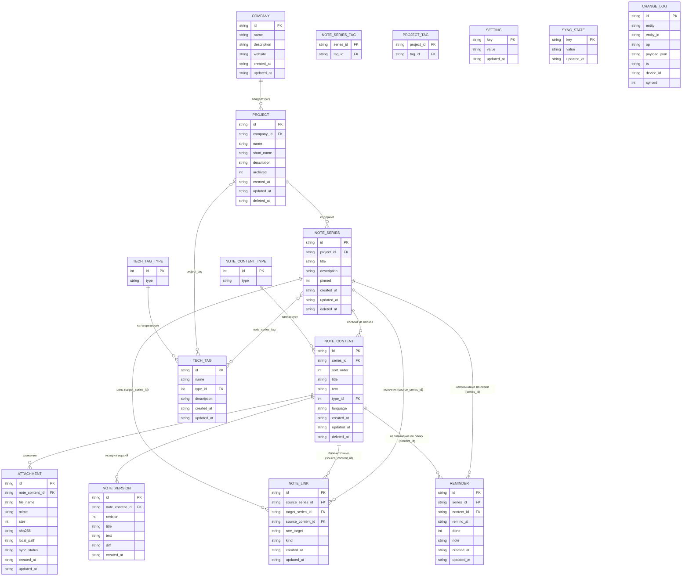

# 05 — Модель данных

> **Что это за файл.** Каноническое описание доменной модели DEVNOTES: сущности, их атрибуты, связи и инварианты; полная схема локальной БД **SQLite** (DDL со всеми `CREATE TABLE`, типами, PK/FK, индексами, `CHECK`-ограничениями), виртуальная таблица **FTS5** для мгновенного поиска и триггеры синхронизации индекса; стратегия версионируемых миграций. Модель перенята из веб-проекта **Portfolio (Mafiozist)** и расширена под десктоп local-first: добавлены сущности для вложений, wiki-связей, истории версий, напоминаний, настроек и журнала синхронизации. Отдельный раздел — соответствие таблиц SQLite доменным классам Portfolio (EF Core). Документ — **источник правды по структуре данных**; из него растут репозитории Rust-ядра, TS-типы фронта и миграционные скрипты.

> **Статус:** проектирование · **Дата:** 2026-07-17 · **Язык:** русский, тон инженерный · **Область:** десктоп v1 (Windows / macOS / Linux).

---

## Связанные документы

Пути относительно `DevNotes/`. Канон именования и глоссарий — `CLAUDE.md`.

| Документ | Назначение | Роль для этого файла |
| --- | --- | --- |
| [`CLAUDE.md`](../CLAUDE.md) | Конвенции, глоссарий, инварианты, DoD | Источник правил именования |
| [`docs/01-VISION.md`](01-VISION.md) | Видение, персоны, сценарии | «Зачем» существует модель |
| [`docs/02-SPECIFICATION.md`](02-SPECIFICATION.md) | Большое ТЗ (раздел 11 «Требования к данным») | Функциональные требования к данным |
| [`docs/03-FEATURES.md`](03-FEATURES.md) | Каталог фич MoSCoW | Какие фичи опираются на сущности |
| [`docs/04-SEARCH-FTS5.md`](04-SEARCH-FTS5.md) | FTS5 external content, bm25, токенизация | Детализация поискового индекса |
| [`docs/05-SYNC-YANDEX.md`](05-SYNC-YANDEX.md) | OAuth 2.0 + PKCE, oplog (ChangeLog), LWW | Детализация `ChangeLog`/`SyncState` |
| [`docs/06-DESIGN-SYSTEM.md`](06-DESIGN-SYSTEM.md) | Дизайн-токены, компоненты | Потребитель модели в UI |
| [`docs/07-ADR/`](07-ADR/) | Architecture Decision Records | Обоснование UUID v7, oplog, FTS5 |

> Ссылки на ещё не созданные файлы — плановые. При расхождении формулировок канон — `CLAUDE.md` и `consistencyNotes` из WBS.

---

## 1. Инварианты модели (обязательны для всех таблиц)

Эти правила действуют для **каждой** доменной таблицы; ниже в DDL они не повторяются в прозе, но соблюдаются в схеме.

| # | Инвариант | Реализация в SQLite |
| --- | --- | --- |
| И-1 | **ID = UUID v7 (строка)**, генерируется клиентом до вставки | `id TEXT PRIMARY KEY NOT NULL` (36 симв., lower-case, дефисы) |
| И-2 | **`created_at` и `updated_at` обязательны** у каждой доменной сущности | `TEXT NOT NULL` — UTC **ISO 8601** `YYYY-MM-DDTHH:MM:SS.sssZ` |
| И-3 | Даты хранятся в **UTC**, отображаются в локальной таймзоне пользователя (конвертация на UI) | Строка с суффиксом `Z`; сравнение лексикографическое = хронологическое |
| И-4 | Схема — **snake_case**; домен на Rust — PascalCase структуры, на TS — camelCase поля | Маппинг в репозиториях |
| И-5 | `updated_at` обновляется при любом изменении строки | Триггеры `AFTER UPDATE` (см. §7) |
| И-6 | Любое доменное изменение фиксируется в `change_log` (oplog) | Пишется в use-case-слое одной транзакцией с мутацией |
| И-7 | Внешние ключи включены | `PRAGMA foreign_keys = ON;` при каждом соединении |
| И-8 | Мягкое удаление где важна история/синк; жёсткое — для связок | Поле `deleted_at TEXT NULL` (tombstone) на синкаемых сущностях |

**Исключения из И-2 (осознанные, оформлены как исключения).** Пара `created_at`+`updated_at` обязательна для всех **настоящих доменных сущностей**. От неё отступают только три особые/несущностные таблицы:

- **`note_version`** — неизменяемый снимок ревизии: несёт лишь `created_at`, поля `updated_at` нет (менять версию нельзя, см. §4.8).
- **`setting`, `sync_state`** — плоские key-value таблицы, **не доменные сущности** и не синкаются: несут лишь `updated_at`. Момент первого появления ключа не имеет доменного смысла, поэтому `created_at` для них не заводится (в отличие от `note_version`, где отсутствует, наоборот, `updated_at`).
- **`change_log`** — append-only журнал: вместо пары дат несёт единственную отметку `ts` (момент операции, основа LWW).

**Почему UUID v7, а не autoincrement.** Local-first + офлайн-создание на нескольких устройствах: суррогатный автоинкремент даёт коллизии при слиянии. UUID v7 монотонно растёт по времени (первые 48 бит — Unix-время в мс), поэтому он одновременно уникален глобально **и** даёт естественную сортировку по created-порядку, что удобно для индексов и курсорной пагинации.

**Тип хранения времени.** SQLite не имеет типа `DATETIME`; выбран `TEXT` в ISO 8601 UTC (а не Unix-epoch INTEGER) ради читаемости при отладке БД и корректной лексикографической сортировки. Точность — миллисекунды.

---

## 2. Обзор сущностей

### 2.1. Ядро иерархии контента

| Сущность (SQLite) | Домен | Назначение | Синкается | В MVP |
| --- | --- | --- | --- | --- |
| `company` | Company | Компания-владелец проектов (из Portfolio) | да | нет¹ |
| `project` | Project | Проект — группа серий заметок | да | **да** |
| `note_series` | NoteSeries | Серия/тема заметок внутри проекта | да | **да** |
| `note_content` | NoteContent | Блок контента серии (единица) | да | **да** |
| `note_content_type` | NoteContentType | Справочник типов блока | seed² | **да** |
| `tech_tag` | TechTag | Тег технологии | да | **да** |
| `tech_tag_type` | TechTagType | Категория тега | seed² | **да** |
| `note_series_tag` | — (связка) | M:N серия ↔ тег | да | **да** |
| `project_tag` | — (связка) | M:N проект ↔ тег | да | **да** |

¹ `company` заведена в схеме для совместимости с Portfolio и будущего, но в UI v1 не используется: `project.company_id` всегда `NULL`. См. §9.
² Справочники наполняются миграцией-сидом, не редактируются пользователем в v1.

### 2.2. Расширения для десктопа

| Сущность (SQLite) | Домен | Назначение | Синкается | В MVP |
| --- | --- | --- | --- | --- |
| `attachment` | Attachment | Вложение блока (файл рядом с БД, content-addressable) | да (файл+мета) | should |
| `note_link` | NoteLink | Wiki-связь `[[...]]` между сериями/блоками + backlinks | да | could |
| `note_version` | NoteVersion | История версий блока (diff/откат) | локально³ | could |
| `reminder` | Reminder | Напоминание по серии/блоку | да | could |
| `setting` | Setting | Настройки приложения (key/value) | нет⁴ | **да** |
| `sync_state` | SyncState | Курсоры/ревизии синка, `device_id` | нет⁴ | **да** |
| `change_log` | ChangeLog | Oplog: журнал изменений для синка | сам является синком | **да** |
| `notes_fts` | — | Виртуальная таблица FTS5 (не доменная) | нет (производная) | **да** |

³ История версий — устройство-локальная (шумный, тяжёлый поток); на облако уходит только «текущее» состояние блока через oplog.
⁴ `setting` и `sync_state` — машинно-специфичны (пути, токены-ссылки, device_id), между устройствами не переносятся.

> Все таблицы расширений входят в базовую схему (миграция `0001`, см. §5/§8.3). Разбивка «should/could» относится к **UI и фичам**, а не к DDL: схема стабильна с v1, чтобы синк и миграции не спотыкались о разный набор таблиц на разных устройствах.

### 2.3. Словарь синонимов (антидубли)

| Канон | НЕ употреблять |
| --- | --- |
| **NoteSeries** | «тема», «заметка целиком», «страница» |
| **NoteContent** | «блок текста», «параграф», «карточка» |
| **TechTag** | «технология», «метка», «label» |
| **ChangeLog** | «oplog» (допустимо как пояснение), «журнал» без уточнения |

---

## 3. ER-диаграмма



> `notes_fts` (FTS5) на диаграмме не показана — это производная (индекс над `note_content` + `note_series`, через представление `notes_fts_src`, см. §6), не доменная связь. Детали — §6 и `04-SEARCH-FTS5.md`.
>
> `NOTE_LINK` присутствует на диаграмме тремя рёбрами — это три полноценных FK одной таблицы: `source_series_id` (обязательная серия-источник), `source_content_id` (опциональный блок-источник) и `target_series_id` (опциональная разрезолвленная цель). Аналогично `REMINDER` имеет два ребра-цели (`series_id` и `content_id`), из которых заполнено хотя бы одно (`CHECK`, §5).

### 3.1. Кардинальности и правила каскадов

| Связь | Кардинальность | ON DELETE | Обоснование |
| --- | --- | --- | --- |
| Company → Project | 1:N (опц.) | `SET NULL` | Удаление компании не должно терять проекты |
| Project → NoteSeries | 1:N (опц.) | `SET NULL` | Серия может «висеть» без проекта (инбокс) |
| NoteSeries → NoteContent | 1:N | `CASCADE` | Блоки не существуют без серии |
| NoteContentType → NoteContent | 1:N | `RESTRICT` | Нельзя удалить используемый тип |
| TechTagType → TechTag | 1:N | `RESTRICT` | Нельзя удалить используемую категорию |
| NoteSeries ↔ TechTag | M:N | `CASCADE` (обе стороны) | Связка чистится при удалении любой стороны |
| Project ↔ TechTag | M:N | `CASCADE` | То же |
| NoteContent → Attachment | 1:N | `CASCADE` | Вложение без блока бессмысленно |
| NoteContent → NoteVersion | 1:N | `CASCADE` | История уходит вместе с блоком |
| NoteSeries → NoteLink (source) | 1:N | `CASCADE` | Исходящие ссылки удаляются с серией-источником |
| NoteContent → NoteLink (source) | 1:N | `CASCADE` | Ссылка-источник уходит с блоком |
| NoteSeries → NoteLink (target) | 1:N | `SET NULL` | Удаление цели превращает ссылку в «висячую», а не рвёт её |
| NoteSeries → Reminder | 1:N | `CASCADE` | Напоминание без цели бессмысленно |
| NoteContent → Reminder | 1:N | `CASCADE` | То же для напоминания по блоку |

> **Замечание о синке и удалении.** Для синкаемых сущностей «удаление» в UI = проставление `deleted_at` (tombstone) + запись `op='delete'` в `change_log`. Физический `DELETE ... CASCADE` применяется только при жёсткой очистке (compaction) уже синхронизированных tombstone'ов. Это гарантирует, что удаление доедет до второго устройства через oplog, а не «воскреснет».

---

## 4. Каталог полей по сущностям

Ниже — семантика нетривиальных полей. Общие `id/created_at/updated_at/deleted_at` описаны в §1 и не дублируются.

### 4.1. `project`
| Поле | Тип | Null | Смысл |
| --- | --- | --- | --- |
| `company_id` | TEXT | да | FK на `company`; в v1 всегда NULL |
| `name` | TEXT | нет | Название проекта |
| `short_name` | TEXT | да | Короткая метка для чипов/палитры |
| `description` | TEXT | да | Описание (markdown) |
| `archived` | INTEGER | нет | 0/1; архив без удаления (скрыт из основных списков) |

### 4.2. `note_series`
| Поле | Тип | Null | Смысл |
| --- | --- | --- | --- |
| `project_id` | TEXT | да | FK на `project`; NULL = «инбокс» |
| `title` | TEXT | нет | Заголовок серии (индексируется FTS5 как `series_title`) |
| `description` | TEXT | да | Краткое описание |
| `pinned` | INTEGER | нет | 0/1; закрепление вверху списка |

### 4.3. `note_content`
| Поле | Тип | Null | Смысл |
| --- | --- | --- | --- |
| `series_id` | TEXT | нет | FK на `note_series` |
| `sort_order` | INTEGER | нет | Порядок блока (drag-and-drop, @dnd-kit) |
| `title` | TEXT | да | Опциональный заголовок блока (индексируется FTS5) |
| `text` | TEXT | нет | Тело блока (markdown/код/URL/подпись) — индексируется FTS5 |
| `type_id` | INTEGER | нет | FK на `note_content_type` |
| `language` | TEXT | да | Язык подсветки для `type='code'` (`ts`, `rust`, `sql`, …) |

> **`sort_order`.** Целое с шагом (например, 1000, 2000, …) — вставка между блоками без переиндексации всей серии. Периодический ре-баланс шага при исчерпании зазора. Уникальность порядка внутри серии обеспечивается на уровне use-case, не БД (перестановки — частая операция).

### 4.4. `note_content_type` (seed)
| id | type |
| --- | --- |
| 1 | `markdown` |
| 2 | `code` |
| 3 | `image` |
| 4 | `link` |

### 4.5. `tech_tag` / `tech_tag_type`
`tech_tag`: `name` (уникально, нормализуется в lower-case для поиска), `type_id` → `tech_tag_type`, `description`.

`tech_tag_type` (seed):
| id | type |
| --- | --- |
| 1 | `language` |
| 2 | `framework` |
| 3 | `tool` |
| 4 | `database` |
| 5 | `devops` |
| 6 | `other` |

### 4.6. `attachment`
| Поле | Тип | Смысл |
| --- | --- | --- |
| `note_content_id` | TEXT | FK на блок |
| `file_name` | TEXT | Отображаемое имя файла |
| `mime` | TEXT | MIME-тип (`image/png`, …) |
| `size` | INTEGER | Размер в байтах |
| `sha256` | TEXT | Хэш содержимого (content-addressable дедупликация) |
| `local_path` | TEXT | Путь в blob-хранилище `<data_dir>/attachments/<sha256[:2]>/<sha256>` |
| `sync_status` | TEXT | `local` \| `queued` \| `synced` \| `remote_only` |

### 4.7. `note_link` (wiki-links / backlinks)
| Поле | Смысл |
| --- | --- |
| `source_series_id` | Откуда ссылка |
| `source_content_id` | Конкретный блок-источник (NULL = на уровне серии) |
| `target_series_id` | Разрезолвленная цель (NULL, если ещё не создана — «висячая» ссылка) |
| `raw_target` | Исходный текст `[[Название/slug]]` — для ре-резолва |
| `kind` | `wiki` \| `mention` |

> **Backlinks** = обратный запрос `SELECT ... WHERE target_series_id = :id`. Ре-резолв висячих ссылок — триггером-приложением при создании серии с совпадающим заголовком/slug.

### 4.8. `note_version`
| Поле | Смысл |
| --- | --- |
| `note_content_id` | Блок, к которому относится ревизия |
| `revision` | Порядковый номер ревизии (1..N) |
| `title` / `text` | Снимок содержимого на момент ревизии |
| `diff` | Unified-diff к предыдущей ревизии (для компактного показа/отката) |
| `created_at` | Момент создания ревизии (нет `updated_at` — версия неизменяема, см. исключение в §1) |

### 4.9. `reminder`
| Поле | Смысл |
| --- | --- |
| `series_id` / `content_id` | Цель напоминания (одно из; `content_id` опц.) |
| `remind_at` | UTC ISO 8601 момент срабатывания |
| `done` | 0/1 — выполнено/снято |
| `note` | Текст напоминания |

### 4.10. `setting` / `sync_state` (key-value)
Плоские таблицы `key TEXT PRIMARY KEY, value TEXT, updated_at TEXT` (без `created_at` — исключение из И-2, см. §1). Примеры ключей:
- `setting`: `theme=dark`, `locale=ru`, `autosave.debounce_ms=600`, `backup.interval_h=24`.
- `sync_state`: `device_id=<uuid>`, `yadisk.cursor=<opaque>`, `yadisk.last_revision=<n>`, `oplog.last_pushed_ts=<iso>`.

### 4.11. `change_log` (oplog)
| Поле | Смысл |
| --- | --- |
| `id` | UUID v7 записи журнала |
| `entity` | Имя сущности: `project` \| `note_series` \| `note_content` \| … |
| `entity_id` | ID изменённой строки |
| `op` | `insert` \| `update` \| `delete` |
| `payload_json` | Снимок/дельта строки (для применения на др. устройстве) |
| `ts` | UTC ISO 8601 момента операции (основа LWW; отдельного `created_at`/`updated_at` нет — журнал append-only, см. §1) |
| `device_id` | Устройство-источник |
| `synced` | 0/1 — выгружено ли в app folder Я.Диска |

Подробности алгоритма выгрузки и LWW-разрешения — `05-SYNC-YANDEX.md`.

---

## 5. Полный DDL SQLite

> **Область раздела.** Ниже приведён **консолидированный конечный вид схемы** — все таблицы, индексы и ограничения в одном месте для чтения. Физически этот DDL создаётся не одним оператором, а распределён по миграциям согласно реестру §8.3: базовые таблицы (ядро, связки, расширения, служебные) и их индексы — миграция `0001`; сиды справочников — `0002`; представление-источник + `notes_fts` + FTS-триггеры (§6, §7.1) — `0003`; touch-триггеры (§7.2) — `0004`. Порядок изложения здесь: `PRAGMA` → справочники → ядро → связки → расширения → служебные (FTS5 и триггеры вынесены в §6–§7). Числовые флаги — через `CHECK (col IN (0,1))`.

```sql
-- === PRAGMA (устанавливаются на каждое соединение в Rust-слое) ===
PRAGMA journal_mode = WAL;        -- конкурентное чтение при записи
PRAGMA foreign_keys = ON;         -- включить FK-констрейнты
PRAGMA busy_timeout = 5000;       -- ждать блокировку до 5 c
PRAGMA synchronous = NORMAL;      -- баланс скорость/надёжность при WAL

-- ============================================================
--  СПРАВОЧНИКИ (seed через миграцию 0002)
-- ============================================================
CREATE TABLE note_content_type (
    id   INTEGER PRIMARY KEY,
    type TEXT NOT NULL UNIQUE          -- markdown | code | image | link
);

CREATE TABLE tech_tag_type (
    id   INTEGER PRIMARY KEY,
    type TEXT NOT NULL UNIQUE          -- language | framework | tool | database | devops | other
);

-- ============================================================
--  ЯДРО ИЕРАРХИИ
-- ============================================================
CREATE TABLE company (                 -- из Portfolio; в v1 не используется в UI
    id          TEXT PRIMARY KEY NOT NULL,
    name        TEXT NOT NULL,
    description TEXT,
    website     TEXT,
    created_at  TEXT NOT NULL,
    updated_at  TEXT NOT NULL,
    deleted_at  TEXT
);

CREATE TABLE project (
    id          TEXT PRIMARY KEY NOT NULL,
    company_id  TEXT,
    name        TEXT NOT NULL,
    short_name  TEXT,
    description TEXT,
    archived    INTEGER NOT NULL DEFAULT 0 CHECK (archived IN (0,1)),
    created_at  TEXT NOT NULL,
    updated_at  TEXT NOT NULL,
    deleted_at  TEXT,
    FOREIGN KEY (company_id) REFERENCES company(id) ON DELETE SET NULL
);

CREATE TABLE note_series (
    id          TEXT PRIMARY KEY NOT NULL,
    project_id  TEXT,
    title       TEXT NOT NULL,
    description TEXT,
    pinned      INTEGER NOT NULL DEFAULT 0 CHECK (pinned IN (0,1)),
    created_at  TEXT NOT NULL,
    updated_at  TEXT NOT NULL,
    deleted_at  TEXT,
    FOREIGN KEY (project_id) REFERENCES project(id) ON DELETE SET NULL
);

CREATE TABLE note_content (
    id          TEXT PRIMARY KEY NOT NULL,
    series_id   TEXT NOT NULL,
    sort_order  INTEGER NOT NULL DEFAULT 0,
    title       TEXT,
    text        TEXT NOT NULL DEFAULT '',
    type_id     INTEGER NOT NULL,
    language    TEXT,
    created_at  TEXT NOT NULL,
    updated_at  TEXT NOT NULL,
    deleted_at  TEXT,
    FOREIGN KEY (series_id) REFERENCES note_series(id) ON DELETE CASCADE,
    FOREIGN KEY (type_id)   REFERENCES note_content_type(id) ON DELETE RESTRICT
);

-- ============================================================
--  ТЕГИ И СВЯЗКИ M:N
-- ============================================================
CREATE TABLE tech_tag (
    id          TEXT PRIMARY KEY NOT NULL,
    name        TEXT NOT NULL,
    type_id     INTEGER NOT NULL,
    description TEXT,
    created_at  TEXT NOT NULL,
    updated_at  TEXT NOT NULL,
    FOREIGN KEY (type_id) REFERENCES tech_tag_type(id) ON DELETE RESTRICT
);
CREATE UNIQUE INDEX ux_tech_tag_name ON tech_tag (lower(name));

CREATE TABLE note_series_tag (
    series_id TEXT NOT NULL,
    tag_id    TEXT NOT NULL,
    PRIMARY KEY (series_id, tag_id),
    FOREIGN KEY (series_id) REFERENCES note_series(id) ON DELETE CASCADE,
    FOREIGN KEY (tag_id)    REFERENCES tech_tag(id)    ON DELETE CASCADE
);

CREATE TABLE project_tag (
    project_id TEXT NOT NULL,
    tag_id     TEXT NOT NULL,
    PRIMARY KEY (project_id, tag_id),
    FOREIGN KEY (project_id) REFERENCES project(id)  ON DELETE CASCADE,
    FOREIGN KEY (tag_id)     REFERENCES tech_tag(id)  ON DELETE CASCADE
);

-- ============================================================
--  РАСШИРЕНИЯ ДЕСКТОПА (входят в базовую схему, миграция 0001)
-- ============================================================
CREATE TABLE attachment (
    id              TEXT PRIMARY KEY NOT NULL,
    note_content_id TEXT NOT NULL,
    file_name       TEXT NOT NULL,
    mime            TEXT NOT NULL,
    size            INTEGER NOT NULL DEFAULT 0,
    sha256          TEXT NOT NULL,
    local_path      TEXT NOT NULL,
    sync_status     TEXT NOT NULL DEFAULT 'local'
                    CHECK (sync_status IN ('local','queued','synced','remote_only')),
    created_at      TEXT NOT NULL,
    updated_at      TEXT NOT NULL,
    deleted_at      TEXT,
    FOREIGN KEY (note_content_id) REFERENCES note_content(id) ON DELETE CASCADE
);
CREATE INDEX ix_attachment_content ON attachment (note_content_id);
CREATE INDEX ix_attachment_sha     ON attachment (sha256);

CREATE TABLE note_link (
    id                TEXT PRIMARY KEY NOT NULL,
    source_series_id  TEXT NOT NULL,
    source_content_id TEXT,
    target_series_id  TEXT,                 -- NULL = висячая ссылка
    raw_target        TEXT NOT NULL,        -- исходный [[...]]
    kind              TEXT NOT NULL DEFAULT 'wiki' CHECK (kind IN ('wiki','mention')),
    created_at        TEXT NOT NULL,
    updated_at        TEXT NOT NULL,
    FOREIGN KEY (source_series_id)  REFERENCES note_series(id)  ON DELETE CASCADE,
    FOREIGN KEY (source_content_id) REFERENCES note_content(id) ON DELETE CASCADE,
    FOREIGN KEY (target_series_id)  REFERENCES note_series(id)  ON DELETE SET NULL
);
CREATE INDEX ix_note_link_target ON note_link (target_series_id);
CREATE INDEX ix_note_link_source ON note_link (source_series_id);

CREATE TABLE note_version (
    id              TEXT PRIMARY KEY NOT NULL,
    note_content_id TEXT NOT NULL,
    revision        INTEGER NOT NULL,
    title           TEXT,
    text            TEXT NOT NULL DEFAULT '',
    diff            TEXT,                     -- unified diff к revision-1
    created_at      TEXT NOT NULL,            -- версия неизменяема => updated_at не нужен
    FOREIGN KEY (note_content_id) REFERENCES note_content(id) ON DELETE CASCADE,
    UNIQUE (note_content_id, revision)
);
CREATE INDEX ix_note_version_content ON note_version (note_content_id, revision DESC);

CREATE TABLE reminder (
    id         TEXT PRIMARY KEY NOT NULL,
    series_id  TEXT,
    content_id TEXT,
    remind_at  TEXT NOT NULL,                 -- UTC ISO 8601
    done       INTEGER NOT NULL DEFAULT 0 CHECK (done IN (0,1)),
    note       TEXT,
    created_at TEXT NOT NULL,
    updated_at TEXT NOT NULL,
    FOREIGN KEY (series_id)  REFERENCES note_series(id)  ON DELETE CASCADE,
    FOREIGN KEY (content_id) REFERENCES note_content(id) ON DELETE CASCADE,
    CHECK (series_id IS NOT NULL OR content_id IS NOT NULL)
);
CREATE INDEX ix_reminder_due ON reminder (remind_at) WHERE done = 0;

-- ============================================================
--  СЛУЖЕБНЫЕ (не синкаются, кроме change_log)
-- ============================================================
CREATE TABLE setting (
    key        TEXT PRIMARY KEY NOT NULL,
    value      TEXT NOT NULL,
    updated_at TEXT NOT NULL                  -- created_at не нужен (см. §1)
);

CREATE TABLE sync_state (
    key        TEXT PRIMARY KEY NOT NULL,
    value      TEXT NOT NULL,
    updated_at TEXT NOT NULL                  -- created_at не нужен (см. §1)
);

CREATE TABLE change_log (
    id           TEXT PRIMARY KEY NOT NULL,   -- UUID v7 => естественный порядок
    entity       TEXT NOT NULL,
    entity_id    TEXT NOT NULL,
    op           TEXT NOT NULL CHECK (op IN ('insert','update','delete')),
    payload_json TEXT,
    ts           TEXT NOT NULL,               -- UTC ISO 8601 (основа LWW)
    device_id    TEXT NOT NULL,
    synced       INTEGER NOT NULL DEFAULT 0 CHECK (synced IN (0,1))
);
CREATE INDEX ix_change_log_unsynced ON change_log (synced, ts) WHERE synced = 0;
CREATE INDEX ix_change_log_entity   ON change_log (entity, entity_id);

-- ============================================================
--  ИНДЕКСЫ ПОД ТИПОВЫЕ ЗАПРОСЫ
-- ============================================================
CREATE INDEX ix_series_project   ON note_series (project_id) WHERE deleted_at IS NULL;
CREATE INDEX ix_series_pinned    ON note_series (pinned, updated_at DESC);
CREATE INDEX ix_content_series   ON note_content (series_id, sort_order) WHERE deleted_at IS NULL;
CREATE INDEX ix_content_type     ON note_content (type_id);
CREATE INDEX ix_project_archived ON project (archived) WHERE deleted_at IS NULL;
```

> Виртуальная таблица `notes_fts`, представление-источник `notes_fts_src` и триггеры вынесены отдельно — см. §6 (создаётся миграцией `0003`) и §7 (триггеры `0003`/`0004`), чтобы не перемешивать доменную схему с производным индексом.

---

## 6. FTS5: виртуальная таблица поиска

Полнотекстовый индекс — **external content** над **представлением** `notes_fts_src`, которое объединяет блок (`note_content.title`, `note_content.text`) с заголовком его серии (`note_series.title`). Ранжирование — `bm25`. Целевой SLA — **<50 мс на 10k блоков**. Токенизатор по умолчанию `unicode61` (быстрый, точные словоформы); для русской морфологии предусмотрен fallback на `trigram` (см. риск в WBS и `04-SEARCH-FTS5.md`).

**Почему представление, а не `content='note_content'` напрямую.** Индекс несёт колонку `series_title`, которой в таблице `note_content` нет. Для external-content FTS5 при `'rebuild'` и при извлечении значений для `snippet()`/`highlight()` выполняет `SELECT <колонки> FROM <источник>`. Если источником указать саму `note_content`, этот запрос упадёт с `no such column: series_title`. Поэтому источником объявлено представление `notes_fts_src`, где `series_title` — настоящая колонка (из `JOIN note_series`). Триггеры §7.1 при этом всё равно наполняют индекс вручную (external content не обновляется сам), а представление нужно именно для корректных `rebuild`/`snippet`/`highlight`.

```sql
-- Источник контента для внешнего FTS. Из него FTS5 читает значения колонок
-- при 'rebuild' и при snippet()/highlight(). rowid представления = rowid блока.
CREATE VIEW notes_fts_src AS
    SELECT
        c.rowid AS rowid,          -- целочисленный rowid note_content = content_rowid
        c.title AS title,          -- note_content.title
        c.text  AS text,           -- note_content.text
        s.title AS series_title    -- note_series.title (денормализовано в индекс)
    FROM note_content c
    JOIN note_series  s ON s.id = c.series_id;

-- external content: строки хранит note_content (через представление), FTS — только индекс
CREATE VIRTUAL TABLE notes_fts USING fts5 (
    title,                 -- note_content.title
    text,                  -- note_content.text
    series_title,          -- note_series.title (через notes_fts_src)
    content='notes_fts_src',
    content_rowid='rowid',
    tokenize = 'unicode61 remove_diacritics 2'
);
```

> `content_rowid` = скрытый `rowid` таблицы `note_content` (не UUID — FTS5 требует INTEGER rowid). Маппинг `rowid → id (UUID)` берётся из `note_content` при выдаче результатов.
>
> **Нестабильность `rowid` (важно для восстановления).** При `TEXT PRIMARY KEY` у `note_content` целочисленный `rowid` — неявный и **нестабильный**: обычный `VACUUM` и восстановление из `VACUUM INTO`-snapshot могут перенумеровать `rowid`, после чего внешний индекс молча укажет на чужие строки. Правило: **после любого `VACUUM` и после восстановления из snapshot обязателен полный rebuild** `notes_fts` (см. §8.1 и §8.4). В штатной работе (без VACUUM/restore) `rowid` стабилен, и триггеры §7.1 поддерживают индекс инкрементно.

### 6.1. Пример поискового запроса с bm25 и сниппетом
```sql
SELECT
    c.id,
    c.series_id,
    snippet(notes_fts, 1, '<mark>', '</mark>', '…', 12) AS snippet,
    bm25(notes_fts, 5.0, 1.0, 3.0)                      AS rank  -- веса: title>series_title>text
FROM notes_fts
JOIN note_content c ON c.rowid = notes_fts.rowid
WHERE notes_fts MATCH :query
  AND c.deleted_at IS NULL
ORDER BY rank            -- bm25: меньше = релевантнее
LIMIT 50;
```

> `snippet(notes_fts, 1, …)` — колонка с индексом 1 (`text`). `bm25(notes_fts, 5.0, 1.0, 3.0)` задаёт веса колонок в порядке объявления: `title`=5, `text`=1, `series_title`=3 (важность `title > series_title > text`). Извлечение сниппета работает потому, что источником индекса объявлено представление `notes_fts_src`, из которого FTS5 достаёт текст колонки по `rowid`. Фильтр `c.deleted_at IS NULL` — дополнительная страховка: удалённые блоки и так изымаются из индекса триггером §7.1.

---

## 7. Триггеры

Две группы: (7.1) синхронизация FTS-индекса с `note_content`/`note_series`; (7.2) сопровождающие поля (`updated_at`). Бизнес-триггеры (запись в `change_log`, история версий) — **в use-case-слое Rust**, не в БД: это осознанное решение (тестируемость, единая транзакция, контроль device_id).

### 7.1. Синхронизация FTS5 (external content)

Индексируются **только активные** блоки (`deleted_at IS NULL`). Ключевой момент: при **мягком удалении** (проставлении `deleted_at`) строку нужно **изъять** из индекса, иначе tombstone навсегда останется в `notes_fts`, раздует индекс и исказит статистику `bm25`; при **снятии** tombstone (восстановлении) — вернуть обратно. Поэтому UPDATE разбит на три триггера с взаимоисключающими `WHEN` (полный компромисс и альтернатива «contentless»-варианта — в `04-SEARCH-FTS5.md`).

Колонки, которыми триггеры наполняют индекс (`title`, `text`, `series_title`), совпадают с колонками представления `notes_fts_src` (§6).

```sql
-- INSERT блока -> добавить в индекс (только если блок не создан уже удалённым)
CREATE TRIGGER trg_content_ai AFTER INSERT ON note_content
WHEN new.deleted_at IS NULL BEGIN
  INSERT INTO notes_fts(rowid, title, text, series_title)
  VALUES (
    new.rowid, new.title, new.text,
    (SELECT title FROM note_series WHERE id = new.series_id)
  );
END;

-- HARD DELETE блока -> изъять из индекса (только если он там был, т.е. был активен)
CREATE TRIGGER trg_content_ad AFTER DELETE ON note_content
WHEN old.deleted_at IS NULL BEGIN
  INSERT INTO notes_fts(notes_fts, rowid, title, text, series_title)
  VALUES ('delete', old.rowid, old.title, old.text,
          (SELECT title FROM note_series WHERE id = old.series_id));
END;

-- UPDATE активного блока (остаётся активным) -> delete+insert в индексе (реиндекс)
CREATE TRIGGER trg_content_au AFTER UPDATE ON note_content
WHEN old.deleted_at IS NULL AND new.deleted_at IS NULL BEGIN
  INSERT INTO notes_fts(notes_fts, rowid, title, text, series_title)
  VALUES ('delete', old.rowid, old.title, old.text,
          (SELECT title FROM note_series WHERE id = old.series_id));
  INSERT INTO notes_fts(rowid, title, text, series_title)
  VALUES (new.rowid, new.title, new.text,
          (SELECT title FROM note_series WHERE id = new.series_id));
END;

-- МЯГКОЕ УДАЛЕНИЕ (проставлен deleted_at) -> изъять tombstone-строку из индекса
CREATE TRIGGER trg_content_soft_delete AFTER UPDATE ON note_content
WHEN old.deleted_at IS NULL AND new.deleted_at IS NOT NULL BEGIN
  INSERT INTO notes_fts(notes_fts, rowid, title, text, series_title)
  VALUES ('delete', old.rowid, old.title, old.text,
          (SELECT title FROM note_series WHERE id = old.series_id));
END;

-- ВОССТАНОВЛЕНИЕ (deleted_at снят) -> вернуть блок в индекс
CREATE TRIGGER trg_content_restore AFTER UPDATE ON note_content
WHEN old.deleted_at IS NOT NULL AND new.deleted_at IS NULL BEGIN
  INSERT INTO notes_fts(rowid, title, text, series_title)
  VALUES (new.rowid, new.title, new.text,
          (SELECT title FROM note_series WHERE id = new.series_id));
END;

-- переименование серии -> обновить series_title во всех её АКТИВНЫХ блоках в индексе
CREATE TRIGGER trg_series_title_au AFTER UPDATE OF title ON note_series BEGIN
  INSERT INTO notes_fts(notes_fts, rowid, title, text, series_title)
  SELECT 'delete', c.rowid, c.title, c.text, old.title
  FROM note_content c WHERE c.series_id = new.id AND c.deleted_at IS NULL;
  INSERT INTO notes_fts(rowid, title, text, series_title)
  SELECT c.rowid, c.title, c.text, new.title
  FROM note_content c WHERE c.series_id = new.id AND c.deleted_at IS NULL;
END;
```

> **Инвариант непротиворечивости.** Ветки `trg_content_au` / `trg_content_soft_delete` / `trg_content_restore` имеют взаимоисключающие `WHEN` по паре `(old.deleted_at, new.deleted_at)`, поэтому на любой UPDATE срабатывает **ровно одна** из них — двойной вставки/удаления в индексе не бывает. `trg_content_ad` и `trg_content_ai` фильтруют по `deleted_at`, чтобы не изымать то, чего в индексе нет, и не индексировать tombstone.

### 7.2. Автообновление `updated_at`
```sql
CREATE TRIGGER trg_project_touch AFTER UPDATE ON project
FOR EACH ROW WHEN new.updated_at = old.updated_at BEGIN
  UPDATE project SET updated_at = strftime('%Y-%m-%dT%H:%M:%fZ','now')
  WHERE id = old.id;
END;
-- Аналогичные trg_*_touch по одному шаблону для КАЖДОЙ синкаемой доменной сущности
-- с парой created_at/updated_at:
--   company, note_series, note_content, tech_tag,
--   attachment, note_link, reminder.
```

**Кто НЕ получает touch-триггер и почему:**
- `note_version` — неизменяема, поля `updated_at` нет (§4.8);
- `change_log` — append-only журнал, строки не апдейтятся (кроме флага `synced`, который меняется кодом синка осознанно и не должен «трогать» несуществующий `updated_at`);
- `setting`, `sync_state` — плоские key-value; их единственный `updated_at` проставляется явно в коде при записи ключа, отдельный триггер избыточен;
- справочники `note_content_type`, `tech_tag_type` и связки `note_series_tag`, `project_tag` — без пары дат (seed / чистая связка).

> Условие `WHEN new.updated_at = old.updated_at` предотвращает рекурсию и уважает `updated_at`, уже проставленный из кода (при применении oplog с чужого устройства сохраняем исходный `ts`, иначе LWW сломается).

---

## 8. Стратегия миграций

### 8.1. Принципы
- **Версионирование схемы** через `PRAGMA user_version` (целое, монотонно растёт). Одна миграция = один SQL-скрипт `NNNN_description.sql`, применяется в транзакции.
- Миграции **аддитивны и необратимы вперёд**: только `ADD COLUMN`, новые таблицы/индексы, backfill. Ломающие изменения — через паттерн «новая таблица + копирование + swap» (SQLite не умеет `DROP COLUMN` до 3.35 надёжно; полагаться нельзя из-за старых WebView-сборок).
- Скрипты встроены в бинарь Rust-ядра (`include_str!`), применяются на старте до открытия репозиториев.
- Перед структурной миграцией — авто-`VACUUM INTO` snapshot (см. `03-FEATURES`/бэкапы) для отката.
- **Процедура восстановления/VACUUM и FTS.** После **восстановления из snapshot** (`VACUUM INTO`-файл), а также после **любого `VACUUM`** основной БД, обязателен шаг **полного rebuild** индекса: `INSERT INTO notes_fts(notes_fts) VALUES('rebuild');`. Причина — нестабильность неявного `rowid` при `TEXT PRIMARY KEY` (§6): без rebuild внешний индекс может указывать на перенумерованные строки. Этот шаг зашивается в код восстановления/обслуживания как неотделимый от VACUUM/restore.

### 8.2. Раннер (псевдо-Rust)
```rust
fn migrate(conn: &Connection) -> Result<()> {
    let mut v: i64 = conn.query_row("PRAGMA user_version", [], |r| r.get(0))?;
    for (target, sql) in MIGRATIONS.iter() {   // отсортированы по номеру
        if *target > v {
            conn.execute_batch("BEGIN")?;
            conn.execute_batch(sql)?;           // DDL + seed + backfill
            conn.execute_batch(&format!("PRAGMA user_version = {target}"))?;
            conn.execute_batch("COMMIT")?;
            v = *target;
        }
    }
    Ok(())
}
```

### 8.3. Реестр миграций (план)
| Версия | Файл | Содержимое |
| --- | --- | --- |
| 1 | `0001_init.sql` | **Все** таблицы (ядро, связки, расширения `attachment`/`note_link`/`note_version`/`reminder`, служебные) и их индексы (§5) |
| 2 | `0002_seed_types.sql` | Seed `note_content_type`, `tech_tag_type` |
| 3 | `0003_fts.sql` | Представление `notes_fts_src` + `notes_fts` + триггеры §7.1; начальный rebuild индекса |
| 4 | `0004_touch_triggers.sql` | Touch-триггеры `updated_at` §7.2 (для всех синкаемых сущностей, включая `company`) |

> **Почему вся схема в `0001`, а не по фиче-миграциям.** Схема расширений (`attachment`, `note_link`, `note_version`, `reminder`) заведена сразу, хотя сами фичи — should/could (§2.2). Причины: (1) стабильный набор таблиц на всех устройствах упрощает синк и исключает расхождение схем; (2) touch-триггеры `0004` ссылаются на эти таблицы — при раздельных поздних миграциях миграция триггеров упала бы на несуществующих таблицах. Гейтинг should/could-функций — на уровне UI/use-case, а не DDL.
>
> **Начальный rebuild в `0003`.** Сразу после создания `notes_fts` выполняется `INSERT INTO notes_fts(notes_fts) VALUES('rebuild');` — он читает данные из представления `notes_fts_src` (`SELECT rowid, title, text, series_title FROM notes_fts_src`) и наполняет индекс. Именно ради корректного `rebuild` источником объявлено представление, а не голая `note_content` (§6).

### 8.4. Правила эволюции
- Никогда не переиспользовать номер `user_version`.
- Backfill больших таблиц — батчами по rowid, чтобы не держать долгую блокировку при WAL.
- Изменение набора индексируемых FTS-полей = новая миграция + `rebuild` (`INSERT INTO notes_fts(notes_fts) VALUES('rebuild');`).
- **После VACUUM / восстановления из snapshot — обязательный полный `rebuild` `notes_fts`** (см. §6, §8.1): неявный `rowid` мог быть перенумерован, инкрементного пути коррекции нет.
- Совместимость синка: добавление поля не ломает oplog (payload_json версионируется своим `schema_version` в `sync_state`).

---

## 9. Соответствие доменным классам Portfolio (EF Core)

Модель DEVNOTES выведена из веб-проекта Portfolio. Ниже — маппинг сущностей и осознанные отличия десктопа.

| Portfolio (EF Core) | DEVNOTES (SQLite) | Отличия десктопа |
| --- | --- | --- |
| `Company(Id,Name,Description?,Website?,CreatedAt?)` | `company` | + `updated_at`, `deleted_at`; в UI v1 не используется |
| `Project(Id,CompanyId?,Name,ShortName?,Description?,CreatedAt?)` | `project` | + `archived`, `updated_at`, `deleted_at`; `company_id` всегда NULL в v1 |
| `NoteSeries(Id,Title,Description?,CreatedAt?,ProjectId?)` | `note_series` | + `pinned`, `updated_at`, `deleted_at` |
| `NoteContent(Id,SeriesId,SortOrder,Title?,Text,CreatedAt?,Type)` | `note_content` | `Type` → FK `type_id`; + `language`, `updated_at`, `deleted_at` |
| `NoteContentType(Id,Type)` | `note_content_type` | Без изменений (seed) |
| `TechTag(Id,Name,Description?,Type)` | `tech_tag` | `Type` → FK `type_id`; + `created_at/updated_at` |
| `TechTagType(Id,Type)` | `tech_tag_type` | Без изменений (seed) |
| `Task`, `ExperienceWork`, `ExperienceEducation` | — | **Не переносятся** в v1 (портфолио-часть, WBS `wont`) |

**Ключевые сдвиги парадигмы Portfolio → DEVNOTES:**
1. **ID**: EF-автоинкремент/GUID сервера → **клиентский UUID v7 строкой** (условие офлайн-создания).
2. **Время**: `CreatedAt?` (nullable, серверное) → **обязательные `created_at`+`updated_at`** UTC ISO 8601 у всех доменных сущностей (исключения — §1).
3. **Тип блока/тега**: enum/навигация EF → явный FK на seed-справочник в SQLite.
4. **Связи тегов**: неявные навигационные коллекции EF → явные таблицы-связки `note_series_tag`, `project_tag`.
5. **Новое для local-first**: `attachment`, `note_link`, `note_version`, `reminder`, `setting`, `sync_state`, `change_log`, `notes_fts` — в Portfolio отсутствуют, добавлены под офлайн, синк и мгновенный поиск.

### 9.1. Соответствие слоям (Clean Architecture)
| Слой | Portfolio | DEVNOTES |
| --- | --- | --- |
| Domain | C# entity-классы | Rust-структуры (PascalCase) / TS-типы (camelCase) |
| Interfaces | `IRepository<T>` | Rust-трейты репозиториев + IPC-контракты Tauri |
| Infrastructure (DB) | EF Core + провайдер БД | rusqlite + этот DDL + миграции |
| Infrastructure (Sync) | — (сервер) | Я.Диск REST (OAuth+PKCE), oplog `change_log` |
| UI | React + repository-pattern | Тот же фронт, TanStack Query + Zustand |

---

## 10. Перспектива (вне v1)

- **Company/Task/Experience**: возврат портфолио-части возможен во v2 — таблицы `company` уже готовы, `project.company_id` зарезервирован.
- **SQLCipher**: шифрование файла БД по мастер-паролю — схема совместима, меняется только слой открытия соединения.
- **Mobile (Tauri 2 iOS/Android)**: та же схема и тот же oplog-синк; отличий в модели данных не требуется.
- **Семантический поиск/AI-автотегирование**: добавление таблицы эмбеддингов `note_embedding(content_id, vector BLOB, model)` отдельной миграцией, не ломая ядро.

---

## 11. Чек-лист соответствия WBS `consistencyNotes`

| Пункт | Выполнено в этом документе |
| --- | --- |
| (1) Канонические имена сущностей | §2, §5 — строго `Project/NoteSeries/NoteContent/...` |
| (2) ID = UUID v7 строкой, клиентский | §1 (И-1), §9 |
| (3) UTC ISO 8601, `created_at`/`updated_at` обязательны (с явными исключениями) | §1 (И-2 + исключения), §5 DDL |
| (4) snake_case в схеме, домен Pascal/camel | §1 (И-4), §9.1 |
| (6) FTS5 external content (через `notes_fts_src`) + bm25 + триггеры, <50 мс | §6, §7.1 |
| (7) Синк через oplog `change_log`, LWW, файл БД не синкается | §2, §4.11, §3.1 |
| (8) Слои Domain/UseCases/Interfaces/Infrastructure/UI | §9.1 |
| (10) MVP без Company/Task/Experience | §2.1 (сноска 1), §9, §10 |
