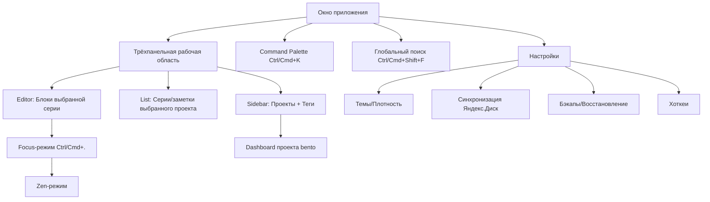

# 06 — Дизайн-система и UI/UX

> **Что это за файл.** Полное описание дизайн-системы и UI/UX десктоп-приложения **DEVNOTES**: анализ трендов интерфейсов 2025–2026, перенятая из проекта **Portfolio** терминально-хакерская эстетика (JetBrains Mono, неоново-зелёный акцент `#22c55e`, scanlines, matrix-grid), система дизайн-токенов в стиле shadcn/ui (HSL CSS-переменные), библиотека CVA-компонентов (Button/Card/Input/TextArea/Badge), тёмная/светлая/дополнительные темы, карта экранов трёхпанельной раскладки, ASCII-вайрфреймы ключевых экранов, командная палитра, focus/zen-режим, микровзаимодействия, клавиатурные сокращения и доступность WCAG 2.2. Документ — источник истины по визуальному слою и паттернам взаимодействия; технические контракты данных, IPC и синка вынесены в соседние файлы.

## Связанные документы

| Файл | Тема |
|------|------|
| [`01-VISION.md`](./01-VISION.md) | Видение продукта, требования, WBS |
| [`02-SPECIFICATION.md`](./02-SPECIFICATION.md) | Функциональная спецификация, доменная модель, DDL |
| [`03-FEATURES.md`](./03-FEATURES.md) | Фичи (must/should/could), пользовательские сценарии |
| [`04-ARCHITECTURE.md`](./04-ARCHITECTURE.md) | Архитектура слоёв, Tauri IPC, sync-движок |
| **`06-UI-UX.md`** | **Этот документ — дизайн-система, темы, экраны, взаимодействия** |

> Нумерация файлов сквозная по каталогу `docs/`. Ссылки на разделы поиска (FTS5) и синка (Яндекс.Диск) даны по содержанию `02-SPECIFICATION.md` и `04-ARCHITECTURE.md`.

---

## 1. Философия интерфейса DEVNOTES

DEVNOTES — **local-first терминал инженерных знаний**. Интерфейс подчинён трём принципам, вытекающим из требований и [WBS-рисков](./01-VISION.md):

| Принцип | Что означает на практике |
|---------|--------------------------|
| **Мгновенность (local-first UX)** | Ни одно действие не ждёт сеть. Открытие серии, ввод текста, поиск — всё синхронно из локального SQLite. Никаких спиннеров на CRUD. Индикатор сети — это фоновый статус синка, а не блокирующее состояние. |
| **Клавиатура-first** | Приложение для инженеров. Любое частое действие достижимо с клавиатуры; мышь опциональна. Командная палитра (`Ctrl/Cmd+K`) — центральный вход. |
| **Плотность без шума** | Максимум полезной информации на экран при читаемости. Терминальная эстетика служит плотности, а не декору: моноширинный шрифт, чёткая сетка, минимум «воздуха» там, где он не нужен. |

Дизайн-язык — прямое продолжение веб-проекта **Portfolio**: терминально-хакерская тема поверх токенов shadcn/ui. Десктоп **расширяет** её паттернами нативного приложения (трёхпанельная раскладка, command palette, focus-режим, системные хоткеи), не ломая визуальную идентичность.

---

## 2. Тренды UI/UX 2025–2026 и решения DEVNOTES

Ниже — не обзор ради обзора, а сопоставление актуального тренда с **конкретным решением** в DEVNOTES.

### 2.1 Local-first мгновенность (optimistic UI)

Пользователи 2025–2026 привыкли к приложениям класса Linear/Obsidian/Raycast, где интерфейс отвечает за <100 мс. Тренд — **optimistic UI**: изменение отражается в UI до подтверждения записи.

**Решение DEVNOTES:** так как источник истины — локальный SQLite, оптимистичность почти бесплатна. Мутация через TanStack Query пишет в БД синхронно (Tauri IPC-команда), UI обновляет кэш немедленно. Сетевой синк — отдельный фоновый процесс (oplog), он **никогда** не участвует в отклике UI. Целевые бюджеты отклика:

| Действие | Бюджет | Механизм |
|----------|--------|----------|
| Нажатие клавиши в редакторе | <16 мс (60 fps) | Локальный стейт, запись в БД с debounce |
| Открытие серии | <50 мс | Пагинация блоков + виртуализация |
| Полнотекстовый поиск (10k блоков) | <50 мс | FTS5 + bm25 (см. `02-SPECIFICATION.md`) |
| Открытие командной палитры | <30 мс | Индекс проектов/серий в памяти (Zustand) |

### 2.2 Command palette как основной навигатор

От VS Code и Raycast паттерн `Ctrl/Cmd+K` стал стандартом де-факто. Пользователь не ищет пункт в меню — он вызывает палитру и печатает намерение.

**Решение:** командная палитра — **обязательная** (must) фича, единый вход для поиска, навигации к проекту/серии и быстрых действий (см. раздел 8).

### 2.3 Bento-раскладки

Bento (модульная сетка карточек разного размера, как в дизайне Apple/Vercel) — доминирующий тренд дашбордов 2025.

**Решение:** применяем **дозированно** — только на экранах-обзорах (Dashboard проекта, экран статистики из `could`), где карточки метрик/heatmap/последних серий естественно ложатся в bento-сетку. Рабочие экраны (редактор) остаются трёхпанельными: bento там — вредный декор.

### 2.4 Тёмная тема по умолчанию, OLED-режим

Тёмная тема — не опция, а дефолт для dev-инструментов. Отдельный тренд — **true-black (OLED)** тема для экономии батареи на ноутбуках с OLED-панелями.

**Решение:** тёмная тема — дефолт (зафиксировано в WBS). Плюс три дополнительные темы, включая `oled` (истинно чёрный `--background: 0 0% 0%`) — см. раздел 6.

### 2.5 Микровзаимодействия

Тренд — **функциональные** микроанимации: подтверждающие действие, а не украшающие. Обязательное требование 2025 — уважение к `prefers-reduced-motion`.

**Решение:** каждая анимация несёт смысл (подтверждение сохранения, перетаскивание блока, появление сниппета поиска). Все переходы отключаемы через системную настройку и внутренний тумблер. Длительности — короткие (см. раздел 9).

### 2.6 Доступность WCAG 2.2

WCAG 2.2 (2023) добавил критерии, критичные для десктопа: **2.4.11 Focus Not Obscured**, **2.4.13 Focus Appearance**, **2.5.7 Dragging Movements** (drag-and-drop должен иметь клавиатурную альтернативу), **2.5.8 Target Size (Minimum)** — цели ≥24×24 CSS-px.

**Решение:** соответствие AA. Drag-and-drop блоков (@dnd-kit) дублируется хоткеями `Alt+↑/↓`. Все интерактивные цели ≥24 px. Подробно — раздел 10.

### 2.7 Плотность и режимы плотности

Инженерные инструменты требуют высокой плотности, но не все пользователи одинаковы. Тренд — переключатель density (comfortable/compact), как в Gmail/GitHub.

**Решение:** три режима плотности через масштаб токенов отступов и высоты строк (раздел 6.5).

### 2.8 Focus / Zen-режим

Тренд «distraction-free» из Obsidian/iA Writer: по хоткею скрываются все панели, остаётся только текст.

**Решение:** focus-режим (`Ctrl/Cmd+.`) сворачивает Sidebar и List, разворачивает Editor на всю ширину с ограничением строки чтения (~80–90 символов для markdown). Zen-режим — расширение focus: убирает и заголовок окна, включает «печатную машинку» (курсор по центру).

### 2.9 Клавиатура-first и command-driven workflow

Сводный тренд: минимизация пути «намерение → действие». Приложения предоставляют полную клавиатурную карту и показывают хинты хоткеев прямо в UI.

**Решение:** полная карта (раздел 8), хинты хоткеев в тултипах и в командной палитре справа от каждой команды.

---

## 3. Наследование дизайн-системы из Portfolio

### 3.1 Что перенимаем

| Элемент Portfolio | Перенос в DEVNOTES |
|-------------------|--------------------|
| Шрифт **JetBrains Mono** | Основной шрифт всего UI (не только кода) |
| Акцент **`#22c55e`** (neon green) | `--primary`, свечение neon-text, кольца фокуса |
| **Terminal window** (заголовок с «light» кружками, prompt-строка) | Обёртка ключевых панелей и модалок |
| **Scanlines** (горизонтальные линии CRT) | Опциональный оверлей фона (отключаем в reduced-motion/light) |
| **Matrix-grid** фон | Тонкая сетка фона рабочей области |
| **Neon-text** свечение | Заголовки, активные элементы, логотип |
| Токены **shadcn/ui** (HSL-переменные) | Полная система токенов (раздел 4) |
| **CVA + clsx + tailwind-merge** | Механизм вариантов всех компонентов |
| Примитивы **Button/Card/Input/TextArea/Badge/AnimatedTooltip** | Базовая библиотека компонентов (раздел 5) |

### 3.2 Что расширяем под десктоп

- **Трёхпанельная раскладка** вместо страничной навигации веба.
- **Command palette** как системный компонент.
- **Focus/Zen-режим**.
- **Плотность** и **дополнительные темы** (OLED, high-contrast, amber).
- Нативные паттерны: контекстные меню, drag-and-drop блоков с клавиатурной альтернативой, системные хоткеи.

### 3.3 Терминальная эстетика: слои фона

```
┌─────────────────────────────────────────────┐
│  Слой 3: neon-text glow (только на акцентах)  │  z: контент
│  Слой 2: scanlines overlay (opacity ~0.03)    │  pointer-events: none
│  Слой 1: matrix-grid (linear-gradient сетка)  │  фон рабочей области
│  Слой 0: --background (сплошной фон темы)      │  базовый
└─────────────────────────────────────────────┘
```

Слои 1–2 — чисто декоративные, `pointer-events: none`, отключаются в светлой теме, high-contrast и при `prefers-reduced-motion`. Реализация — CSS `background-image` (matrix-grid) и псевдоэлемент `::after` с повторяющимся градиентом (scanlines), без DOM-нагрузки.

---

## 4. Дизайн-токены (shadcn/ui, HSL)

Токены — CSS-переменные в формате `H S% L%` (значения HSL **без** `hsl()`), чтобы Tailwind мог оборачивать их с прозрачностью: `hsl(var(--primary) / 0.5)`. Тема переключается атрибутом `data-theme` на `:root`.

### 4.1 Полный перечень семантических токенов

| Переменная | Назначение | Тёмная (default) | Светлая |
|------------|-----------|------------------|---------|
| `--background` | Фон приложения | `0 0% 4%` | `0 0% 100%` |
| `--foreground` | Основной текст | `0 0% 95%` | `240 10% 4%` |
| `--card` | Фон карточек/панелей | `0 0% 7%` | `0 0% 100%` |
| `--card-foreground` | Текст на карточке | `0 0% 95%` | `240 10% 4%` |
| `--popover` | Фон поповеров/палитры | `0 0% 6%` | `0 0% 100%` |
| `--popover-foreground` | Текст в поповере | `0 0% 95%` | `240 10% 4%` |
| `--primary` | Акцент (neon green) | `142 71% 45%` | `142 71% 40%` |
| `--primary-foreground` | Текст на акценте | `0 0% 4%` | `0 0% 100%` |
| `--secondary` | Вторичный фон/кнопка | `0 0% 12%` | `240 5% 96%` |
| `--secondary-foreground` | Текст вторичного | `0 0% 95%` | `240 6% 10%` |
| `--muted` | Приглушённый фон | `0 0% 12%` | `240 5% 96%` |
| `--muted-foreground` | Приглушённый текст | `0 0% 60%` | `240 4% 46%` |
| `--accent` | Ховер/подсветка | `142 40% 18%` | `142 40% 90%` |
| `--accent-foreground` | Текст на accent | `142 71% 60%` | `142 71% 30%` |
| `--destructive` | Ошибка/удаление | `0 72% 51%` | `0 72% 45%` |
| `--destructive-foreground` | Текст на destructive | `0 0% 98%` | `0 0% 100%` |
| `--border` | Границы | `0 0% 16%` | `240 6% 90%` |
| `--input` | Границы полей ввода | `0 0% 16%` | `240 6% 90%` |
| `--ring` | Кольцо фокуса | `142 71% 45%` | `142 71% 40%` |
| `--radius` | Базовый радиус | `0.5rem` | `0.5rem` |

`--primary: 142 71% 45%` ≈ `#22c55e` (Tailwind green-500), что и есть акцент Portfolio.

### 4.2 Токены статуса синка (специфичны для DEVNOTES)

| Переменная | Назначение | Значение (dark) |
|------------|-----------|-----------------|
| `--sync-ok` | Всё синхронизировано | `142 71% 45%` |
| `--sync-pending` | Есть несинхронизированные изменения | `38 92% 50%` (amber) |
| `--sync-offline` | Нет сети | `0 0% 45%` (серый) |
| `--sync-conflict` | Конфликт-копия | `0 72% 51%` (red) |

### 4.3 Токены типографики и сетки

| Переменная | Значение | Назначение |
|------------|----------|------------|
| `--font-mono` | `"JetBrains Mono", ui-monospace, monospace` | Весь UI |
| `--font-size-base` | `14px` | Базовый кегль (плотность comfortable) |
| `--line-height` | `1.6` | Тело текста |
| `--panel-sidebar-w` | `260px` | Ширина Sidebar |
| `--panel-list-w` | `340px` | Ширина List |
| `--reading-width` | `78ch` | Ограничение строки в редакторе |

### 4.4 Пример корневого CSS

```css
:root, :root[data-theme="dark"] {
  --background: 0 0% 4%;
  --foreground: 0 0% 95%;
  --card: 0 0% 7%;
  --primary: 142 71% 45%;      /* #22c55e */
  --primary-foreground: 0 0% 4%;
  --muted: 0 0% 12%;
  --muted-foreground: 0 0% 60%;
  --accent: 142 40% 18%;
  --border: 0 0% 16%;
  --ring: 142 71% 45%;
  --radius: 0.5rem;
  --sync-pending: 38 92% 50%;
}

:root[data-theme="light"] {
  --background: 0 0% 100%;
  --foreground: 240 10% 4%;
  --card: 0 0% 100%;
  --primary: 142 71% 40%;
  --muted: 240 5% 96%;
  --border: 240 6% 90%;
  --ring: 142 71% 40%;
}

* { border-color: hsl(var(--border)); }
body {
  background: hsl(var(--background));
  color: hsl(var(--foreground));
  font-family: var(--font-mono);
  font-size: var(--font-size-base, 14px);
}
```

Tailwind-конфиг мапит токены в утилиты: `colors.primary = "hsl(var(--primary) / <alpha-value>)"` и т.д. — идентично подходу Portfolio.

---

## 5. Библиотека компонентов (CVA)

Все примитивы построены на **class-variance-authority (CVA)** + `clsx` + `tailwind-merge` — как в Portfolio. Ниже — контракты вариантов.

### 5.1 Button

Полный набор вариантов и размеров перенесён из Portfolio без изменений.

| Prop | Значения |
|------|----------|
| `variant` | `default` \| `destructive` \| `outline` \| `secondary` \| `ghost` \| `link` |
| `size` | `sm` \| `default` \| `lg` \| `icon` |

```ts
const buttonVariants = cva(
  "inline-flex items-center justify-center gap-2 whitespace-nowrap rounded-md " +
  "text-sm font-medium ring-offset-background transition-colors " +
  "focus-visible:outline-none focus-visible:ring-2 focus-visible:ring-ring " +
  "focus-visible:ring-offset-2 disabled:pointer-events-none disabled:opacity-50",
  {
    variants: {
      variant: {
        default:     "bg-primary text-primary-foreground hover:bg-primary/90",
        destructive: "bg-destructive text-destructive-foreground hover:bg-destructive/90",
        outline:     "border border-input bg-background hover:bg-accent hover:text-accent-foreground",
        secondary:   "bg-secondary text-secondary-foreground hover:bg-secondary/80",
        ghost:       "hover:bg-accent hover:text-accent-foreground",
        link:        "text-primary underline-offset-4 hover:underline",
      },
      size: {
        sm:      "h-8 rounded-md px-3 text-xs",
        default: "h-9 px-4 py-2",
        lg:      "h-10 rounded-md px-8",
        icon:    "h-9 w-9",
      },
    },
    defaultVariants: { variant: "default", size: "default" },
  }
);
```

> Цель размеров: `sm` (h-8 = 32px) и выше проходят WCAG 2.2 Target Size (≥24px). Для `icon` — 36×36px.

### 5.2 Card

Композиция: `Card` / `CardHeader` / `CardTitle` / `CardDescription` / `CardContent` / `CardFooter`. Опциональный вариант `terminal` — с заголовком-«окном»:

| Prop | Значения |
|------|----------|
| `variant` | `default` \| `terminal` (шапка с тремя кружками + prompt) \| `ghost` |

### 5.3 Input / TextArea

```ts
// Input — h-9, border-input, focus ring-ring
"flex h-9 w-full rounded-md border border-input bg-transparent px-3 py-1 " +
"text-sm shadow-sm transition-colors placeholder:text-muted-foreground " +
"focus-visible:outline-none focus-visible:ring-2 focus-visible:ring-ring " +
"disabled:cursor-not-allowed disabled:opacity-50"
```

TextArea — аналогично, `min-h-[80px]`, `resize-y`. В редакторе блока используется автогроу-вариант (высота по контенту).

### 5.4 Badge

Для тегов технологий (TechTag) и статусов.

| `variant` | Использование |
|-----------|---------------|
| `default` | Тег по умолчанию |
| `secondary` | Нейтральный статус |
| `outline` | Фильтр-чип (неактивный) |
| `destructive` | Конфликт/ошибка |
| `tag-language` / `tag-framework` / `tag-tool` / `tag-database` / `tag-devops` / `tag-other` | Цвет по категории `TechTagType` |

Категории тега кодируются оттенком: language — зелёный (primary), framework — cyan, tool — фиолетовый, database — amber, devops — оранжевый, other — серый. Все проходят контраст AA на фоне `--card`.

### 5.5 AnimatedTooltip

Из Portfolio. Показывает хинт + **клавиатурное сокращение** справа (`⌘K`, `Alt+N`). Появление с задержкой 400 мс, `prefers-reduced-motion` → без анимации.

### 5.6 Дополнительные компоненты десктопа

| Компонент | Назначение |
|-----------|-----------|
| `CommandPalette` | Модальный список команд/результатов, fuzzy-фильтр |
| `PanelResizer` | Перетаскиваемая граница панелей, двойной клик — сброс |
| `BlockEditor` | Обёртка блока NoteContent: тип, drag-handle, тулбар |
| `SnippetHighlight` | Подсветка совпадений поиска (`<mark>` из FTS5 snippet) |
| `SyncStatusBadge` | Индикатор статуса синка (токены 4.2) |
| `EmptyState` | Пустые состояния с prompt-стилем терминала |

---

## 6. Темы

### 6.1 Матрица тем

| Тема | `data-theme` | Дефолт | Назначение |
|------|--------------|--------|-----------|
| Dark (Terminal) | `dark` | Да | Основная, полная эстетика |
| Light | `light` | — | Дневная работа, scanlines/matrix off |
| OLED (True Black) | `oled` | — | Экономия батареи, `--background: 0 0% 0%` |
| High Contrast | `hc` | — | Доступность, контраст ≥7:1, без свечения |
| Amber (Retro) | `amber` | — | Альтернативный акцент `38 92% 50%` (янтарный монохром) |

### 6.2 OLED-тема (отличия от dark)

```css
:root[data-theme="oled"] {
  --background: 0 0% 0%;   /* истинно чёрный */
  --card:       0 0% 3%;
  --border:     0 0% 12%;
  /* акцент и текст — как в dark */
}
```

### 6.3 High-contrast (WCAG AAA-ориентир)

- `--foreground: 0 0% 100%`, `--background: 0 0% 0%`, `--border: 0 0% 40%`.
- Отключены scanlines, matrix-grid, neon-glow (свечение снижает воспринимаемый контраст).
- Кольцо фокуса утолщено до 3px.

### 6.4 Переключение

- Хоткей `Ctrl/Cmd+Shift+L` — циклическое переключение dark → light → oled.
- Полный выбор — в командной палитре (`> Theme: ...`) и в настройках.
- Значение хранится в `AppSetting(key="theme")`; при старте применяется до первого рендера (инлайн-скрипт в `index.html`, чтобы избежать вспышки FOUC).
- `prefers-color-scheme` учитывается только при первом запуске (нет сохранённого выбора).

### 6.5 Плотность

| Режим | `--font-size-base` | Высота строки списка | Отступы панелей |
|-------|--------------------|-----------------------|-----------------|
| `comfortable` (default) | 14px | 36px | 12px |
| `compact` | 13px | 28px | 8px |
| `spacious` | 15px | 44px | 16px |

Переключается атрибутом `data-density` на `:root`; токены отступов масштабируются множителем.

---

## 7. Карта экранов и раскладка

### 7.1 Иерархия навигации



### 7.2 Основная трёхпанельная раскладка

Классика приложений-заметок (Notion/Bear/Obsidian), адаптированная под иерархию `Project → NoteSeries → NoteContent`:

| Панель | Содержимое | Ширина | Сворачивается |
|--------|-----------|--------|---------------|
| **Sidebar** | Дерево проектов, фильтр по тегам, избранное (pinned), архив | 260px | `Ctrl/Cmd+1` |
| **List** | Список серий выбранного проекта: заголовок, дата, теги, превью | 340px | `Ctrl/Cmd+2` |
| **Editor** | Блоки NoteContent выбранной серии, drag-and-drop, тулбар | flex | — (основная) |

Границы панелей перетаскиваемые (`PanelResizer`), ширины сохраняются в `AppSetting`.

### 7.3 Адаптивность окна

| Ширина окна | Поведение |
|-------------|-----------|
| ≥1100px | Все три панели |
| 800–1100px | Sidebar сворачивается в иконки (rail), List + Editor |
| <800px | Одна панель за раз, переключение свайпом/хоткеем (мобильная перспектива Tauri) |

---

## 8. ASCII-вайрфреймы ключевых экранов

### 8.1 Основной рабочий экран (трёхпанельный)

```
┌─ DEVNOTES ─────────────────────────────────────── ● sync: ok ─ ⌘K ─┐
│┌───────────────┬──────────────────────┬───────────────────────────┐│
││ PROJECTS      │ SERIES / .NET Core    │ ▹ EF Core: N+1 и Include  ││
││ ───────────── │ ──────────────────── │ ───────────────────────── ││
││ ▸ ★ Portfolio │ 🔎 filter…            │ updated 2026-07-17 14:22  ││
││ ▾   DevNotes  │                       │ #ef-core #performance     ││
││   • .NET Core │ ▣ EF Core: N+1  14:22 │                           ││
││   • React     │   #ef-core #perf      │ ┌───────────────────────┐ ││
││   • DevOps    │ ▢ Async/Await  11:03  │ │ ⠿ [markdown]      ⋯   │ ││
││ ───────────── │   #csharp             │ │ Проблема N+1 возника- │ ││
││ TAGS          │ ▢ LINQ tricks  Jul 15 │ │ ет когда навигацион-  │ ││
││ #csharp   12  │   #linq #csharp       │ │ ные свойства…         │ ││
││ #react     8  │ ▢ Minimal API  Jul 14 │ └───────────────────────┘ ││
││ #docker    5  │                       │ ┌───────────────────────┐ ││
││ ───────────── │ [+ Новая серия]       │ │ ⠿ [code · csharp] ⋯   │ ││
││ ▸ Archive (3) │                       │ │ var q = ctx.Orders    │ ││
│└───────────────┴──────────────────────┤ │   .Include(o=>o.Items)│ ││
│                                        │ └───────────────────────┘ ││
│                                        │ [+ markdown][+ code][+img]││
│└───────────────────────────────────────┴───────────────────────────┘│
└─ 24 серии · 187 блоков · ⇅ 2 несинхронизировано ────────────────────┘
   Sidebar (260)      List (340)              Editor (flex)
```

Легенда: `★` pinned-проект, `▸/▾` свёрнут/раскрыт, `▣/▢` выбранная/невыбранная серия, `⠿` drag-handle блока, `⋯` меню блока, `⇅` счётчик несинхронизированных изменений.

### 8.2 Командная палитра (`Ctrl/Cmd+K`)

```
        ┌─ ⌘ Command Palette ──────────────────────────────┐
        │ > ef core n_                                  esc │
        ├───────────────────────────────────────────────────┤
        │ ПОИСК ПО ЗАМЕТКАМ                                  │
        │  ▹ EF Core: N+1 и Include        .NET Core   ↵     │
        │    «…проблема N+1 возникает когда навигац…»        │
        │  ▹ EF Core миграции              .NET Core         │
        ├───────────────────────────────────────────────────┤
        │ ПЕРЕЙТИ                                            │
        │  ⧉ Проект: DevNotes                          ⌘1    │
        │  ▤ Серия: Async/Await                             │
        ├───────────────────────────────────────────────────┤
        │ ДЕЙСТВИЯ                                           │
        │  + Новая серия                               ⌘N    │
        │  + Новый блок кода                          ⌥⌘C    │
        │  ◐ Тема: OLED                              ⇧⌘L    │
        │  ⇅ Синхронизировать сейчас                        │
        └───────────────────────────────────────────────────┘
```

Палитра: fuzzy-фильтр, секции (Поиск / Перейти / Действия), хоткей справа, FTS5-сниппет под результатом поиска. Навигация `↑/↓`, `↵` — выполнить, `Tab` — вложенные действия.

### 8.3 Focus / Zen-режим (Editor на всю ширину)

```
┌─ DEVNOTES · focus ──────────────────────────── ⌘. выйти ─┐
│                                                           │
│           ▹ EF Core: N+1 и Include                        │
│           #ef-core #performance · 2026-07-17              │
│                                                           │
│      ┌─────────────────────────────────────────────┐     │
│      │ ## Проблема                                   │     │
│      │ N+1 возникает, когда для коллекции сущностей  │     │
│      │ EF выполняет отдельный запрос на каждую       │     │
│      │ навигацию вместо JOIN.                        │     │
│      │                                               │     │
│      │ ```csharp                                     │     │
│      │ var q = ctx.Orders.Include(o => o.Items);     │     │
│      │ ```                                           │     │
│      └─────────────────────────────────────────────┘     │
│                    (строка чтения ≈ 78ch)                 │
└───────────────────────────────────────────────────────────┘
```

Sidebar и List скрыты, редактор центрирован с ограничением `--reading-width`. Zen дополнительно скрывает шапку окна и включает «печатную машинку».

### 8.4 Глобальный поиск с фильтрами (`Ctrl/Cmd+Shift+F`)

```
┌─ Поиск по всей БД ────────────────────────────────────────┐
│ 🔎  include navigation                          142 рез. │
│ ───────────────────────────────────────────────────────── │
│ Фильтры: [проект: все ▾][тег: #ef-core ✕][тип: code ▾]    │
│          [дата: 30 дней ▾]                       очистить │
│ ───────────────────────────────────────────────────────── │
│ ▹ EF Core: N+1 и Include            .NET Core · 14:22     │
│   …используйте <mark>Include</mark> для загрузки          │
│   <mark>navigation</mark> свойств одним запросом…         │
│                                                bm25: 0.94 │
│ ▹ Repository pattern                React · Jul 12        │
│   …абстрагируем <mark>navigation</mark> от компонентов…  │
│                                                bm25: 0.71 │
└───────────────────────────────────────────────────────────┘
```

Подсветка через FTS5 `snippet()` (`<mark>`), релевантность bm25, фильтры по проекту/тегу/типу блока/диапазону дат (соответствует `should`-фиче).

### 8.5 Dashboard проекта (bento)

```
┌─ DevNotes · обзор ────────────────────────────────────────┐
│ ┌───────────────┐ ┌───────────────────────────────────┐  │
│ │ 24 серии      │ │ Активность (heatmap 12 недель)    │  │
│ │ 187 блоков    │ │ ▪▪▫▪▪▪▫ ▪▫▪▪▪▪▫ ▪▪▪▫▪▪▪ ▪▫▪▪▪▪▪  │  │
│ └───────────────┘ └───────────────────────────────────┘  │
│ ┌───────────────────────┐ ┌───────────────────────────┐  │
│ │ Топ технологий         │ │ Последние серии            │  │
│ │ #csharp   ████████ 12  │ │ ▹ EF Core: N+1     14:22   │  │
│ │ #react    █████    8   │ │ ▹ Async/Await      11:03   │  │
│ │ #docker   ███      5   │ │ ▹ LINQ tricks      Jul 15  │  │
│ └───────────────────────┘ └───────────────────────────┘  │
└───────────────────────────────────────────────────────────┘
```

Bento применяется только здесь и на экране статистики (`could`).

### 8.6 Пустое состояние (терминальный prompt)

```
┌───────────────────────────────────────────┐
│  $ devnotes --new-series                   │
│                                            │
│  Здесь пока нет заметок.                    │
│  Создайте первую серию: [+ Новая серия] ⌘N │
│  или импортируйте из Portfolio API.        │
│                                            │
│  _                                         │
└───────────────────────────────────────────┘
```

---

## 9. Микровзаимодействия и анимации

Принцип: **анимация подтверждает действие**. Все длительности короткие, кривые — `ease-out` для входа, `ease-in` для выхода.

| Взаимодействие | Анимация | Длительность | Заметки |
|----------------|----------|--------------|---------|
| Открытие командной палитры | fade + scale 0.98→1 | 120 мс | Backdrop blur 4px |
| Появление блока / нового элемента | fade + slide-up 4px | 150 мс | — |
| Drag блока (@dnd-kit) | подъём тени + `scale 1.02`, плейсхолдер-«призрак» | по жесту | Клавиатурная альтернатива `Alt+↑/↓` |
| Сохранение черновика (debounce) | пульс индикатора «●→✓» | 200 мс | Тихо, без тоста |
| Успешная мутация | тост react-hot-toast (зелёный) | 2.5 c | Только для явных действий |
| Ошибка синка/конфликт | тост destructive + бейдж | до закрытия | Требует внимания |
| Наведение на тег/кнопку | смена фона `--accent` | 100 мс | `transition-colors` |
| Neon-glow активного элемента | `text-shadow` пульсация | 2 c, бесконечно | Только dark/amber, off в reduced-motion |
| Scanlines | статичный оверлей (без движения) | — | Движение убрано намеренно (укачивание) |
| Переключение темы | crossfade фона | 180 мс | Off в reduced-motion |
| Печатная машинка (Zen) | плавный скролл к курсору | 80 мс | — |

### 9.1 Reduced motion

При `prefers-reduced-motion: reduce` **или** внутреннем тумблере «Отключить анимации»:

- Все `transition`/`animation` → `0.01ms` (мгновенно, но без сломанной верстки).
- Отключаются neon-glow-пульсация, scanlines, matrix-grid, crossfade тем.
- Drag сохраняет функцию, но без анимации подъёма.

```css
@media (prefers-reduced-motion: reduce) {
  *, *::before, *::after {
    animation-duration: 0.01ms !important;
    animation-iteration-count: 1 !important;
    transition-duration: 0.01ms !important;
  }
}
```

---

## 10. Клавиатурные сокращения

`⌘` = Cmd (macOS) / Ctrl (Windows/Linux). Полная карта настраивается в разделе «Хоткеи» и хранится в `AppSetting`.

### 10.1 Глобальные

| Сочетание | Действие |
|-----------|----------|
| `⌘K` | Командная палитра |
| `⌘⇧F` | Глобальный поиск по всей БД |
| `⌘N` | Новая серия |
| `⌘⇧N` | Новый проект |
| `⌘,` | Настройки |
| `⌘⇧L` | Циклическое переключение темы |
| `⌘.` | Focus-режим (toggle) |
| `⌘\` | Zen-режим (toggle) |
| `⌘1` / `⌘2` | Свернуть/показать Sidebar / List |
| `⌘⇧S` | Синхронизировать сейчас |
| `⌘B` | Резервная копия (snapshot) |

### 10.2 В редакторе блоков

| Сочетание | Действие |
|-----------|----------|
| `⌥⌘M` | Новый блок markdown |
| `⌥⌘C` | Новый блок code |
| `⌥⌘I` | Новый блок image |
| `⌥⌘K` | Новый блок link |
| `Alt+↑` / `Alt+↓` | Переместить блок вверх/вниз (альтернатива drag) |
| `⌘D` | Дублировать блок |
| `⌘↵` | Завершить редактирование блока (blur) |
| `⌘⌫` | Удалить блок (с подтверждением) |
| `Tab` / `⇧Tab` | Отступ в code/markdown |
| `⌘/` | Комментарий/переключение превью markdown |

### 10.3 Навигация по спискам

| Сочетание | Действие |
|-----------|----------|
| `↑` / `↓` | Перемещение по сериям/блокам |
| `↵` | Открыть серию / войти в блок |
| `Esc` | Закрыть палитру/модалку/выйти из focus |
| `⌘F` | Поиск внутри текущей серии |
| `⌘P` | Быстрый переход (quick-open серии) |

### 10.4 Discoverability

- Хоткей каждой команды показан в командной палитре и в тултипах.
- Экран «Хоткеи» (`⌘,` → вкладка) — полная карта с поиском и возможностью переназначения.
- `⌘/` на пустом фокусе — шпаргалка-оверлей активных сочетаний.

---

## 11. Доступность (WCAG 2.2 AA)

### 11.1 Целевой уровень

Соответствие **WCAG 2.2 Level AA**; high-contrast-тема стремится к AAA по контрасту.

### 11.2 Ключевые критерии и реализация

| Критерий WCAG 2.2 | Реализация в DEVNOTES |
|-------------------|-----------------------|
| **1.4.3 Контраст (минимум)** | Все пары текст/фон ≥4.5:1 (крупный ≥3:1). Проверка токенов в CI-скрипте. |
| **1.4.11 Non-text Contrast** | Границы полей, иконки, кольцо фокуса ≥3:1 к фону. |
| **2.1.1 Клавиатура** | Всё доступно с клавиатуры; нет keyboard-trap. |
| **2.4.7 Focus Visible** | Видимое кольцо `--ring` 2px (3px в hc). |
| **2.4.11 Focus Not Obscured** | Липкие панели не перекрывают сфокусированный элемент; автоскролл в видимую область. |
| **2.4.13 Focus Appearance** | Кольцо фокуса ≥2px, контраст ≥3:1 к соседним цветам. |
| **2.5.7 Dragging Movements** | Drag-and-drop блоков дублирован хоткеями `Alt+↑/↓` и меню «Переместить». |
| **2.5.8 Target Size (Minimum)** | Все интерактивные цели ≥24×24 CSS-px (кнопки sm = 32px, icon = 36px). |
| **1.4.12 Text Spacing** | Верстка не ломается при увеличении межстрочного/межбуквенного интервала. |
| **1.4.10 Reflow** | Контент читается при 320px без горизонтального скролла (мобильная перспектива). |
| **2.3.3 Animation from Interactions** | `prefers-reduced-motion` отключает нефункциональные анимации. |

### 11.3 Семантика и ассистивные технологии

- Панели — `role="region"` с `aria-label` («Проекты», «Серии», «Редактор»).
- Командная палитра — `role="dialog"` + `aria-modal`, список результатов `role="listbox"` / `role="option"`, `aria-activedescendant`.
- Drag-and-drop @dnd-kit — с `announcements` (screen-reader объявляет «Блок перемещён на позицию N»).
- Статус синка — `aria-live="polite"` для ненавязчивых обновлений; конфликт — `aria-live="assertive"`.
- Иконки-кнопки — обязательный `aria-label`.

### 11.4 Терминальная эстетика vs доступность

Эстетика **не должна** мешать доступности:

- Neon-glow и scanlines — чисто декоративные, `aria-hidden`, отключаемы.
- В high-contrast свечение и оверлеи выключены (снижают воспринимаемый контраст).
- Моноширинный шрифт JetBrains Mono имеет высокую читаемость и различимые `0/O`, `1/l/I` — плюс для доступности и кода.
- Цвет **никогда** не единственный носитель смысла: статус синка дублируется иконкой (`✓ / ● / ⇅ / ⚠`) и текстом, категории тегов — префиксом.

---

## 12. Резюме принятых решений

| Аспект | Решение |
|--------|---------|
| Шрифт | JetBrains Mono (весь UI) |
| Акцент | `#22c55e` → `--primary: 142 71% 45%` |
| Токены | shadcn/ui HSL, переключение через `data-theme` |
| Компоненты | CVA + clsx + tailwind-merge; Button variants/sizes как в Portfolio |
| Темы | dark (default), light, oled, high-contrast, amber; 3 режима плотности |
| Раскладка | Трёхпанельная: Sidebar → List → Editor |
| Навигация | Command palette `⌘K` как основной вход |
| Режимы | Focus (`⌘.`) и Zen (`⌘\`) |
| Поиск | Глобальный `⌘⇧F` с фильтрами, FTS5-сниппеты + bm25 |
| Анимации | Функциональные, короткие, `prefers-reduced-motion`-aware |
| Доступность | WCAG 2.2 AA; drag дублирован клавиатурой; цвет не единственный носитель смысла |
| Эстетика | Терминально-хакерская (scanlines/matrix-grid/neon) — декоративна и отключаема |

---

*Документ описывает визуальный слой и паттерны взаимодействия DEVNOTES. Реализация токенов и компонентов зеркалит дизайн-систему Portfolio; технические контракты данных и синка — в `02-SPECIFICATION.md` и `04-ARCHITECTURE.md`.*
