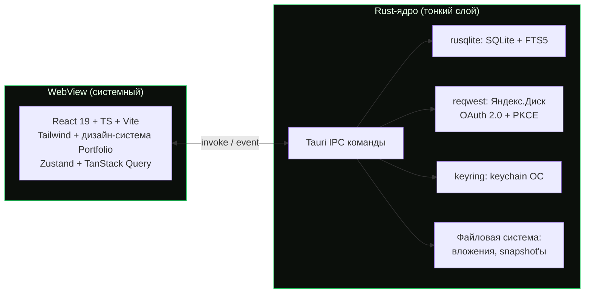

# 07 — Технологический стек

> **Что это за файл.** Обоснование выбора всего технологического стека **DEVNOTES**: почему оболочка — **Tauri 2.0**, а не Electron / .NET MAUI / Flutter (сравнительная таблица по размеру, производительности, переиспользованию React-дизайна из Portfolio, доступу к ФС/ОС и мобильным перспективам); из чего состоит **фронтенд** (React 19 / TypeScript / Vite / Tailwind / @dnd-kit / react-markdown / react-syntax-highlighter / TanStack Query / Zustand / иконки); из чего состоит **Rust-ядро** (rusqlite/sqlx, SQLite + FTS5, reqwest, keyring); как всё это **собирается и дистрибутируется** (Tauri bundler → msi/dmg/AppImage/deb, автообновление, подпись) и как устроен **CI** (GitHub Actions, матрица ОС). В конце — таблица закреплённых версий зависимостей. Документ — источник правды по выбору инструментов; архитектура слоёв и IPC разобраны в `04-ARCHITECTURE.md`, схема данных — в `05-DATA-MODEL.md`.

> **Стадия:** проектирование · **Дата:** 2026-07-17 · **Язык:** русский, тон инженерный · **Область:** десктоп v1 (Windows / macOS / Linux).

---

## Связанные документы

Пути указаны относительно `DevNotes/`. Канон именования, глоссарий и инварианты — в `CLAUDE.md`.

| Документ | Тема | Роль для этого файла |
| --- | --- | --- |
| [`CLAUDE.md`](../CLAUDE.md) | Конвенции, зафиксированные архитектурные решения | Источник закреплённых решений (Tauri, SQLite, FTS5) |
| [`docs/01-VISION.md`](01-VISION.md) | Видение, персоны, scope MoSCoW | «Зачем» именно local-first десктоп |
| [`docs/02-SPECIFICATION.md`](02-SPECIFICATION.md) | Большое ТЗ | Функциональные требования к стеку |
| [`docs/03-FEATURES.md`](03-FEATURES.md) | Каталог фич MoSCoW | Какие фичи диктуют выбор библиотек |
| [`docs/04-ARCHITECTURE.md`](04-ARCHITECTURE.md) | Слои Clean Architecture, IPC, sync-движок | Куда встают выбранные технологии |
| [`docs/05-DATA-MODEL.md`](05-DATA-MODEL.md) | Доменная модель, DDL SQLite, FTS5 | Потребитель rusqlite/FTS5 |
| [`docs/06-UI-UX.md`](06-UI-UX.md) | Дизайн-токены, компоненты, терминальная эстетика | Потребитель Tailwind/CVA |
| [`docs/08-SEARCH.md`](08-SEARCH.md) | Полнотекстовый поиск: FTS5, bm25, токенизаторы | Детализация поискового движка |
| [`docs/09-YANDEX-DISK.md`](09-YANDEX-DISK.md) | Синхронизация с Яндекс.Диском, OAuth + PKCE | Детализация reqwest/keyring |
| `docs/07-ADR/` (план) | Architecture Decision Records | Формальное ADR по «Tauri vs …» |

> Единственная ещё не созданная ссылка — каталог `docs/07-ADR/` (плановый, стадия проектирования). Остальные документы уже существуют. При расхождении формулировок канон — `CLAUDE.md` и `consistencyNotes` из WBS.

---

## 1. Резюме решения (TL;DR)

| Слой | Выбор | Одной фразой |
| --- | --- | --- |
| **Оболочка** | **Tauri 2.0** (Rust-ядро + системный WebView) | Лёгкий бинарь, нативный доступ к ФС/ОС, мобильные таргеты, переиспользование React-фронта из Portfolio без переписывания |
| **Фронтенд** | React 19 + TypeScript + Vite 6 + Tailwind | Полностью перенимаем дизайн-систему и стек Portfolio |
| **Состояние** | Zustand + TanStack Query | UI-состояние + серверный (здесь — IPC) кэш, repository-pattern с генераторами query-key |
| **Ядро** | Rust (тонкий слой) | Только SQL, FTS5, sync, OAuth, FS, keychain, IPC-команды — без «умной» бизнес-логики представления |
| **Хранилище** | SQLite + **FTS5** через **rusqlite** | Local-first, мгновенный поиск, миграции версионируются |
| **Сеть** | **reqwest** | Яндекс.Диск REST API (OAuth 2.0 + PKCE) |
| **Секреты** | **keyring** | Токены в системном keychain (Credential Manager / Keychain / Secret Service) |
| **Сборка** | Tauri bundler + GitHub Actions | msi / dmg / AppImage + deb, подпись, автообновление |

**Главный принцип выбора:** сохранить и переиспользовать существующий React-фронтенд Portfolio (React 19, Tailwind, дизайн-токены shadcn/ui, CVA), при этом получить нативную скорость доступа к SQLite/FS и малый вес дистрибутива. Обе цели одновременно закрывает только **Tauri 2.0**.

---

## 2. Выбор оболочки: Tauri 2 vs Electron vs .NET MAUI vs Flutter

### 2.1. Критерии оценки

Оболочка выбирается по шести критериям, ранжированным под требования DEVNOTES:

1. **Переиспользование React-дизайна из Portfolio** (критично — не хотим переписывать UI).
2. **Размер дистрибутива и потребление памяти** (десктоп-утилита должна быть лёгкой).
3. **Производительность** (холодный старт, отзывчивость, объём IPC).
4. **Доступ к ФС/ОС** (SQLite-файл, вложения, snapshot'ы, keychain, глобальные хоткеи).
5. **Мобильные перспективы** (iOS/Android поверх той же схемы синка — could).
6. **Совпадение с компетенциями команды** (.NET / React; Rust — тонким слоем).

### 2.2. Сравнительная таблица

| Критерий | **Tauri 2.0** | Electron | .NET MAUI | Flutter |
| --- | --- | --- | --- | --- |
| **Язык ядра** | Rust | Node.js (Chromium+V8) | C# / .NET | Dart |
| **Рендер UI** | Системный WebView (WebView2 / WKWebView / WebKitGTK) | Встроенный Chromium | Нативные контролы + BlazorWebView | Собственный движок (Skia/Impeller) |
| **Переиспользование React из Portfolio** | **Да, 1:1** — тот же React 19 + Tailwind + дизайн-токены | Да, 1:1 | Частично (Blazor ≠ React; React только через WebView-костыль) | **Нет** — переписывать весь UI на Dart/Flutter |
| **Размер инсталлятора (типовой)** | **~3–10 МБ** | ~85–150 МБ | ~30–60 МБ (+ .NET runtime) | ~15–40 МБ |
| **RAM в простое (порядок)** | **~80–150 МБ** | ~300–500 МБ | ~120–200 МБ | ~100–180 МБ |
| **Холодный старт** | Быстрый (нативный бинарь) | Медленный (поднять Chromium+Node) | Средний | Быстрый |
| **Доступ к ФС/ОС** | **Нативный** (Rust: rusqlite, keyring, глобальные хоткеи, tray) | Через Node + native addons | Нативный (.NET) | Через platform channels / FFI |
| **SQLite + FTS5** | rusqlite/sqlx — прямой, в процессе | better-sqlite3 (native addon) | Microsoft.Data.Sqlite | sqflite / drift (через FFI) |
| **Мобильные таргеты** | **iOS + Android (Tauri 2)** — та же кодовая база | Нет (десктоп only) | **iOS + Android + Windows** | **iOS + Android + desktop** |
| **Linux-рендер** | WebKitGTK (отстаёт от Chromium — риск, см. §2.4) | Chromium (стабильно) | ограниченная поддержка | собственный движок (стабильно) |
| **Кривая обучения для команды (.NET/React)** | Средняя (нужен тонкий Rust) | Низкая (JS/TS знаком) | **Низкая (родной C#)** | Высокая (Dart + новый UI-фреймворк) |
| **Автообновление** | Tauri Updater (подписанные релизы) | electron-updater | MAUI/Sparkle-костыли | сторонние решения |
| **Подпись / нотаризация** | Встроено в bundler | electron-builder | dotnet publish + signtool | сторонние скрипты |
| **Зрелость экосистемы (2026)** | Растёт, v2 стабилен | Максимальная | Средняя (десктоп-Linux слабый) | Высокая (но UI-центрична) |

### 2.3. Разбор кандидатов и отсев

**Electron — отклонён.** Единственный, кто на равных с Tauri по переиспользованию React. Проигрывает по всему остальному, что критично для локальной утилиты:

- Дистрибутив в 10–20× тяжелее (каждое приложение тащит свой Chromium+Node).
- RAM в 3–4× выше в простое — заметно для «фонового» приложения заметок.
- Нет мобильных таргетов — закрывает перспективу mobile (could) полностью.
- Более широкая attack surface (полноценный Node в рантайме).

Для DEVNOTES выигрыш Electron (стабильный Chromium на Linux) не перевешивает системную «тяжесть».

**.NET MAUI — отклонён,** несмотря на идеальное совпадение с компетенциями команды (родной C#):

- **Убивает переиспользование дизайна.** UI на MAUI — это XAML + нативные контролы, не React. Blazor Hybrid даёт WebView, но это уже не «родной» MAUI-путь, и он не даёт преимуществ MAUI, зато наследует все минусы WebView без выигрыша Tauri по весу.
- **Слабый десктоп-Linux.** MAUI на Linux официально не поддержан на уровне Windows/macOS — а Linux в требованиях обязателен.
- Тянет .NET runtime в дистрибутив (или требует self-contained сборку в десятки МБ).

MAUI выиграл бы, если бы целью был mobile-first на C# без переиспользования React — это не наш случай.

**Flutter — отклонён.** Технически силён (единый движок рендера, стабильный кроссплатформ, отличный mobile), но:

- **Полностью обнуляет инвестицию в дизайн-систему Portfolio.** Весь UI переписывается на Dart + Flutter-виджеты; терминально-хакерская эстетика, CVA-компоненты, Tailwind-токены — всё заново.
- Новый язык (Dart) и парадигма для команды .NET/React — максимальная кривая обучения.
- SQLite/FTS5 доступны, но через FFI-обёртки, менее прямо, чем rusqlite.

Flutter — правильный выбор для mobile-first продукта с нуля, не для переноса существующего React-приложения.

### 2.4. Вывод: Tauri 2.0

**Решение зафиксировано (WBS `wont`: «Electron/.NET MAUI/Flutter как оболочка — решение зафиксировано»).** Tauri 2.0 — единственный кандидат, который одновременно:

1. **Сохраняет весь React-фронтенд Portfolio 1:1** — React 19, Tailwind, дизайн-токены shadcn/ui, CVA-компоненты, react-markdown, @dnd-kit переезжают без переписывания.
2. **Даёт лёгкий нативный бинарь** (единицы МБ, ~100 МБ RAM) вместо тяжёлого Chromium.
3. **Даёт прямой нативный доступ** к SQLite (rusqlite), файловой системе (вложения, snapshot'ы), системному keychain (keyring) и ОС-фичам (глобальные хоткеи, tray) — всё в процессе, без native-addon-костылей.
4. **Открывает мобильные таргеты** (iOS/Android на Tauri 2) поверх той же схемы синка — перспектива mobile (could) остаётся достижимой без смены стека.
5. **Приносит из коробки** подписанный автоапдейтер и bundler под msi/dmg/AppImage/deb.

**Осознанные компромиссы Tauri (из реестра рисков WBS):**

| Риск | Митигация |
| --- | --- |
| **Rust-ядро при .NET/React-команде** | Ядро держим **тонким**: только SQL + sync + OAuth + FS + IPC-команды. Вся бизнес-логика представления — в TypeScript. Кривая обучения ограничена. |
| **WebKitGTK на Linux отстаёт от Chromium** (рендер markdown/подсветки, перфоманс) | Обязательное тестирование на Ubuntu из CI (см. §7); при необходимости — фолбэки в рендере, экспорт PDF на Rust-стороне вместо html2pdf.js. |
| **IPC-сериализация JSON на больших сериях** | Пагинация блоков `NoteContent` и виртуализация списков с самого начала (см. `04-ARCHITECTURE.md`). |
| **React 19 + часть библиотек Portfolio в WebView** (react-modal-sheet, html2pdf.js) | Проверка в WebView каждой ОС; PDF-экспорт при проблемах переносим на Rust (`printpdf`/headless). |



---

## 3. Фронтенд (WebView, TypeScript)

Стек фронтенда **перенимается из Portfolio** — это осознанная экономия: дизайн-система, компоненты и паттерны уже написаны и проверены. Ниже — что берём и зачем.

### 3.1. База

| Технология | Версия (целевая) | Роль в DEVNOTES |
| --- | --- | --- |
| **React** | 19.x | UI-фреймворк; тот же, что в Portfolio |
| **TypeScript** | 5.6+ | Строгая типизация домена (camelCase-зеркало SQLite) |
| **Vite** | 6.x | Дев-сервер и сборка ассетов фронта (Tauri монтирует его билд) |
| **Tailwind CSS** | 3.4+ | Утилити-стили; HSL-токены shadcn/ui, тёмная тема по умолчанию |
| **CVA + clsx + tailwind-merge** | актуальные | Варианты компонентов (Button: default/destructive/outline/secondary/ghost/link; sizes sm/default/lg/icon) |

> **Примечание по роутингу.** В Portfolio использовался React Router 7 для веба. В десктопе допустимо оставить React Router (memory/hash-режим внутри WebView) — окончательный выбор фиксируется в `04-ARCHITECTURE.md`; на выбор стека это не влияет.

### 3.2. Состояние и данные

| Технология | Роль |
| --- | --- |
| **Zustand** | Клиентское UI-состояние (тема, открытая палитра, черновики, фильтры) |
| **TanStack Query** | Кэш «серверных» данных — здесь «сервер» это **Rust-ядро через IPC**; инвалидация, фоновая перезагрузка, оптимистичные апдейты |
| **Repository-pattern + генераторы query-key** | Как в Portfolio: каждый домен (Project / NoteSeries / NoteContent / TechTag) имеет репозиторий-обёртку над IPC и фабрику query-key |

Схема потока данных на фронте:

```
Component → useQuery/useMutation → repository.ts → tauri invoke(cmd) → Rust IPC → SQLite
                     ↑                                                          │
                     └──────────── queryKey invalidation ←──────── event ───────┘
```

### 3.3. Контент и редактирование

| Технология | Роль | Тип блока `NoteContent` |
| --- | --- | --- |
| **@dnd-kit** | Drag-and-drop сортировка блоков (поле `sort_order`) | все |
| **react-markdown** | Рендер markdown-блоков | `markdown` |
| **react-syntax-highlighter** | Подсветка кода (по `NoteContent.language`) | `code` |
| **react-hot-toast** | Уведомления (сохранение, синк, ошибки) | — |
| **@tabler/icons-react** + **lucide-react** | Иконки (как в Portfolio) | — |

> **Экспорт PDF (should).** В Portfolio использовался `html2pdf.js`. В WebView Tauri поведение может отличаться — при проблемах экспорт переносится на Rust-сторону (`printpdf`/headless-рендер). Решение фиксируется по факту тестирования в WebView.

### 3.4. Что сознательно НЕ тащим в v1

- **react-responsive / react-modal-sheet** — заточены под мобильный веб; для десктопа в MVP не нужны (вернутся при mobile-таргете).
- WYSIWYG-редакторы — только markdown-редактор с превью (WBS `wont`).

---

## 4. Ядро / бэкенд (Rust)

Ядро **тонкое**: единственная бизнес-логика в нём — инварианты данных и I/O. Всё остальное — в TS.

### 4.1. Хранилище: rusqlite (выбор) vs sqlx

| Аспект | **rusqlite** (выбор) | sqlx |
| --- | --- | --- |
| Модель | Синхронный, embedded, прямой доступ к SQLite C-API | Async, ориентирован на клиент-серверные СУБД + SQLite |
| **FTS5** | Полный контроль: `PRAGMA`, кастомные токенизаторы, `bm25()`, `snippet()` | Работает, но FTS5-специфику проще писать «сырым» SQL |
| Bundled SQLite | `features = ["bundled"]` — фиксируем версию SQLite, не зависим от системной | Требует системную либу или отдельную сборку |
| Транзакции | Явные, синхронные — идеально для local-first (UI не ждёт сеть) | Async-оверхед не нужен для локального файла |
| Соответствие задаче | **Да** — один процесс, один файл, синхронные операции | Избыточен для embedded-сценария |

**Выбор — `rusqlite` с `features = ["bundled"]`.** Причины: (1) local-first не нуждается в async-рантайме для доступа к локальному файлу; (2) полный контроль над FTS5 (external content table, триггеры, `bm25`-ранжирование, кастомные токенизаторы для русского — trigram-фолбэк); (3) фиксированная версия SQLite в бинаре — воспроизводимость на всех ОС. `sqlx` держим в уме как альтернативу, если появится async-heavy сценарий.

> Async-рантайм (**tokio**) в проекте всё равно присутствует — его требует `reqwest` для сети. Но доступ к БД остаётся синхронным (при необходимости — через `spawn_blocking`).

### 4.2. Поиск: SQLite FTS5

- **FTS5 external content table** над `NoteContent.title/text` + `NoteSeries.title` — индекс не дублирует данные, обновляется триггерами.
- **Ранжирование `bm25()`**, подсветка сниппетов `snippet()`.
- **SLA:** `<50 мс` на 10k блоков.
- **Русская морфология:** `unicode61` ищет только точные словоформы; закладываем **trigram-токенизатор** как фолбэк (компромисс: размер индекса ↑ vs морфология). Детали — в `08-SEARCH.md`.

### 4.3. Сеть: reqwest

| Технология | Роль |
| --- | --- |
| **reqwest** (+ `rustls-tls`) | HTTPS-клиент к **Яндекс.Диск REST API**: OAuth 2.0 Authorization Code + **PKCE**, загрузка/скачивание oplog и snapshot'ов в app folder |
| **tokio** | Async-рантайм под reqwest |
| **serde / serde_json** | Сериализация payload'ов oplog (`ChangeLog.payload_json`), тел IPC-команд, ответов API |

> Используем `rustls` вместо системного OpenSSL — меньше платформенных зависимостей при сборке под три ОС. Loopback-redirect для OAuth поднимается локальным HTTP-listener'ом в Rust. Запасной канал (ручной экспорт / WebDAV) — на случай недоступности Яндекс.Диска вне РФ (риск WBS). Детали протокола синка — в `09-YANDEX-DISK.md`.

### 4.4. Секреты: keyring

| Технология | Роль | Бэкенд по ОС |
| --- | --- | --- |
| **keyring** (Rust crate) | OAuth-токены Яндекс.Диска в системном хранилище (не в БД, не в конфиге) | Windows Credential Manager / macOS Keychain / Linux Secret Service (libsecret) |

### 4.5. Прочие crate'ы ядра

| Технология | Роль |
| --- | --- |
| **uuid** (`v7`) | Генерация UUID v7 — согласована с клиентской (ID может рождаться и на TS, и на Rust) |
| **chrono** / **time** | UTC ISO 8601, работа с датами `created_at` / `updated_at` |
| **sha2** | `sha256` вложений (content-addressable хранение `Attachment`) |
| **thiserror** / **anyhow** | Ошибки ядра и их проброс в IPC |
| **tauri-plugin-updater** | Автообновление (см. §6) |
| **tauri-plugin-global-shortcut** | Глобальный quick-capture (could) |

### 4.6. Границы ядра (что НЕ в Rust)

Валидация форм, сортировка для отображения, форматирование дат в локальную таймзону, markdown-рендер — **всё в TypeScript**. Rust отвечает только за инварианты данных (UUID, обязательные `created_at`/`updated_at`, запись в `ChangeLog` в той же транзакции) и I/O.

---

## 5. Матрица «требование → технология»

| Требование (WBS `must`) | Технология стека |
| --- | --- |
| Оболочка, кроссплатформенность | Tauri 2.0 + системный WebView |
| Local-first, SQLite, миграции | rusqlite (bundled), версионируемые миграции |
| CRUD Project→NoteSeries→NoteContent, drag-and-drop | React 19, @dnd-kit, TanStack Query |
| `created_at`/`updated_at` UTC ISO 8601 | chrono/time (Rust) + локальная конвертация (TS) |
| Мгновенный FTS5-поиск, bm25, <50 мс | rusqlite + FTS5 external content + bm25 |
| Командная палитра Ctrl/Cmd+K | React + Zustand (+ хоткеи) |
| Теги TechTag/TechTagType, фильтрация | React + TanStack Query + SQLite |
| OAuth Яндекс.Диска, токены в keychain | reqwest + keyring |
| Офлайн-очередь (oplog), LWW-конфликты | rusqlite (`ChangeLog`) + reqwest sync |
| Рендер markdown, подсветка кода | react-markdown, react-syntax-highlighter |
| Тёмная/светлая тема, HSL-токены, терминал | Tailwind + CVA + дизайн-система Portfolio |
| Слои Clean Architecture | Rust-модули (Domain/UseCases/…) + зеркало на TS |

---

## 6. Сборка и дистрибуция

### 6.1. Tauri bundler → артефакты по ОС

| ОС | Формат(ы) | Инструмент | Примечание |
| --- | --- | --- | --- |
| **Windows** | `.msi` (WiX) + `.exe` (NSIS) | Tauri bundler | Подпись Authenticode (сертификат); таргет x86_64 |
| **macOS** | `.dmg` + `.app` | Tauri bundler | **Universal binary** (Intel x86_64 + Apple Silicon arm64), таргет `universal-apple-darwin`; подпись (Developer ID) + **нотаризация** Apple |
| **Linux** | `.AppImage` + `.deb` | Tauri bundler | AppImage — универсально; deb — для Debian/Ubuntu; таргет x86_64 |

> **Архитектурное решение по macOS-таргету.** В v1 macOS-сборка выпускается **universal-бинарём** (`--target universal-apple-darwin`), покрывающим и Intel (x86_64), и Apple Silicon (arm64) одним `.dmg`. Это осознанный выбор в пользу единого артефакта вместо двух раздельных: пользователи Intel-маков поддержаны без отдельной ветки релиза. Universal-сборку CI-раннер `macos-14` (Apple Silicon) собирает кросс-компиляцией на таргет `x86_64-apple-darwin` (см. §7). Windows и Linux в v1 — только x86_64; arm64-Linux и arm64-Windows не входят в v1 (при необходимости добавляются отдельными строками матрицы).
>
> RPM (`.rpm`) — опционально, добавляется при необходимости. Формат обновлений (updater) отдельно упаковывается как подписанный архив (см. §6.2).

### 6.2. Автообновление (Tauri Updater)

- Плагин **`tauri-plugin-updater`**: приложение периодически проверяет манифест обновления (`latest.json`) на статическом хосте / в релизах GitHub.
- **Каждый релиз подписывается** приватным ключом; приложение содержит публичный ключ и проверяет подпись перед установкой (защита от подмены).
- Ключи подписи апдейтера хранятся в секретах CI (`TAURI_SIGNING_PRIVATE_KEY`, `TAURI_SIGNING_PRIVATE_KEY_PASSWORD`), не в репозитории.
- Каналы: как минимум `stable`; при необходимости `beta`.

### 6.3. Подпись кода (по платформам)

| Платформа | Что подписываем | Секреты CI |
| --- | --- | --- |
| Windows | `.msi`/`.exe` (Authenticode) | сертификат + пароль |
| macOS | `.app`/`.dmg` (Developer ID, universal) + нотаризация | Apple ID / App-specific password / Team ID |
| Updater (все ОС) | Архив обновления (Tauri signing) | `TAURI_SIGNING_PRIVATE_KEY` (+ пароль) |

> Без подписи Windows покажет SmartScreen-предупреждение, а macOS Gatekeeper заблокирует запуск. Подпись — обязательное условие релиза, не опция.

---

## 7. CI: GitHub Actions, матрица ОС

Сборка и проверки идут в матрице из трёх ОС — Linux-тестирование обязательно (риск WebKitGTK из WBS). macOS собирается **universal-бинарём** (x86_64 + arm64) на одном раннере — Intel-маки покрыты без отдельной строки матрицы (см. §6.1).

```yaml
# .github/workflows/build.yml (эскиз; финальная версия — в репозитории)
name: build
on:
  push: { branches: [main] }
  pull_request: {}
  workflow_dispatch: {}

jobs:
  build:
    strategy:
      fail-fast: false
      matrix:
        include:
          - os: ubuntu-22.04      # AppImage + deb (x86_64); тест WebKitGTK
          - os: windows-latest    # msi + exe (x86_64)
          - os: macos-14          # dmg (universal: x86_64 + arm64)
    runs-on: ${{ matrix.os }}
    steps:
      - uses: actions/checkout@v4
      - uses: dtolnay/rust-toolchain@stable
      - uses: actions/setup-node@v4
        with: { node-version: 20 }
      - name: Установить системные зависимости Tauri (Linux)
        if: runner.os == 'Linux'
        run: |
          sudo apt-get update
          sudo apt-get install -y libwebkit2gtk-4.1-dev build-essential \
            libssl-dev libayatana-appindicator3-dev librsvg2-dev
      - name: Добавить Rust-таргеты для macOS universal
        if: runner.os == 'macOS'
        run: rustup target add x86_64-apple-darwin aarch64-apple-darwin
      - run: npm ci
      - name: Проверки фронта
        run: npm run typecheck && npm run lint
      - name: Проверки ядра
        run: cargo fmt --check && cargo clippy -- -D warnings && cargo test
      - name: Сборка бандлов Tauri
        # На macOS — universal-бинарь (Intel + Apple Silicon); на прочих ОС — нативный x86_64
        run: npx tauri build ${{ runner.os == 'macOS' && '--target universal-apple-darwin' || '' }}
        env:
          TAURI_SIGNING_PRIVATE_KEY: ${{ secrets.TAURI_SIGNING_PRIVATE_KEY }}
          TAURI_SIGNING_PRIVATE_KEY_PASSWORD: ${{ secrets.TAURI_SIGNING_PW }}
      - uses: actions/upload-artifact@v4
        with:
          name: devnotes-${{ matrix.os }}
          path: src-tauri/target/**/release/bundle/**
```

Этапы CI:

1. **Lint/format** — `eslint` + `prettier` (фронт), `cargo fmt` + `cargo clippy -D warnings` (ядро).
2. **Типы** — `tsc --noEmit`.
3. **Тесты** — `cargo test` (ядро: репозитории, миграции, FTS5, конфликты), vitest (фронт, по мере появления).
4. **Сборка бандлов** на каждой ОС из матрицы; macOS — universal (`universal-apple-darwin`).
5. **Релиз** (отдельный workflow по тегу `v*`): подпись, нотаризация macOS, публикация артефактов + `latest.json` для updater.

> **Обязательно:** e2e-прогон рендера markdown/подсветки на Ubuntu-раннере (WebKitGTK) — ловит расхождения Linux-WebView до релиза.

---

## 8. Версии и зависимости (закреплённые ориентиры)

> Версии — **целевые на момент проектирования (2026-07)**; точные пины фиксируются в `package.json` / `Cargo.toml` при старте реализации. Обновления — через отдельные PR с прогоном CI-матрицы.
>
> **Политика версий.** Ориентиры ниже отражают актуальные мажорные ветки на 2026-07 — где библиотека ушла вперёд, целевая версия обновлена (например, `@dnd-kit/sortable` 10.x, `rusqlite` 0.33.x, `thiserror` 2.x). Отдельно помечены пакеты, версия которых **сознательно выравнивается по Portfolio ради 1:1-переиспользования кода** (React/Tailwind/CVA/иконки): их поднимаем только совместно с Portfolio, чтобы не разъезжались компоненты дизайн-системы.

### 8.1. Фронтенд (`package.json`)

| Пакет | Версия | Назначение |
| --- | --- | --- |
| `react`, `react-dom` | ^19 | UI (пин по Portfolio) |
| `typescript` | ^5.6 | Типы |
| `vite` | ^6 | Сборка |
| `@tauri-apps/api` | ^2 | Мост к Rust (invoke/event) |
| `@tauri-apps/cli` | ^2 | CLI сборки/дева |
| `tailwindcss` | ^3.4 | Стили (пин по Portfolio) |
| `class-variance-authority` | ^0.7 | Варианты компонентов (пин по Portfolio) |
| `clsx`, `tailwind-merge` | актуальные | Композиция классов |
| `zustand` | ^5 | UI-состояние |
| `@tanstack/react-query` | ^5 | Кэш данных/IPC |
| `@dnd-kit/core`, `@dnd-kit/sortable` | ^6 / ^10 | Drag-and-drop блоков (sortable — актуальная ветка 10.x; при несовместимости с версией из Portfolio пиннится по Portfolio) |
| `react-markdown` | ^9 | Рендер markdown |
| `react-syntax-highlighter` | ^15 | Подсветка кода |
| `react-hot-toast` | ^2 | Уведомления |
| `@tabler/icons-react` | ^3 | Иконки |
| `lucide-react` | актуальная | Иконки |

### 8.2. Ядро (`src-tauri/Cargo.toml`)

| Crate | Версия | Feature-флаги | Назначение |
| --- | --- | --- | --- |
| `tauri` | ^2 | — | Оболочка/IPC |
| `tauri-build` | ^2 | — | build-скрипт |
| `tauri-plugin-updater` | ^2 | — | Автообновление |
| `tauri-plugin-global-shortcut` | ^2 | — | Quick-capture (could) |
| `rusqlite` | ^0.33 | `["bundled"]` | SQLite + FTS5 |
| `reqwest` | ^0.12 | `["json","rustls-tls"]` | Яндекс.Диск API |
| `tokio` | ^1 | `["rt-multi-thread","macros"]` | Async под reqwest |
| `keyring` | ^3 | — | Токены в keychain |
| `serde`, `serde_json` | ^1 | `serde:["derive"]` | Сериализация |
| `uuid` | ^1 | `["v7"]` | UUID v7 |
| `chrono` | ^0.4 | `["clock"]` | Даты UTC ISO 8601 |
| `sha2` | ^0.10 | — | sha256 вложений |
| `thiserror` | ^2 | — | Ошибки ядра |
| `anyhow` | ^1 | — | Проброс ошибок |

### 8.3. Инструментарий

| Инструмент | Версия | Назначение |
| --- | --- | --- |
| Rust toolchain | stable (1.80+) | Сборка ядра |
| Node.js | 20 LTS | Сборка фронта / CLI |
| Tauri CLI | 2.x | `tauri dev` / `tauri build` |

---

## 9. Итог

- **Оболочка — Tauri 2.0.** Единственный вариант, сохраняющий React-дизайн Portfolio 1:1 **и** дающий лёгкий нативный бинарь, прямой доступ к SQLite/FS/keychain и путь к mobile. Electron проигрывает по весу/RAM/mobile; MAUI и Flutter обнуляют инвестицию в React-UI.
- **Фронт — стек Portfolio без переписывания** (React 19 / TS / Vite / Tailwind / CVA / Zustand / TanStack Query / @dnd-kit / react-markdown / react-syntax-highlighter).
- **Ядро — тонкий Rust:** `rusqlite` (SQLite + FTS5), `reqwest` (Яндекс.Диск, OAuth+PKCE), `keyring` (секреты). Бизнес-логика представления остаётся в TypeScript — кривая обучения Rust ограничена.
- **Дистрибуция — Tauri bundler** (msi/dmg/AppImage/deb) с подписью и автообновлением; macOS — universal-бинарь (Intel + Apple Silicon); **CI — GitHub Actions** в матрице трёх ОС с обязательным Linux-тестом WebKitGTK.

> Все решения этого документа согласованы с `consistencyNotes` WBS и зафиксированными решениями `CLAUDE.md`. Пересмотр — только через ADR в `docs/07-ADR/`.
