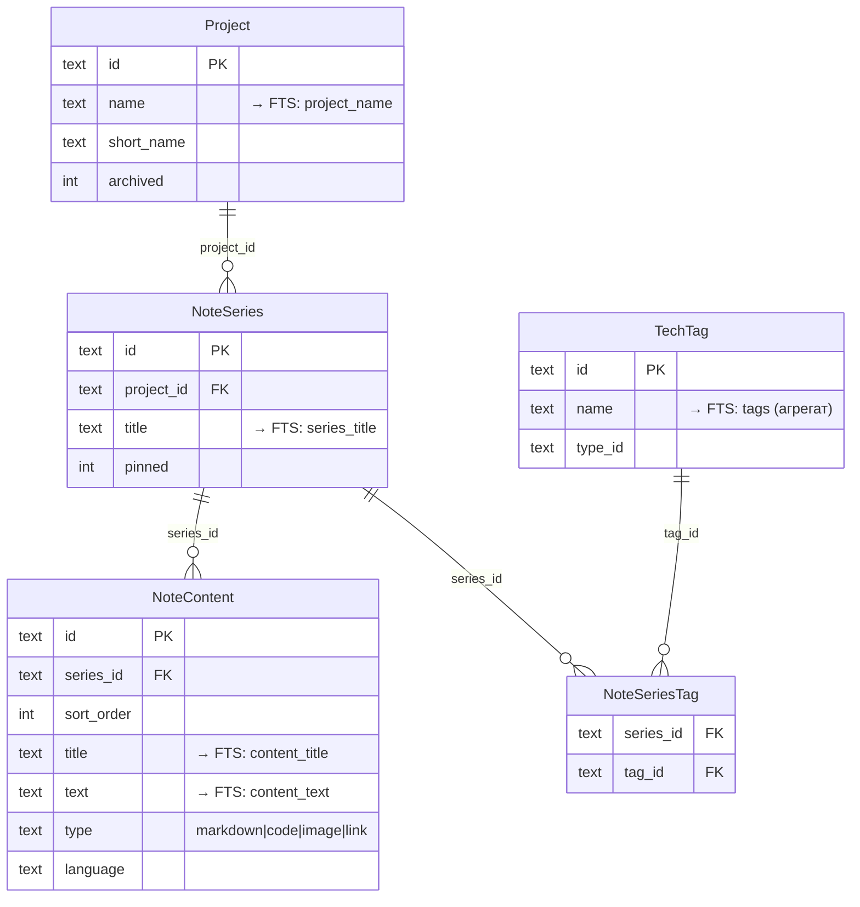

# 08 — Быстрый поиск (FTS5)

> **Что это за файл.** Инженерная спецификация подсистемы мгновенного полнотекстового поиска DEVNOTES. Описывает: устройство виртуальной таблицы **SQLite FTS5** (`notes_fts`) в режиме *external content*; какие поля индексируются (заголовки серий, заголовки и текст блоков, имена тегов, имена проектов) и как они сводятся в единый документ; триггеры инкрементальной поддержки индекса; ранжирование **bm25** с весами по полям; синтаксис пользовательских запросов (префиксы, фразы, булевы операторы, `NEAR`) и слой SQL-фильтров (проект / тег / тип блока / диапазон дат); подсветку совпадений через `snippet()` и `highlight()`; целевой SLA (`<100 мс` на `50k+` блоков) и как он достигается; интеграцию с командной палитрой `Ctrl/Cmd+K` и экраном глобального поиска; фолбэк на `LIKE` при повреждении/недоступности индекса; план бенчмарков и нагрузочных сценариев. Документ — источник правды по поиску; из него растут SQL-миграции индекса, Rust-репозиторий `SearchRepository` и TS-хук `useSearch`.

> **Статус:** проектирование · **Дата:** 2026-07-17 · **Язык:** русский, тон инженерный · **Область:** десктоп v1 (Windows / macOS / Linux).

---

## Связанные документы

Пути относительно `DevNotes/`. Канон именования, глоссарий и инварианты — `CLAUDE.md`.

| Документ | Назначение | Роль для этого файла |
| --- | --- | --- |
| [`CLAUDE.md`](../CLAUDE.md) | Конвенции, глоссарий, инварианты, DoD | Именование сущностей, UUID v7, UTC ISO 8601 |
| [`docs/01-VISION.md`](01-VISION.md) | Видение, персоны, WBS | Требование «мгновенный поиск по всей БД» |
| [`docs/02-SPECIFICATION.md`](02-SPECIFICATION.md) | Большое ТЗ | Функциональные требования к поиску |
| [`docs/03-FEATURES.md`](03-FEATURES.md) | Каталог фич MoSCoW | Фичи «FTS5-поиск», «командная палитра», «фильтры» |
| [`docs/04-ARCHITECTURE.md`](04-ARCHITECTURE.md) | Слои, Tauri IPC, sync-движок | Где живёт `SearchRepository`, контракт IPC-команды |
| [`docs/05-DATA-MODEL.md`](05-DATA-MODEL.md) | Доменная модель, полный DDL, `notes_fts` | Источник схемы таблиц-доноров индекса |
| [`docs/06-UI-UX.md`](06-UI-UX.md) | Дизайн-система, экраны, командная палитра | Потребитель результатов: UI поиска |

> Раздел про FTS5 в `05-DATA-MODEL.md` даёт «скелет» виртуальной таблицы; **этот файл — её полное, каноническое описание** (веса, триггеры, синтаксис, фолбэк, бенчмарки). При расхождении формулировок канон — `CLAUDE.md` и `consistencyNotes` из WBS.

---

## 1. Требования и границы

### 1.1 Что обязан делать поиск (из WBS `must`)

| # | Требование | Реализация |
| --- | --- | --- |
| П-1 | Мгновенный полнотекстовый поиск **по всей БД** | Единый индекс `notes_fts` над всеми текстовыми полями |
| П-2 | Индекс покрывает: заголовки серий, заголовки/текст блоков, имена тегов, имена проектов | 5 колонок FTS + агрегация тегов в один документ |
| П-3 | Ранжирование **bm25** с весами полей | `ORDER BY bm25(notes_fts, w1..w5)` |
| П-4 | Подсветка сниппетов | `snippet()` / `highlight()` |
| П-5 | Целевой SLA `<50 мс` на `10k` блоков (WBS), рабочая цель **`<100 мс` на `50k+`** | external content + инкрементальные триггеры + LIMIT |
| П-6 | Инкрементальная индексация (без полной переиндексации на каждое изменение) | Триггеры `AFTER INSERT/UPDATE/DELETE` |
| П-7 | Фильтры: проект / тег / тип блока / диапазон дат | Гибрид: FTS `MATCH` + SQL `WHERE` по донорским таблицам |
| П-8 | Интеграция с командной палитрой `Ctrl/Cmd+K` и глобальным поиском | Одна IPC-команда `search_query`, два режима вызова |

### 1.2 Границы (не входит в v1)

- Семантический / векторный поиск (embeddings) — WBS `could`, не MVP.
- Полноценная морфология русского языка (лемматизация) — компромисс через `trigram`, см. [§10](#10-русская-морфология-и-токенизация).
- Поиск внутри бинарных вложений (OCR по изображениям, парсинг PDF) — не индексируется, только имя файла `Attachment.file_name` в перспективе.
- Fuzzy-поиск с исправлением опечаток (Левенштейн) — только префикс `*` в v1.

### 1.3 Ключевое проектное решение

> **Индекс — денормализованная проекция домена.** `notes_fts` не является доменной сущностью (см. `CLAUDE.md`, entities). Это производная структура: строка индекса ≈ один **NoteContent** (блок), обогащённый заголовком его **NoteSeries**, именем **Project** и склеенными именами привязанных **TechTag**. Единица поискового результата — **блок (NoteContent)**, потому что именно блок несёт основной текст и на него ведёт навигация.

---

## 2. Модель донорских данных

Индекс собирается из пяти таблиц (полный DDL — в `05-DATA-MODEL.md`). Здесь — только поля, участвующие в поиске.



**Что индексируется и в какую колонку FTS попадает:**

| Источник (таблица.поле) | Колонка `notes_fts` | Гранулярность | Примечание |
| --- | --- | --- | --- |
| `NoteContent.text` | `content_text` | 1 строка = 1 блок | Основное тело; для `type='code'` — исходник как есть |
| `NoteContent.title` | `content_title` | 1 блок | Может быть `NULL` → пустая строка |
| `NoteSeries.title` | `series_title` | дублируется в каждый блок серии | Денормализация ради single-table search |
| `Project.name` | `project_name` | дублируется в каждый блок | `NULL` если серия без проекта |
| `GROUP_CONCAT(TechTag.name)` | `tags` | все теги серии, склеенные через пробел | Теги привязаны к серии, не к блоку |

> Поля-справочники (`NoteContentType.type`, `TechTagType.type`) в FTS **не** индексируются — по ним фильтруют через `WHERE`, а не `MATCH` (см. [§7](#7-фильтры-гибридный-поиск)).

---

## 3. Схема виртуальной таблицы FTS5

### 3.1 DDL индекса (external content)

Режим **external content** (`content='...'`) означает: FTS5 хранит только инвертированный индекс, а сами тексты остаются в донорских таблицах. Это экономит ~40–50 % места (нет дублирования текста) и делает индекс производным — его можно снести и пересобрать в любой момент.

```sql
-- Индекс строится над "плоским" представлением блока.
-- content='' + content_rowid не привязываем к одной таблице, т.к. документ
-- собирается из НЕСКОЛЬКИХ таблиц. Поэтому используем contentless-подобный
-- external content с ручным управлением rowid = целочисленный ключ блока.

-- 3.1.a Числовой rowid для блоков (FTS5 требует INTEGER rowid).
-- UUID v7 (TEXT) не годится как rowid → держим маппинг.
CREATE TABLE IF NOT EXISTS fts_docmap (
    rowid       INTEGER PRIMARY KEY,          -- автоинкремент, стабильный rowid для FTS
    content_id  TEXT NOT NULL UNIQUE,         -- NoteContent.id (UUID v7)
    series_id   TEXT NOT NULL,                -- денормализация для быстрых JOIN
    project_id  TEXT                          -- NULL если серия вне проекта
);

CREATE INDEX IF NOT EXISTS ix_fts_docmap_content ON fts_docmap(content_id);
CREATE INDEX IF NOT EXISTS ix_fts_docmap_series  ON fts_docmap(series_id);

-- 3.1.b Сама FTS5-таблица. 5 индексируемых колонок + UNINDEXED-служебные.
CREATE VIRTUAL TABLE IF NOT EXISTS notes_fts USING fts5(
    content_text,                 -- вес 1.0 (базовый)
    content_title,                -- вес выше
    series_title,                 -- вес выше
    project_name,                 -- вес средний
    tags,                         -- вес высокий (точное совпадение технологии — сильный сигнал)

    content_id   UNINDEXED,       -- NoteContent.id для навигации из результата
    series_id    UNINDEXED,       -- NoteSeries.id
    content_type UNINDEXED,       -- markdown|code|image|link (быстрый доступ без JOIN)

    tokenize = 'unicode61 remove_diacritics 2',
    prefix   = '2 3 4'            -- ускоряет префиксный поиск для 2..4-символьных префиксов
);
```

Пояснения к параметрам:

| Параметр | Значение | Зачем |
| --- | --- | --- |
| `tokenize='unicode61 remove_diacritics 2'` | Unicode-токенизатор, снятие диакритики | Базовый режим; латиница + кириллица по словоформам. `remove_diacritics 2` — корректная обработка составных символов |
| `prefix='2 3 4'` | Индексы префиксов длиной 2/3/4 | Запрос `dock*` бьёт по преднакопленному префикс-индексу, а не сканом словаря — важно для live-search в палитре |
| `UNINDEXED`-колонки | `content_id`, `series_id`, `content_type` | Возврат из результата без JOIN к домену — быстрее и меньше IPC |
| external content | документ склеивается триггерами | Нет дублирования текста; индекс — производная структура |

> **Почему свой `fts_docmap`, а не `content='NoteContent'`.** Классический external content привязывает FTS к **одной** таблице по её `rowid`. Наш документ — из пяти таблиц, а PK домена — `TEXT` (UUID v7), тогда как FTS5 `rowid` обязан быть `INTEGER`. `fts_docmap` даёт стабильный `INTEGER rowid ↔ content_id (UUID)` и одновременно денормализует `series_id`/`project_id` для дешёвых фильтров. Это осознанный размен: +1 таблица и +триггеры против единственного способа держать мультитабличный документ в одном FTS-индексе.

### 3.2 ASCII-схема потока данных

```
   ДОМЕН (snake_case, UUID v7)                 ИНДЕКС (производный)
 ┌───────────────────────────┐
 │ project(name)             │──┐
 ├───────────────────────────┤  │  триггеры        ┌──────────────────────────┐
 │ note_series(title)        │──┼── AFTER I/U/D ──▶ │ fts_docmap(rowid↔uuid)   │
 ├───────────────────────────┤  │   собирают       ├──────────────────────────┤
 │ note_content(title,text,  │──┤   плоский         │ notes_fts (FTS5)         │
 │              type)        │  │   документ        │  content_text            │
 ├───────────────────────────┤  │                  │  content_title           │
 │ tech_tag(name) ⨝          │──┘                  │  series_title            │
 │ note_series_tag           │                     │  project_name            │
 └───────────────────────────┘                     │  tags                    │
                                                    └────────────┬─────────────┘
        SELECT ... MATCH ? ORDER BY bm25(...) ◀─────────────────┘
```

---

## 4. Инкрементальная индексация (триггеры)

Индекс поддерживается **инкрементально**: каждое доменное изменение точечно правит одну-две строки FTS. Полная переиндексация — только при первичной инициализации, миграции токенизатора или восстановлении из фолбэка ([§9](#9-фолбэк-like-и-самолечение-индекса)).

### 4.1 Правило сборки строки индекса

Одна строка `notes_fts` соответствует одному блоку `note_content`. Её значения:

```sql
-- «Собери документ по content_id» — используется во всех триггерах.
-- Возвращает готовые значения для вставки/обновления в notes_fts.
WITH doc AS (
  SELECT
    nc.id                                   AS content_id,
    nc.series_id                            AS series_id,
    nc.type                                 AS content_type,
    COALESCE(nc.text, '')                   AS content_text,
    COALESCE(nc.title, '')                  AS content_title,
    COALESCE(ns.title, '')                  AS series_title,
    COALESCE(p.name, '')                    AS project_name,
    COALESCE((
        SELECT GROUP_CONCAT(tt.name, ' ')
        FROM note_series_tag nst
        JOIN tech_tag tt ON tt.id = nst.tag_id
        WHERE nst.series_id = ns.id
    ), '')                                  AS tags
  FROM note_content nc
  JOIN note_series ns ON ns.id = nc.series_id
  LEFT JOIN project  p ON p.id = ns.project_id
  WHERE nc.id = :content_id
)
SELECT * FROM doc;
```

### 4.2 Триггеры на `note_content` (основной источник)

```sql
-- INSERT блока: завести rowid в docmap, затем вставить документ в FTS.
CREATE TRIGGER IF NOT EXISTS trg_note_content_ai
AFTER INSERT ON note_content
BEGIN
    INSERT INTO fts_docmap(content_id, series_id, project_id)
    SELECT NEW.id, NEW.series_id,
           (SELECT project_id FROM note_series WHERE id = NEW.series_id);

    INSERT INTO notes_fts(
        rowid, content_text, content_title, series_title, project_name, tags,
        content_id, series_id, content_type)
    SELECT
        (SELECT rowid FROM fts_docmap WHERE content_id = NEW.id),
        COALESCE(NEW.text,''), COALESCE(NEW.title,''),
        COALESCE((SELECT title FROM note_series WHERE id = NEW.series_id),''),
        COALESCE((SELECT p.name FROM note_series ns LEFT JOIN project p ON p.id = ns.project_id
                  WHERE ns.id = NEW.series_id),''),
        COALESCE((SELECT GROUP_CONCAT(tt.name,' ') FROM note_series_tag nst
                  JOIN tech_tag tt ON tt.id = nst.tag_id
                  WHERE nst.series_id = NEW.series_id),''),
        NEW.id, NEW.series_id, NEW.type;
END;

-- UPDATE текстовых полей блока: external content FTS требует delete-then-insert.
CREATE TRIGGER IF NOT EXISTS trg_note_content_au
AFTER UPDATE OF text, title, type, series_id ON note_content
BEGIN
    INSERT INTO notes_fts(notes_fts, rowid) VALUES ('delete',
        (SELECT rowid FROM fts_docmap WHERE content_id = OLD.id));

    UPDATE fts_docmap
      SET series_id  = NEW.series_id,
          project_id = (SELECT project_id FROM note_series WHERE id = NEW.series_id)
      WHERE content_id = NEW.id;

    INSERT INTO notes_fts(
        rowid, content_text, content_title, series_title, project_name, tags,
        content_id, series_id, content_type)
    SELECT
        (SELECT rowid FROM fts_docmap WHERE content_id = NEW.id),
        COALESCE(NEW.text,''), COALESCE(NEW.title,''),
        COALESCE((SELECT title FROM note_series WHERE id = NEW.series_id),''),
        COALESCE((SELECT p.name FROM note_series ns LEFT JOIN project p ON p.id = ns.project_id
                  WHERE ns.id = NEW.series_id),''),
        COALESCE((SELECT GROUP_CONCAT(tt.name,' ') FROM note_series_tag nst
                  JOIN tech_tag tt ON tt.id = nst.tag_id
                  WHERE nst.series_id = NEW.series_id),''),
        NEW.id, NEW.series_id, NEW.type;
END;

-- DELETE блока: убрать из FTS и docmap.
CREATE TRIGGER IF NOT EXISTS trg_note_content_ad
AFTER DELETE ON note_content
BEGIN
    INSERT INTO notes_fts(notes_fts, rowid) VALUES ('delete',
        (SELECT rowid FROM fts_docmap WHERE content_id = OLD.id));
    DELETE FROM fts_docmap WHERE content_id = OLD.id;
END;
```

### 4.3 Триггеры на «родительские» поля

Изменение заголовка серии, имени проекта или набора тегов должно освежить **все** блоки, где эти поля денормализованы.

```sql
-- Переименование серии → обновить series_title во всех её блоках.
CREATE TRIGGER IF NOT EXISTS trg_note_series_title_au
AFTER UPDATE OF title, project_id ON note_series
BEGIN
    -- Пометить каскад: реиндексируем блоки серии батчем (см. §4.4).
    INSERT INTO fts_reindex_queue(content_id)
    SELECT id FROM note_content WHERE series_id = NEW.id;
END;

-- Переименование проекта → все блоки его серий.
CREATE TRIGGER IF NOT EXISTS trg_project_name_au
AFTER UPDATE OF name ON project
BEGIN
    INSERT INTO fts_reindex_queue(content_id)
    SELECT nc.id FROM note_content nc
    JOIN note_series ns ON ns.id = nc.series_id
    WHERE ns.project_id = NEW.id;
END;

-- Изменение набора тегов серии (привязка/отвязка) → блоки серии.
CREATE TRIGGER IF NOT EXISTS trg_series_tag_ai
AFTER INSERT ON note_series_tag
BEGIN
    INSERT INTO fts_reindex_queue(content_id)
    SELECT id FROM note_content WHERE series_id = NEW.series_id;
END;

CREATE TRIGGER IF NOT EXISTS trg_series_tag_ad
AFTER DELETE ON note_series_tag
BEGIN
    INSERT INTO fts_reindex_queue(content_id)
    SELECT id FROM note_content WHERE series_id = OLD.series_id;
END;

-- Переименование тега → все серии, где он привязан.
CREATE TRIGGER IF NOT EXISTS trg_tech_tag_name_au
AFTER UPDATE OF name ON tech_tag
BEGIN
    INSERT INTO fts_reindex_queue(content_id)
    SELECT nc.id FROM note_content nc
    JOIN note_series_tag nst ON nst.series_id = nc.series_id
    WHERE nst.tag_id = NEW.id;
END;
```

### 4.4 Очередь реиндексации (`fts_reindex_queue`)

Каскадные обновления (переименование проекта с сотнями блоков) не выполняются прямо в триггере — это раздуло бы транзакцию мутации родителя. Вместо этого блоки складываются в лёгкую очередь, а Rust-ядро **дренирует** её батчем сразу после коммита (в том же tick, синхронно для UX, но вне пользовательской транзакции).

```sql
CREATE TABLE IF NOT EXISTS fts_reindex_queue (
    content_id TEXT PRIMARY KEY          -- дедупликация «бесплатно» через PK
);
```

```
Rust: drain_reindex_queue()  (вызывается после каждой мутации-родителя)
  BEGIN IMMEDIATE;
    FOR content_id IN (SELECT content_id FROM fts_reindex_queue LIMIT 500):
        notes_fts('delete', rowid);          -- по docmap
        INSERT INTO notes_fts(...) SELECT <собрать документ>;  -- см. §4.1
    DELETE FROM fts_reindex_queue WHERE content_id IN (обработанные);
  COMMIT;
  -- повторять, пока очередь не пуста (батчи по 500)
```

> **Почему очередь, а не прямой каскад в триггере.** Переименование проекта — редкая операция, но может задеть тысячи блоков. Прямой каскадный `UPDATE notes_fts` внутри триггера родителя удлиняет пользовательскую транзакцию и блокирует БД. Очередь + батч-дренаж вне транзакции держит запись родителя мгновенной, а реиндекс — фоновым и идемпотентным (PK гасит дубли).

---

## 5. Ранжирование bm25 и веса полей

FTS5 отдаёт встроенную функцию `bm25(fts_table, w1, w2, ...)`, где `wN` — вес соответствующей колонки. Меньшее значение `bm25()` = более релевантно (это «стоимость», поэтому `ORDER BY bm25(...) ASC`).

### 5.1 Веса колонок (v1)

Порядок весов повторяет порядок колонок в DDL (`content_text, content_title, series_title, project_name, tags`).

| Колонка | Вес | Обоснование |
| --- | --- | --- |
| `content_title` | **10.0** | Совпадение в заголовке блока — сильнейший сигнал точного попадания |
| `series_title` | **8.0** | Заголовок темы — почти столь же значим |
| `tags` | **6.0** | Точное имя технологии (`Rust`, `EF Core`) — намеренный, узкий запрос |
| `project_name` | **4.0** | Контекстный сигнал, но проектов мало и имена общие |
| `content_text` | **1.0** | Базовый вес; тела блоков длинные, совпадение менее избирательно |

```sql
-- Канонический ORDER BY. Порядок аргументов = порядок колонок в CREATE VIRTUAL TABLE.
--            content_text, content_title, series_title, project_name, tags
ORDER BY bm25(notes_fts,   1.0,          10.0,          8.0,          4.0,         6.0) ASC
```

### 5.2 Дополнительные бусты на уровне SQL

bm25 отвечает за текстовую релевантность; продуктовые сигналы добавляем поверх как слагаемые к сортировочному ключу (меньше = выше):

```sql
SELECT
    f.content_id, f.series_id, f.content_type,
    bm25(notes_fts, 1.0, 10.0, 8.0, 4.0, 6.0)
      - (CASE WHEN ns.pinned = 1 THEN 2.0 ELSE 0 END)          -- закреплённые серии выше
      - (CASE WHEN nc.updated_at > :recent_cutoff THEN 1.0 ELSE 0 END)  -- свежие правки выше
      + (CASE WHEN p.archived = 1 THEN 5.0 ELSE 0 END)          -- архив ниже
      AS rank_score
FROM notes_fts f
JOIN note_content nc ON nc.id = f.content_id
JOIN note_series  ns ON ns.id = f.series_id
LEFT JOIN project p  ON p.id = ns.project_id
WHERE notes_fts MATCH :query
ORDER BY rank_score ASC
LIMIT :limit OFFSET :offset;
```

> Веса и коэффициенты бустов вынесены в `AppSetting` (`search.weights.*`), чтобы тюнинговать без миграции. Значения из таблицы выше — дефолты v1, зафиксированные до появления телеметрии кликов.

---

## 6. Синтаксис запросов

DEVNOTES принимает пользовательскую строку и транслирует её в валидный FTS5-`MATCH`. Есть два уровня: (а) то, что печатает пользователь; (б) во что это превращает парсер запроса перед `MATCH`.

### 6.1 Поддерживаемый синтаксис (пользователь)

| Возможность | Ввод пользователя | FTS5 `MATCH` | Пример |
| --- | --- | --- | --- |
| Простые слова (AND по умолчанию) | `docker volume` | `docker AND volume` | блоки, где есть оба слова |
| Префиксный поиск | `dock*` | `dock*` | `docker`, `dockerfile`, `docker-compose` |
| Точная фраза | `"clean architecture"` | `"clean architecture"` | слова подряд, в порядке |
| Логическое ИЛИ | `redis OR memcached` | `redis OR memcached` | любой из терминов |
| Исключение | `cache -redis` | `cache NOT redis` | `cache` без `redis` |
| Близость | `git NEAR/5 rebase` | `NEAR(git rebase, 5)` | слова в пределах 5 токенов |
| Поле-ограничение | `title: migration` | `{content_title series_title} : migration` | искать только в заголовках |
| Тег-ограничение | `tag: rust` | `tags : rust` | только по колонке тегов |
| Группировка | `(redis OR valkey) cache` | `(redis OR valkey) AND cache` | скобки |

### 6.2 Живой (live) режим командной палитры

Пока пользователь печатает в `Ctrl/Cmd+K`, последнее «слово» автоматически получает суффикс `*` (префиксный поиск), чтобы результаты появлялись до окончания ввода:

```
Ввод:        "docker net"
MATCH:        docker AND net*
Ввод:        "docker net "   (пробел = слово завершено)
MATCH:        docker AND net
```

Терм в кавычках или содержащий оператор не «префиксуется» автоматически.

### 6.3 Парсер запроса (защита от инъекций в MATCH)

Строка `MATCH` — это мини-язык; пользовательский ввод нельзя подставлять в него сырым (спецсимволы `"`, `*`, `(`, `:`, `-` ломают запрос или меняют семантику). Алгоритм трансляции:

```
1. Токенизировать ввод: [слова] | ["фразы"] | [операторы OR/NOT/NEAR] | [field:] | [(] [)]
2. Каждое СЛОВО, не являющееся оператором:
     - экранировать внутренние кавычки, обернуть в "..." если содержит небезопасные символы
     - в live-режиме добавить * к последнему слову
3. Операторы OR / NOT / NEAR/N — пропустить как есть (whitelist).
4. field: — сопоставить с whitelist полей (title→{content_title series_title}, tag→tags,
            code→content_text, project→project_name); неизвестное поле → трактовать как слово.
5. Собрать обратно в валидную MATCH-строку.
6. try_parse: пробный EXPLAIN/подготовка запроса; при ошибке FTS5 → фолбэк LIKE (§9).
```

> Правило: **любой** ввод обязан транслироваться в *синтаксически валидный* `MATCH` либо явно уходить в фолбэк. Пользователь не должен видеть `SQL error: fts5: syntax error`.

---

## 7. Фильтры (гибридный поиск)

Фильтры по проекту / тегу / типу блока / диапазону дат **не** выражаются через `MATCH` (кроме `tag:` как текстового сигнала) — они применяются как обычные SQL-предикаты по донорским таблицам и `UNINDEXED`-колонкам. Это и быстрее (индексы B-tree), и точнее (диапазоны дат в FTS невыразимы).

### 7.1 Полный шаблон запроса с фильтрами

```sql
SELECT
    f.content_id,
    f.series_id,
    f.content_type,
    snippet(notes_fts, 0, '⟦', '⟧', ' … ', 12) AS snippet_text,   -- по content_text
    bm25(notes_fts, 1.0, 10.0, 8.0, 4.0, 6.0)  AS bm25_score,
    nc.updated_at,
    ns.title  AS series_title,
    p.name    AS project_name
FROM notes_fts f
JOIN note_content nc ON nc.id = f.content_id
JOIN note_series  ns ON ns.id = f.series_id
LEFT JOIN project p  ON p.id = ns.project_id
WHERE notes_fts MATCH :match_query
  AND (:project_id  IS NULL OR ns.project_id = :project_id)
  AND (:content_type IS NULL OR f.content_type = :content_type)
  AND (:date_from   IS NULL OR nc.updated_at >= :date_from)   -- UTC ISO 8601, лексикограф. сравнение
  AND (:date_to     IS NULL OR nc.updated_at <  :date_to)
  AND (:tag_id IS NULL OR EXISTS (
        SELECT 1 FROM note_series_tag nst
        WHERE nst.series_id = ns.id AND nst.tag_id = :tag_id))
  AND (:archived_included = 1 OR p.archived IS NULL OR p.archived = 0)
ORDER BY bm25_score ASC
LIMIT :limit OFFSET :offset;
```

### 7.2 Таблица фильтров

| Фильтр | Параметр | Где применяется | Индекс-опора |
| --- | --- | --- | --- |
| По проекту | `:project_id` | `note_series.project_id` | `ix_note_series_project` |
| По типу блока | `:content_type` | `notes_fts.content_type` (UNINDEXED) | из FTS-строки, без JOIN |
| По диапазону дат | `:date_from` / `:date_to` | `note_content.updated_at` | `ix_note_content_updated` |
| По тегу | `:tag_id` | `EXISTS note_series_tag` | PK `(series_id, tag_id)` |
| Скрыть архив | `:archived_included` | `project.archived` | — |

> Диапазон дат работает по `updated_at` (UTC ISO 8601). Т.к. формат лексикографически = хронологически (`CLAUDE.md`, И-3), сравнение строк корректно и без парсинга дат. UI-виджет отдаёт границы в UTC; отображение — в локальной TZ.

### 7.3 Пустой запрос + только фильтры

Если пользователь не ввёл текст, но выбрал фильтры (например, «все блоки типа `code` проекта X за последнюю неделю») — `MATCH` пропускается, работает чистый SQL по домену с `ORDER BY nc.updated_at DESC`. Это режим «browse», а не «search», но точка входа та же.

---

## 8. Подсветка совпадений

Две встроенные функции FTS5:

| Функция | Назначение | Использование в DEVNOTES |
| --- | --- | --- |
| `snippet(fts, col, open, close, ellip, tokens)` | Фрагмент вокруг совпадения с маркерами и «…» | Список результатов: контекст находки в теле блока |
| `highlight(fts, col, open, close)` | Всё поле с обёрнутыми совпадениями | Открытый блок: подсветка всех вхождений |

```sql
-- Сниппет по телу блока (колонка 0 = content_text), окно ~12 токенов.
snippet(notes_fts, 0, '⟦', '⟧', ' … ', 12) AS body_snippet

-- Сниппет по заголовку блока (колонка 1), если совпало там.
snippet(notes_fts, 1, '⟦', '⟧', '',     32) AS title_snippet
```

**Контракт с UI:** ядро отдаёт нейтральные маркеры `⟦ … ⟧` (не HTML), фронт заменяет их на `<mark class="search-hit">`. Причина — эти же результаты рендерятся в командной палитре как plain-text и в списке как React-узлы; отдавать сырой HTML из ядра небезопасно (XSS через содержимое заметки) и негибко. Замена делается на TS через безопасный сплиттер, не `dangerouslySetInnerHTML`.

```
Пример строки результата (палитра):
  [code] Dockerfile multi-stage · Проект: DEVNOTES
  … используем ⟦docker⟧ buildx для ⟦docker⟧ multi-stage сборки …
         ▲ подсветка неоново-зелёным (#22c55e), см. 06-UI-UX
```

Токен-окно (`12`) и маркеры вынесены в `AppSetting`.

---

## 9. Фолбэк `LIKE` и самолечение индекса

FTS5 может быть недоступен: повреждение индекса, сбой миграции токенизатора, рассинхрон после ручного вмешательства в БД, теоретически — сборка SQLite без FTS5 (в Tauri-бандле мы линкуем `rusqlite` с `bundled` + фичей `fts5`, так что последнее исключено, но защищаемся).

### 9.1 Детектирование и деградация

```
search_query(q, filters):
    if fts_healthy():
        try:
            return fts_search(q, filters)     # основной путь
        except SqliteError as e:
            log.warn("FTS5 failed, degrading to LIKE", e)
            set_fts_unhealthy()               # флаг в SyncState/AppSetting
            return like_search(q, filters)
    else:
        return like_search(q, filters)         # деградированный путь
```

### 9.2 Запрос-фолбэк на `LIKE`

Медленнее (полный скан + `LIKE '%...%'` не использует индекс), без ранжирования bm25, но функционально возвращает результаты. Каждое слово ввода → `AND`-условие по нескольким полям:

```sql
SELECT nc.id AS content_id, nc.series_id, nc.type AS content_type,
       nc.title, substr(nc.text, 1, 200) AS preview, nc.updated_at
FROM note_content nc
JOIN note_series ns ON ns.id = nc.series_id
LEFT JOIN project p ON p.id = ns.project_id
WHERE (nc.text LIKE :w1 OR nc.title LIKE :w1 OR ns.title LIKE :w1 OR p.name LIKE :w1)
  AND (nc.text LIKE :w2 OR nc.title LIKE :w2 OR ns.title LIKE :w2 OR p.name LIKE :w2)
  -- ... по числу слов (ограничить, напр., 6)
  AND (:project_id IS NULL OR ns.project_id = :project_id)
  AND (:content_type IS NULL OR nc.type = :content_type)
  AND (:date_from IS NULL OR nc.updated_at >= :date_from)
  AND (:date_to   IS NULL OR nc.updated_at <  :date_to)
ORDER BY nc.updated_at DESC
LIMIT :limit;
```

- `:wN` = `'%' || escape_like(word) || '%'` (экранирование `%`, `_`, `\` через `ESCAPE '\'`).
- Ранжирование заменяется на «свежесть» (`updated_at DESC`) — честный компромисс.
- UI показывает бейдж «поиск в режиме совместимости» + кнопку «Пересобрать индекс».

### 9.3 Пересборка индекса

```sql
-- Полная пересборка external-content FTS5 (после ремонта/миграции токенизатора).
INSERT INTO notes_fts(notes_fts) VALUES ('rebuild');   -- встроенная команда FTS5
-- Для нашего мультитабличного случая 'rebuild' недостаточен (нет привязки content=)
-- → выполняем ручную пересборку:
--   1) DELETE FROM notes_fts;  DELETE FROM fts_docmap;
--   2) INSERT INTO fts_docmap(...) SELECT ... FROM note_content;
--   3) INSERT INTO notes_fts(...) SELECT <документ по §4.1> FROM note_content;
-- Обёрнуто в одну транзакцию; прогресс-бар в UI; после успеха set_fts_healthy().
```

Целостность индекса также проверяется командой `INSERT INTO notes_fts(notes_fts, rank) VALUES('integrity-check', ...)` при старте приложения (дёшево) и после восстановления из snapshot/бэкапа.

---

## 10. Русская морфология и токенизация

**Проблема (WBS-риск).** `unicode61` токенизирует по границам символов и приводит к нижнему регистру, но **не** делает стемминг/лемматизацию. Запрос `миграция` не найдёт `миграции`, `миграций`, `миграцию`. Для инженерных заметок на русском это ощутимо.

**Решение v1 — двойная стратегия:**

| Стратегия | Токенизатор | Плюсы | Минусы |
| --- | --- | --- | --- |
| Основная | `unicode61 remove_diacritics 2` | Малый индекс, точные совпадения, отлично для кода/латиницы | Нет морфологии русского |
| Fallback-широкий | `trigram` (второй индекс `notes_fts_tri`) | Находит подстроки/словоформы, устойчив к окончаниям и опечаткам | Индекс крупнее (в 2–4×), больше шума, `MATCH` только от 3 символов |

**Как совмещаем:** основной запрос идёт по `unicode61`-индексу. Если он вернул `0` результатов, а длина запроса ≥ 3 символов, автоматически повторяем по `trigram`-индексу (`notes_fts_tri`) и помечаем результаты как «нестрогое совпадение». Пользователь может форсировать trigram-режим переключателем «расширенный поиск» (`~` перед словом в строке ввода).

```sql
CREATE VIRTUAL TABLE IF NOT EXISTS notes_fts_tri USING fts5(
    content_text, content_title, series_title, project_name, tags,
    content_id UNINDEXED, series_id UNINDEXED, content_type UNINDEXED,
    tokenize = 'trigram'
);
-- Поддерживается теми же триггерами (записываем в обе таблицы), либо
-- отдельным набором триггеров. Размер/скорость — см. бенчмарки §12.
```

> **Компромисс честно.** Держать два индекса — это ~+30–40 % к размеру индекса и удвоение работы триггеров на запись. Для v1 это приемлемо: запись заметки редка относительно чтения, а морфология русского критична для UX. Полноценная лемматизация (словарь + `snowball`/`mystem`) — кандидат в `could`/v2, требует нативной зависимости и увеличивает бандл.

---

## 11. Интеграция: командная палитра и глобальный поиск

Один бэкенд (`search_query`) — два UI-потребителя. Детали экранов — в `06-UI-UX.md`.

### 11.1 Единая IPC-команда (Tauri)

```
// Rust-сторона, слой Interfaces → Infrastructure(DB)
#[tauri::command]
fn search_query(req: SearchRequest) -> SearchResponse

SearchRequest {
    query:        String,               // сырой пользовательский ввод
    mode:         "palette" | "global", // palette → авто-префикс последнего слова
    project_id:   Option<Uuid>,
    tag_id:       Option<Uuid>,
    content_type: Option<"markdown"|"code"|"image"|"link">,
    date_from:    Option<String>,       // UTC ISO 8601
    date_to:      Option<String>,
    include_archived: bool,
    limit:        u32,                  // палитра: 8; глобальный: 50
    offset:       u32,                  // пагинация только для global
}

SearchResponse {
    items: Vec<SearchHit>,              // content_id, series_id, type, title,
                                        // snippet(маркеры ⟦⟧), project_name, updated_at, score, strict:bool
    total_estimate: u32,
    engine: "fts_unicode" | "fts_trigram" | "like",  // для бейджа режима
    elapsed_ms: f32,                    // телеметрия SLA
}
```

### 11.2 Командная палитра `Ctrl/Cmd+K`

- Режим `palette`, `limit=8`, live-префикс последнего слова ([§6.2](#62-живой-live-режим-командной-палитры)).
- Debounce ввода **120 мс**; отмена «в полёте» предыдущего запроса (последний выигрывает).
- Секции результата: **Заметки** (FTS-хиты) · **Переходы** (проект/серия по имени) · **Действия** (создать заметку, переключить тему, синхронизировать) — см. WBS `must`.
- Enter по хиту → навигация к блоку (`content_id`) с прокруткой и `highlight()` в открытом блоке.

### 11.3 Экран глобального поиска

- Режим `global`, `limit=50`, пагинация через `offset`.
- Левая панель — фасеты-фильтры (проект / тег / тип / даты), синхронизированы с URL-состоянием (React Router) для «шаримых» внутри приложения ссылок на поиск.
- Виртуализация списка (`react-virtual`) — снимает риск IPC/DOM на больших выдачах (WBS-риск про IPC).
- TanStack Query: `queryKey = searchKeys.query(normalizedRequest)`; кеш по нормализованному запросу, `keepPreviousData` для плавной пагинации. Repository-pattern + генераторы query-key — как в Portfolio (`CLAUDE.md`).

```
searchKeys = {
  all:            ['search'] as const,
  query: (req) => ['search', 'query', normalize(req)] as const,
}
```

---

## 12. Производительность и план бенчмарков

### 12.1 Целевые показатели (SLA)

| Метрика | Цель WBS | Рабочая цель (этот док) | Условие |
| --- | --- | --- | --- |
| Латентность запроса (p50) | `<50 мс` @ 10k блоков | `<20 мс` @ 10k | тёплый кеш, unicode61, LIMIT 50 |
| Латентность запроса (p95) | — | `<100 мс` @ **50k+** блоков | холодный старт после открытия БД |
| Latency палитры (live, p95) | — | `<80 мс` | debounce 120 мс сверху не в счёт |
| Инкрементальная индексация 1 блока | — | `<5 мс` | INSERT/UPDATE + триггер |
| Каскад (переименование проекта, 1000 блоков) | — | `<300 мс` фоном | батч-дренаж очереди |
| Размер индекса | — | `≤ 60 %` от размера текстов (unicode61) | external content |

### 12.2 Факторы, обеспечивающие SLA

1. **External content** — индекс компактен, влезает в page cache.
2. **`prefix='2 3 4'`** — префиксный live-поиск без скана словаря.
3. **`LIMIT` + `bm25` top-N** — не материализуем всю выдачу.
4. **UNINDEXED-колонки** (`content_id`, `series_id`, `content_type`) — минимум JOIN на горячем пути.
5. **PRAGMA** соединения: `journal_mode=WAL`, `synchronous=NORMAL`, `cache_size=-16000` (16 МБ), `mmap_size` на чтение, `temp_store=MEMORY`.
6. **Один long-lived коннекшн на чтение** в Rust (пул), prepared statements закешированы.

### 12.3 План бенчмарков

**Генератор данных (fixture):** синтетический корпус — `N ∈ {1k, 10k, 50k, 100k}` блоков, распределение: ~200 проектов, ~5k серий, средний блок 800–1500 символов, смесь ru/en текста и код-блоков, 40 тегов. Сид фиксирован для воспроизводимости.

**Сценарии измерений:**

| # | Сценарий | Что меряем | Порог провала |
| --- | --- | --- | --- |
| Б-1 | Одно частое слово (`docker`) | p50/p95 латентность | p95 > 100 мс @ 50k |
| Б-2 | Двухсловный AND (`docker volume`) | p95 | > 100 мс @ 50k |
| Б-3 | Префикс live (`dock*`) | p95, число хитов | > 100 мс |
| Б-4 | Фраза (`"clean architecture"`) | p95 | > 120 мс |
| Б-5 | Редкое слово (1–2 хита) | p95 (worst-case скан) | > 100 мс |
| Б-6 | Частое слово + 3 фильтра | p95 | > 120 мс |
| Б-7 | Только фильтры (browse, пустой MATCH) | p95 | > 150 мс |
| Б-8 | trigram-фолбэк (`~миграц`) | p95, размер индекса | > 200 мс |
| Б-9 | Инкрементальный INSERT блока | latency триггера | > 5 мс |
| Б-10 | Каскад переименования проекта (1000 блоков) | время дренажа очереди | > 300 мс |
| Б-11 | Пересборка индекса @ 50k | время rebuild | > 10 с |
| Б-12 | `LIKE`-фолбэк (деградация) @ 50k | p95 (референс «как плохо без FTS») | информативный, не gate |

**Инструментарий:**

- Rust: `criterion` для микробенчей SQL-путей (prepared statement → fetch → map).
- E2E: замер `elapsed_ms` из `SearchResponse` в реальном IPC-цикле (включает сериализацию Tauri) — отдельно от чистого SQL, чтобы отловить IPC-оверхед (WBS-риск).
- Прогон в CI на Ubuntu (WebKitGTK-риск: меряем и рендер-латентность списка, не только SQL).
- Метрики пишутся в CSV, строится p50/p95/p99; регрессия > 20 % относительно baseline валит CI.

**Матрица платформ:** Windows (SQLite bundled), macOS, Ubuntu 22.04 — идентичный fixture, сравнение абсолютных чисел (WebView Linux — отдельная колонка отчёта).

### 12.4 Наблюдаемость в проде (локально)

- `elapsed_ms` и `engine` каждого запроса пишутся в кольцевой буфер в памяти; экран «Диагностика» показывает распределение латентностей и долю фолбэков — без отправки куда-либо (local-first, приватность).
- Порог-алерт в UI: если p95 сессии > 100 мс → мягкое предложение «Оптимизировать БД» (`VACUUM` + `rebuild` индекса).

---

## 13. Чек-лист Definition of Done (поиск)

- [ ] `notes_fts` (+ `fts_docmap`) создаётся версионируемой миграцией; `PRAGMA foreign_keys=ON`.
- [ ] Триггеры на `note_content` (I/U/D) поддерживают индекс инкрементально; проверено юнит-тестами на равенство «домен ↔ индекс».
- [ ] Каскадные триггеры (проект/серия/тег) наполняют `fts_reindex_queue`; дренаж идемпотентен и батчится.
- [ ] Веса bm25 (`10/8/6/4/1`) вынесены в `AppSetting`; бусты pinned/recent/archived применяются.
- [ ] Парсер запроса покрывает префикс/фразу/`OR`/`NOT`/`NEAR`/`field:`; любой ввод → валидный `MATCH` или фолбэк; тесты на инъекции спецсимволов.
- [ ] Фильтры проект/тег/тип/даты работают как SQL-предикаты; пустой-MATCH browse-режим.
- [ ] `snippet()`/`highlight()` отдают нейтральные маркеры; UI подсвечивает без `dangerouslySetInnerHTML`.
- [ ] Фолбэк `LIKE` + детект нездоровья индекса + ручная пересборка + integrity-check при старте.
- [ ] trigram-фолбэк для русской морфологии; переключатель «расширенный поиск».
- [ ] IPC-команда `search_query` (palette/global), TanStack Query + query-key генераторы.
- [ ] Бенчмарки Б-1…Б-12 в CI на Win/macOS/Ubuntu; регресс-гейт 20 %; SLA p95 `<100 мс` @ 50k подтверждён.

---

> **Резюме.** Поиск DEVNOTES — единый FTS5-индекс `notes_fts` (external content) над блоками, обогащёнными заголовками серий/проектов и тегами; поддерживается инкрементальными триггерами и очередью каскадов; ранжируется bm25 с полевыми весами и продуктовыми бустами; принимает богатый синтаксис поверх безопасного парсера; фильтруется SQL-предикатами по домену; подсвечивается `snippet()`; деградирует на `LIKE` при сбое и на `trigram` для русской морфологии; держит p95 `<100 мс` на 50k+ блоков, что подтверждается матрицей бенчмарков в CI.
