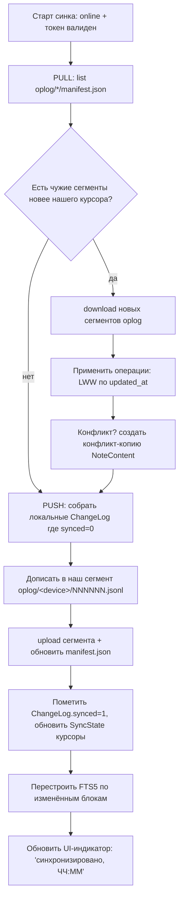

# 09 — Интеграция с Яндекс.Диском

> **Что это за файл.** Каноническое описание облачной синхронизации DEVNOTES с **Яндекс.Диском**: обзор двух транспортов (**Cloud REST API** и **WebDAV**) и выбор основного; аутентификация **OAuth 2.0 Authorization Code + PKCE** на десктопе (регистрация приложения в Яндекс OAuth, scope `cloud_api:disk.app_folder`, поток через **loopback-redirect**, безопасное хранение токенов в **системном keychain** через `keyring`, обновление токена). Модель хранения в облаке: разбор варианта A (синк живого файла БД) и варианта B (экспорт markdown-файлов), обоснование **гибрида**: локальный SQLite — источник истины, в облако едет только **oplog (ChangeLog) + периодический snapshot**, живой файл БД **никогда** не синкается. Стратегия синхронизации: pull/push дельт по `updated_at`, разрешение конфликтов **LWW на уровне `NoteContent` + конфликт-копия**, офлайн-очередь операций, индикаторы статуса. Обработка ошибок сети и лимитов API, приватность и безопасность, псевдокод ключевых операций (`upload` / `download` / `list`). Документ — источник правды по синхронизации; структура `ChangeLog`/`SyncState`/`Attachment` описана в `05-DATA-MODEL.md`, место sync-движка в слоях — в `04-ARCHITECTURE.md`.

> **Стадия:** проектирование · **Дата:** 2026-07-17 · **Язык:** русский, тон инженерный · **Область:** десктоп v1 (Windows / macOS / Linux).

---

## Связанные документы

Пути указаны относительно `DevNotes/`. Канон именования, глоссарий и инварианты — в `CLAUDE.md`.

| Документ | Тема | Роль для этого файла |
| --- | --- | --- |
| [`CLAUDE.md`](../CLAUDE.md) | Конвенции, зафиксированные архитектурные решения | Источник инвариантов (oplog, UUID v7, UTC, LWW) |
| [`docs/01-VISION.md`](01-VISION.md) | Видение, персоны, scope MoSCoW | «Зачем» синк вообще нужен (бэкап + мультидевайс) |
| [`docs/02-SPECIFICATION.md`](02-SPECIFICATION.md) | Большое ТЗ | Функциональные требования к синку |
| [`docs/03-FEATURES.md`](03-FEATURES.md) | Каталог фич MoSCoW | Приоритет фич синка/бэкапа |
| [`docs/04-ARCHITECTURE.md`](04-ARCHITECTURE.md) | Слои Clean Architecture, IPC, sync-движок | Куда встаёт `SyncService`, IPC-команды |
| [`docs/05-DATA-MODEL.md`](05-DATA-MODEL.md) | Доменная модель, DDL, `ChangeLog`/`SyncState`/`Attachment` | Структуры, которыми оперирует синк |
| [`docs/07-TECH-STACK.md`](07-TECH-STACK.md) | Стек: reqwest, keyring, Tauri | Инструменты транспорта и хранения секретов |
| [`docs/08-SEARCH.md`](08-SEARCH.md) | FTS5, bm25 | Индекс перестраивается после применения дельт |
| [`docs/06-UI-UX.md`](06-UI-UX.md) | Дизайн-токены, компоненты | Внешний вид индикаторов статуса синка |
| `docs/11-ADR/` (план) | Architecture Decision Records | Формальные ADR: «oplog, не файл БД», «REST vs WebDAV» |

> Ссылки на ещё не созданные файлы — плановые (стадия проектирования). При расхождении формулировок канон — `CLAUDE.md` и `consistencyNotes` из WBS.

---

## 1. Резюме решения (TL;DR)

| Вопрос | Решение | Одной фразой |
| --- | --- | --- |
| **Транспорт** | Cloud **REST API** (основной) + **WebDAV** (запасной канал/ручной бэкап) | REST — богаче, отдаёт ревизии и полупотоковую загрузку; WebDAV — fallback и совместимость |
| **Аутентификация** | OAuth 2.0 **Authorization Code + PKCE**, loopback-redirect | Десктоп без client_secret, код обменивается на токен на `127.0.0.1` |
| **Scope** | `cloud_api:disk.app_folder` | Доступ **только** к папке приложения `app:/`, не ко всему диску |
| **Хранение токенов** | Системный keychain через `keyring` | Никогда не в файле/БД; refresh-токен переживает перезапуск |
| **Что синкается** | **oplog (`ChangeLog`) + периодический snapshot БД**, вложения (`Attachment`) по хэшу | Живой файл `devnotes.db` в облако **не** едет никогда |
| **Дельты** | По `updated_at` (UTC ISO 8601) + курсоры в `SyncState` | Тянем/шлём только изменения с последней синхронизации |
| **Конфликты** | **LWW по `updated_at`** на уровне `NoteContent` + **конфликт-копия** | Проигравшая версия не теряется молча — создаётся копия и UI-пометка |
| **Офлайн** | Локальная очередь операций (тот же `ChangeLog`, `synced=0`) | Всё работает офлайн, выгрузка при появлении сети |

**Главный инвариант (риск №1 из WBS):** синхронизация файла SQLite целиком между двумя устройствами гарантированно ведёт к потере данных. Поэтому источник истины — локальная БД, а через облако передаётся **только журнал изменений** (idempotent-операции с UUID v7) и **snapshot'ы для восстановления**. Это решение обязательно для всех документов.

---

## 2. Обзор транспортов: REST API vs WebDAV

Яндекс.Диск предоставляет два независимых интерфейса поверх одного хранилища.

| Критерий | Cloud REST API (`cloud-api.yandex.net`) | WebDAV (`webdav.yandex.ru`) |
| --- | --- | --- |
| Базовый URL | `https://cloud-api.yandex.net/v1/disk` | `https://webdav.yandex.ru` |
| Протокол | HTTP+JSON, свои методы | Расширение HTTP (PROPFIND/PUT/MKCOL/COPY/MOVE) |
| Авторизация | OAuth 2.0 `Authorization: OAuth <token>` | Basic (логин/пароль приложения) **или** OAuth Bearer |
| App folder scope | Да — `cloud_api:disk.app_folder`, путь `app:/` | Нет отдельного app-scope: даёт весь диск |
| Загрузка файла | 2 шага: получить upload-URL → `PUT` на него | Прямой `PUT /path` |
| Скачивание | 2 шага: получить download-URL → `GET` | Прямой `GET /path` |
| Ревизии/метаданные | Богатые: `revision`, `md5`, `sha256`, `modified`, `size` | Бедные: `getlastmodified`, `getcontentlength`, `getetag` |
| Листинг | `GET /resources?path=&limit=&offset=` (пагинация) | `PROPFIND` c `Depth: 1` (XML) |
| Лимиты/квоты | Явные HTTP 429 + заголовки; операции-статусы (async) | Менее предсказуемо |
| Доступность | Основной публичный API | Поддерживается, но «legacy»-ощущение |

**Вывод.** Основной транспорт — **REST API** (богатые метаданные, app-folder scope, предсказуемые лимиты и OAuth-first). **WebDAV** оставляем как:
1. запасной канал синхронизации через `WebDAV-абстракцию` (см. WBS «could»: Nextcloud/Диск по WebDAV);
2. канал ручного бэкапа/восстановления, если у пользователя нет доступа к REST (риск №3: недоступность сервиса вне РФ).

Обе реализации прячутся за одним доменным интерфейсом `CloudProvider` (см. §9), UI и UseCases не знают, какой транспорт активен.

### 2.1. Используемые методы REST API

| Операция | Метод | Назначение в DEVNOTES |
| --- | --- | --- |
| Метаданные ресурса | `GET /v1/disk/resources?path=app:/…` | Проверить существование/ревизию файла в облаке |
| Листинг папки | `GET /v1/disk/resources?path=app:/oplog&limit=&offset=` | Получить список сегментов oplog / snapshot'ов |
| Получить URL для загрузки | `GET /v1/disk/resources/upload?path=&overwrite=` | Шаг 1 выгрузки файла |
| Загрузить содержимое | `PUT <href из шага 1>` (тело файла) | Шаг 2 выгрузки |
| Получить URL для скачивания | `GET /v1/disk/resources/download?path=` | Шаг 1 скачивания |
| Скачать содержимое | `GET <href из шага 1>` | Шаг 2 скачивания |
| Создать папку | `PUT /v1/disk/resources?path=app:/…` | Инициализация раскладки при первом синке |
| Удалить | `DELETE /v1/disk/resources?path=&permanently=` | Ротация старых snapshot'ов |
| Инфо о диске | `GET /v1/disk` | Свободное место перед выгрузкой snapshot |

---

## 3. Аутентификация OAuth 2.0

### 3.1. Регистрация приложения

Один раз на [oauth.yandex.ru](https://oauth.yandex.ru) регистрируется OAuth-приложение DEVNOTES.

| Параметр | Значение | Комментарий |
| --- | --- | --- |
| Тип приложения | Нативное (десктоп) | Без надёжного хранения `client_secret` |
| Client ID | публичный, зашивается в бинарь | Не является секретом |
| Client Secret | **не используется в потоке** | На десктопе секрет нельзя защитить → берём **PKCE** вместо secret |
| Права (scope) | `cloud_api:disk.app_folder` | Только папка приложения |
| Redirect URI | `http://127.0.0.1:<port>/callback` | Loopback; порт динамический (см. §3.3) |

> **Почему PKCE, а не classic Authorization Code + secret.** Десктоп-бинарь распространяется публично; любой `client_secret`, вшитый в него, извлекается тривиально. RFC 8252 («OAuth 2.0 for Native Apps») прямо требует PKCE и loopback/custom-scheme redirect. Секрет не участвует в обмене кода на токен.

### 3.2. Scope: почему только `app_folder`

`cloud_api:disk.app_folder` ограничивает приложение единственной папкой `Приложения/DEVNOTES` (в API — виртуальный путь `app:/`). Приложение **физически не может** прочитать или испортить остальные файлы диска пользователя. Это ключ к разделу «Приватность» (§8): минимизация прав по умолчанию.

Раскладка внутри app-folder:

```
app:/                            (= Приложения/DEVNOTES)
├── oplog/                       журнал изменений (источник синка)
│   ├── <device_id>/            сегменты по устройству — нет конфликтов записи
│   │   ├── 000001.jsonl
│   │   ├── 000002.jsonl
│   │   └── manifest.json       {last_seq, updated_at, checksum}
│   └── ...
├── snapshots/                   периодические бэкапы БД (VACUUM INTO)
│   ├── 2026-07-17T03-00-00Z.sqlite.zst
│   └── latest.json             указатель на актуальный snapshot
├── attachments/                 вложения, content-addressable
│   └── ab/cd/abcdef…​.bin        первые байты sha256 → шардинг
└── meta.json                    версия схемы, формат oplog, ревизия
```

> **Разделение oplog по `device_id`** — сознательное: каждое устройство пишет только в свою подпапку, поэтому две машины никогда не перезаписывают один файл в облаке. Слияние происходит при чтении (каждый читает чужие сегменты). Это устраняет конфликты на уровне файлов и сводит их к доменному LWW (§6).

### 3.3. Поток авторизации на десктопе (loopback)

Tauri-приложение не имеет серверного redirect-эндпоинта, поэтому поднимает **временный localhost-HTTP-сервер** на свободном порту и туда принимает `code`.

```mermaid
sequenceDiagram
    participant U as Пользователь
    participant App as DEVNOTES (Rust-ядро)
    participant Loop as loopback 127.0.0.1:port
    participant Browser as Системный браузер
    participant Y as Яндекс OAuth

    App->>App: сгенерировать code_verifier (43-128 симв.)
    App->>App: code_challenge = BASE64URL(SHA256(code_verifier))
    App->>Loop: поднять HTTP-сервер на свободном порту
    App->>Browser: открыть authorize?client_id&scope&code_challenge&redirect_uri&state
    Browser->>Y: пользователь логинится и подтверждает доступ
    Y-->>Browser: 302 redirect → 127.0.0.1:port/callback?code&state
    Browser->>Loop: GET /callback?code=…&state=…
    Loop->>App: передать code (сверив state от CSRF)
    App->>Loop: остановить HTTP-сервер, показать «можно закрыть вкладку»
    App->>Y: POST /token (grant=authorization_code, code, code_verifier, client_id)
    Y-->>App: { access_token, refresh_token, expires_in }
    App->>App: сохранить токены в системный keychain (keyring)
```

**Параметры запроса на `https://oauth.yandex.ru/authorize`:**

| Параметр | Значение |
| --- | --- |
| `response_type` | `code` |
| `client_id` | публичный Client ID |
| `redirect_uri` | `http://127.0.0.1:<port>/callback` |
| `scope` | `cloud_api:disk.app_folder` |
| `code_challenge` | `BASE64URL(SHA256(code_verifier))` |
| `code_challenge_method` | `S256` |
| `state` | случайный nonce (защита от CSRF, сверяется в callback) |

**Обмен кода на токен — `POST https://oauth.yandex.ru/token`:**

```
grant_type=authorization_code
&code=<code>
&code_verifier=<code_verifier>
&client_id=<client_id>
&redirect_uri=http://127.0.0.1:<port>/callback
```

Ответ:

```json
{
  "access_token": "y0_Ag…",
  "token_type": "bearer",
  "expires_in": 31536000,
  "refresh_token": "1:…"
}
```

> **Мера безопасности loopback:** сервер слушает строго `127.0.0.1` (не `0.0.0.0`), принимает ровно один запрос на `/callback`, проверяет `state`, затем немедленно останавливается. Порт выбирается через bind на `:0` (ОС выдаёт свободный) и подставляется в `redirect_uri` до открытия браузера.

### 3.4. Хранение токенов в системном keychain

Токены **никогда** не пишутся в SQLite, файлы или логи. Используется crate `keyring` (см. `07-TECH-STACK.md`), маппящийся на нативные хранилища:

| ОС | Хранилище |
| --- | --- |
| Windows | Windows Credential Manager |
| macOS | Keychain |
| Linux | Secret Service (GNOME Keyring / KWallet) через D-Bus |

Ключи: `service = "devnotes"`, `account = "yandex.access_token"` и `"yandex.refresh_token"`. В самой БД (`SyncState`) хранится **только** нечувствительная метаинформация: `token_expires_at`, `account_login` (для отображения «вы вошли как …»), но не сами токены.

> **Linux-нюанс:** headless-окружение (CI, серверный Linux без keyring-демона) может не иметь Secret Service. На этот случай — явная ошибка «keychain недоступен» + подсказка настроить `gnome-keyring`/`kwallet`; молчаливый fallback в файл **запрещён**.

### 3.5. Обновление токена (refresh)

`access_token` Яндекса живёт долго (обычно ~1 год), но обрабатываем истечение честно:

```
Перед каждым сетевым вызовом:
  if now >= token_expires_at - 60s:
      refresh()

refresh():
  POST /token
    grant_type=refresh_token
    &refresh_token=<из keychain>
    &client_id=<client_id>
  → сохранить новый access_token (+ refresh_token, если пришёл) в keychain
  → обновить token_expires_at в SyncState

Если refresh вернул 400/401 (invalid_grant):
  → пометить учётку как «требует повторного входа»
  → UI: баннер «Переавторизуйтесь в Яндекс.Диске»
  → синк переходит в офлайн-режим (данные не теряются, копятся в ChangeLog)
```

Реактивная стратегия дополняет проактивную: получив `401` на реальном запросе, делаем один `refresh()` и **однократный** ретрай.

---

## 4. Модель хранения в облаке: A vs B vs гибрид

### 4.1. Вариант A — синхронизация единого файла БД SQLite

Заливать `devnotes.db` целиком в облако и качать обратно.

| Плюсы | Минусы |
| --- | --- |
| Тривиально реализовать | **Гарантированная потеря данных** при двух устройствах: тот, кто залил последним, затирает чужие изменения |
| Один артефакт | Нет мерджа на уровне записей — только «весь файл или ничего» |
| — | Большой трафик: любая правка = перезалив всего файла (мегабайты) |
| — | Риск залить файл в момент открытой транзакции → битый бэкап |
| — | Конфликты неразрешимы: SQLite-файл нельзя «слить» построчно |

**Вердикт: запрещён как механизм синхронизации** (риск №1 из WBS). Допустим только как **read-only snapshot для восстановления** (§4.3).

### 4.2. Вариант B — экспорт заметок как markdown-файлов

Каждую `NoteSeries` писать в облако как `.md`-файл, синкать пофайлово.

| Плюсы | Минусы |
| --- | --- |
| Человекочитаемо, переносимо | Теряется структура: `sort_order`, типы блоков, `TechTag`, связи, `Attachment` |
| Легко ручной бэкап | Обратный парсинг markdown → доменная модель хрупок и с потерями |
| Диффится глазами | Конфликты на уровне файла, не блока — грубее нашего LWW |
| — | Нет `updated_at`/`id` дельт без доп. метаданных |

**Вердикт: не как основной синк.** Экспорт в Markdown/PDF остаётся отдельной **should**-фичей (см. `03-FEATURES.md`) для выгрузки наружу, но не как транспорт синхронизации.

### 4.3. Рекомендация — гибрид (принято)

```
┌─────────────────────────────────────────────────────────────┐
│  ЛОКАЛЬНО (источник истины)                                  │
│  devnotes.db (SQLite)  ──пишет──►  ChangeLog (oplog)         │
│         ▲                                │                   │
│         │ применяет дельты               │ выгружает         │
└─────────┼────────────────────────────────┼──────────────────┘
          │                                 ▼
┌─────────┼─────────────────────────────────────────────────┐
│  ОБЛАКО (app:/)                                            │
│  oplog/<device>/*.jsonl   ◄── основной канал синка         │
│  snapshots/*.sqlite.zst   ◄── бэкап/восстановление (RO)    │
│  attachments/<sha>.bin    ◄── бинарные вложения по хэшу    │
└───────────────────────────────────────────────────────────┘
```

**Правила гибрида:**

1. **Источник истины — локальный SQLite.** В облаке лежит производное: журнал + бэкапы.
2. **Синхронизация — только через oplog** (`ChangeLog`): каждая доменная мутация = idempotent-операция с UUID v7 и `updated_at`. Устройства обмениваются журналами и применяют чужие операции к своей БД.
3. **Snapshot — только для восстановления/первичной раскрутки.** Периодический `VACUUM INTO` → сжатие (zstd) → выгрузка в `snapshots/`. Новое устройство поднимается из `latest` snapshot + догоняет oplog. Snapshot **никогда** не перезаписывает БД на устройстве, где уже есть данные, без явного подтверждения пользователя.
4. **Живой файл БД в облако не едет** — ни при каких обстоятельствах (инвариант).

Почему гибрид, а не «чистый oplog»: без периодического snapshot журнал растёт неограниченно, а новое устройство вынуждено проигрывать всю историю с нуля. Snapshot — точка компакции: после него старые сегменты oplog можно ротировать.

---

## 5. Стратегия синхронизации

### 5.1. Единица синка — операция oplog

Формат строки в `oplog/<device>/NNNNNN.jsonl` (одна JSON-операция на строку, append-only):

```json
{
  "op_id": "018f...-uuidv7",
  "entity": "NoteContent",
  "entity_id": "018f...-uuidv7",
  "op": "upsert",
  "payload": { "series_id": "…", "sort_order": 3, "title": "…", "text": "…", "type": "code", "language": "rust", "updated_at": "2026-07-17T03:12:44.301Z" },
  "ts": "2026-07-17T03:12:44.312Z",
  "device_id": "018f...-uuidv7"
}
```

| Поле | Смысл |
| --- | --- |
| `op_id` | UUID v7 операции — дедупликация (idempotency) |
| `entity` | `Project` / `NoteSeries` / `NoteContent` / `TechTag` / `NoteSeriesTag` / `Attachment` |
| `op` | `upsert` / `delete` |
| `payload` | полное состояние записи (для upsert) или `{id}` (для delete) |
| `ts` | момент записи операции (UTC ISO 8601) |
| `device_id` | автор операции |

`payload.updated_at` — **арбитр конфликтов** (§6), а не `ts`: важно доменное время изменения записи, не момент журналирования.

### 5.2. Цикл синхронизации (push/pull дельт)



**Дельты по `updated_at`.** В `SyncState` хранятся курсоры: для каждого чужого `device_id` — `last_applied_seq` (номер последнего применённого сегмента) и `last_applied_ts`. Тянем только сегменты с бо́льшим `seq`; внутри сегмента применяем только операции с `updated_at > local.updated_at` соответствующей записи.

### 5.3. Псевдокод главного цикла

```rust
fn sync_once() -> Result<SyncReport> {
    ensure_online()?;                       // §7: иначе выход, копим офлайн
    ensure_token_fresh()?;                  // §3.5 refresh при необходимости
    ensure_remote_layout()?;                // создать app:/oplog|snapshots|attachments

    // --- PULL ---
    let remote = cloud.list("app:/oplog")?;           // сегменты всех устройств
    for dev in remote.devices_except(self.device_id) {
        let cursor = sync_state.cursor(dev);
        for seg in dev.segments_after(cursor.seq) {
            let bytes = cloud.download(seg.path)?;      // §11 download
            for op in parse_jsonl(bytes) {
                apply_op_lww(op)?;                      // §6
            }
            sync_state.set_cursor(dev, seg.seq, seg.last_ts);
        }
    }

    // --- PUSH ---
    let pending = change_log.where_synced(false);       // офлайн-очередь
    if !pending.is_empty() {
        let segment = self.current_segment_or_new();
        append_jsonl(&segment.local_path, &pending)?;
        cloud.upload(segment.remote_path, &segment.local_path, overwrite=true)?; // §10
        cloud.upload_json(self.manifest_path(), &segment.manifest())?;
        change_log.mark_synced(pending.ids());
    }

    // --- SNAPSHOT (по расписанию) ---
    if snapshot_due() { upload_snapshot()?; rotate_old_snapshots()?; }

    rebuild_fts_for_changed_blocks()?;                  // 04-SEARCH-FTS5
    sync_state.set_last_success(now_utc());
    Ok(report)
}
```

### 5.4. Триггеры запуска синка

| Триггер | Поведение |
| --- | --- |
| Запуск приложения | Полный `sync_once()` (pull → push) |
| Появление сети (offline→online) | Разбор офлайн-очереди (push), затем pull |
| Таймер (debounce, напр. каждые 60 c при активности) | Инкрементальный `sync_once()` |
| Ручная кнопка «Синхронизировать» | Немедленный `sync_once()`, показ прогресса |
| После snapshot-расписания | Выгрузка snapshot + ротация |

---

## 6. Разрешение конфликтов

### 6.1. Правило LWW + конфликт-копия

Конфликт возникает, когда для одного `NoteContent.id` приходит чужая операция `upsert` с `updated_at`, отличным от локального, и обе стороны меняли запись независимо после общего предка.

```
apply_op_lww(op):
    local = db.get(op.entity, op.entity_id)

    if local is None:                       # у нас нет записи
        db.upsert(op.payload); return

    if op.op == "delete":
        if op.payload.updated_at >= local.updated_at: db.delete(...)
        return

    if op.payload.updated_at >  local.updated_at:
        # чужая версия новее → побеждает, но проигравшую НЕ теряем молча
        if local.dirty_since_last_sync and content_differs(local, op.payload):
            create_conflict_copy(local)     # §6.2
        db.upsert(op.payload)

    elif op.payload.updated_at <  local.updated_at:
        # наша версия новее → игнорируем чужую (наша уйдёт при push)
        if remote_differs(op.payload, local):
            create_conflict_copy(op.payload)  # чужую тоже сохраняем как копию
        pass

    else:  # updated_at равны
        if content_differs(local, op.payload):
            # редкий clock-tie: детерминированный tie-break по device_id
            if op.device_id > self.device_id: db.upsert(op.payload)
            create_conflict_copy(loser)
```

> **Риск №7 из WBS:** LWW теряет одну версию молча — недопустимо. Поэтому при любом расхождении содержимого проигравшая версия материализуется как **конфликт-копия** и подсвечивается в UI. Пользователь сам решает, что оставить (ручной merge).

### 6.2. Конфликт-копия

Проигравшая версия сохраняется как новый `NoteContent` в той же `NoteSeries`:

- новый `id` (UUID v7), `sort_order` = сразу после оригинала;
- `title` = `«<оригинал> (конфликт: <device>, <локальное время>)»`;
- флаг/тег «конфликт» для фильтра в UI;
- запись в `ChangeLog` как обычный `upsert` (конфликт-копия тоже синкается — её увидят все устройства).

UI (`06-DESIGN-SYSTEM.md`): бейдж «⚠ конфликт» на серии, экран сравнения двух версий (side-by-side diff), кнопки «оставить эту / оставить ту / слить вручную».

### 6.3. Почему уровень `NoteContent`, а не серии

Гранулярность конфликта = **блок** (`NoteContent`), а не вся `NoteSeries`. Правка разных блоков одной серии на двух устройствах сливается без конфликта (обе операции применяются). Конфликт возникает только при одновременной правке **одного и того же блока**. Это резко снижает частоту конфликт-копий.

---

## 7. Офлайн-очередь и обработка ошибок

### 7.1. Офлайн-очередь

Отдельной таблицы-очереди нет — очередь **и есть** `ChangeLog` с `synced=0`:

```
Любая доменная мутация (UseCase):
   BEGIN;
     UPDATE/INSERT доменная таблица;         -- меняем данные
     INSERT INTO change_log (... synced=0);  -- фиксируем операцию
   COMMIT;
```

Приложение полностью функционально офлайн: правки копятся в `ChangeLog`. При появлении сети `sync_once()` разбирает очередь (push). Идемпотентность по `op_id` гарантирует, что повторная выгрузка (после сбоя между upload и `mark_synced`) не задвоит операцию.

**Индикатор несинхронизированных изменений** (should-фича): `COUNT(*) WHERE synced=0` → бейдж «N несинхронизировано» в статус-баре.

### 7.2. Классы ошибок и реакция

| Ситуация | HTTP / признак | Реакция |
| --- | --- | --- |
| Нет сети | timeout / DNS fail / connect error | Тихо уйти в офлайн, копить `ChangeLog`, статус «офлайн» |
| Токен истёк | `401 Unauthorized` | `refresh()` + однократный ретрай (§3.5) |
| Refresh невалиден | `400 invalid_grant` | Баннер «переавторизуйтесь», офлайн-режим |
| Нет прав/скоупа | `403 Forbidden` | Ошибка настройки, лог, стоп синка, уведомление |
| Файл/папка нет | `404 Not Found` | Для pull — норма (ещё не создано); для download — пересоздать раскладку |
| Конфликт ревизии | `409 Conflict` | Перечитать remote-манифест, пересобрать сегмент, ретрай |
| Лимит запросов | `429 Too Many Requests` | Backoff по `Retry-After`, экспоненциально (§7.3) |
| Нет места на диске | `507 Insufficient Storage` | Стоп выгрузки snapshot, уведомление «облако переполнено» |
| Ошибка сервера | `500/502/503` | Экспоненциальный backoff + ретрай, затем офлайн |

### 7.3. Лимиты API и backoff

Яндекс.Диск ограничивает частоту запросов (per-token rate limit). Стратегия:

```
retry_with_backoff(request):
    delays = [1s, 2s, 4s, 8s, 16s]  (+ jitter ±20%)
    for attempt in 0..len(delays):
        resp = send(request)
        if resp.ok: return resp
        if resp.status == 429:
            wait = resp.header("Retry-After") or delays[attempt]
            sleep(wait)
        elif resp.status in [500,502,503]:
            sleep(delays[attempt])
        else:
            raise                      # не ретраим 4xx кроме 429
    mark_offline(); raise RetriesExhausted
```

Дополнительно:
- **Клиентский rate-limiter** (token bucket) на исходящие запросы, чтобы не упираться в 429 на массовой выгрузке вложений;
- **Батчинг**: операции oplog копятся в сегмент и выгружаются одним `PUT`, а не по одной;
- **Дедуп вложений** по sha256: не заливаем то, что уже есть в облаке (`list` перед `upload`).

---

## 8. Приватность и безопасность

| Аспект | Решение |
| --- | --- |
| Минимизация прав | scope `cloud_api:disk.app_folder` — доступ только к своей папке, не ко всему диску |
| Хранение токенов | системный keychain (`keyring`), не файл/БД/лог; в `SyncState` только `expires_at`/логин |
| PKCE вместо secret | нет `client_secret` в бинаре (RFC 8252) |
| CSRF | параметр `state` (nonce), сверяется в loopback-callback |
| Loopback binding | строго `127.0.0.1`, один запрос, немедленная остановка сервера |
| Транспорт | TLS 1.2+ на всех запросах; проверка сертификатов через `/root/.ccr/ca-bundle.crt` окружения не отключается |
| Логи | токены/`code`/`code_verifier` **никогда** не логируются (маскирование) |
| Данные в облаке | oplog/snapshot **не шифруются в v1** (только транспортный TLS) — см. `wont` WBS; E2E-шифрование облака — вне MVP |
| Локальное шифрование | опционально SQLCipher по мастер-паролю (WBS `could`), не MVP |
| Удаление аккаунта | «Отключить Яндекс.Диск» → стереть токены из keychain + курсоры из `SyncState`; локальные данные остаются |
| Право на офлайн | пользователь может вообще не подключать облако — приложение полноценно локальное |

> **Честный компромисс (для документации пользователю):** данные в app-folder Яндекс.Диска хранятся у Яндекса в открытом (нешифрованном приложением) виде, защищены только правами доступа Диска и TLS в транспорте. Кому нужна конфиденциальность на стороне облака — ждать SQLCipher/E2E (post-MVP) или не включать синк.

---

## 9. Абстракция `CloudProvider` (слои Clean Architecture)

Синк вписан в слои (`04-ARCHITECTURE.md`): доменный интерфейс в `Interfaces`, реализации в `Infrastructure/Sync`.

```
Domain            : ChangeLog, SyncState, Attachment (структуры, без I/O)
UseCases          : SyncUseCase (sync_once, resolve_conflict, restore_snapshot)
Interfaces        : trait CloudProvider  ← точка расширения
Infrastructure    : YandexRestProvider  (реализует CloudProvider через REST)
   /Sync            YandexWebDavProvider (реализует CloudProvider через WebDAV)
                    OAuthService (PKCE, loopback, keyring)
UI                : индикаторы статуса, экран конфликтов, кнопка «Синхронизировать»
```

```rust
trait CloudProvider {
    fn list(&self, path: &str) -> Result<Vec<RemoteEntry>>;
    fn download(&self, path: &str) -> Result<Vec<u8>>;
    fn upload(&self, path: &str, local: &Path, overwrite: bool) -> Result<()>;
    fn mkdir(&self, path: &str) -> Result<()>;
    fn delete(&self, path: &str, permanently: bool) -> Result<()>;
    fn free_space(&self) -> Result<u64>;
}
```

UI и UseCases зависят только от `CloudProvider`; замена REST ↔ WebDAV (риск №3: недоступность вне РФ, WebDAV/Nextcloud как fallback) не затрагивает бизнес-логику.

---

## 10. Псевдокод: upload (REST, двухшаговый)

```rust
fn upload(path: &str, local: &Path, overwrite: bool) -> Result<()> {
    // Шаг 1: получить одноразовый upload-URL
    let meta = http_get(
        "https://cloud-api.yandex.net/v1/disk/resources/upload",
        query = { "path": path, "overwrite": overwrite },
        auth  = oauth_header(),      // "OAuth <access_token>"
    )?;
    // meta = { "href": "https://uploader...", "method": "PUT", "operation_id": ... }

    // Шаг 2: PUT тела файла на выданный href (без OAuth-заголовка — URL уже подписан)
    let body = read_file_streaming(local)?;
    let resp = retry_with_backoff(|| http_put(meta.href, body.clone()))?;

    match resp.status {
        201 | 202 => Ok(()),                 // 202 = async, при желании опросить operation_id
        409       => Err(Conflict),          // overwrite=false и файл существует
        s         => Err(map_http_error(s)), // §7.2
    }
}

// Вложения: content-addressable, заливаем только отсутствующее
fn upload_attachment(att: &Attachment) -> Result<()> {
    let remote = attachment_path(att.sha256);         // app:/attachments/ab/cd/<sha>.bin
    if cloud.exists(&remote)? { return Ok(()); }       // дедуп по хэшу
    cloud.upload(&remote, &att.local_path, overwrite=false)
}
```

## 10.1. Псевдокод: download (REST, двухшаговый)

```rust
fn download(path: &str) -> Result<Vec<u8>> {
    // Шаг 1: получить одноразовый download-URL
    let meta = http_get(
        "https://cloud-api.yandex.net/v1/disk/resources/download",
        query = { "path": path },
        auth  = oauth_header(),
    )?;
    // meta = { "href": "https://downloader...", "method": "GET" }

    // Шаг 2: GET содержимого
    let resp = retry_with_backoff(|| http_get_raw(meta.href))?;
    match resp.status {
        200 => Ok(resp.bytes),
        404 => Err(NotFound),               // для pull часто норма
        s   => Err(map_http_error(s)),
    }
}
```

## 10.2. Псевдокод: list (REST, пагинация)

```rust
fn list(path: &str) -> Result<Vec<RemoteEntry>> {
    let mut out = vec![];
    let (mut offset, limit) = (0, 200);
    loop {
        let page = http_get(
            "https://cloud-api.yandex.net/v1/disk/resources",
            query = { "path": path, "limit": limit, "offset": offset,
                      "fields": "_embedded.items.name,_embedded.items.path,\
                                 _embedded.items.type,_embedded.items.modified,\
                                 _embedded.items.md5,_embedded.items.size,\
                                 _embedded.total" },
            auth  = oauth_header(),
        )?;
        out.extend(page._embedded.items.map(RemoteEntry::from));
        offset += limit;
        if offset >= page._embedded.total { break; }
    }
    Ok(out)
}
```

## 10.3. Псевдокод: snapshot (бэкап БД)

```rust
fn upload_snapshot() -> Result<()> {
    let tmp = temp_path("snap.sqlite");
    db.execute("VACUUM INTO ?", tmp)?;          // консистентная копия БД
    let zst = zstd_compress(tmp)?;              // сжать
    let name = format!("{}.sqlite.zst", now_utc_filename());  // 2026-07-17T03-00-00Z
    cloud.upload(&format!("app:/snapshots/{name}"), &zst, overwrite=false)?;
    cloud.upload_json("app:/snapshots/latest.json",
                      &json!({ "name": name, "created_at": now_utc(),
                               "schema_version": SCHEMA_VERSION,
                               "sha256": sha256(&zst) }))?;
    Ok(())
}

fn restore_from_snapshot(name: &str) -> Result<()> {
    // ТОЛЬКО по явному подтверждению пользователя — перезапишет локальную БД
    let zst = cloud.download(&format!("app:/snapshots/{name}"))?;
    verify_sha256(&zst, latest.sha256)?;
    let db_bytes = zstd_decompress(&zst)?;
    backup_current_db_locally()?;               // страховка перед перезаписью
    replace_db_file(db_bytes)?;
    reopen_db_and_rebuild_fts()?;
    Ok(())
}
```

---

## 11. Индикаторы статуса синхронизации (UI)

| Состояние | Индикатор | Данные |
| --- | --- | --- |
| Синхронизировано | зелёная точка (#22c55e) «синхронизировано, ЧЧ:ММ» | `SyncState.last_success` |
| Идёт синк | спиннер «синхронизация…» | активный `sync_once()` |
| Есть несинхронизированное | бейдж «N ↑» | `COUNT ChangeLog WHERE synced=0` |
| Офлайн | серая точка «офлайн» | нет сети / нет токена |
| Требует входа | оранжевый баннер «переавторизуйтесь» | `invalid_grant` |
| Конфликт | ⚠ бейдж на серии + экран сравнения | наличие конфликт-копий |
| Ошибка | красная точка + тултип с причиной | последний класс ошибки (§7.2) |

Все временные метки хранятся в UTC, отображаются в локальной таймзоне пользователя (инвариант И-3, `05-DATA-MODEL.md`).

---

## 12. Открытые вопросы и ссылки на ADR (план)

| Вопрос | Куда | Статус |
| --- | --- | --- |
| REST vs WebDAV как основной транспорт | `07-ADR/ADR-XXX-cloud-transport.md` | склоняемся к REST |
| Формат сегментов oplog (JSONL vs бинарный) | `07-ADR/ADR-XXX-oplog-format.md` | JSONL для читаемости/дебага |
| Частота snapshot и глубина ротации | `02-SPECIFICATION.md` §синк | ~1/сутки, хранить N=7 |
| Порог компакции oplog | ADR | после успешного snapshot |
| Поведение при смене `schema_version` в облаке | миграции + ADR | блок синка до апгрейда клиента |

---

> **Итог.** Синхронизация DEVNOTES построена на принципе «локальная БД — источник истины, в облако едет только журнал и бэкапы». Транспорт — REST API Яндекс.Диска с OAuth 2.0 + PKCE и app-folder scope, токены в системном keychain. Конфликты разрешаются LWW на уровне блока с обязательной конфликт-копией, офлайн-очередь = `ChangeLog(synced=0)`, ошибки и лимиты обрабатываются backoff-ом. Живой файл SQLite по облаку не синкается — никогда.
