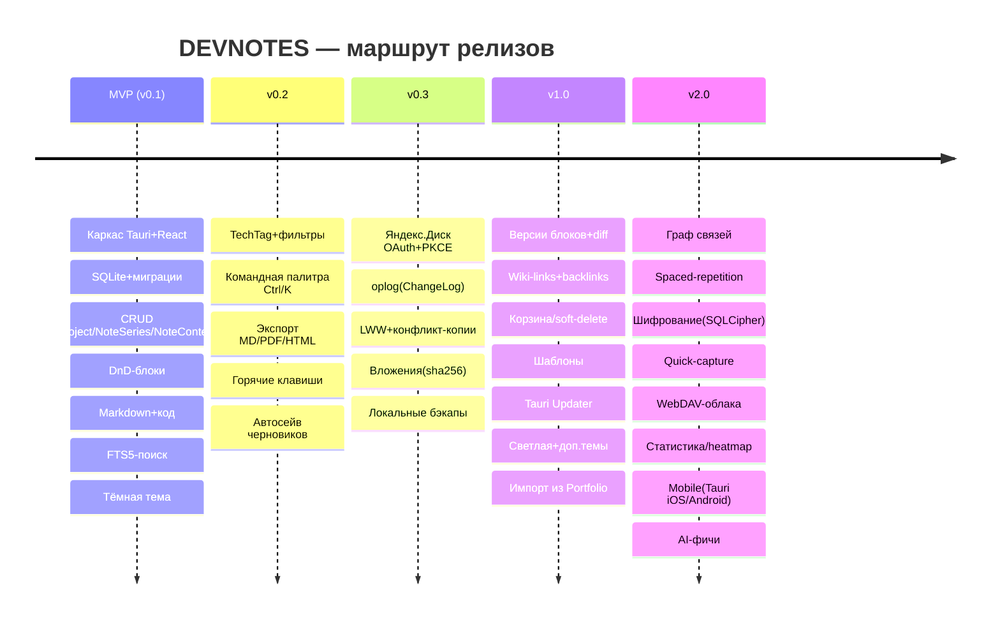
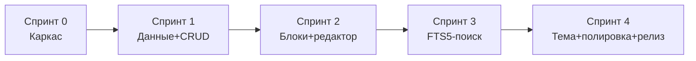

# 10 — Дорожная карта

> **Что это за файл.** План реализации DEVNOTES во времени: какие релизы выпускаем, в каком порядке, что входит в каждый и по каким критериям считаем его готовым. Документ отвечает на вопрос «**в каком порядке** и **когда**» — в отличие от `03-FEATURES.md` («что делаем») и `04-ARCHITECTURE.md` («как устроено»). Здесь: цели релизов MVP → v0.2 → v0.3 → v1.0 → v2.0, привязка объёма к фичам (`M*/S*/C*` из каталога), критерии готовности (Definition of Done релиза), детальная разбивка ближайшего MVP на спринты и задачи, матрица рисков с митигациями и верхнеуровневая оценка трудозатрат. Оценки — грубые (порядок величины), не обязательства по датам: проект ведёт один разработчик, темп плавающий.

**Статус:** черновик v1 · **Дата:** 2026-07-17 · **Автор:** Full-Stack .NET/React-разработчик · **Аудитория:** автор + будущие контрибьюторы.

---

## Связанные документы

| Документ | Назначение |
|---|---|
| [`01-VISION.md`](./01-VISION.md) | Видение, персоны, сценарии, метрики успеха — «зачем» |
| [`02-SPECIFICATION.md`](./02-SPECIFICATION.md) | Функциональная спецификация, сценарии, приёмочные критерии |
| [`03-FEATURES.md`](./03-FEATURES.md) | Каталог фич с приоритизацией MoSCoW (`M*/S*/C*`) — «что делаем» |
| [`04-ARCHITECTURE.md`](./04-ARCHITECTURE.md) | Слои Clean Architecture, Tauri 2.0, IPC-контур — «как устроено» |
| [`05-DATA-MODEL.md`](./05-DATA-MODEL.md) | Доменные сущности, SQLite-схема (snake_case), UUID v7, миграции |
| [`06-UI-UX.md`](./06-UI-UX.md) | Экраны, навигация, компоненты, командная палитра, горячие клавиши |
| [`07-TECH-STACK.md`](./07-TECH-STACK.md) | Стек и обоснование (Tauri vs Electron/MAUI/Flutter), библиотеки |
| [`09-YANDEX-DISK.md`](./09-YANDEX-DISK.md) | OAuth 2.0 + PKCE, oplog (ChangeLog), LWW + конфликт-копии, WebDAV-fallback |
| **`10-ROADMAP.md`** | **(этот файл)** Релизы, спринты, риски, оценки — «в каком порядке и когда» |

> Ссылки на фичи вида `M5`, `S1`, `C2` указывают на разделы `03-FEATURES.md`. Ссылки на сущности (`Project`, `NoteSeries`, `NoteContent`, `TechTag`, `ChangeLog`, …) — на `05-DATA-MODEL.md`. Термины — строго по глоссарию `CLAUDE.md`: **Project → NoteSeries → NoteContent**, без синонимов.

---

## 0. Как читать этот документ

**Принцип планирования — вертикальные срезы, а не слои.** Каждый релиз — это работающий продукт, который можно установить и использовать, а не «готовый слой БД без UI». Мы предпочитаем сквозные фичи (Rust-команда → IPC → repository → UI-экран) горизонтальным «сначала весь бэкенд».

**MoSCoW ≠ релизы.** `03-FEATURES.md` приоритизирует фичи по обязательности (Must/Should/Could). Дорожная карта раскладывает их во времени. Важный нюанс: **все Must-фичи** (`M1…M12`) должны быть в продукте к моменту **v1.0 = feature-complete**, но выходят они постепенно — от MVP до v0.3. То есть «MVP» здесь — это первый *пригодный к работе* релиз (проекты + заметки + поиск), а не полный набор Must. Такое дробление снижает риск и даёт обратную связь раньше.

**Единицы оценки.** Трудозатраты — в **идеальных инженерных днях (и.д.)** одного full-stack разработчика: чистое время без переключений контекста, встреч и простоев. Реальный календарный срок при частичной занятости — умножайте на 1.8–2.5. Точность оценок падает от MVP (высокая) к v2.0 (порядок величины).

**Легенда размеров задач:** `◔` ~0.5–1 и.д. · `◑` ~2–4 и.д. · `●` ~5–8 и.д. · `◕` крупная с риском ~8–15 и.д.

---

## 1. Обзор релизов (маршрут)

| Релиз | Кодовое имя | Суть одной строкой | Целевой объём (и.д.) | Ключевая проверяемая ценность |
|---|---|---|---|---|
| **MVP / v0.1** | `terminal-boot` | Локальный редактор инженерных заметок с мгновенным поиском | ~30–38 | «Я веду заметки офлайн и нахожу нужное за <100 мс» |
| **v0.2** | `command-deck` | Скорость: теги, палитра команд, экспорт, хоткеи | ~14–20 | «Я управляю приложением с клавиатуры и делюсь заметками» |
| **v0.3** | `cloud-link` | Синхронизация и бэкап через Яндекс.Диск | ~22–30 | «Мои заметки на двух машинах совпадают, ничего не теряется» |
| **v1.0** | `feature-complete` | Полный Must+Should, зрелость и надёжность | ~25–35 | «Продукт, который не стыдно рекомендовать» |
| **v2.0** | `knowledge-graph` | Знание как сеть + мобильность + защита | ~50+ | «Заметки связаны, доступны с телефона и зашифрованы» |

**Совокупно до v1.0:** ~90–125 и.д. (порядок 5–7 календарных месяцев при частичной занятости). v2.0 — отдельная эпопея, оценивается позже.

---

## 2. Релиз MVP / v0.1 — `terminal-boot`

### Цель
Получить **самодостаточный офлайн-инструмент**: пользователь создаёт проекты, ведёт в них серии заметок из блоков (markdown/code/image/link), сортирует блоки мышью и **мгновенно находит** любой текст по всей базе. Всё локально, в тёмной терминальной теме. Ни облака, ни тегов, ни палитры — только базовая петля «пишу → нахожу».

### Объём (фичи из `03-FEATURES.md`)

| Фича | Название | Размер |
|---|---|---|
| `M1` | CRUD иерархии Project → NoteSeries → NoteContent | `●` |
| `M2` | Типы блоков markdown / code / image / link | `◑` |
| `M3` | Drag-and-drop сортировка блоков (`@dnd-kit`, `sort_order`) | `◑` |
| `M4` | Markdown-редактор с live-preview и подсветкой кода | `●` |
| `M5` | Мгновенный полнотекстовый поиск (FTS5 + bm25 + сниппеты) | `◕` |
| `M10` | Local-first / полный офлайн | `●` (сквозной) |
| `M11` | Тёмная тема + терминальная эстетика (JetBrains Mono, `#22c55e`) | `◑` |
| `M12` | Обязательные `created_at` / `updated_at` (UTC ISO 8601) | `◔` |

**Инфраструктурная база (не фичи, но обязательны):** каркас Tauri 2.0 + Vite/React 19, слой миграций SQLite (версионируется), IPC-контракты для CRUD и поиска, repository-pattern на фронте с генераторами query-key, сборка под три ОС в CI.

### Явно вне MVP
Теги (`M7` → v0.2), командная палитра (`M6` → v0.2), синхронизация (`M8`,`M9` → v0.3). Светлая тема (`M11`-часть → v1.0). Всё из Should/Could.

> **Замечание о MoSCoW-Must.** `M6`, `M7`, `M8`, `M9` формально Must, но вынесены за MVP. Это сознательно: они не нужны для первой петли ценности и несут отдельные риски (OAuth, конфликты). MVP доказывает ядро; Must-остаток добирается в v0.2–v0.3. К v1.0 все Must закрыты.

### Критерии готовности (Definition of Done релиза)

- [ ] Устанавливается и запускается на Windows 10+, macOS 12+, Ubuntu 22.04+ (артефакты из CI).
- [ ] Полный цикл: создать `Project` → создать `NoteSeries` → добавить ≥4 блока разных типов → отредактировать → удалить — без ошибок и потери данных.
- [ ] Drag-and-drop меняет `sort_order`, порядок сохраняется после перезапуска.
- [ ] Markdown рендерится, код подсвечивается; переключение edit/preview работает.
- [ ] FTS5-поиск по базе с 10 000 блоков возвращает результаты **<50 мс** (p95, замер в CI-бенче), со сниппетами и подсветкой совпадений.
- [ ] Все сущности пишут `created_at`/`updated_at` в UTC ISO 8601; UI показывает локальное время.
- [ ] Миграции применяются с чистой БД и с БД предыдущей версии схемы (forward-only проверка).
- [ ] Приложение полностью функционально при выключенной сети (проверка в тесте).
- [ ] Тёмная тема соответствует токенам `06-UI-UX.md`; шрифт JetBrains Mono; акцент `#22c55e`.
- [ ] Ручной прогон smoke-чеклиста на Ubuntu (WebKitGTK) — рендер markdown и подсветка без визуальных дефектов.

### Разбивка MVP на спринты

Спринт ≈ 1 условная неделя фокуса (~5–7 и.д.). Порядок задан зависимостями: каркас → данные → CRUD → контент → поиск → полировка.

#### Спринт 0 — Каркас и «скелет ходит» (~6 и.д.)
| # | Задача | Слой | Размер |
|---|---|---|---|
| 0.1 | Инициализация монорепо: Tauri 2.0 + Vite + React 19 + TS + Tailwind; запуск пустого окна | Оболочка | `◑` |
| 0.2 | Дизайн-токены HSL (shadcn/ui) в CSS-переменных, тёмная тема, JetBrains Mono, базовый `terminal window` | UI | `◑` |
| 0.3 | Примитивы UI: Button (варианты как в Portfolio), Card, Input, TextArea, Badge (CVA+clsx+tailwind-merge) | UI | `◑` |
| 0.4 | Каркас слоёв: `Domain / UseCases / Interfaces / Infrastructure / UI` по обе стороны IPC | Все | `◑` |
| 0.5 | CI: сборка под Windows/macOS/Linux (GitHub Actions matrix), артефакты | DevOps | `◑` |
| 0.6 | «Hello IPC»: одна команда Rust ↔ TS туда-обратно, типизированный клиент | Interfaces | `◔` |

#### Спринт 1 — Данные и CRUD иерархии (~7 и.д.) → закрывает `M1`, `M12`
| # | Задача | Слой | Размер |
|---|---|---|---|
| 1.1 | SQLite-схема (snake_case) для `Project`/`NoteSeries`/`NoteContent`/`NoteContentType`; DDL из `05-DATA-MODEL.md` | Infra/DB | `◑` |
| 1.2 | Движок миграций: таблица `schema_version`, forward-only, применение при старте | Infra/DB | `◑` |
| 1.3 | Генерация UUID v7 (строка) на клиенте; `created_at`/`updated_at` в UTC ISO 8601 | Domain | `◔` |
| 1.4 | IPC-команды CRUD для трёх сущностей; репозитории на Rust (rusqlite) | Interfaces/Infra | `●` |
| 1.5 | Frontend repository-pattern + генераторы query-key; TanStack Query + Zustand | UI | `◑` |
| 1.6 | Экраны: список проектов, дерево `Project → NoteSeries`, пустые состояния | UI | `◑` |

#### Спринт 2 — Блоки контента и редактор (~7 и.д.) → закрывает `M2`, `M3`, `M4`
| # | Задача | Слой | Размер |
|---|---|---|---|
| 2.1 | CRUD блоков `NoteContent`, типы markdown/code/image/link, поле `language` для code | Infra/UI | `◑` |
| 2.2 | Drag-and-drop сортировка (`@dnd-kit`), пересчёт `sort_order`, персист | UI | `◑` |
| 2.3 | Markdown-редактор с live-preview (`react-markdown`) | UI | `●` |
| 2.4 | Подсветка кода (`react-syntax-highlighter`), выбор языка | UI | `◑` |
| 2.5 | Блок image (локальный файл/paste) — минимальный рендер без синка вложений | UI | `◑` |
| 2.6 | Виртуализация списка блоков (задел под серии на сотни блоков — риск IPC) | UI | `◑` |

#### Спринт 3 — Мгновенный поиск FTS5 (~7 и.д.) → закрывает `M5`
| # | Задача | Слой | Размер |
|---|---|---|---|
| 3.1 | Виртуальная таблица `notes_fts` (FTS5 external content над `NoteContent.title/text` + `NoteSeries.title`) | Infra/DB | `●` |
| 3.2 | Триггеры синхронизации индекса (insert/update/delete) | Infra/DB | `◑` |
| 3.3 | Ранжирование bm25, генерация сниппетов и подсветка совпадений | Infra | `◑` |
| 3.4 | IPC-команда поиска + debounce на фронте, экран результатов | UI | `◑` |
| 3.5 | Trigram-токенизатор как fallback для русской морфологии (за флагом настройки) | Infra/DB | `◑` |
| 3.6 | Бенч в CI: 10k блоков, замер p95 < 50 мс, регресс-гейт | DevOps | `◑` |

#### Спринт 4 — Тема, полировка, релиз (~6 и.д.) → закрывает `M10`, `M11`
| # | Задача | Слой | Размер |
|---|---|---|---|
| 4.1 | Финализация тёмной темы: scanlines, matrix-grid фон, neon-text свечение | UI | `◑` |
| 4.2 | Тест офлайн-режима (сеть выключена) — сквозной e2e | QA | `◔` |
| 4.3 | Smoke-прогон на Ubuntu (WebKitGTK): рендер/подсветка/перфоманс | QA | `◑` |
| 4.4 | Обработка ошибок IPC, тосты (`react-hot-toast`), пустые/загрузочные состояния | UI | `◑` |
| 4.5 | Упаковка инсталляторов (msi/dmg/AppImage+deb), README установки | DevOps | `◑` |
| 4.6 | Бэклог-груминг v0.2, ретро MVP | — | `◔` |

**Итого MVP:** ~33 и.д. (диапазон 30–38 с учётом риска `M5`).

---

## 3. Релиз v0.2 — `command-deck`

### Цель
Превратить рабочий редактор в **быстрый** инструмент: управление с клавиатуры (командная палитра + хоткеи), организация через теги, вынос знаний наружу (экспорт). Всё ещё офлайн — облако в следующем релизе.

### Объём

| Фича | Название | Размер |
|---|---|---|
| `M6` | Командная палитра Ctrl/Cmd+K (поиск, переходы, действия) | `◑` |
| `M7` | Теги технологий `TechTag` + `TechTagType` + фильтрация списков | `◑` |
| `S1` | Экспорт серии в Markdown / PDF / HTML | `◑` |
| `S6` | Автосохранение черновиков блоков (debounce) | `◑` |
| `S7` | Горячие клавиши (глобальная карта: новая заметка/блок/поиск/тема) | `◔` |
| `S10` | Расширенные фильтры поиска (по проекту/тегу/типу блока/дате) | `◑` |
| `S4` | Закрепление (`pinned`) серий + архив (`archived`) проектов | `◔` |

### Критерии готовности
- [ ] `Ctrl/Cmd+K` открывает палитру: поиск по базе, переход к любому `Project`/`NoteSeries`, быстрые действия (новая серия, новый блок, экспорт).
- [ ] Теги создаются с категорией (`language/framework/tool/database/devops/other`), привязываются к `NoteSeries` (many-to-many через `NoteSeriesTag`), списки фильтруются по тегу и проекту.
- [ ] Экспорт серии в `.md` и `.pdf` даёт корректный результат (markdown + код). Если `html2pdf.js` нестабилен в WebView — fallback на Rust-генерацию PDF (см. риск R8).
- [ ] Черновик блока сохраняется автоматически с debounce; правки не теряются при закрытии.
- [ ] Карта горячих клавиш задокументирована и работает на всех ОС (с учётом Cmd vs Ctrl).
- [ ] Поиск фильтруется по проекту, тегу, типу блока и диапазону дат одновременно.
- [ ] `pinned`-серии всплывают вверх; `archived`-проекты скрыты из основного списка, но не удалены.

**Оценка:** ~14–20 и.д.

---

## 4. Релиз v0.3 — `cloud-link`

### Цель
**Синхронизация и бэкап** через Яндекс.Диск без потери данных на двух устройствах. Ключевая инженерная сложность проекта. Синкается **только oplog (`ChangeLog`) + снапшоты**, никогда «живой» файл БД.

### Объём

| Фича | Название | Размер |
|---|---|---|
| `M8` | Синхронизация с Яндекс.Диском (OAuth 2.0 Authorization Code + PKCE, app folder) | `◕` |
| `M9` | Офлайн-очередь (`ChangeLog`) + LWW по `updated_at` + конфликт-копии | `◕` |
| `S2` | Вложения-изображения (content-addressable по `sha256`) + синк вложений | `●` |
| `S3` | Локальные бэкапы (`VACUUM INTO` snapshot) + восстановление | `◑` |
| `S6`* | Индикатор несинхронизированных изменений (доработка из v0.2) | `◔` |
| `C7`? | WebDAV-абстракция как запасной канал (частично, если успеваем) | `●` |

### Критерии готовности
- [ ] OAuth 2.0 + PKCE через loopback-redirect; токены — в системном keychain (не в файле/БД).
- [ ] Каждое доменное изменение пишет запись в `ChangeLog` в той же транзакции; при появлении сети очередь выгружается в app folder Я.Диска (REST API).
- [ ] Два устройства сходятся к одному состоянию; при расхождении блока — **LWW по `updated_at` + конфликт-копия** `NoteContent`, о которой пользователь уведомлён в UI (никогда не теряем версию молча).
- [ ] Вложения адресуются по `sha256`, хранятся рядом с БД, синкаются отдельно от текста; дедупликация работает.
- [ ] Периодический snapshot (`VACUUM INTO`) создаётся и восстанавливается; восстановление из снапшота на Я.Диске проверено.
- [ ] Файл SQLite **никогда** не выгружается целиком в облако (архитектурный инвариант, проверен код-ревью и тестом).
- [ ] Ручной экспорт/WebDAV задокументированы как запасной канал (для пользователей вне зоны доступности сервиса).

**Оценка:** ~22–30 и.д. Наибольшая неопределённость по всей карте (конфликты + OAuth-десктоп).

> Детали протокола, форматы oplog и разрешение конфликтов — в [`09-YANDEX-DISK.md`](./09-YANDEX-DISK.md).

---

## 5. Релиз v1.0 — `feature-complete`

### Цель
**Зрелость.** Закрыть весь Must + приоритетный Should, добавить надёжность (корзина, автообновление), связность знаний (wiki-links) и историю (версии блоков). После v1.0 продукт не стыдно рекомендовать и на него можно ставить автообновления.

### Объём

| Фича | Название | Размер |
|---|---|---|
| `C1` | Версионирование блоков (история + diff + откат) | `●` |
| `C2` | Wiki-links `[[...]]` + backlinks | `◑` |
| `S5` | Корзина с восстановлением (soft-delete) | `◑` |
| `S8` | Шаблоны серий/блоков («разбор бага», «сниппет», «конспект технологии») | `◑` |
| `S9` | Автообновление (Tauri Updater, подписанные релизы) | `◑` |
| `S11` | Импорт из Portfolio API (одноразовый мигратор) | `◑` |
| `C11` | Светлая тема + доп.темы + плотность интерфейса | `◔` |
| `C4` | Дополнительные типы блоков (таблица, callout, чеклист) | `◑` |

### Критерии готовности
- [ ] Все Must-фичи `M1…M12` присутствуют и стабильны (сводка трассировки из `03-FEATURES.md` §6 — зелёная).
- [ ] Версии блока сохраняются, diff между версиями отображается, откат восстанавливает содержимое.
- [ ] `[[Название серии]]` создаёт ссылку; на целевой серии виден список backlinks.
- [ ] Удаление — в корзину; восстановление возвращает сущность со связями; окончательное удаление — явное действие.
- [ ] Автообновление доставляет подписанный релиз; откат при сбое обновления безопасен.
- [ ] Мигратор одноразово переносит `Project/NoteSeries/NoteContent/TechTag` из Portfolio API без дублей.
- [ ] Светлая тема полна и переключается хоткеем; контраст соответствует WCAG AA в обеих темах.
- [ ] Регресс-набор (e2e основных петель) зелёный на трёх ОС в CI.

**Оценка:** ~25–35 и.д.

---

## 6. Релиз v2.0 — `knowledge-graph`

### Цель
Превратить набор заметок в **сеть знаний** и вынести за пределы десктопа: граф связей, повторение по интервалам, защита данных, мобильность. Это долгосрочный горизонт — объём и приоритеты пересматриваются после v1.0 и обратной связи.

### Объём (кандидаты, порядок не финальный)

| Фича | Название | Размер | Комментарий |
|---|---|---|---|
| `C3` | Граф связей заметок (визуализация wiki-links) | `●` | Растёт из `C2` |
| `C10` | Spaced-repetition / флеш-карты из блоков | `●` | Новый режим работы с заметкой |
| `C5` | Шифрование локальной БД (SQLCipher, мастер-пароль) | `◕` | Меняет слой доступа к данным |
| `C6` | Глобальный quick-capture (system hotkey → мини-окно) | `◑` | Требует second window / tray |
| `C7` | WebDAV-абстракция (Nextcloud, Диск по WebDAV) | `●` | Если не сделано в v0.3 |
| `C8` | Статистика + heatmap активности по дням | `◑` | Аналитика поверх `created_at` |
| `C12` | Mobile-версия (Tauri 2 iOS/Android) поверх той же схемы синка | `◕` | Крупнейший риск v2 |
| `C13` | AI-фичи: автотегирование, суммаризация, семантический поиск | `◕` | Отдельная эпопея, требует решения по приватности/оффлайн |

### Критерии готовности (укрупнённо)
- [ ] Граф интерактивен: узлы — серии, рёбра — wiki-links; клик ведёт к серии.
- [ ] Spaced-repetition: блок можно пометить как карточку, планировщик показывает «к повторению сегодня».
- [ ] При включённом шифровании БД недоступна без мастер-пароля; синк совместим с шифрованием.
- [ ] Quick-capture открывается системным хоткеем даже когда основное окно закрыто; заметка попадает в inbox.
- [ ] Mobile-сборка синкается с десктопом через тот же oplog; UI адаптирован под тач.

**Оценка:** ~50+ и.д. (декомпозируется отдельным документом перед стартом).

> Won't-фичи (Company/Task/Experience, мультипользовательность, свой сервер, реалтайм-коллаборация, WYSIWYG, плагины, E2E-шифрование облака) **вне** дорожной карты во всех обозримых релизах — см. `03-FEATURES.md` §5.

---

## 7. Сводная привязка фич к релизам (трассировка)

| Фича | MVP | v0.2 | v0.3 | v1.0 | v2.0 |
|---|:---:|:---:|:---:|:---:|:---:|
| `M1` CRUD иерархии | ✅ | | | | |
| `M2` типы блоков | ✅ | | | | |
| `M3` DnD-сортировка | ✅ | | | | |
| `M4` markdown+код | ✅ | | | | |
| `M5` FTS5-поиск | ✅ | | | | |
| `M6` командная палитра | | ✅ | | | |
| `M7` теги TechTag | | ✅ | | | |
| `M8` синк Я.Диск | | | ✅ | | |
| `M9` oplog+конфликты | | | ✅ | | |
| `M10` local-first | ✅ | | | | |
| `M11` тёмная тема | ✅ | | (свет)→ | ✅ | |
| `M12` created/updated_at | ✅ | | | | |
| `S1` экспорт | | ✅ | | | |
| `S2` вложения | | | ✅ | | |
| `S3` бэкапы | | | ✅ | | |
| `S4` pinned/archived | | ✅ | | | |
| `S5` корзина | | | | ✅ | |
| `S6` автосейв/индикатор | | ✅ | (индик)→ | | |
| `S7` хоткеи | | ✅ | | | |
| `S8` шаблоны | | | | ✅ | |
| `S9` автообновление | | | | ✅ | |
| `S10` фильтры поиска | | ✅ | | | |
| `S11` импорт Portfolio | | | | ✅ | |
| `C1` версии блоков | | | | ✅ | |
| `C2` wiki-links | | | | ✅ | |
| `C3` граф | | | | | ✅ |
| `C4` доп. типы блоков | | | | ✅ | |
| `C5` шифрование | | | | | ✅ |
| `C6` quick-capture | | | | | ✅ |
| `C7` WebDAV | | | (опц.)? | | ✅ |
| `C8` статистика | | | | | ✅ |
| `C10` spaced-repetition | | | | | ✅ |
| `C11` доп.темы | | | | ✅ | |
| `C12` mobile | | | | | ✅ |
| `C13` AI | | | | | ✅ |

---

## 8. Матрица рисков и митигации

Риски пронумерованы `R1…R8` (соответствуют разделу `risks` WBS). Оценка: **Вероятность** × **Влияние** ∈ {низк., сред., выс.}. Приоритет митигации — по произведению.

| # | Риск | Вер. | Влияние | Релиз риска | Митигация | Триггер/детектор |
|---|---|:---:|:---:|---|---|---|
| **R1** | Синк «живого» файла SQLite → гарантированная потеря данных при двух устройствах | выс. | критич. | v0.3 | Синкаем **только** oplog (`ChangeLog`) + снапшоты; файл БД в облако не выгружается никогда. Инвариант закреплён в архитектуре и проверяется тестом+ревью | Код-ревью PR синка; тест «файл БД не в списке выгрузки» |
| **R2** | FTS5 `unicode61` не даёт русского стемминга — поиск только по точным словоформам | выс. | сред. | MVP | Trigram-токенизатор как fallback (задача 3.5), честно описан компромисс «размер индекса vs морфология»; выбор за флагом настройки | Бенч-набор русских запросов с словоформами |
| **R3** | OAuth Я.Диска на десктопе: loopback-redirect, лимиты API, недоступность вне РФ | сред. | выс. | v0.3 | loopback/custom-scheme redirect; троттлинг под лимиты; ручной экспорт + WebDAV как запасной канал | Мониторинг 429/5xx от API; e2e OAuth на чистой машине |
| **R4** | Linux-WebView (WebKitGTK) отстаёт от Chromium: рендер markdown/подсветки, перфоманс | сред. | сред. | MVP | Обязательный smoke-прогон на Ubuntu **в CI с самого начала** (задачи 0.5, 4.3); виртуализация списков | CI-job Ubuntu; ручной визуальный чеклист |
| **R5** | Команда .NET/React, ядро на Rust — кривая обучения | сред. | сред. | сквозной | Тонкое Rust-ядро (SQL+sync+IPC+FS), вся UI-логика в TS; изоляция Rust в узкий набор команд | Рост времени задач Rust-слоя выше оценки в 1.5× |
| **R6** | IPC на больших сериях (сотни блоков): сериализация JSON — узкое место | сред. | сред. | MVP+ | Пагинация блоков и виртуализация списков **с самого начала** (задача 2.6); измерять до оптимизации | Профиль IPC при серии 500+ блоков |
| **R7** | LWW теряет одну из версий молча → потеря доверия к синку | выс. | выс. | v0.3 | Обязательная **конфликт-копия** блока + явная UI-индикация; молчаливой потери быть не может | Тест сценария конкурентной правки; UI-баннер конфликта |
| **R8** | React 19 + `react-modal-sheet`/`html2pdf.js` иначе ведут себя в WebView; PDF-экспорт | сред. | низк. | v0.2 | Проверить рано; при нестабильности — PDF-экспорт на Rust-стороне (`printpdf`/headless) | Прогон экспорта PDF на трёх ОС |
| **R9**\* | Один разработчик, плавающий темп → срыв календарных сроков | выс. | сред. | все | Оценки в идеальных днях без обязательств по датам; вертикальные срезы дают ценность на каждом релизе; Should вырезается первым | Скольжение спринта >1.5× оценки |

\* R9 — организационный риск, добавлен сверх WBS.

**Топ-3 по приоритету митигации:** R1 (данные), R7 (доверие к синку), R3 (доступность облака). Все три сосредоточены в v0.3 — самом рискованном релизе; закладываем на него запас времени и отдельную фазу стабилизации.

---

## 9. Верхнеуровневая оценка

### По релизам

| Релиз | Оптимистично | Реалистично | Пессимистично | Главный драйвер разброса |
|---|:---:|:---:|:---:|---|
| MVP / v0.1 | 30 | 33 | 38 | FTS5 (`M5`) + Linux-WebView (R4) |
| v0.2 | 14 | 17 | 20 | PDF-экспорт в WebView (R8) |
| v0.3 | 22 | 26 | 30 | Конфликты синка (R7) + OAuth (R3) |
| v1.0 | 25 | 29 | 35 | Версии блоков (`C1`) |
| **До v1.0 (сумма)** | **91** | **105** | **123** | — |
| v2.0 | — | 50+ | — | Mobile (`C12`) + шифрование (`C5`) |

### Календарная проекция
При частичной занятости (коэффициент 1.8–2.5 к идеальным дням) и одном разработчике:

- **MVP:** ~6–9 недель.
- **До v1.0:** ~5–7 месяцев.
- **v2.0:** оценивается отдельным планом после v1.0.

Оценки — **не обязательства по датам**. Они задают порядок величины и помогают решать, что резать (первыми — Should, затем поздние Could). Единственная жёсткая граница объёма — Must-набор к v1.0; всё остальное гибко.

### Принципы управления объёмом
1. **Ценность на каждом релизе.** Каждый выпуск — устанавливаемый рабочий продукт, а не «полуслой».
2. **Режем Should, а не качество.** При нехватке времени вырезаются Should-фичи целиком, а не урезается надёжность Must.
3. **Риск — раньше.** Самые неопределённые вещи (FTS5, синк) получают отдельные спринты/фазы стабилизации.
4. **Замеряй до оптимизации.** Перфоманс-риски (R6, R2) проверяются бенчами, а не «на глаз».

---

## 10. Что дальше

- После MVP — ретро и груминг v0.2 (задача 4.6).
- Перед стартом v0.3 — детальный дизайн протокола синка в `09-YANDEX-DISK.md` (форматы oplog, конфликт-копии).
- Перед стартом v2.0 — отдельный документ декомпозиции (граф, mobile, шифрование): текущие оценки v2.0 — только порядок величины.
- Актуальный статус фич — сводная трассировка в `03-FEATURES.md` §6.
