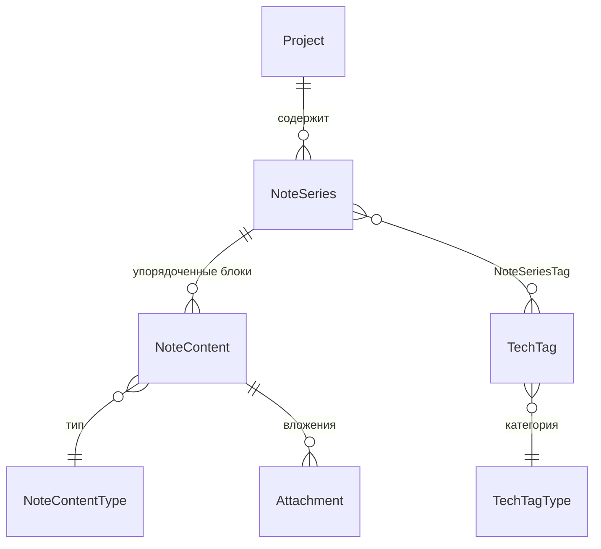

# 12 — Глоссарий

> **Что это за файл.** Единый словарь терминов проекта DEVNOTES — канонические определения доменных сущностей, архитектурных понятий, механизмов синхронизации, поиска и UI. Назначение: устранить синонимию и разночтения между всеми документами, кодом (Rust-ядро, TS-фронтенд) и схемой БД. Каждый термин даётся в 1–3 предложениях, снабжён якорем для перекрёстных ссылок и, где уместно, указанием на источник правды (соответствующий `docs/*` или таблицу схемы). При конфликте формулировок канон — этот файл, `CLAUDE.md` и `consistencyNotes` из WBS.

> **Статус:** проектирование · **Дата:** 2026-07-17 · **Язык:** русский, тон инженерный · **Область:** десктоп v1 (Windows / macOS / Linux).

---

## Связанные документы

Пути относительно `DevNotes/`. Канон именования и инварианты — `CLAUDE.md`.

| Документ | Назначение | Роль для этого файла |
| --- | --- | --- |
| [`CLAUDE.md`](../CLAUDE.md) | Конвенции, инварианты, DoD | Первоисточник имён сущностей и инвариантов |
| [`docs/01-VISION.md`](01-VISION.md) | Видение, персоны, WBS | Термины из требований пользователя |
| [`docs/02-SPECIFICATION.md`](02-SPECIFICATION.md) | Большое ТЗ | Функциональные термины |
| [`docs/03-FEATURES.md`](03-FEATURES.md) | Каталог фич MoSCoW | Термины фич (палитра, spaced repetition, backlinks) |
| [`docs/04-ARCHITECTURE.md`](04-ARCHITECTURE.md) | Слои, Tauri, IPC, sync | Tauri, IPC, слои, sync-движок |
| [`docs/05-DATA-MODEL.md`](05-DATA-MODEL.md) | Доменная модель, DDL | Определения сущностей и полей |
| [`docs/08-SEARCH.md`](08-SEARCH.md) | Подсистема поиска | FTS5, bm25, командная палитра |
| [`docs/09-YANDEX-DISK.md`](09-YANDEX-DISK.md) | Синхронизация с Я.Диском | OAuth app folder, конфликты, LWW, WebDAV |

---

## Как читать глоссарий

- **Каноничное имя** — в коде и схеме используется только оно (например, `NoteSeries`, а не «тема» или «топик»).
- Формат имён по слоям (инвариант из `consistencyNotes`):

| Слой | Регистр | Пример |
| --- | --- | --- |
| SQLite-схема | `snake_case` | `note_content`, `sort_order`, `created_at` |
| Rust-домен | `PascalCase` / поля `snake_case` | `struct NoteContent { sort_order: i64 }` |
| TS-домен | `PascalCase` тип / `camelCase` поля | `type NoteContent = { sortOrder: number }` |

- Все ID — **UUID v7** (строка), генерируются клиентом. Все даты — **UTC ISO 8601** в БД, отображение в локальной таймзоне.

### Карта доменных сущностей

---

## Термины (по алфавиту)

Латиница и кириллица в общем алфавитном ряду; для двуязычных терминов якорь — по каноничному имени.

- [Attachment (Вложение)](#attachment-вложение)
- [Backlink / Wiki-ссылка](#backlink--wiki-ссылка)
- [bm25](#bm25)
- [ChangeLog / oplog](#changelog--oplog)
- [Company (Компания)](#company-компания)
- [FTS5](#fts5)
- [IPC](#ipc)
- [Local-first](#local-first)
- [LWW (Last-Writer-Wins)](#lww-last-writer-wins)
- [NoteContent (Блок)](#notecontent-блок)
- [NoteContentType (Тип блока)](#notecontenttype-тип-блока)
- [NoteSeries (Серия заметок)](#noteseries-серия-заметок)
- [OAuth app folder](#oauth-app-folder)
- [Project (Проект)](#project-проект)
- [Spaced repetition (Интервальное повторение)](#spaced-repetition-интервальное-повторение)
- [Sync-движок](#sync-движок)
- [Tauri](#tauri)
- [TechTag (Тег технологии)](#techtag-тег-технологии)
- [TechTagType (Категория тега)](#techtagtype-категория-тега)
- [WebDAV](#webdav)
- [Командная палитра (Command Palette)](#командная-палитра-command-palette)
- [Конфликт синхронизации](#конфликт-синхронизации)

---

### Attachment (Вложение)
Файл, прикреплённый к блоку `NoteContent` (изображение, а в перспективе — произвольный бинарник). Хранится **content-addressable** рядом с БД: имя файла на диске = `sha256` содержимого, что даёт дедупликацию и целостность. Поля: `id, note_content_id, file_name, mime, size, sha256, local_path, sync_status`; синхронизируется на Я.Диск отдельно от блоков. Источник правды: [`05-DATA-MODEL.md`](05-DATA-MODEL.md).

### Backlink / Wiki-ссылка
Двунаправленная связь между заметками через синтаксис `[[Имя серии]]` внутри markdown-блока: при рендере превращается в навигационную ссылку, а на целевой стороне показывается список «кто на меня ссылается» (backlinks). Основа для будущего графа связей. Область: WBS `could` — планируется после MVP, не входит в v1.

### bm25
Функция ранжирования релевантности из семейства TF-IDF, встроенная в SQLite FTS5 (`ORDER BY bm25(notes_fts)`). Возвращает вес документа по частоте терминов с поправкой на длину; в DEVNOTES колонкам задаются разные веса (заголовок серии и заголовок блока — выше, чем тело текста). Чем меньше значение `bm25()`, тем релевантнее строка. Источник правды: [`08-SEARCH.md`](08-SEARCH.md).

### ChangeLog / oplog
Локальный журнал операций (operation log) — единственный канал синхронизации: каждое изменение сущности фиксируется строкой `id, entity, entity_id, op, payload_json, ts, device_id, synced`. При появлении сети непереданные (`synced = 0`) записи выгружаются в app folder Я.Диска, входящие — применяются. **Живой файл БД по облаку не синкается никогда** — только oplog и снапшоты (ключевое решение против потери данных). Источник правды: [`09-YANDEX-DISK.md`](09-YANDEX-DISK.md).

### Company (Компания)
Сущность из исходного проекта Portfolio (`Id, Name, Description?, Website?, CreatedAt?`), группировавшая проекты по работодателю/заказчику. **В десктоп v1 не переносится**: `Project` существует без `company_id`. Термин сохранён в глоссарии только для трассируемости к Portfolio и разделов «перспектива». Область: WBS `wont`.

### FTS5
Модуль полнотекстового поиска SQLite (Full-Text Search v5). В DEVNOTES используется виртуальная таблица `notes_fts` в режиме **external content** над `NoteContent` и `NoteSeries`: индекс не дублирует данные, а поддерживается триггерами `INSERT/UPDATE/DELETE`. Токенизатор `unicode61`, с trigram-фолбэком для морфологии русского. Цель: `<50 мс` на 10k блоков. Источник правды: [`08-SEARCH.md`](08-SEARCH.md).

### IPC
Inter-Process Communication — граница между Rust-ядром Tauri и React-фронтендом. Фронт вызывает Rust-команды через `invoke("command_name", args)`; аргументы и результат сериализуются в JSON. Узкое место на больших сериях (сотни блоков), поэтому с самого начала закладываются пагинация и виртуализация списков. Источник правды: [`04-ARCHITECTURE.md`](04-ARCHITECTURE.md).

### Local-first
Архитектурный принцип: приложение полностью работает офлайн, все данные живут в локальном SQLite, а облако (Я.Диск) — лишь опциональный канал бэкапа/синка, а не источник правды. Следствия: клиентская генерация UUID v7, oplog для отложенной синхронизации, отсутствие обязательного сервера. Источник правды: [`01-VISION.md`](01-VISION.md), [`04-ARCHITECTURE.md`](04-ARCHITECTURE.md).

### LWW (Last-Writer-Wins)
Стратегия разрешения конфликтов синхронизации: при расхождении двух версий одного `NoteContent` побеждает запись с большим `updated_at` (UTC). Чтобы проигравшая версия не терялась молча, DEVNOTES **обязательно** создаёт конфликт-копию блока и показывает UI-индикацию. Гранулярность — уровень блока, а не всей серии. Источник правды: [`09-YANDEX-DISK.md`](09-YANDEX-DISK.md).

### NoteContent (Блок)
Единица контента внутри серии — «блок заметки». Поля: `id, series_id, sort_order, title?, text, type, language?, created_at, updated_at`. Упорядочивается drag-and-drop через `sort_order` (@dnd-kit), тип задаётся `NoteContentType`. Синонимы «блок», «content-block» = `NoteContent`; другие имена запрещены. Источник правды: [`05-DATA-MODEL.md`](05-DATA-MODEL.md).

### NoteContentType (Тип блока)
Справочник допустимых типов блока: `markdown | code | image | link`. Определяет способ рендера (`react-markdown`, `react-syntax-highlighter` для `code`, превью изображения, карточка ссылки) и валидацию полей (например, `language?` осмыслен только для `code`). Источник правды: [`05-DATA-MODEL.md`](05-DATA-MODEL.md).

### NoteSeries (Серия заметок)
Тематическая серия/подборка блоков внутри проекта — «тема заметок». Поля: `id, project_id?, title, description?, pinned, created_at, updated_at`; содержит упорядоченные `NoteContent` и связана many-to-many с `TechTag` через `NoteSeriesTag`. Синонимы «тема», «топик», «заметка» (в разговорном смысле) = `NoteSeries`. Источник правды: [`05-DATA-MODEL.md`](05-DATA-MODEL.md).

### OAuth app folder
Режим авторизации Я.Диска, при котором приложение получает доступ только к своей выделенной папке (`app folder`), а не ко всему диску пользователя. В DEVNOTES используется **OAuth 2.0 Authorization Code + PKCE** через loopback-redirect; токены хранятся в системном keychain. Минимизирует область доступа и риск для остальных файлов пользователя. Источник правды: [`09-YANDEX-DISK.md`](09-YANDEX-DISK.md).

### Project (Проект)
Верхнеуровневая группа заметок — контейнер серий. Поля: `id, name, short_name?, description?, archived, created_at, updated_at`. В v1 существует **без** `company_id` (см. [Company](#company-компания)); может архивироваться (`archived`) без удаления. Синоним «проект-группа» = `Project`. Источник правды: [`05-DATA-MODEL.md`](05-DATA-MODEL.md).

### Spaced repetition (Интервальное повторение)
Методика запоминания через повторение материала с растущими интервалами (SM-2-подобные алгоритмы) — потенциальная фича для превращения серий-конспектов в карточки для заучивания. В DEVNOTES относится к дальней перспективе (не входит в WBS `must/should`), упоминается как возможное направление обучающего сценария. Область: перспектива.

### Sync-движок
Компонент Infrastructure-слоя Rust-ядра, отвечающий за синхронизацию с Я.Диском: чтение/запись oplog в app folder, применение входящих операций, разрешение конфликтов по [LWW](#lww-last-writer-wins), управление офлайн-очередью и снапшотами. Состояние (ревизии, курсоры, `device_id`) хранит в таблице `SyncState`. Источник правды: [`04-ARCHITECTURE.md`](04-ARCHITECTURE.md), [`09-YANDEX-DISK.md`](09-YANDEX-DISK.md).

### Tauri
Кроссплатформенный тулкит для десктоп-приложений: нативное **Rust-ядро** + системный WebView для UI (вместо встроенного Chromium как в Electron). В DEVNOTES зафиксирован Tauri 2.0 (решение против Electron / .NET MAUI / Flutter) — даёт малый размер, доступ к SQLite/keychain из Rust и переиспользование React-фронтенда Portfolio. Риск: WebKitGTK на Linux отстаёт от Chromium. Источник правды: [`04-ARCHITECTURE.md`](04-ARCHITECTURE.md), [`07-TECH-STACK.md`](07-TECH-STACK.md).

### TechTag (Тег технологии)
Тег, помечающий технологию, к которой относится серия заметок. Поля: `id, name, type_id, description?`; категория задаётся через `TechTagType`. Привязывается к `NoteSeries` через `NoteSeriesTag` (many-to-many); используется для фильтрации списков и поиска. Источник правды: [`05-DATA-MODEL.md`](05-DATA-MODEL.md).

### TechTagType (Категория тега)
Справочник категорий тегов: `language | framework | tool | database | devops | other`. Позволяет группировать и фильтровать теги по роду технологии (например, показать все `framework`-теги). Ссылается из `TechTag.type_id`. Источник правды: [`05-DATA-MODEL.md`](05-DATA-MODEL.md).

### WebDAV
Протокол доступа к файлам поверх HTTP (расширение методов `PROPFIND`, `PUT`, `MKCOL` и др.). В DEVNOTES — запасной канал синхронизации на случай проблем с REST API Я.Диска или недоступности сервиса, а также абстракция для альтернативных облаков (Nextcloud и т.п.). Область: WBS `could` / митигация риска OAuth. Источник правды: [`09-YANDEX-DISK.md`](09-YANDEX-DISK.md).

### Командная палитра (Command Palette)
Модальный интерфейс, вызываемый по `Ctrl/Cmd+K`: единая точка для полнотекстового поиска, быстрой навигации к проекту/серии и запуска команд (новая заметка, смена темы и т.д.). Потребитель результатов [FTS5](#fts5)/[bm25](#bm25). Источник правды: [`08-SEARCH.md`](08-SEARCH.md), [`06-UI-UX.md`](06-UI-UX.md).

### Конфликт синхронизации
Ситуация, когда один и тот же `NoteContent` был независимо изменён на двух устройствах между синхронизациями (расходящиеся `updated_at`). Разрешается стратегией [LWW](#lww-last-writer-wins) с **обязательным** созданием конфликт-копии проигравшей версии и UI-индикацией — молчаливая потеря данных запрещена. Источник правды: [`09-YANDEX-DISK.md`](09-YANDEX-DISK.md).

---

## Приложение: запрещённые синонимы

Во всех документах и коде — только левый столбец.

| Каноничное имя | Запрещённые синонимы |
| --- | --- |
| `Project` | группа, папка, workspace (как сущность) |
| `NoteSeries` | тема, топик, заметка-как-сущность, note |
| `NoteContent` | блок-как-имя-типа, item, entry |
| `TechTag` | tag (без Tech), метка (как имя поля) |
| `ChangeLog` | oplog употребим как пояснение, но имя сущности — `ChangeLog` |
| `Sync-движок` | synchronizer, sync-service (в прозе допустимо, в коде — модуль `sync`) |

> Изменения глоссария синхронизируются с `CLAUDE.md`. Новый термин добавляется сюда до первого использования в других `docs/*`.
