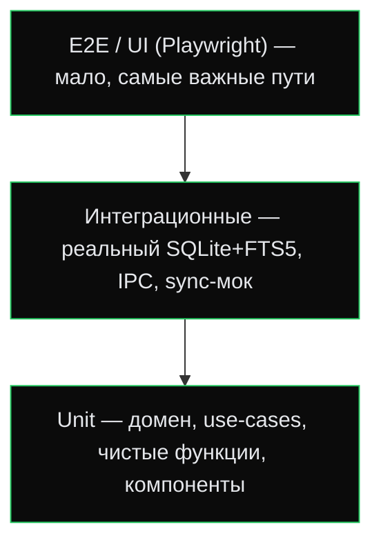

# 13 — Стратегия тестирования

> **Что это за файл.** Единый документ по тестированию DEVNOTES: пирамида тестов, что и чем покрываем в Rust-ядре и React-фронтенде, обязательные **unit** и **интеграционные** тесты, тест-данные, целевое покрытие и запуск в CI. Является нормативным: конвенция [`CLAUDE.md` §3.7](../CLAUDE.md) требует сопровождать каждую фичу тестами по этому документу.

## Связанные документы

- [`00-INDEX.md`](00-INDEX.md) — оглавление документации.
- [`02-SPECIFICATION.md`](02-SPECIFICATION.md) — требования и критерии приёмки (источник тест-кейсов).
- [`04-ARCHITECTURE.md`](04-ARCHITECTURE.md) — слои (Domain/UseCases/Interfaces/Infrastructure/UI) — определяют границы тестирования.
- [`05-DATA-MODEL.md`](05-DATA-MODEL.md) — схема БD, инварианты, миграции (интеграционные тесты БД).
- [`08-SEARCH.md`](08-SEARCH.md) — FTS5/bm25 (тесты релевантности и производительности).
- [`09-YANDEX-DISK.md`](09-YANDEX-DISK.md) — sync-движок, конфликты (интеграционные тесты синхронизации).
- [`10-ROADMAP.md`](10-ROADMAP.md) — когда какие наборы тестов вводятся.

---

## 1. Принципы

1. **Тесты — часть Definition of Done.** Код без тестов не считается готовым (см. `CLAUDE.md` §6).
2. **Тестируем поведение, а не реализацию.** Проверяем контракты слоёв (порты/use-cases), а не приватные детали.
3. **Быстро и детерминированно.** Никаких сетевых вызовов к реальному Я.Диску в CI — только моки/песочница. Никаких зависимостей от системных часов (время инъектируется).
4. **Инварианты обязаны иметь тесты.** LWW-разрешение конфликтов, миграции схемы, синхронизация FTS5-индекса триггерами, генерация UUID v7, формат дат UTC — критические места, регресс недопустим.
5. **Один баг → один регресс-тест.** Любой воспроизведённый дефект фиксируется тестом до фикса.

---

## 2. Пирамида тестов



| Уровень | Доля | Что покрывает | Инструменты |
| --- | --- | --- | --- |
| **Unit** | ~70% | Доменные инварианты, use-cases с моками портов, чистые функции (парсинг запроса поиска, LWW-решатель, маппинг DTO), React-компоненты | `cargo test`, Vitest, React Testing Library |
| **Интеграционные** | ~25% | Репозитории на реальном SQLite + FTS5, миграции, IPC-команды Tauri, sync-движок против песочницы/мока Я.Диска | `cargo test` (`tests/`), Vitest + `@tauri-apps/api` мок |
| **E2E / UI** | ~5% | Ключевые пользовательские пути (создать серию → блок → найти → синхронизировать) | Playwright |

---

## 3. Rust-ядро (`src-tauri/`)

### 3.1. Unit-тесты

- Расположение: рядом с кодом, в модулях `#[cfg(test)] mod tests { … }`.
- Покрываем **без БД и сети**:
  - **Domain**: инварианты сущностей (напр. `NoteContent.sort_order >= 0`, обязательность `created_at`/`updated_at`), value objects.
  - **UseCases**: сценарии с подменёнными портами (traits) через ручные фейки или `mockall`.
  - Чистые функции: парсер поискового запроса (→ `08-SEARCH.md`), LWW-решатель конфликтов (→ `09-YANDEX-DISK.md`), генерация/валидация UUID v7, сериализация дат UTC ISO 8601.
- Время и идентификаторы инъектируются через порты (`Clock`, `IdGenerator`) — тесты детерминированы.

```rust
// Пример: LWW выбирает запись с большим updated_at, при равенстве — создаёт конфликт-копию.
#[test]
fn lww_prefers_newer_and_forks_on_tie() {
    let local  = content_at("2026-07-17T10:00:00Z");
    let remote = content_at("2026-07-17T10:00:05Z");
    assert_eq!(resolve(&local, &remote), Resolution::TakeRemote);

    let a = content_at("2026-07-17T10:00:00Z");
    let b = content_at("2026-07-17T10:00:00Z"); // одинаковое время, разный текст
    assert!(matches!(resolve(&a, &b), Resolution::Conflict { .. }));
}
```

### 3.2. Интеграционные тесты

- Расположение: `src-tauri/tests/*.rs` (отдельные бинарники).
- **БД на реальном SQLite** во временном файле или `:memory:`; прогоняем **все миграции** перед тестом.
- Обязательные наборы:
  - **Миграции**: применяются с нуля; повторный запуск идемпотентен; downgrade/rollback (если поддержан) не рушит данные.
  - **Репозитории**: CRUD иерархии `Project → NoteSeries → NoteContent`, каскады, `sort_order` при drag-and-drop, обязательные `created_at/updated_at`.
  - **FTS5** (→ `08-SEARCH.md`): вставка/апдейт/удаление блока корректно обновляет индекс через триггеры; `bm25`-ранжирование даёт ожидаемый порядок; `snippet()` подсвечивает; SLA `< 50 мс` на 10k блоков (перф-тест, помечен `#[ignore]` для обычного прогона, гоняется в отдельной джобе).
  - **IPC-команды Tauri**: команда → use-case → БД → корректный ответ/ошибка; сериализация DTO.
  - **Sync-движок** (→ `09-YANDEX-DISK.md`): против **мок-сервера** HTTP (напр. `wiremock`) или файловой песочницы, эмулирующей Я.Диск REST: выгрузка/загрузка oplog, разрешение конфликтов (LWW + конфликт-копия), офлайн-очередь, ретраи при 5xx/429, отсутствие «тихой» потери версий.

```rust
// tests/search_fts5.rs — реальный SQLite + FTS5
#[test]
fn fts5_index_updates_on_content_change() {
    let db = TestDb::migrated();           // временная БД + все миграции
    let s  = db.create_series("Rust async");
    let c  = db.add_content(s, "code", "tokio::spawn запускает задачу");
    assert_eq!(db.search("tokio").len(), 1);

    db.update_content(c, "переписали на async-std");
    assert_eq!(db.search("tokio").len(), 0); // триггер обновил индекс
    assert_eq!(db.search("async").len(), 1);
}
```

---

## 4. Фронтенд (`src/`)

### 4.1. Unit / компонентные тесты

- **Vitest** + **React Testing Library**. Тестируем поведение, а не разметку.
- Покрываем:
  - Чистую логику: repository-слой и генераторы query-key, маппинг доменных типов, форматирование дат в локальную TZ.
  - Хуки и сторы (**Zustand**): переходы состояния, оптимистичные апдейты **TanStack Query**.
  - Компоненты дизайн-системы (→ `06-UI-UX.md`): `Button` (все варианты/размеры), `Card`, `Input`, `Badge`; доступность (роли, фокус, клавиатура).
  - Ключевые фичи-компоненты: редактор блоков, сортировка `@dnd-kit`, панель поиска (ввод → запрос → подсветка).
- Вызовы Tauri (`invoke`) **мокируются** (`@tauri-apps/api/mocks` или ручной мок) — фронт-тесты не поднимают Rust-ядро.

```ts
// Панель поиска дебаунсит ввод и отдаёт подсвеченные результаты.
it('подсвечивает совпадения из ядра', async () => {
  mockIPC((cmd, args) =>
    cmd === 'search' ? [{ id: '…', snippet: 'tokio::<b>spawn</b>' }] : undefined);
  render(<SearchPanel />);
  await userEvent.type(screen.getByRole('searchbox'), 'spawn');
  expect(await screen.findByText(/spawn/)).toBeInTheDocument();
});
```

### 4.2. E2E (Playwright)

- Немного сценариев на «золотых» путях, поверх собранного Tauri-приложения (или webview в dev):
  - Создать проект → серию → блок кода; убедиться, что дата/время проставлены.
  - Полнотекстовый поиск находит блок; открытие из результата.
  - Командная палитра (Ctrl/Cmd+K) навигирует и создаёт заметку.
  - (после v0.3) авторизация Я.Диск и первичная синхронизация против песочницы.

---

## 5. Тестовые данные и фикстуры

- **Фабрики** доменных объектов (Rust `TestDb`/билдеры, TS-фабрики) вместо копипасты литералов.
- **Сид-набор**: небольшой (≈50 блоков) для функциональных тестов и большой (10k–50k) — генерируемый для перф-тестов поиска (→ `08-SEARCH.md`).
- **Детерминизм**: фиксированные UUID и время через инъекцию портов `Clock`/`IdGenerator`.
- Секреты в тестах запрещены; OAuth Я.Диска эмулируется мок-сервером, реальные токены не используются (см. `CLAUDE.md` §3.6).

---

## 6. Покрытие и качество

| Область | Целевое покрытие |
| --- | --- |
| Domain + UseCases (Rust) | ≥ 85% строк, 100% критических инвариантов |
| Infrastructure (DB, Sync) | покрыто интеграционными сценариями (не гонимся за % строк) |
| Repository/логика фронта (TS) | ≥ 80% |
| UI-компоненты | ключевые состояния + доступность |

- Инструменты покрытия: `cargo-llvm-cov` (Rust), `vitest --coverage` (v8) — фронт.
- Покрытие — ориентир, не самоцель: важнее покрытые **инварианты и критерии приёмки** из `02-SPECIFICATION.md`.

---

## 7. Запуск и CI

**Локально:**

```bash
# Rust-ядро
cargo test                      # unit + интеграционные
cargo test -- --ignored         # перф-тесты (FTS5 SLA) по требованию
cargo llvm-cov                  # покрытие

# Фронтенд
pnpm test                       # Vitest (watch off)
pnpm test:coverage
pnpm e2e                        # Playwright
```

**CI (GitHub Actions, → `07-TECH-STACK.md`):** матрица `ubuntu / macos / windows`.

1. Линт + типизация (`cargo clippy`, `cargo fmt --check`, `eslint`, `tsc --noEmit`).
2. `cargo test` (unit + интеграционные).
3. `pnpm test` + сбор покрытия.
4. Сборка Tauri (smoke) + Playwright e2e (на `ubuntu`, headless).
5. Перф-джоба FTS5 (`--ignored`) — не блокирующая, но с трендом по времени.

**Красный CI = задача не выполнена** (`CLAUDE.md` §3.7). Тесты добавляются вместе с фичей в том же PR.

---

## 8. Ввод по этапам (согласовано с `10-ROADMAP.md`)

| Этап | Что появляется в тестах |
| --- | --- |
| **MVP** | Unit домена/use-cases; интеграционные: миграции, репозитории, FTS5-поиск; Vitest на repository-слой и базовые компоненты; CI-пайплайн. |
| **v0.2** | Тесты командной палитры, экспорта, тегов; e2e «золотых» путей. |
| **v0.3** | Интеграционные тесты sync-движка против мок-Я.Диска: конфликты, офлайн-очередь, ретраи. |
| **v1.0** | Тесты версий/вложений/wiki-links/backlinks; расширение e2e; перф-бюджеты в CI. |
| **v2.0** | Тесты графа связей, spaced-repetition, шифрования; e2e на мобильной сборке. |
